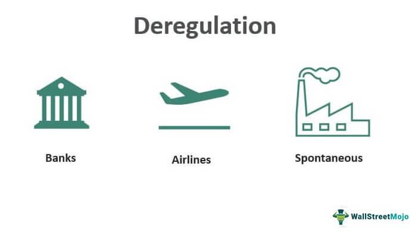

The financial landscape has evolved significantly through a continuous process of regulatory reforms and economic policy shifts. Regulatory policies, designed to maintain market integrity and protect investors, have historically oscillated between stringent oversight and periods of deregulation. Deregulation, aimed at reducing government intervention, has been particularly influential in fostering competitive environments and stimulating innovation. However, it has also sparked debates regarding its impact on financial stability, as reduced oversight can lead to increased risk-taking by market participants.

In parallel, technology has reshaped market dynamics, with algorithmic trading emerging as a transformative force. The practice of using algorithms to automate and execute trades has revolutionized financial markets by enhancing trading efficiency and liquidity. Yet, this technological advancement presents new challenges, as it necessitates the reassessment of existing regulatory frameworks to mitigate risks such as market volatility and systemic failures.

The interplay between regulatory reforms, economic policies, and technological advancements is crucial for understanding both past developments and future directions of global financial markets. As markets become increasingly decentralized and interconnected, the potential for both growth and disruption rises. This calls for a balanced approach to policymaking that considers the complexity of modern financial systems.

This article aims to provide an in-depth examination of the relationships between regulatory reforms, economic policies, deregulation, and algorithmic trading. Through this exploration, we seek to understand how these elements collectively shape the global economic landscape, ensuring that financial systems remain robust and adaptable in a rapidly changing world.

## Table of Contents

## Regulatory Reform and Deregulation: Definitions and Historical Context

Regulatory reform encompasses the revision or introduction of policies designed to govern economic and market activities. It is a process aimed at ensuring that regulations are efficient, effective, and conducive to market stability and growth. Regulatory reform can involve tightening rules in certain areas while loosening them in others, depending on the prevailing economic conditions and objectives.

Deregulation, a specific aspect of regulatory reform, seeks to reduce the level of government oversight and control over industries, facilitating a more competitive and open market environment. The premise is that by minimizing regulatory barriers, businesses can operate more freely, leading to increased innovation, efficiency, and consumer choice. However, deregulation carries the inherent risk of inadequate checks on market behavior, possibly leading to negative externalities such as financial instability.

Deregulation began to significantly influence economic policies in the late 20th century, particularly within the financial sector of the United States. This era was marked by a growing belief in the power of free markets to self-regulate. One of the most pivotal legislative changes during this time was the Gramm-Leach-Bliley Act (GLBA) of 1999. The GLBA effectively repealed elements of the Glass-Steagall Act of 1933, which had enforced strict separations between commercial and investment banking. The dismantling of these boundaries allowed for greater integration of financial services, leading to the creation of financial conglomerates offering a wide range of services.

Understanding the historical context of deregulation is essential for several reasons. Firstly, it illustrates how past policies have shaped the current regulatory landscape. The experiences and consequences of deregulation efforts provide valuable lessons and warnings, particularly about the balance between allowing economic freedom and ensuring market integrity and stability. Secondly, this history offers insights into the dynamics of regulatory debates that continue to this day, where proponents of deregulation argue for reducing unnecessary bureaucratic obstacles, while opponents warn of the risks associated with unchecked market powers.

Overall, regulatory reform and deregulation reflect attempts to navigate the complex interplay between regulation and market freedom. As economic conditions and market structures evolve, so too must the policies that define and guide them. Balancing innovation and stability remains at the core of ongoing regulatory discourse.

## Economic Policy and Its Impact on Deregulation

Economic policies play a pivotal role in shaping market operations, often serving as a catalyst for regulatory change. Fiscal policies are fundamental, with government spending and taxation directly influencing deregulation. These policies impact economic growth and investment climates, often dictating the pace and scope of deregulation measures. For instance, increased government spending can stimulate economic activity, creating a favorable environment for deregulation by enhancing market efficiency and competitiveness. Conversely, heavy taxation can discourage investment, prompting calls for deregulatory measures to alleviate economic strain.

Monetary policy, administered by central banks, significantly impacts deregulation through [interest rate](/wiki/interest-rate-trading-strategies) adjustments and money supply control. Low interest rates can encourage borrowing and investment, potentially reducing the perceived need for strict regulatory oversight. Conversely, tightening monetary policies could prompt deregulation as a means to offset economic slowdowns by lowering barriers for business operations and market entry.

During economic downturns, deregulation efforts often accelerate to stimulate growth. By removing regulatory obstacles, governments aim to encourage entrepreneurial activities and investments, driving recovery. This approach has been notably observed in historical contexts, such as the deregulation movement following the economic stagnation of the 1970s, where loosening regulations aimed to revitalize economic productivity and market freedoms.

Analyzing these economic policies provides insights into the intentions and possible outcomes of deregulation across various sectors. While fiscal and monetary strategies are primarily aimed at fostering a robust economic environment, they also highlight potential risks associated with rapid deregulation, such as financial instability and increased market [volatility](/wiki/volatility-trading-strategies). Balancing economic liberalization with sound regulatory oversight is imperative to ensure sustainable economic development while mitigating potential downsides.

## The Role of Algorithmic Trading in a Deregulated Market

Algorithmic trading represents a significant advancement in modern finance, employing sophisticated computer algorithms to automate trade execution. As financial markets evolve, the adoption of [algorithmic trading](/wiki/algorithmic-trading) has accelerated, particularly in environments characterized by reduced regulatory oversight. In such deregulated markets, algorithmic trading systems function with minimized governmental constraints, leading to increased trading speed and enhanced market efficiency.

The primary advantage of algorithmic trading in a deregulated setting is its ability to process vast amounts of market data rapidly and execute trades based on predefined criteria without human intervention. This capability allows traders to capitalize on fleeting market opportunities, enhance [liquidity](/wiki/liquidity-risk-premium), and reduce transaction costs. For example, algorithmic trading can utilize strategies like statistical [arbitrage](/wiki/arbitrage), [market making](/wiki/market-making), or [trend following](/wiki/trend-following) by integrating data analytics and real-time market signals.

Despite these benefits, algorithmic trading in deregulated markets raises concerns about market stability and integrity. The increased complexity and speed at which algorithms operate can contribute to heightened market volatility. A notable incident is the "Flash Crash" of May 6, 2010, where the Dow Jones Industrial Average plunged approximately 1,000 points within minutes, primarily due to algorithmic trading activities. This event underscored the need for robust regulatory oversight to mitigate the risks associated with high-frequency trading practices.

Addressing these concerns necessitates the implementation of updated regulatory measures. Regulators must ensure that trading algorithms are designed with safeguards to prevent erratic behavior and that systems capable of contributing to systemic risk are subject to scrutiny and compliance requirements. For example, introducing circuit breakers—mechanisms to temporarily halt trading during extreme market movements—can help manage volatility and maintain orderly markets.

In balancing the benefits and risks of algorithmic trading, policymakers face the challenge of crafting regulations that dovetail with technological advancements without stifling innovation. Striking this balance involves evaluating the effectiveness of existing regulatory frameworks and adapting them to account for the nuances of modern trading technologies. By doing so, it becomes possible to harness the potential of algorithmic trading while safeguarding market stability and protecting investors.

Ultimately, integrating algorithmic trading within a deregulated market environment requires a comprehensive approach that aligns with technological progress and regulatory evolution. By examining the interplay between these factors, stakeholders can develop informed policies that foster sustainable and equitable financial markets.

## Case Studies and Global Perspectives on Deregulation and Algo Trading

Case studies across various sectors provide valuable insights into the effects of deregulation and the adoption of algorithmic trading in financial markets. A notable example is the deregulation of the airline industry in the United States, primarily through the Airline Deregulation Act of 1978. This act removed government control over fares, routes, and market entry, leading to increased competition, reduced airfares, and improved service quality. However, it also resulted in challenges such as market monopolization by larger airlines and volatility in service offerings. The lessons learned emphasize the importance of balancing deregulation with mechanisms to safeguard against monopolistic behaviors and ensure fair competition [1].

In telecommunications, deregulation in the 1990s, exemplified by the Telecommunications Act of 1996 in the U.S., aimed to eliminate barriers to entry and boost competition. This resulted in technological innovations and lower consumer costs but also highlighted the necessity for regulatory oversight to prevent anti-competitive practices as major players sought to consolidate their market positions [2].

Globally, approaches to deregulation and algorithmic trading differ significantly, reflecting regional economic policies and regulatory standards. In Europe, the Markets in Financial Instruments Directive (MiFID II) underscores stricter regulatory controls aimed at enhancing transparency and protecting investors in response to financial crises attributed to insufficient regulatory oversight. This framework contrasts with the United States' less stringent approach in certain areas, favoring market-driven growth. Countries like Japan and Singapore have adopted proactive stances towards algorithmic trading, integrating advanced technological regulations to manage associated risks [3].

These various approaches demonstrate the diverse impact and effectiveness of deregulation policies. A thorough comparative analysis can aid policymakers in understanding best practices and potential pitfalls. For instance, regions that successfully integrate algorithmic trading into deregulated markets often employ rigorous risk management protocols, ensuring market stability while fostering innovation.

Complex global interactions in deregulated markets further necessitate ongoing assessment and adaptation of regulatory frameworks. Countries more receptive to deregulation can serve as testing grounds for new policies, providing empirical data on economic outcomes, which can inform international best practices. At the same time, the experiences of nations with stricter control measures offer valuable lessons on safeguarding market integrity and consumer protection.

Ultimately, the varying global perspectives and case studies reveal that while deregulation can encourage competitiveness and innovation, it must be tempered with regulatory measures that prevent potential negative consequences such as market manipulation and financial instability.

---

### References

1. Morrison, Steven A., and Clifford Winston. "The economic effects of airline deregulation." Brookings Institution Press, 1995.
2. Crandall, Robert W. "The Failure of Structural Remedies in Sherman Act Monopolization Cases." Oregon Law Review, vol. 80, 2001.
3. European Securities and Markets Authority (ESMA). "MiFID II: A new framework for the financial sector." European Commission, 2014.

## Conclusion

Deregulation has proven to be a double-edged sword, facilitating economic growth and innovation while simultaneously posing significant risks. The reduction of government oversight often encourages a competitive market environment, spurring innovation and efficiency that drive economic expansion. However, this same reduction can lead to insufficient checks and balances, leaving markets vulnerable to volatility and, in some cases, exploitation. Therefore, it is crucial to implement effective regulation and robust policy frameworks to mitigate these risks. An example of balanced regulatory intervention can be observed in implementing circuit breakers in stock markets to prevent excessive volatility triggered by algorithmic trading.

Algorithmic trading, which automates and executes trades with precision and speed, exemplifies the need for regulatory adaptation. As technology in financial markets evolves, so too must the regulatory mechanisms that govern them. The rapid technological advancements necessitate a framework that can effectively oversee and manage these new trading modalities without stifying innovation. The "Flash Crash" of 2010, where markets plunged and recovered within minutes, underscores the potential repercussions of inadequate oversight in algorithm-dominated environments.

Ongoing policy debates are essential in navigating the delicate balance between economic flexibility and the need to safeguard consumer interests and ensure market stability. Policymakers must strive for an equilibrium that encourages innovation and competitive practices while protecting financial systems from undue risk. This requires a nuanced understanding of the interplay between deregulation, economic policies, and technological advancements.

Ultimately, regulatory reform, economic policy, and technological progress such as algorithmic trading should not be viewed in isolation. These elements must be integrated to ensure sustainable and robust economic outcomes. By considering these factors together, policymakers can craft regulations that support innovation while maintaining market integrity and protecting stakeholders.

As financial markets continually evolve, the need for continuous assessment and adjustment of regulatory and policy frameworks becomes increasingly vital. Such adaptability will be crucial in fostering healthy economic environments that can withstand the challenges of rapid technological development and shifting global dynamics. In conclusion, while deregulation offers significant potential benefits, it must be pursued with caution and responsibility to achieve an optimal balance that sustains long-term economic health.

## References & Further Reading

[1]: Morrison, Steven A., and Clifford Winston. ["The Economic Effects of Airline Deregulation."](https://www.brookings.edu/books/the-economic-effects-of-airline-deregulation/) Brookings Institution Press, 1995.

[2]: Crandall, Robert W. ["The Failure of Structural Remedies in Sherman Act Monopolization Cases."](https://papers.ssrn.com/sol3/papers.cfm?abstract_id=286357) Oregon Law Review, vol. 80, 2001.

[3]: European Securities and Markets Authority (ESMA). ["MiFID II: A New Framework for the Financial Sector."](https://www.esma.europa.eu/press-news/esma-news/esma-publishes-final-guidelines-mifid-ii-suitability-requirements-0) European Commission, 2014.

[4]: MacKenzie, D. A., & Spears, T. K. (2010). ["The Temporality of HFT: A Leverified Trading Strategy."](https://uberty.org/wp-content/uploads/2015/11/mackenzie-algorithms.pdf) Economy and Society, 39(1), 19-42.

[5]: Kirilenko, A. A., & Lo, A. W. (2013). ["Moore’s Law versus Murphy’s Law: Algorithmic Trading and Its Discontents."](https://www.aeaweb.org/articles?id=10.1257/jep.27.2.51) Journal of Economic Perspectives, 27(2), 51-72.

[6]: McLean, R. D., & Pontiff, J. (2016). ["Does Academic Research Destroy Stock Return Predictability?"](https://onlinelibrary.wiley.com/doi/abs/10.1111/jofi.12365) Review of Financial Studies, 29(3), 736-769.

[7]: Krugman, P. R., & Obstfeld, M. (2003). ["International Economics: Theory and Policy."](https://www.pearson.com/se/Nordics-Higher-Education/subject-catalogue/economics/International-Economics-Theory-and-Policy-Krugman.html) Pearson Education. 

[8]: Schularick, M., & Taylor, A. M. (2012). ["Credit Booms Gone Bust: Monetary Policy, Leverage Cycles, and Financial Crises, 1870–2008."](https://www.aeaweb.org/articles?id=10.1257/aer.102.2.1029) American Economic Review, 102(2), 1029-1061.