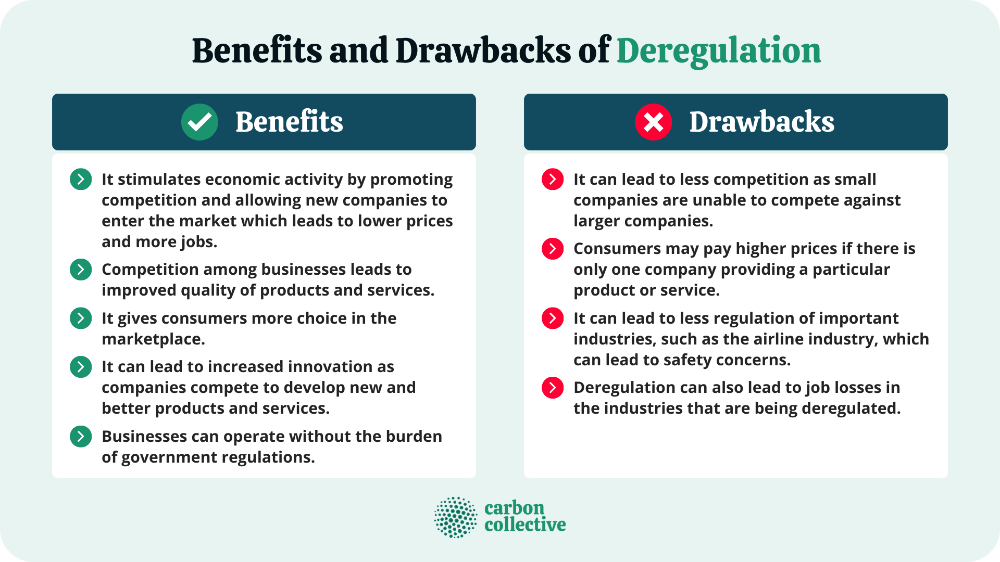

## Table of Contents

## What is deregulation?

Deregulation is when the government reduces or removes rules and controls on businesses and industries. It lets companies have more freedom to decide how they want to work, without as much interference from the government. This can happen in areas like finance, energy, transportation, and more. The idea behind deregulation is that it can lead to more competition, lower prices for customers, and more innovation because companies can try new things more easily.

However, deregulation can also have some downsides. Without strict rules, companies might take bigger risks, which can lead to problems. For example, in the financial sector, too much deregulation can lead to economic crises, like what happened during the 2008 financial crisis. Also, without regulations, companies might not take care of the environment or treat workers fairly. So, while deregulation can help businesses grow and innovate, it's important to balance it with enough rules to keep things safe and fair for everyone.

## What are the main objectives of deregulation?

The main goal of deregulation is to make it easier for businesses to operate by reducing the rules they have to follow. When there are fewer regulations, companies can make decisions more quickly and try new ways of doing things. This can lead to more competition between businesses, which often results in lower prices for customers. For example, in the telecommunications industry, deregulation has allowed more companies to enter the market, giving people more choices and often cheaper services.

Another important objective of deregulation is to encourage innovation. When businesses don't have to spend as much time and money following strict rules, they can focus more on creating new products and services. This can lead to technological advancements and improvements in how things are done. However, deregulation needs to be balanced carefully. While it can help businesses grow and innovate, it's also important to have some rules in place to protect consumers, workers, and the environment from potential negative impacts.

## Can you provide a brief history of deregulation?

Deregulation started to become popular in the late 1970s and 1980s. Before that time, many industries like airlines, telecommunications, and energy were tightly controlled by the government. In the United States, President Jimmy Carter and his administration began pushing for deregulation. They believed that fewer rules would help businesses grow and give consumers more choices. One of the first big steps was the Airline Deregulation Act of 1978, which allowed airlines to set their own prices and routes. This led to more competition and lower prices for travelers.

In the 1980s and 1990s, deregulation spread to other countries and industries. In the UK, Prime Minister Margaret Thatcher was a strong supporter of deregulation. She believed it would help the economy grow. Many other countries followed suit, reducing rules in areas like finance, energy, and telecommunications. However, deregulation also led to some problems. For example, in the late 2000s, too much deregulation in the financial sector contributed to the global financial crisis. Since then, governments have been trying to find a balance between giving businesses freedom and protecting consumers and the economy.

## Which industries are most commonly affected by deregulation?

The industries that are most commonly affected by deregulation are airlines, telecommunications, energy, and finance. In the airline industry, deregulation has allowed companies to set their own prices and choose their routes. This has led to more competition and cheaper flights for travelers. In telecommunications, deregulation has let more companies enter the market, giving people more choices for phone and internet services. The energy sector has also seen a lot of deregulation, which has allowed companies to produce and sell energy more freely, often leading to lower prices for consumers.

In the finance industry, deregulation has had a big impact. Banks and other financial institutions have been able to offer new types of products and services without as many restrictions. This has led to more innovation and competition in the financial sector. However, it has also led to problems. Too much deregulation in finance was one of the reasons for the 2008 financial crisis. Because of this, governments have been working to find a balance between giving financial companies more freedom and making sure they don't take too many risks.

## What are some examples of significant deregulation events in history?

One of the most important deregulation events was the Airline Deregulation Act of 1978 in the United States. Before this law, the government controlled what airlines could do, like where they could fly and how much they could charge. The Act changed that, allowing airlines to set their own prices and routes. This made it easier for new airlines to start up and compete with bigger companies. As a result, air travel became cheaper and more people could fly.

Another big example is the deregulation of the telecommunications industry in the 1980s and 1990s. In the U.S., the breakup of AT&T in 1984 was a key moment. Before this, AT&T had a monopoly on phone services. After the breakup, new companies could enter the market, leading to more competition and cheaper phone services. This also helped pave the way for the internet and mobile phones, which have changed how we communicate.

In the finance sector, the Gramm-Leach-Bliley Act of 1999 in the United States was a major deregulation event. This law removed some of the restrictions that had been in place since the Great Depression, allowing banks to offer a wider range of financial services. While this led to more innovation and competition in the financial industry, it also contributed to the 2008 financial crisis. Many people believe that too much deregulation in finance can lead to risky behavior and economic problems.

## How does deregulation impact the economy?

Deregulation can help the economy grow by making it easier for businesses to operate. When there are fewer rules, companies can make decisions faster and try new ways of doing things. This often leads to more competition between businesses, which can result in lower prices for customers. For example, in the airline industry, deregulation allowed more airlines to start flying, which made tickets cheaper and helped more people travel. This can boost the economy because when people have more money to spend, they can buy more things and support more businesses.

However, deregulation can also have some negative effects on the economy. Without strict rules, companies might take bigger risks, which can lead to problems. For example, too much deregulation in the financial sector was one of the reasons for the 2008 financial crisis. When banks and other financial institutions were allowed to do more risky things, it led to a big economic downturn. Also, without regulations, companies might not take care of the environment or treat workers fairly. So, while deregulation can help businesses grow and innovate, it's important to balance it with enough rules to keep the economy stable and protect everyone.

## What are the potential benefits of deregulation for businesses and consumers?

Deregulation can help businesses grow and make more money. When there are fewer rules, companies can decide things faster and try new ideas without worrying so much about government rules. This can lead to more competition because new businesses can start up more easily. When companies compete, they often try to offer better products or lower prices to attract customers. This is good for businesses because they can make more profit and grow bigger.

For consumers, deregulation can mean cheaper prices and more choices. When businesses don't have to follow as many rules, they can often lower their costs and pass those savings on to customers. For example, in the airline industry, deregulation made it easier for new airlines to start flying, which led to cheaper tickets. Also, when there are more companies to choose from, consumers can pick the one that offers the best service or the best price. This gives people more power and can make their lives easier and more affordable.

## What are the potential risks and drawbacks of deregulation?

Deregulation can cause problems if there are not enough rules to keep things safe and fair. Without strict rules, businesses might take big risks that can hurt the economy. For example, too much deregulation in the financial sector helped cause the 2008 financial crisis. Banks were allowed to do risky things, and when those risks didn't pay off, it led to a big economic downturn. This shows that deregulation can lead to instability and make life harder for people if it's not done carefully.

Another risk of deregulation is that it can harm the environment and workers. When businesses don't have to follow as many rules, they might not take care of the environment as well as they should. They might pollute more or use up natural resources without thinking about the future. Also, without regulations, companies might not treat their workers fairly. They might pay low wages or have unsafe working conditions. This means that while deregulation can help businesses grow, it's important to have some rules in place to protect people and the planet.

## How do governments implement deregulation policies?

Governments implement deregulation policies by changing or removing laws and rules that control businesses. They do this by passing new laws or changing old ones through their legislative bodies, like Congress in the United States or Parliament in the UK. For example, if a government wants to deregulate the airline industry, they might pass a law that lets airlines set their own prices and choose their own routes. This process often involves a lot of discussion and debate because people have different opinions about how much regulation is needed.

Sometimes, governments also use executive orders or directives from agencies to implement deregulation. This can be quicker than passing new laws because it doesn't need as much approval from different parts of the government. For instance, a president or prime minister might issue an order that tells a government agency to reduce the number of rules it enforces on a certain industry. However, this method can be controversial because it might not involve as much public input as passing a new law would. Overall, implementing deregulation is a complex process that requires careful planning and consideration of the potential impacts on businesses, consumers, and the economy.

## What role do regulatory agencies play in the process of deregulation?

Regulatory agencies are important in deregulation because they are the ones that usually make and enforce the rules for businesses. When a government decides to deregulate an industry, these agencies have to change or remove the rules they have been using. This can mean rewriting their guidelines, stopping certain checks and inspections, or changing how they monitor businesses. For example, if the government wants to deregulate the energy sector, the agency in charge of energy might have to stop controlling prices or allow companies to produce more freely.

Sometimes, regulatory agencies also have to make sure that deregulation happens in a safe way. They might need to keep some rules in place to protect consumers, workers, and the environment. This means finding a balance between giving businesses more freedom and making sure that freedom doesn't lead to problems. For instance, even if the financial sector is being deregulated, the agency might still keep rules about how much risk banks can take to prevent another financial crisis. So, regulatory agencies play a key role in both carrying out deregulation and making sure it's done responsibly.

## How can the effectiveness of deregulation be measured?

The effectiveness of deregulation can be measured by looking at how it affects businesses and consumers. For businesses, deregulation is successful if it leads to more competition and innovation. When companies can make decisions faster and try new things without so many rules, they often grow and make more money. This can be seen in how many new businesses start up and how much they are able to expand. If deregulation helps businesses in this way, it's considered effective.

For consumers, the effectiveness of deregulation can be seen in lower prices and more choices. When businesses compete more, they often lower their prices to attract customers. This means people can buy things for less money. Also, with more companies to choose from, consumers can pick the one that offers the best service or the best deal. If deregulation leads to these kinds of benefits for consumers, it's seen as successful. However, it's also important to look at any negative effects, like risks to the economy or harm to the environment, to get a full picture of how effective deregulation really is.

## What are the current trends and future prospects for deregulation globally?

Currently, deregulation is still a big topic around the world. Many countries are trying to make it easier for businesses to operate by reducing rules. For example, in the United States, there have been efforts to deregulate industries like energy and finance to boost economic growth. In Europe, some countries are looking at deregulating parts of their economies to be more competitive. However, there is also a lot of debate about how much deregulation is good. Some people worry that too much deregulation can lead to problems like economic crises or harm to the environment.

Looking to the future, deregulation will likely continue to be important but with a focus on finding the right balance. Governments will need to keep reducing rules that hold back businesses but also make sure there are enough protections in place. This means keeping some regulations to protect consumers, workers, and the environment. Technology and new industries like renewable energy and digital services might see more deregulation to encourage innovation. But overall, the trend will be towards smart deregulation that helps the economy grow without causing too many risks.

## References & Further Reading

[1]: Morrison, Steven A., and Clifford Winston. ["The Economic Effects of Airline Deregulation."](https://www.brookings.edu/books/the-economic-effects-of-airline-deregulation/) Brookings Institution Press, 1995.

[2]: Crandall, Robert W. ["The Failure of Structural Remedies in Sherman Act Monopolization Cases."](https://papers.ssrn.com/sol3/papers.cfm?abstract_id=286357) Oregon Law Review, vol. 80, 2001.

[3]: European Securities and Markets Authority (ESMA). ["MiFID II: A New Framework for the Financial Sector."](https://www.esma.europa.eu/press-news/esma-news/esma-publishes-final-guidelines-mifid-ii-suitability-requirements-0) European Commission, 2014.

[4]: MacKenzie, D. A., & Spears, T. K. (2010). ["The Temporality of HFT: A Leverified Trading Strategy."](https://uberty.org/wp-content/uploads/2015/11/mackenzie-algorithms.pdf) Economy and Society, 39(1), 19-42.

[5]: Kirilenko, A. A., & Lo, A. W. (2013). ["Moore’s Law versus Murphy’s Law: Algorithmic Trading and Its Discontents."](https://www.aeaweb.org/articles?id=10.1257/jep.27.2.51) Journal of Economic Perspectives, 27(2), 51-72.

[6]: McLean, R. D., & Pontiff, J. (2016). ["Does Academic Research Destroy Stock Return Predictability?"](https://onlinelibrary.wiley.com/doi/abs/10.1111/jofi.12365) Review of Financial Studies, 29(3), 736-769.

[7]: Krugman, P. R., & Obstfeld, M. (2003). ["International Economics: Theory and Policy."](https://www.pearson.com/se/Nordics-Higher-Education/subject-catalogue/economics/International-Economics-Theory-and-Policy-Krugman.html) Pearson Education. 

[8]: Schularick, M., & Taylor, A. M. (2012). ["Credit Booms Gone Bust: Monetary Policy, Leverage Cycles, and Financial Crises, 1870–2008."](https://www.aeaweb.org/articles?id=10.1257/aer.102.2.1029) American Economic Review, 102(2), 1029-1061.