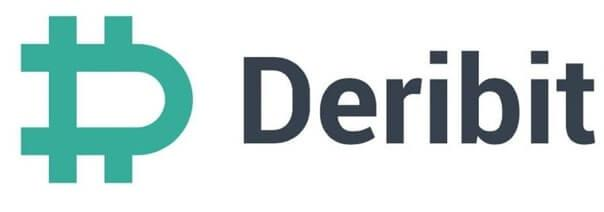

## Table of Contents

## What is Deribit and why is its API important?

Deribit is a cryptocurrency exchange that focuses on trading options and futures. It was started in 2016 and is based in the Netherlands. People use Deribit to buy and sell Bitcoin and Ethereum options and futures, which are like bets on what the price of these cryptocurrencies will do in the future.

The Deribit API is important because it lets other computer programs talk to Deribit's system. This means that traders can build their own tools to automatically buy and sell options and futures on Deribit. The API makes it easier for big traders and companies to use Deribit's services without having to click buttons on a website. It helps them trade faster and more efficiently.

## How do I get started with the Deribit API?

To get started with the Deribit API, you first need to sign up for a Deribit account if you don't have one already. Once you're signed up, go to the Deribit website and find the API section. There, you can create an API key, which is like a special password that lets your programs talk to Deribit. Make sure to keep your API key secret and secure, just like you would with your regular password.

After you have your API key, you can start using the Deribit API. Deribit provides a lot of information on their website about how to use the API, including examples and guides. You'll need to know a bit about programming, but don't worry if you're new to it. Start with simple things like checking the current price of Bitcoin or Ethereum on Deribit. As you get more comfortable, you can try more advanced stuff like placing orders or checking your account balance. Remember, it's a good idea to practice with a test account before using real money.

## What are the basic endpoints for account management on Deribit?

The basic endpoints for account management on Deribit help you do things like check your balance, see your open orders, and manage your API keys. The main endpoint for checking your account balance is "GET /api/v2/private/get_account_summary". This endpoint gives you information about how much money you have in your account, both in cryptocurrency and in the currency you use to deposit and withdraw money. Another important endpoint is "GET /api/v2/private/get_open_orders", which shows you all the orders you have placed that haven't been filled yet.

To manage your API keys, you can use the "GET /api/v2/private/get_api_keys" endpoint to see all your current API keys. If you need to create a new API key, you can use "POST /api/v2/private/create_api_key". And if you want to delete an API key, you use "POST /api/v2/private/disable_api_key". These endpoints help you keep your account secure by managing who has access to your account through the API.

## How can I use the Deribit API to place trades?

To place trades using the Deribit API, you'll need to use the "POST /api/v2/private/buy" endpoint for buying and the "POST /api/v2/private/sell" endpoint for selling. These endpoints let you send a request to Deribit with details like what you want to buy or sell, how much, and at what price. For example, if you want to buy some Bitcoin options, you would use the buy endpoint and include the type of option, the amount, and the price you're willing to pay. It's like telling Deribit, "Hey, I want to buy this, at this price, right now."

Before you send the request, make sure you have enough money in your account and that you're using the right API key. The API will check these things and then try to make the trade happen. If everything goes well, you'll get a response from Deribit telling you that the trade was successful. If something goes wrong, like if you don't have enough money or if the price you want isn't available, Deribit will let you know that too. It's a good idea to start with small trades and practice to make sure you understand how it all works before you start trading with bigger amounts.

## What are the key differences between the REST and WebSocket APIs on Deribit?

The REST API and the WebSocket API on Deribit are two different ways to talk to the exchange. The REST API is like sending a letter. You send a request to Deribit, and it sends back a response. It's good for things like checking your account balance or placing a trade. But, it's not the best for getting information that changes a lot, like the current price of Bitcoin, because you have to keep asking Deribit over and over again.

The WebSocket API is more like having a phone call with Deribit. Once you connect, you can keep the line open and get updates as soon as they happen. This makes it great for things like watching the price of Bitcoin change in real-time or seeing when your orders get filled. It's more complicated to set up than the REST API, but it's much better for trading because you don't miss out on important updates.

In short, use the REST API for one-time requests and the WebSocket API for ongoing, real-time data. Both are important tools for trading on Deribit, but they serve different purposes depending on what you need.

## How do I handle authentication and security with the Deribit API?

To handle authentication and security with the Deribit API, you need to use an API key. This key is like a special password that lets your program talk to Deribit. When you create an API key, you get two parts: the API key itself and a secret key. You use the API key to identify yourself, and the secret key to sign your requests. This signing process makes sure that only you can send requests to Deribit using your key. It's important to keep your secret key safe and never share it with anyone. If someone else gets your secret key, they could use it to access your account and make trades without your permission.

Deribit also uses HTTPS to keep your communication with their servers secure. This means that the information you send to Deribit, like your API key and your trade requests, is encrypted so no one can see it while it's traveling over the internet. To make sure your account stays safe, you should also use the Deribit API endpoints to manage your API keys. You can create new keys, disable old ones, and check what permissions each key has. This helps you control who has access to your account and what they can do with it. Always be careful and double-check everything when you're working with your API keys to keep your account secure.

## What are some common errors and how can I troubleshoot them using the Deribit API?

When using the Deribit API, you might run into some common errors like "Invalid API Key" or "Insufficient Funds". An "Invalid API Key" error means that the API key you're using is either wrong or has been disabled. To fix this, make sure you're using the correct key and that it hasn't been changed or disabled on the Deribit website. If you get an "Insufficient Funds" error, it means you don't have enough money in your account to make the trade you're trying to do. You can check your account balance using the "GET /api/v2/private/get_account_summary" endpoint to see if you need to add more money.

Another common issue is a "Rate Limit Exceeded" error, which happens if you're sending too many requests to Deribit too quickly. To avoid this, you can add some delays between your requests or use the WebSocket API for real-time data instead of constantly asking for updates with the REST API. If you get a "Network Error", it could mean there's a problem with your internet connection or Deribit's servers. Try refreshing your connection or waiting a bit before trying again. Always make sure to read the error messages carefully and check the Deribit API documentation for more help on troubleshooting.

## How can I use the Deribit API to access real-time market data?

To get real-time market data from Deribit, you should use their WebSocket API. The WebSocket API lets you keep a connection open with Deribit, so you can get updates as soon as they happen. This is great for watching things like the current price of Bitcoin or Ethereum, or seeing when new orders come in. To start, you need to connect to Deribit's WebSocket server and subscribe to the data you want. For example, if you want to see the price of Bitcoin, you would subscribe to the Bitcoin ticker channel. Once you're subscribed, Deribit will send you updates whenever the price changes.

Using the WebSocket API can be a bit more complicated than the REST API, but it's worth it for real-time data. You need to make sure your program can handle the constant stream of information coming from Deribit. This means you'll need to write code that can process the updates as they come in and do something with them, like updating a chart or making a trade. If you run into any problems, check the Deribit API documentation for examples and troubleshooting tips. Remember, keeping your connection stable and managing the data flow are key to successfully using the WebSocket API for real-time market data.

## What advanced trading strategies can be implemented using the Deribit API?

Using the Deribit API, you can build advanced trading strategies like market making and arbitrage. Market making is when you put both buy and sell orders in the market to make money from the difference between the buying and selling prices. With the Deribit API, you can watch the market closely and change your orders quickly to keep making money. Arbitrage is another strategy where you buy something on one exchange and sell it on another at a higher price. The Deribit API helps you check prices on different exchanges and make trades fast enough to make a profit before the prices change.

Another advanced strategy you can use is delta hedging. This is when you own options and you buy or sell the underlying asset (like Bitcoin) to protect yourself from price changes. The Deribit API lets you check the price of your options and the underlying asset in real-time, so you can make the right trades at the right time. You can also use the API to automate these trades, so your portfolio stays balanced without you having to watch it all the time. These strategies need you to know a bit about programming and trading, but the Deribit API makes it easier to put them into action.

## How can I optimize API calls for better performance and lower latency?

To optimize API calls for better performance and lower latency on Deribit, you should first understand the difference between the REST and WebSocket APIs. The REST API is good for one-time requests like checking your account balance or placing an order. To make it faster, you can batch multiple requests into one call if possible, and make sure you're not sending too many requests at once, which can lead to rate limit errors. You can also use caching to store data that doesn't change often, so you don't have to ask Deribit for it every time.

For real-time data and lower latency, the WebSocket API is better because it keeps a constant connection open with Deribit. This means you get updates as soon as they happen without having to ask for them. To optimize WebSocket usage, make sure your program can handle the constant stream of data efficiently. You can also subscribe only to the channels you really need, to reduce the amount of data you're processing. By using both types of APIs smartly, you can get the best performance out of your trading strategies on Deribit.

## What are the best practices for managing API rate limits on Deribit?

To manage API rate limits on Deribit, you need to understand how often you can send requests without getting blocked. Deribit sets a limit on how many requests you can make in a certain time. If you go over this limit, you'll get a "Rate Limit Exceeded" error. To avoid this, you can add small waits between your requests. This gives Deribit time to process your requests without getting overwhelmed. You can also group several requests together into one call if possible, so you don't have to send as many separate requests.

Another good practice is to use the WebSocket API for real-time data instead of constantly asking for updates with the REST API. The WebSocket API keeps a connection open, so you get updates as soon as they happen without having to ask for them. This can help you stay under the rate limit because you're not sending as many requests. Also, make sure you're only asking for the data you really need, so you don't waste your rate limit on information you don't use. By being careful and smart with your API calls, you can keep trading smoothly without hitting the rate limit.

## How can I integrate Deribit API with other platforms or tools for a more comprehensive trading setup?

To make your trading setup better, you can connect the Deribit API with other platforms or tools. For example, you might want to use a charting tool like TradingView to see price movements and patterns. You can use the Deribit API to get real-time data and send it to TradingView, so your charts are always up to date. Another useful thing is to connect with a risk management tool. This tool can watch your trades and tell you if you're taking too much risk. By using the Deribit API to share data with this tool, you can make smarter decisions and keep your money safer.

You can also link the Deribit API with other exchanges to do things like arbitrage, where you buy on one exchange and sell on another for a profit. By getting price data from different places using the Deribit API and other exchange APIs, you can find the best deals quickly. Another good idea is to use a custom trading bot that you build yourself or find online. This bot can use the Deribit API to place trades automatically based on the rules you set. By putting all these pieces together, you can create a powerful trading system that helps you make more money and manage your trades better.

## References & Further Reading

[1]: ["Deribit - Wikipedia"](https://en.bitcoin.it/wiki/Deribit)

[2]: Bergstra, J., Bardenet, R., Bengio, Y., & Kégl, B. (2011). ["Algorithms for Hyper-Parameter Optimization."](https://dl.acm.org/doi/10.5555/2986459.2986743) Advances in Neural Information Processing Systems 24.

[3]: ["Advances in Financial Machine Learning"](https://resources.caih.jhu.edu/textbooks/Resources/_pdfs/Advances_In_Financial_Machine_Learning.pdf) by Marcos Lopez de Prado

[4]: ["Evidence-Based Technical Analysis: Applying the Scientific Method and Statistical Inference to Trading Signals"](https://www.amazon.com/Evidence-Based-Technical-Analysis-Scientific-Statistical/dp/0470008741) by David Aronson

[5]: ["Machine Learning for Algorithmic Trading"](https://github.com/stefan-jansen/machine-learning-for-trading) by Stefan Jansen

[6]: ["Quantitative Trading: How to Build Your Own Algorithmic Trading Business"](https://books.google.com/books/about/Quantitative_Trading.html?id=j70yEAAAQBAJ) by Ernest P. Chan