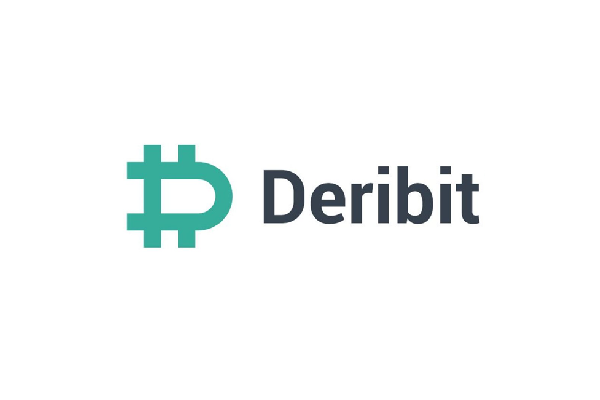

Algorithmic trading, also known as automated trading, involves using computer algorithms to execute trades based on predefined criteria. This approach has become a significant component of modern finance due to its ability to process complex calculations and execute high-speed trading strategies that humans would struggle to match manually. By leveraging technology, market participants can capitalize on fleeting opportunities, maintain consistency in trade executions, and ensure decisions are made without emotional bias.

Deribit emerges as a leading platform in the cryptocurrency derivatives market. Launched in 2016, it specializes in offering options and futures trading for major cryptocurrencies like Bitcoin and Ethereum.[^1] As cryptocurrencies continue to exhibit high volatility, derivative exchanges like Deribit provide indispensable tools for hedging and speculation. They allow traders to use leverage and access sophisticated financial products that are otherwise unavailable on spot exchanges.



Application Programming Interfaces (APIs) play a crucial role in enabling algorithmic trading by allowing software to retrieve real-time market data and execute trades programmatically. APIs act as intermediaries, enabling seamless communication between trading platforms and automated trading systems. Through APIs, traders can access live price feeds, historical data, and order book information while placing, modifying, or canceling orders efficiently.

This article provides an exploration of Deribit's API capabilities and its significance in algorithmic trading. It will cover an in-depth understanding of what Deribit's API offers, including the various types, features, and functionalities available to traders. Furthermore, it will guide you through setting up the Deribit API for algo trading purposes, building the foundation for developing effective trading strategies. Next, the piece will address challenges and considerations involved in using Deribit's API, while highlighting the tangible benefits traders can achieve. Finally, the advantages of leveraging Deribit's API in executing trading strategies and enhancing overall trading performance will be discussed, with practical examples of successful implementations.

[^1]: [Deribit - Wikipedia](https://en.wikipedia.org/wiki/Deribit)

## Table of Contents

## Understanding Deribit API

Deribit, a renowned cryptocurrency derivatives exchange, provides robust Application Programming Interfaces (APIs) that facilitate seamless interaction with its trading platform. These APIs are crucial for enabling algorithmic trading by offering real-time data access and efficient trade execution.

Deribit offers several types of APIs, mainly the REST API and WebSocket API. The REST API is designed for accessing Deribit’s trading and account data through HTTP requests. It is synchronous, meaning each request receives a response before another request can be made. This API is suitable for functions where immediate real-time data is not critical, such as account management, historical data retrieval, and trade execution.

Conversely, the WebSocket API operates asynchronously, providing a persistent connection to receive real-time data updates directly from the exchange. This API is ideal for applications that require low-latency access to market data, such as live [order book](/wiki/order-book-trading-strategies) updates and instantaneous trade notifications.

Key features of the Deribit API include:
- **Market Data Access**: Real-time and historical market data, including order books, recent trades, and instrument data.
- **Trade Execution**: Functions to place, cancel, and manage orders, allowing for automated trade operations.
- **Account Management**: Access to account information, margin details, and position data, facilitating comprehensive trading strategies.

The benefits of using Deribit API are manifold. For traders, the API provides an unparalleled advantage by offering direct access to market data, enabling quick and efficient trade execution. This greatly enhances the ability to execute complex algorithmic strategies without manual intervention. Furthermore, the API facilitates comprehensive account management, which is essential for monitoring and adjusting trading positions in a dynamic market environment.

In summary, Deribit's APIs are essential tools for traders seeking to leverage [algorithmic trading](/wiki/algorithmic-trading) strategies in [cryptocurrency](/wiki/cryptocurrency) markets. By offering both REST and WebSocket APIs, Deribit ensures that traders have access to the necessary real-time data and functionalities required to execute trades efficiently and effectively, thereby providing a significant competitive advantage in the rapidly evolving world of cryptocurrency trading.

## Setting Up Deribit API for Algo Trading

To begin setting up the Deribit API for algorithmic trading, the first step is to create a Deribit account. Visit the Deribit website and follow the registration procedure, which typically requires providing an email address, creating a password, and undergoing a verification process.

### Step 1: Obtain API Keys

Once your account is created and verified, navigate to the account settings, specifically the API section, to generate API keys. The keys consist of the following:

- **Client ID**: Identifies the application connecting to the API.
- **Client Secret**: A confidential key associated with the client ID, used for authentication.

Ensure to store these keys securely, as they enable access to your Deribit account.

### Step 2: Authenticate and Connect to the API

Authentication ensures that the communication between your application and Deribit is secure. Deribit supports OAuth 2.0 for authentication. Here's a basic guide using Python:

```python
import requests

url = "https://www.deribit.com/api/v2/public/auth"
params = {
    'client_id': '<YOUR_CLIENT_ID>',
    'client_secret': '<YOUR_CLIENT_SECRET>',
    'grant_type': 'client_credentials'
}

response = requests.get(url, params=params)
token = response.json()['result']['access_token']
```

This code snippet uses the `requests` library to obtain an access token by sending a `GET` request to the Deribit authentication endpoint. The returned token is then used in subsequent API requests.

### Step 3: Connecting to the API

Once authenticated, you can connect to Deribit's API using the provided REST or WebSocket interfaces:

- **REST API**: Suitable for transactional requests like placing or canceling orders.
- **WebSocket API**: Ideal for real-time data streaming, such as live market data.

### Step 4: Parameter and Configuration Setup

When setting up the Deribit API for algorithmic trading, configuring it to suit specific trading strategies is crucial. Here are key parameters to consider:

- **Market Data Subscription**: Define the specific data streams required, such as perpetual, futures, or options contracts. Use WebSocket endpoints to subscribe to real-time data feeds.

- **Order Types and Execution**: The API supports various order types like limit, market, and stop orders. Customize these to match the logic of your trading strategy.

- **Rate Limits**: Be mindful of the API's rate limits to prevent connection throttling. Implement logic to handle rate limit responses, potentially including wait times or alternate strategies such as queuing orders.

- **Error Handling**: Establish robust error handling and recovery mechanisms to ensure that your algorithm can handle downtime or unexpected disconnections gracefully.

This setup guide provides the foundational steps needed to start using the Deribit API for algorithmic trading, allowing traders to automate strategies with precision and access crucial market data in real-time.

## Developing Algo Trading Strategies with Deribit API

Algorithmic trading on Deribit involves implementing various strategies that can exploit the exchange's features and API capabilities. This section introduces key algorithmic trading strategies like [market making](/wiki/market-making), [arbitrage](/wiki/arbitrage), and [trend following](/wiki/trend-following), and illustrates how the Deribit API can support these approaches.

### Algorithmic Trading Strategies

1. **Market Making**: Market making involves providing liquidity to the market by submitting both buy (bid) and sell (ask) limit orders. The goal is to capture the bid-ask spread as profit. Trading algorithms would frequently update these orders based on market conditions.

2. **Arbitrage**: Arbitrage strategies involve exploiting price discrepancies of the same asset between different markets or platforms. On Deribit, this could mean taking advantage of price differences between different contract types or exchanges. 

3. **Trend Following**: This strategy capitalizes on the momentum of cryptocurrency price movements. Algorithms identify and follow trends by placing trades in the direction of a significant market move, often utilizing technical indicators.

### Using Deribit API Endpoints

To implement these strategies, the Deribit API provides essential endpoints that cater to various aspects of trading:

- **Market Data**: Endpoints offer real-time data on current market conditions, including order books, tickers, and trades. For market making, low-latency access to this data is vital for continuously updating orders.

- **Order Execution**: API endpoints allow you to place, cancel, and manage orders programmatically. This facility is crucial for executing trades at the speed necessary to exploit arbitrage opportunities.

- **Account Management**: Access to account balances, position information, and transaction history is provided through the API, enabling dynamic position sizing and risk management.

### Code Snippets and Pseudocode

Below is a simple Python snippet illustrating a basic trend-following strategy using Deribit's WebSocket API for real-time price updates:

```python
import websocket
import json

def on_message(ws, message):
    data = json.loads(message)
    price = data['result']['last_price']

    # Example of a simplistic trend-following logic
    if price > moving_average:  # Define moving_average elsewhere
        place_buy_order()       # Define function to place trade
    elif price < moving_average:
        place_sell_order()      # Define function to place trade

def on_error(ws, error):
    print(f"Error: {error}")

def on_close(ws):
    print("Connection closed")

def on_open(ws):
    # Subscribe to the price index
    subscribe_message = {
        "jsonrpc": "2.0",
        "method": "public/subscribe",
        "params": {
            "channels": ["ticker.BTC-PERP.100ms"]
        },
        "id": 42
    }
    ws.send(json.dumps(subscribe_message))

# Define WebSocket connection
ws = websocket.WebSocketApp("wss://www.deribit.com/ws/api/v2",
                            on_open=on_open,
                            on_message=on_message,
                            on_error=on_error,
                            on_close=on_close)

ws.run_forever()
```

This pseudocode exemplifies a rudimentary trading strategy, reacting to market prices against a predefined moving average. It highlights real-time data usage and order-triggering mechanisms. More sophisticated strategies could involve integration of technical indicators and [machine learning](/wiki/machine-learning) models.

### Summary

Developing algorithmic trading strategies using Deribit's API involves leveraging real-time market data and robust order execution capabilities. Whether pursuing market making, arbitrage, or trend following, the API provides the essential infrastructure needed to implement and automate these strategies efficiently. This technological edge is critical in the highly competitive world of cryptocurrency trading.

## Challenges and Considerations

When engaging in algorithmic trading using the Deribit API, traders may encounter several challenges and considerations that need to be addressed to ensure successful and efficient trading operations. One of the primary challenges includes rate limits imposed by the API. Deribit, like many other exchanges, enforces rate limits to manage server load and maintain fair access. This means that traders must design their algorithms to operate within these limits, avoiding excessive requests that could lead to important limitations of access. A common strategy to overcome this is to implement smart request management, which involves batching requests and using efficient data processing techniques to minimize the number of API calls.

Connection issues present another potential challenge. Algorithmic trading systems need consistent and stable connectivity to execute trades and process real-time market data effectively. Any latency or disruption in connection can lead to missed opportunities or unintended trades. To mitigate this risk, traders can use robust internet connections and implement fallback procedures where necessary, such as a secondary API endpoint or backup server to maintain continuous trading operations.

Risk management and security considerations are paramount when trading algorithmically on Deribit. The volatile nature of the cryptocurrency market necessitates stringent risk management protocols to protect trading portfolios from significant losses. Implementing features such as stop-loss orders, position limits, and real-time monitoring systems can help safeguard against unexpected market movements.

Security is another critical area of focus. Ensuring that API keys and other credentials are securely stored and transmitted is essential to prevent unauthorized access. Traders should employ encryption and secure authentication methods, such as two-[factor](/wiki/factor-investing) authentication, to enhance security measures. Regularly reviewing and updating security protocols can mitigate risks associated with unauthorized access and data breaches.

To optimize the use of Deribit's API in algorithmic trading, traders should adhere to several best practices. Firstly, thorough testing of algorithms in simulated environments before deploying them in live markets is crucial. This helps identify potential issues and refine strategies without financial consequences. Additionally, documenting the API interactions and maintaining robust logging mechanisms can assist in troubleshooting and improving trading strategies over time.

Moreover, integrating contingency plans and monitoring systems allows traders to respond swiftly to unexpected occurrences, such as market upheavals or technical failures. Establishing a disciplined approach to algorithm updates and maintenance further ensures that trading strategies remain effective and aligned with market conditions. By addressing these challenges and considerations, traders can leverage Deribit's API to execute precise and automated trading strategies, gaining a competitive advantage in the cryptocurrency market.

## Benefits of Using Deribit API in Algo Trading

Algorithmic trading has become a cornerstone of modern finance, largely due to the capabilities offered by robust APIs. Deribit's API stands out for its ability to provide speed, precision, and automation, crucial elements in the cryptocurrency market. The use of Deribit's API allows traders to execute trades swiftly and accurately, enabling them to respond faster to market changes than manual trading would allow. Automation through APIs reduces human error, increases efficiency, and allows for the continuous exploitation of algorithmic strategies without the need for constant manual intervention.

Utilizing Deribit's API gives traders a competitive advantage in the burgeoning arena of cryptocurrency trading. Speed is a critical factor, considering that market conditions can fluctuate within seconds. By leveraging the API, traders are empowered with real-time data streaming and instant trade execution capabilities. This rapid response time can be the difference between capitalizing on a transient market opportunity and missing it entirely.

For instance, a high-frequency trading strategy that uses Deribit's API can place thousands of trades in seconds, executing complex algorithms that monitor market conditions and execute pre-programmed trading instructions. The precision of the API ensures that trades are executed at desired price points, which is vital when engaging in strategies like market making or arbitrage where profit margins can be slim.

Real-world examples underscore the efficacy of Deribit's API. Traders report that deploying algorithmic strategies on Deribit has resulted in increased profitability and lower transaction costs. One such testimonial comes from a trader employing a trend-following algorithm, which effectively capitalizes on price movements by using the API to monitor multiple markets simultaneously and execute trades automatically when certain technical indicators are met.

Moreover, the API offers extensive documentation and support, ensuring that even those new to algorithmic trading can develop and execute their strategies with relative ease. The customizable nature of Deribit's API allows users to tailor their trading systems to specific needs, enhancing performance and profitability.

In conclusion, Deribit's API equips traders with the tools necessary for maintaining an edge in cryptocurrency markets. By offering unparalleled speed and precision, alongside the capability for automation, the API solidifies its position as an indispensable asset for algorithmic trading strategies. As the digital currency landscape continues to evolve, tools like Deribit's API will likely remain crucial to achieving trading success.

## Conclusion

In this article, we have explored the integral role of Deribit's API in the landscape of algorithmic trading for cryptocurrency derivatives. The API's ability to provide real-time data, execute trade orders with precision, and manage accounts programmatically positions it as a crucial tool for traders aiming to leverage technology for trading efficiency. By facilitating access to extensive market data and offering seamless trade execution capabilities, the Deribit API empowers traders to implement various algorithmic strategies such as market making, arbitrage, and trend following.

The significance of Deribit's API extends beyond mere functionality; it offers a competitive advantage in the high-speed, volatile environment of cryptocurrency trading. Through automation, traders can enhance the precision of their operations, minimizing manual errors and optimizing transaction times. This advantage is crucial given the rapid pace at which market conditions can change, allowing traders to capitalize on opportunities swiftly and effectively.

As we look to the future, the importance of APIs in algorithmic trading is likely to continue growing. With the ongoing development of blockchain technologies and the increasing sophistication of trading algorithms, platforms like Deribit are poised to remain at the forefront of innovation in this area. They provide a robust foundation for traders to build, refine, and execute their algorithmic strategies, adapting to new market conditions and emerging opportunities.

The Deribit API, by facilitating enhanced trading capabilities, remains a key player in advancing algorithmic strategies within the cryptocurrency space. Its integration into trading systems not only enhances operational efficiency but also shapes the future landscape of trading by setting a standard for reliability and performance. As trading evolves, traders equipped with the right tools, like those provided by Deribit, will be well-positioned to navigate the challenges and opportunities of cryptocurrency markets.

## References & Further Reading

[1]: ["Deribit - Wikipedia"](https://en.bitcoin.it/wiki/Deribit)

[2]: Bergstra, J., Bardenet, R., Bengio, Y., & Kégl, B. (2011). ["Algorithms for Hyper-Parameter Optimization."](https://dl.acm.org/doi/10.5555/2986459.2986743) Advances in Neural Information Processing Systems 24.

[3]: ["Advances in Financial Machine Learning"](https://resources.caih.jhu.edu/textbooks/Resources/_pdfs/Advances_In_Financial_Machine_Learning.pdf) by Marcos Lopez de Prado

[4]: ["Evidence-Based Technical Analysis: Applying the Scientific Method and Statistical Inference to Trading Signals"](https://www.amazon.com/Evidence-Based-Technical-Analysis-Scientific-Statistical/dp/0470008741) by David Aronson

[5]: ["Machine Learning for Algorithmic Trading"](https://github.com/stefan-jansen/machine-learning-for-trading) by Stefan Jansen

[6]: ["Quantitative Trading: How to Build Your Own Algorithmic Trading Business"](https://books.google.com/books/about/Quantitative_Trading.html?id=j70yEAAAQBAJ) by Ernest P. Chan