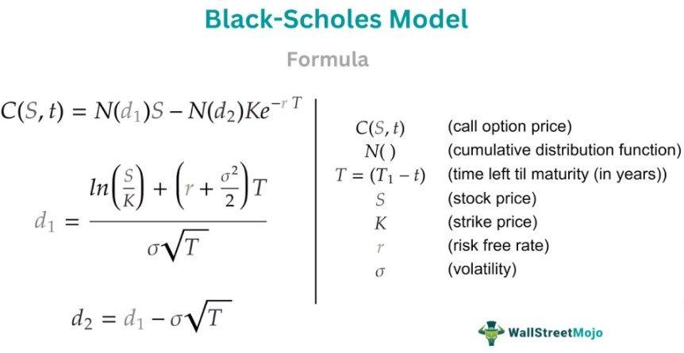

Derivative pricing plays a pivotal role in the modern financial markets, involving the process of determining the fair value of financial derivatives—contracts whose value is derived from underlying assets such as stocks, bonds, currencies, or commodities. Accurate pricing is crucial as it informs the decision-making process for investors, enabling them to hedge risks, speculate on future movements, or engage in arbitrage opportunities. Mispricing can lead to substantial financial losses, impacting not only individual investors but also the stability of the financial markets.

Algorithmic trading, on the other hand, has revolutionized the financial industry by automating trading activities through pre-defined criteria that can include timing, price, quantity, or complex mathematical models. By employing algorithms, traders can execute orders at speeds and frequencies unimaginable to human traders, capitalizing on market inefficiencies and reducing transaction costs. This technology-driven approach has led to significant increases in trading volumes and market liquidity.



The intersection of derivatives and algorithmic trading is marked by the utilization of derivative pricing as a critical tool in designing trading strategies. Algorithms can leverage real-time pricing of derivatives to optimize trading decisions, allowing for dynamic adjustments to market changes. Derivative pricing models, when integrated into algorithmic trading platforms, enhance the strategy's robustness by incorporating risk management features and identifying profitable opportunities with greater precision.

This article aims to explore how derivative pricing is integral to refining algorithmic trading strategies, offering insights into the seamless integration of these components to foster more sophisticated and adaptive financial trading systems. Through examining various models, their applications, and the benefits of incorporating real-time data, the article will outline the transformative impact of this integration on achieving strategic trading advantages.

## Table of Contents

## Understanding Derivatives

Derivatives are financial instruments whose value is based on the performance of underlying assets such as stocks, bonds, commodities, currencies, interest rates, or market indexes. They are contractual agreements used extensively in modern finance to manage risk, speculate on future price movements, or arbitrage differences in market prices. The main types of derivatives include options, futures, forwards, and swaps.

Options provide the holder with the right, but not the obligation, to buy or sell an underlying asset at a predetermined price and time. Two main types of options are call options, giving the holder the right to buy, and put options, granting the right to sell.

Futures are standardized contracts that obligate the buyer to purchase, and the seller to sell, an asset at a future date and price. Unlike options, futures impose a binding obligation on the involved parties. These contracts are traded on exchanges and are used primarily for hedging and speculative purposes.

Forwards are similar to futures but involve privately negotiated agreements between two parties to buy or sell an asset at a specified future date and price. Unlike futures, forwards are not standardized or traded on exchanges, making them customizable but also more risky due to counterparty risk.

Swaps are agreements to exchange cash flows or other financial instruments between parties over a defined period. They often involve exchanging fixed interest payments for floating payments based on an [interest rate](/wiki/interest-rate-trading-strategies) index, making them valuable for managing interest rate risk.

Derivatives serve crucial economic functions in the financial markets. They are commonly used for hedging, which involves offsetting potential losses in investments by taking an opposite position in a related derivative. For instance, a company expecting to pay for a future commodity purchase in foreign currency may use a currency derivative to lock in the exchange rate, mitigating the risk of unfavorable currency movements.

Derivatives also facilitate speculation, allowing traders to bet on the direction of an asset's price without owning the asset. This can lead to large profits or losses depending on the accuracy of the trader's market predictions. Arbitrage, another function, enables traders to profit from price discrepancies of the same asset in different markets by simultaneously buying and selling it.

Accurate pricing in the derivatives market is vital, as mispricing can lead to incorrect hedging, failed [arbitrage](/wiki/arbitrage) strategies, and speculative losses. Pricing models, which can be mathematical or statistical, are used to estimate the fair value of derivatives by considering factors such as the price of the underlying asset, time to expiration, [volatility](/wiki/volatility-trading-strategies), and interest rates. A common pricing model for options is the Black-Scholes model, which calculates the theoretical option price based on these inputs.

However, derivatives trading carries significant risks. Notably, leverage can amplify both gains and losses, leading to substantial financial exposure, potentially exceeding the initial investment. Market risk is inherent as derivatives are susceptible to rapid changes in market conditions. Additionally, credit risk arises in over-the-counter derivatives, where the counterparty may default, causing significant financial loss. Furthermore, [liquidity](/wiki/liquidity-risk-premium) risk poses challenges as certain derivatives may not be easily sold or priced accurately in fast-moving markets.

Consequently, participants in the derivatives markets should exercise caution and employ robust risk management strategies to mitigate potential drawbacks while leveraging the economic benefits derivatives offer.

## Basics of Algorithmic Trading

Algorithmic trading, also known as automated trading, involves the use of computer programs and algorithms to execute trading decisions with minimal human intervention. By leveraging pre-set criteria such as timing, price, and [volume](/wiki/volume-trading-strategy), [algorithmic trading](/wiki/algorithmic-trading) systems can process vast amounts of market data to execute buy and sell orders more efficiently and accurately than manual trading. These systems are designed to respond to market conditions at speeds often imperceptible to human traders, thereby capitalizing on favorable market conditions more effectively.

Algorithmic trading strategies can be broadly categorized into several types, each serving different financial objectives:

1. **Market Making**: This strategy involves continuously quoting buy and sell prices for financial instruments, aiming to profit from the bid-ask spread. By providing liquidity to the market, market makers enable smoother transactions and earn small profits on each trade, which can accumulate over time.

2. **Statistical Arbitrage**: This strategy leverages statistical models to identify mispricings between correlated financial instruments. Traders can then execute long and short positions in pairs or groups of securities, with the expectation that price disparities will eventually converge, allowing them to profit from mean reversion.

3. **Trend Following**: Typically used in futures markets, trend-following strategies aim to capitalize on the persistence of market trends. Algorithms identify and confirm trend signals and execute trades in the direction of the trend, whether upwards or downwards, until signs of a reversal are detected.

Speed, data, and precision are integral components of algorithmic trading. To outpace competitors, traders invest heavily in cutting-edge technology that reduces latency to an absolute minimum. Access to real-time data and historical market information allows algorithms to make informed, data-driven decisions. Precision ensures that trades are executed accurately within the parameters set by the trading strategy, minimizing slippage and maximizing potential returns.

The advent of technology and the integration of [machine learning](/wiki/machine-learning) have significantly impacted algorithmic trading. Machine learning algorithms can analyze vast datasets to uncover hidden patterns and relationships within the market. These algorithms self-improve over time, potentially increasing profitability by adapting to changing market conditions more swiftly than traditional models. Moreover, advancements in computing power have enabled the development of more sophisticated algorithms capable of handling complex calculations and simulations in real-time.

In conclusion, algorithmic trading has transformed the financial markets by automating decision-making processes, enhancing the speed and precision of trade execution, and utilizing advanced technologies to gain insights from market data. These benefits have led to increased efficiency and liquidity in the markets, though they have also introduced complexities such as the need for robust technology infrastructure and ongoing vigilance against evolving market conditions.

## Derivative Pricing Models

Derivative pricing models play a crucial role in the valuation and trading of derivative instruments. Among the primary models used for pricing derivatives are the Black-Scholes model, Binomial Trees, and Monte Carlo simulation. Each of these models provides a different approach to pricing, offering unique advantages and challenges.

The Black-Scholes model, developed by Fischer Black, Myron Scholes, and Robert Merton in the early 1970s, is perhaps the most famous approach. It is used primarily for pricing European-style options and provides a closed-form solution for option pricing based on a set of assumptions, including constant volatility and interest rates, and the log-normal distribution of asset prices. The Black-Scholes formula is expressed as:

$$
C = S_0N(d_1) - Xe^{-rt}N(d_2)
$$

where:

- $C$ is the call option price
- $S_0$ is the current stock price
- $X$ is the strike price
- $t$ is the time to expiration
- $r$ is the risk-free interest rate
- $N$ is the cumulative distribution function of the standard normal distribution
- $d_1 = \frac{\ln(S_0/X) + (r + \sigma^2/2)T}{\sigma\sqrt{T}}$
- $d_2 = d_1 - \sigma\sqrt{T}$

While the Black-Scholes model is praised for its simplicity and analytical elegance, its assumptions often limit its real-world applicability. Challenges arise in accurately estimating volatility and interest rates, which can fluctuate over time.

The Binomial Tree model offers a more flexible approach, allowing for the pricing of American-style options, which can be exercised at any time before expiration. This model breaks down the time to expiration into discrete intervals, creating a tree of potential future prices. By working backward from the expiration to the present, it calculates the option's value at each node. This model overcomes some of the limitations of the Black-Scholes model by accommodating changing interest rates and volatilities, though at the cost of increased computational complexity.

Monte Carlo simulation is another powerful technique, particularly suited for complex derivatives or portfolios where analytical solutions are not feasible. This method involves simulating a large number of possible future paths for the underlying asset's price, calculating the payoff for each path, and then averaging these payoffs to determine the derivative's value. While very flexible and applicable to a wide range of derivatives, Monte Carlo simulations require significant computational power, and their accuracy depends on the number of simulations run.

The selection of an appropriate derivative pricing model is crucial, as it directly affects the pricing accuracy, risk assessment, and strategic decisions in trading. Each model must consider factors such as volatility, interest rate shifts, and market conditions, which significantly impact the pricing process. High volatility, for instance, increases the uncertainty of future asset prices, leading to higher option prices. Similarly, changes in interest rates can affect the present value of option payoffs.

In algorithmic trading, the choice of pricing model impacts the strategy's effectiveness. Models integrated into trading algorithms must not only offer precision and adaptability to changing market conditions but also balance the demands of computational efficiency and accuracy. As such, continuously refining pricing models and incorporating real-time data analysis is essential for maximizing trading performance and managing risks.

## Integrating Derivative Pricing into Algorithmic Trading

Real-time pricing data plays a critical role in algorithmic trading decisions, enabling traders to respond promptly and precisely to market movements. The continuous influx of up-to-the-minute data on asset prices, including derivatives, allows trading algorithms to adjust their strategies in response to dynamic market conditions. This capability is essential for ensuring that trading decisions are made with the most current information, thereby optimizing potential returns and minimizing risks.

The integration of machine learning and [artificial intelligence](/wiki/ai-artificial-intelligence) (AI) into derivative pricing models significantly enhances their predictive power and accuracy. Machine learning algorithms can analyze vast datasets to identify patterns and correlations that might not be apparent through traditional methods. For instance, neural networks and other advanced AI techniques can be employed to model complex, nonlinear relationships in market data, which are common in the pricing of derivatives. These approaches can accommodate various input variables such as volatility surfaces, interest rates, and macroeconomic indicators, thereby offering more robust pricing models.

The synergy between derivatives pricing and algorithmic trading results in numerous benefits, particularly in terms of risk management and strategy optimization. Accurate pricing models facilitate the assessment of fair market value, allowing traders to identify mispricings and arbitrage opportunities. Moreover, by implementing these models within algorithms, traders can automate hedging strategies, thereby reducing exposure to unwanted risks. Optimization of portfolio performance is another key advantage, as algorithms equipped with precise pricing models can dynamically adjust asset allocations based on forecasted market conditions.

Several case studies highlight the successful integration of derivatives pricing into algorithmic trading platforms. For example, some trading firms leverage AI-enhanced models to predict option prices with greater accuracy than conventional models, leading to improved returns in options trading. Similarly, high-frequency trading ([HFT](/wiki/high-frequency-trading-strategies)) firms utilize real-time pricing data in conjunction with advanced algorithms to capitalize on fleeting market inefficiencies across various derivative instruments. These firms often employ AI to refine their pricing models continuously, ensuring that their trading strategies remain competitive and adaptive to evolving market dynamics. 

The integration of derivative pricing into algorithmic trading is thus a multifaceted approach, blending real-time data processing, advanced modeling techniques, and strategic automation to enhance trading outcomes. This convergence of technology and finance not only optimizes trading performance but also contributes to the robustness and efficiency of financial markets as a whole.

## Challenges and Risks

Implementing derivative pricing models in real-time trading scenarios poses substantial challenges, particularly in terms of computational complexities, data requirements, and regulatory compliance. These factors significantly impact the effectiveness and reliability of algorithmic trading strategies that utilize derivatives.

### Computational Complexities and Data Requirements

Derivatives pricing often necessitates sophisticated models, such as Black-Scholes, Binomial Trees, and Monte Carlo simulations. These models require intensive computational power, especially when employed in high-frequency trading (HFT) environments where decisions are made in fractions of a second. For instance, Monte Carlo simulations involve simulating numerous potential future price paths to estimate the present value of derivatives, demanding substantial computational resources and optimized processing algorithms.

Python, with its robust libraries like NumPy and SciPy, is frequently used to handle these computations. However, the need for precision and speed might also call for C++ implementations, which significantly reduce execution time but increase complexity. Consider the following Python snippet for a simple Black-Scholes option pricing model:

```python
import numpy as np
from scipy.stats import norm

def black_scholes(S, K, T, r, sigma, option_type='call'):
    d1 = (np.log(S/K) + (r + 0.5 * sigma**2) * T) / (sigma * np.sqrt(T))
    d2 = d1 - sigma * np.sqrt(T)

    if option_type == 'call':
        return S * norm.cdf(d1) - K * np.exp(-r * T) * norm.cdf(d2)
    elif option_type == 'put':
        return K * np.exp(-r * T) * norm.cdf(-d2) - S * norm.cdf(-d1)

# Example usage
price = black_scholes(S=100, K=100, T=1, r=0.05, sigma=0.2, option_type='call')
```

In addition to computational demands, real-time derivatives pricing mandates access to high-quality, low-latency market data. This data, typically obtained from multiple sources to ensure accuracy, must be processed rapidly to inform trading decisions. The integration of extensive datasets, including historical prices, interest rates, and volatility measures, adds another layer of complexity to implementing these models in real-time systems.

### Regulatory and Compliance Issues

The regulatory landscape for derivative trading is intricate, with stringent compliance requirements that vary across jurisdictions. Regulations such as the Dodd-Frank Act in the United States and the European Union's Markets in Financial Instruments Directive II (MiFID II) impose significant obligations on traders. These include transparency requirements, reporting obligations, and the necessity to maintain a comprehensive audit trail of trading activities.

Compliance with these regulations requires the implementation of robust risk management frameworks and transparent pricing mechanisms. Firms must ensure that their derivative pricing models adhere to regulatory standards while delivering real-time insights without violating compliance mandates.

### Managing Risks in Derivative Trading

Risk management in derivative trading is critical, given the inherent risks associated with liquidity, market volatility, and model inaccuracies. Market liquidity risk can lead to significant price slippage during execution, impacting the profitability of trades. Moreover, the models themselves can introduce inaccuracies due to incorrect assumptions or parameter estimation errors, leading to suboptimal pricing.

To mitigate these risks, continuous monitoring and validation of pricing models are necessary. This process involves back-testing models against historical data and real-market scenarios to assess performance and recalibrate as needed. Additionally, incorporating advanced techniques such as machine learning can enhance model accuracy by adapting to market changes dynamically.

Risk management systems must also consider hedge effectiveness, assessing how well derivatives positions protect against adverse movements in underlying assets. Sophisticated risk assessment tools and scenario analysis techniques are often employed to ensure that trading strategies remain resilient amidst market fluctuations.

In conclusion, addressing the challenges of real-time derivative pricing in algorithmic trading requires a multifaceted approach involving robust computational infrastructure, rigorous compliance with regulatory standards, and effective risk management practices. By leveraging advanced technology and data analytics, traders can enhance the accuracy and reliability of their derivative pricing models, paving the way for more effective and profitable trading strategies.

## The Future of Derivative Pricing in Algorithmic Trading

The landscape of derivative pricing within algorithmic trading is poised for significant transformation, driven by emerging trends and technological advancements. 

Decentralized finance (DeFi) presents substantial opportunities for derivatives trading. By leveraging blockchain technology, DeFi has the potential to democratize access to derivative markets, promoting transparency and reducing counterparty risk. This shift could enable more efficient and secure derivative transactions without traditional intermediaries. Decentralized exchanges (DEXs) are emerging that allow for peer-to-peer derivatives trading, introducing smart contracts which automate and enforce contractual agreements without the need for a centralized authority. These innovations can lead to the creation of novel derivative products and platforms, expanding the horizons of traditional financial instruments.

Advancements in high-frequency trading (HFT) and quantum computing also suggest transformative possibilities for derivative pricing. HFT, characterized by rapid order execution, relies heavily on sophisticated algorithms and low-latency data feeds. The integration of real-time derivative pricing can enhance the precision and effectiveness of HFT strategies. Meanwhile, quantum computing promises to revolutionize financial modeling by solving complex computations at unprecedented speeds. This capability is particularly valuable in pricing derivatives, which often require extensive simulations to assess risk and value accurately. With quantum algorithms, traders could process vast datasets and execute complex derivative pricing models more efficiently than ever before.

Another significant [factor](/wiki/factor-investing) in the future of derivative markets is the growing focus on sustainability and ethical considerations. As investors increasingly prioritize environmental, social, and governance ([ESG](/wiki/esg-investing)) criteria, the derivative markets must adapt to reflect these values. This could involve developing new derivative products that allow investors to hedge against ESG risks or facilitate investment in sustainable projects. Additionally, the adoption of fair and transparent pricing practices will be crucial in maintaining trust and integrity within the market, particularly as algorithmic and automated systems play larger roles in trading decisions.

These evolving trends suggest that the future of derivative pricing in algorithmic trading will be shaped by technological innovation, market democratization, and a commitment to ethical and sustainable practices. Traders and financial institutions must adapt to these changes, leveraging advanced tools and strategies to remain competitive in this dynamic environment.

## Conclusion

In the discussions throughout this article, we've underscored the intricate interplay between derivative pricing and algorithmic trading. The precision of derivative pricing is crucial for enhancing the effectiveness of algorithmic trading strategies. Accurate derivative valuation not only aids in formulating trading strategies but also serves as a vital tool for risk management. By incorporating real-time derivative pricing into their strategies, traders and investors can better assess risks, optimize returns, and make more informed decisions in increasingly dynamic financial markets.

Moreover, we've highlighted how integrating machine learning and artificial intelligence can elevate derivative pricing models, leading to more robust, data-driven decision-making processes. These technologies aid in refining models and allowing for the swift adaptation to market changes, thereby ensuring that algorithmic trading systems remain competitive.

For traders and investors, the integrations of derivative pricing into their trading strategies are not merely beneficial but essential. It offers a comprehensive approach to managing financial exposures and exploiting market opportunities. As the landscape of finance continues to evolve with technological advancements, a call to action is warranted for further research and development in this domain. Ensuring regulatory compliance and managing market liquidity risks are also critical to maintaining a healthy and sustainable trading environment.

The continued exploration of emerging technologies, such as decentralized finance and quantum computing, holds promise for revolutionizing derivative pricing and trading practices. The pursuit of innovative, ethical, and sustainable solutions will drive the next wave of progress in this field, inviting professionals to explore new avenues and harness cutting-edge tools for improved outcomes in financial markets.

## References & Further Reading

[1]: Black, F., & Scholes, M. (1973). ["The Pricing of Options and Corporate Liabilities."](https://www.cs.princeton.edu/courses/archive/fall09/cos323/papers/black_scholes73.pdf) The Journal of Political Economy, 81(3), 637-654.

[2]: Hull, J. C. (2018). ["Options, Futures, and Other Derivatives"](https://www.pearson.com/nl/en_NL/higher-education/subject-catalogue/finance/Options-Futures-and-Other-Derivatives-Hull.html). Pearson.

[3]: Merton, R. C. (1973). ["Theory of Rational Option Pricing."](https://www.semanticscholar.org/paper/Theory-of-Rational-Option-Pricing-Merton/f22256599cc513be281a2a82082d4bac7031def2) The Bell Journal of Economics and Management Science, 4(1), 141-183.

[4]: Talay, D. (1997). ["Efficient Numerical Schemes for the Pricing of Options under Stochastic Volatility Models."](https://www.cambridge.org/core/journals/acta-numerica/article/abs/an-introduction-to-numerical-methods-for-stochastic-differential-equations/34AEA7B7D62931AE332FD168CDA3B8AB)00024-3) Mathematical Finance, 7(1), 95-114.

[5]: Almgren, R., & Chriss, N. (2001). ["Optimal Execution of Portfolio Transactions."](https://www.risk.net/journal-risk/2161150/optimal-execution-portfolio-transactions) Journal of Risk, 3(2), 5-39.