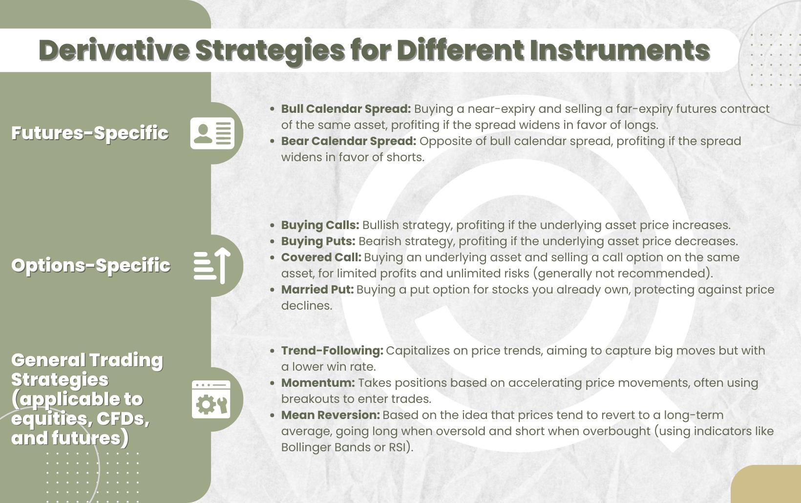

Algorithmic trading has fundamentally transformed the dynamics of financial markets by enabling automated, rapid, and data-driven trading decisions. The rise of algorithmic trading is attributed to advances in technology, increased market data availability, and the need for speed and precision in executing trades. Central to the enhancement of these algorithmic strategies is the use of derivatives, which are pivotal in broadening the scope of trading strategies available to market participants.

Derivatives are financial instruments whose value is dependent on underlying assets such as stocks, bonds, commodities, or market indices. These instruments, including futures, options, and swaps, serve multiple purposes within financial markets. Derivatives facilitate hedging, allowing traders to mitigate risk associated with price fluctuations in underlying assets. Additionally, they enable speculation and arbitrage, offering opportunities to profit from expected market movements or price discrepancies.



Incorporating derivatives in algorithmic trading can significantly enhance a trader’s ability to implement sophisticated strategies that might not be possible with traditional securities alone. Derivatives provide leverage, meaning that a trader can gain disproportionate exposure to an asset without needing to own the entirety of that asset, thereby allowing for potentially higher returns on investment. Furthermore, their flexibility supports the execution of complex strategies such as spread trading, volatility trading, and risk management enhancements.

This article aims to explore various derivative strategies used in algorithmic trading, highlighting their intricate roles in optimizing trading performance. By examining the benefits and practical considerations of these strategies, traders can better understand how to leverage derivatives to their advantage.

## Table of Contents

## Understanding Derivatives in Algorithmic Trading

Derivatives are pivotal instruments in the financial markets, serving as contracts whose value is dependent on the performance of underlying assets such as stocks, bonds, commodities, or market indices. The primary forms of derivatives include futures, options, and swaps, each offering distinct functionalities and applications.

Futures contracts are standardized agreements to buy or sell an asset at a predetermined future date and price. These contracts are commonly used in algorithmic trading for hedging and speculative purposes. An algorithm might, for example, programmatically enter into futures positions to gain exposure to a particular commodity market while mitigating the risks associated with price volatility.

Options provide an alternative avenue, granting the holder the right, but not the obligation, to buy or sell an underlying asset at a set price within a specified timeframe. This flexibility makes options a versatile tool for managing and hedging risks, especially in volatile markets. In [algorithmic trading](/wiki/algorithmic-trading), options can be algorithmically traded to construct strategies that capitalize on market movements while containing downside risks, such as through straddles or strangles.

Swaps, another critical derivative type, are over-the-counter contracts in which two parties exchange financial instruments or cash flows. The most prevalent swap is the [interest rate](/wiki/interest-rate-trading-strategies) swap, used to manage exposure to fluctuations in interest rates. Although swaps are less commonly associated with algorithmic trading compared to futures and options, their integration can enhance strategies involving interest rate differentials or hedging complex financial positions.

In algorithmic trading, derivatives are instrumental for various strategic applications. They provide a platform for hedging—protecting investments against adverse price movements—speculation on future price changes, and [arbitrage](/wiki/arbitrage) opportunities. Arbitrage, in particular, involves exploiting the price discrepancies between derivatives and their underlying assets across different markets to achieve risk-free profits. This can be achieved through carefully programmed algorithms capable of executing trades at high speed, ensures minimal market impact.

Overall, the integration of derivatives in algorithmic trading strategies significantly enhances the ability to manage risk and capitalize on market opportunities effectively, making them indispensable tools for traders in dynamic financial environments.

## Key Advantages of Incorporating Derivatives

Derivatives offer several key advantages to traders and investors, especially when integrated into algorithmic trading strategies. One of the primary benefits is the leverage they provide. Leverage allows traders to control large positions with comparatively small amounts of capital. This means that with a limited initial investment, traders can potentially achieve substantial returns, although it also implies increased risk if the market moves unfavorably.

In terms of risk management, derivatives are invaluable tools for hedging purposes. By using instruments such as options and futures, traders can effectively protect their portfolios against adverse market movements. For instance, a trader holding a portfolio of stocks can purchase put options to guard against potential declines in stock prices. This hedging capability ensures that investments are safeguarded against [volatility](/wiki/volatility-trading-strategies), thereby enhancing the stability of trading operations.

Additionally, algorithmic strategies that utilize derivatives are well-positioned to exploit arbitrage opportunities across various markets. Arbitrage involves taking advantage of price discrepancies between related financial instruments. For example, if there is a pricing differential between a derivative and its underlying asset, an algorithm can execute simultaneous buy and sell orders to profit from the incongruence, thus ensuring efficient market functioning.

Python can be an effective tool for implementing such strategies. Consider the following simple example of using Python to identify potential arbitrage opportunities:

```python
def check_arbitrage(spot_price, future_price, transaction_cost):
    if future_price - spot_price > transaction_cost:
        return "Arbitrage Opportunity"
    else:
        return "No Arbitrage"

# Example usage
spot_price = 100
future_price = 105
transaction_cost = 3

result = check_arbitrage(spot_price, future_price, transaction_cost)
print(result)
```

In this example, the function `check_arbitrage` evaluates if the price difference between the spot and future price exceeds the transaction cost, indicating a possible arbitrage opportunity.

In summary, incorporating derivatives into algorithmic trading offers substantial leverage, robust risk management, and the potential to capitalize on arbitrage opportunities, thereby contributing to more efficient and strategic trading endeavors.

## Popular Derivative Strategies in Algo Trading

Algorithmic trading leverages advanced computational techniques to optimize trading strategies, often using derivatives as primary instruments. Among the diverse array of derivative strategies employed, trend-following with futures, options strategies for hedging and managing volatility, and arbitrage strategies exploiting price discrepancies stand out as particularly effective.

**Trend-following with Futures Contracts**

Trend-following strategies seek to capitalize on sustained movements in market prices by identifying and riding trends. Futures contracts, agreements to buy or sell an asset at a predetermined future date and price, are well-suited for these strategies due to their [liquidity](/wiki/liquidity-risk-premium) and leverage features. Traders typically utilize automated systems to detect price movements and align their positions accordingly. A simple moving average crossover strategy, where a short-term moving average crosses above a long-term moving average to signal a buy, is a classic example. This strategy can be implemented in Python as follows:

```python
import numpy as np
import pandas as pd

# Sample data for prices
prices = pd.Series([100, 102, 101, 105, 110, 115, 120])

# Calculate moving averages
short_window = prices.rolling(window=3).mean()
long_window = prices.rolling(window=5).mean()

# Generate signals
signal = np.where(short_window > long_window, 1, 0)
```

**Options Strategies for Hedging and Managing Volatility Risks**

Options strategies in algorithmic trading offer multiple hedging and speculation opportunities. Options, which confer the right but not the obligation to buy or sell an asset at a specified price, are instrumental in managing volatility risks. A common strategy includes using a straddle, which involves buying both a call and a put option at the same strike price and expiration. This positions the trader to profit from significant price movements in either direction, while the loss is limited to the premium paid for the options.

Consider a scenario where a trader expects a big move in a stock price but is uncertain about the direction. The payoff for a long straddle is:

$$
\text{Payoff} = \max((S_T - K), 0) + \max((K - S_T), 0) - C - P
$$

where $S_T$ is the stock price at expiration, $K$ is the strike price, $C$ is the call premium, and $P$ is the put premium.

**Arbitrage Strategies Leveraging Price Discrepancies**

Arbitrage strategies exploit inefficiencies between the price of a derivative and its underlying asset. These strategies require rapid execution to capitalize on small pricing discrepancies before they disappear. For instance, a common approach involves the index arbitrage strategy, where a trader simultaneously buys and sells a stock index futures contract and the underlying components if the futures price diverges significantly from the index value.

To perform such an operation programmatically, traders use algorithms to quickly identify and execute trades based on deviation thresholds, ensuring that the transactions occur almost instantaneously, mitigated by low latency infrastructure.

In summary, derivative strategies like trend-following with futures, options-based hedging, and arbitrage present robust techniques in algorithmic trading. With precise implementation, these strategies enhance trading robustness and capitalize on market movements and inefficiencies.

## Implementation Considerations

In algorithmic trading, the successful implementation of derivative strategies hinges on developing sophisticated algorithms capable of quickly analyzing vast amounts of market data and executing trades with precision. Given the competitive and fast-paced nature of financial markets, efficiency is paramount. 

Algorithms must be designed to process real-time data inputs and deliver actionable insights swiftly. This capability is essential not only for capturing fleeting opportunities but also for mitigating risks associated with market movements. The integration of [machine learning](/wiki/machine-learning) techniques and high-frequency trading strategies often requires optimizing code for latency and throughput. Optimized Python libraries, such as NumPy and pandas, are frequently used to handle data processing efficiently, although languages like C++ may be chosen for performance-critical components due to their execution speed.

A crucial component of implementation is thorough [backtesting](/wiki/backtesting) and optimization. This involves simulating the trading strategy on historical data to assess its performance and resilience under various market conditions. Backtesting helps identify potential weaknesses and areas for improvement before deploying the strategy in live markets. Key performance metrics, such as Sharpe Ratio, drawdown, and profit and loss, are typically used to evaluate the strategy's effectiveness. Python libraries like Backtrader and Zipline provide robust frameworks for running backtests and optimizing trading strategies. 

For example, a simple backtesting setup in Python might involve:

```python
import backtrader as bt

class MyStrategy(bt.Strategy):
    def __init__(self):
        self.sma = bt.indicators.SimpleMovingAverage(self.data.close, period=15)

    def next(self):
        if self.data.close[0] > self.sma[0]:
            self.buy(size=1)
        elif self.data.close[0] < self.sma[0]:
            self.sell(size=1)

cerebro = bt.Cerebro()
cerebro.addstrategy(MyStrategy)
cerebro.run()
cerebro.plot()
```

The ability to adapt to dynamic market conditions further necessitates the incorporation of real-time monitoring tools. This involves setting up systems that continuously evaluate market data, track performance indicators, and alert traders to any significant changes that may require intervention. These systems are essential for maintaining the strategy's edge in fluctuating market environments. Real-time monitoring systems often use data visualization tools and dashboards to present insights clearly and allow for rapid decision-making. 

Moreover, the use of cloud-based solutions and APIs, such as those provided by AWS and Google Cloud, enhances data storage and processing capabilities, enabling scalability and greater computational power when running complex algorithms and simulations. Implementing these considerations effectively not only ensures a robust trading strategy but also fosters the adaptability needed to thrive in the algorithmic trading landscape.

## Challenges and Risks Associated with Derivative Strategies

Derivatives are integral in algorithmic trading due to their ability to provide leverage and facilitate complex strategies. However, these advantages come with inherent risks and challenges that require careful consideration.

High leverage is a double-edged sword in derivative trading. While it allows traders to control substantial positions with relatively minimal capital, it also magnifies potential losses. If trades move unfavorably, the losses incurred can exceed the initial capital investment. This is especially pertinent in volatile markets, where rapid price swings can quickly deplete a leveraged position. It is crucial for traders to implement effective risk management strategies, such as stop-loss orders and position sizing, to mitigate these risks.

Market volatility is another significant [factor](/wiki/factor-investing) impacting derivative pricing and strategy outcomes. Derivative prices are influenced by the underlying asset's price volatility, which can lead to unpredictable and sudden value changes. For example, options pricing models, such as the Black-Scholes model, rely heavily on volatility assumptions. An unexpected spike in volatility can render these models inaccurate, potentially leading to suboptimal trading decisions. Traders must continuously adjust their models and strategies to account for changing market conditions.

Regulatory constraints also pose challenges in derivative trading. Financial markets are subject to a wide array of regulations that vary by jurisdiction. These regulations are designed to ensure market integrity and protect investors, but they can also impose limitations on trading activities. For example, new rules might require higher capital reserves for leveraged positions or impose restrictions on certain high-frequency trading practices. Compliance with these regulations demands ongoing attention to legal requirements and may require adjustments in trading strategies to remain within legal bounds.

Overall, the challenges and risks associated with derivative strategies in algorithmic trading highlight the importance of robust risk management frameworks, continuous monitoring of market conditions, and adherence to regulatory requirements.

## Future Trends in Derivative Strategies for Algo Trading

The landscape of algorithmic trading is continually evolving, with derivative strategies playing a pivotal role in this dynamic environment. As technology advances, several emerging trends are shaping the future of derivative strategies within algo trading. One significant trend is the integration of machine learning into predictive analytics. Machine learning algorithms, such as neural networks and support vector machines, are increasingly being employed to analyze vast datasets, identify patterns, and generate predictive insights. These algorithms can process high-dimensional data more efficiently than traditional statistical methods, allowing traders to anticipate market movements with greater accuracy. For example, implementing a recurrent [neural network](/wiki/neural-network) (RNN) in Python for time series forecasting can help in predicting future price trends:

```python
from keras.models import Sequential
from keras.layers import LSTM, Dense

# Initialize the RNN
model = Sequential()
# Add LSTM layer
model.add(LSTM(units=50, return_sequences=True, input_shape=(X_train.shape[1], 1)))
model.add(LSTM(units=50))
# Add output layer
model.add(Dense(units=1))

# Compile the RNN
model.compile(optimizer='adam', loss='mean_squared_error')

# Fit the RNN to the training set
model.fit(X_train, y_train, epochs=100, batch_size=32)
```

Another trend is the increasing use of [alternative data](/wiki/best-alternative-data) sources to refine strategy formulation. Beyond traditional financial metrics, traders are now leveraging unconventional data streams such as social media sentiment, satellite imagery, and corporate web traffic. These alternative datasets can provide unique insights into market behavior and supplement traditional data, enhancing the robustness of trading algorithms.

Sustainability and ethical considerations are also gaining prominence in the development of algorithmic trading strategies. Traders and financial institutions are focusing on environmental, social, and governance ([ESG](/wiki/esg-investing)) factors, aligning their strategies with sustainable and ethical trading practices. This trend is driven by growing awareness of the impact of financial activities on society and the environment, prompting the inclusion of ESG criteria in trading models. Sustainable investments not only meet ethical standards but also tap into a market segment that is increasingly valued by stakeholders globally.

These trends indicate a shift towards more sophisticated, diverse, and ethical approaches in leveraging derivative strategies within algorithmic trading, setting a foundation for future developments in the industry.

## Conclusion

Derivatives are indispensable in modern algorithmic trading, offering traders the tools to enhance both flexibility and efficiency in their strategies. By incorporating derivatives into algorithmic frameworks, traders gain the ability to leverage positions with minimal capital, efficiently manage risks, and capitalize on market inefficiencies. This versatility is crucial for navigating the fast-paced and ever-evolving financial markets.

Robust derivative strategies, when well-understood and implemented, can significantly boost trading performance. For instance, using options and futures can provide sophisticated hedging mechanisms to protect against adverse movements in asset prices. These strategies allow algorithmic traders to maintain positions that are aligned with desired risk profiles while also exploring opportunities for arbitrage and speculation.

Continuing research and development in derivative strategies is vital for maintaining a competitive edge in the field of algorithmic trading. Innovations such as integrating machine learning to enhance predictive capabilities, employing alternative data sources for refined analysis, and adhering to ethical trading practices are anticipated to play crucial roles in the future evolution of algorithmic trading strategies. By staying abreast of these advancements, traders can ensure that their strategies remain robust and effective amid changing market conditions. 

As the landscape of financial markets continues to shift, adaptability and continuous learning will be paramount for traders seeking to leverage derivatives efficiently within their algorithmic trading paradigms.

## References & Further Reading

[1]: Bergstra, J., Bardenet, R., Bengio, Y., & Kégl, B. (2011). ["Algorithms for Hyper-Parameter Optimization."](https://papers.nips.cc/paper/4443-algorithms-for-hyper-parameter-optimization) Advances in Neural Information Processing Systems 24.

[2]: ["Advances in Financial Machine Learning"](https://www.amazon.com/Advances-Financial-Machine-Learning-Marcos/dp/1119482089) by Marcos Lopez de Prado

[3]: ["Evidence-Based Technical Analysis: Applying the Scientific Method and Statistical Inference to Trading Signals"](https://www.amazon.com/Evidence-Based-Technical-Analysis-Scientific-Statistical/dp/0470008741) by David Aronson

[4]: ["Machine Learning for Algorithmic Trading"](https://github.com/stefan-jansen/machine-learning-for-trading) by Stefan Jansen

[5]: ["Quantitative Trading: How to Build Your Own Algorithmic Trading Business"](https://books.google.com/books/about/Quantitative_Trading.html?id=j70yEAAAQBAJ) by Ernest P. Chan