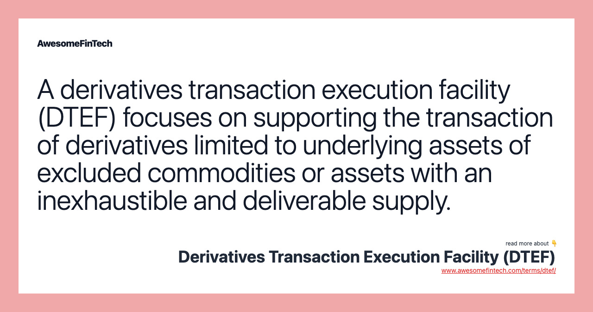

## Table of Contents

## What is a Derivatives Transaction Execution Facility (DTEF)?

A Derivatives Transaction Execution Facility (DTEF) is a type of marketplace where people can buy and sell derivatives. Derivatives are financial contracts whose value is based on an underlying asset, like stocks, commodities, or interest rates. DTEFs are designed to provide a more transparent and efficient way for these transactions to happen. They are regulated by financial authorities to make sure everything is fair and to protect the people using them.

DTEFs are different from traditional exchanges because they offer more flexibility in how trades can be made. For example, they might allow for negotiations between buyers and sellers, rather than just matching orders automatically. This can be helpful for people who need to customize their trades. Overall, DTEFs help make the derivatives market more accessible and easier to use for a wider range of people.

## How does a DTEF differ from other trading platforms?

A Derivatives Transaction Execution Facility (DTEF) is different from other trading platforms because it focuses specifically on derivatives, which are financial contracts based on things like stocks or commodities. Unlike traditional exchanges that might handle a variety of financial instruments, DTEFs are designed to handle only derivatives. This specialization allows DTEFs to offer more tailored services and better meet the needs of people trading these specific types of contracts.

Another way DTEFs differ is in how trades are made. On many trading platforms, trades are matched automatically by a computer system. But on a DTEF, there's often more room for buyers and sellers to negotiate directly with each other. This flexibility can be really helpful for people who need to customize their trades to fit their specific needs. So, while other platforms might be more rigid and standardized, DTEFs offer a more personalized trading experience.

## What types of derivatives can be traded on a DTEF?

A Derivatives Transaction Execution Facility (DTEF) can trade many different types of derivatives. These include futures contracts, which are agreements to buy or sell an asset at a future date for a price set today. Options are another type, giving the buyer the right, but not the obligation, to buy or sell an asset at a set price before a certain date. Swaps, where two parties exchange cash flows or other financial instruments, can also be traded on a DTEF.

In addition to these common derivatives, DTEFs can also handle more specialized products. For example, they might offer trading in credit default swaps, which are like insurance against a borrower defaulting on a loan. Another type could be commodity derivatives, which are based on the price of things like oil or wheat. This variety allows traders to use DTEFs for a wide range of financial strategies and risk management needs.

## Who are the typical users of a DTEF?

The typical users of a DTEF are often big financial institutions like banks and hedge funds. These groups use DTEFs to buy and sell derivatives as part of their business. They might use derivatives to manage risk, like protecting themselves from big changes in the market, or to make money by betting on future price movements. Because DTEFs let them negotiate trades directly, these big players can tailor their deals to fit their specific needs.

Smaller traders and companies can also use DTEFs, though not as often. These users might include businesses that want to protect themselves from price changes in things they buy or sell, like a farmer using derivatives to lock in a good price for their crops. Individual investors might also use DTEFs if they want to trade derivatives but need more flexibility than what traditional exchanges offer. Overall, DTEFs serve a wide range of users, from big institutions to smaller businesses and individual traders.

## What are the regulatory requirements for operating a DTEF?

Operating a DTEF comes with strict rules to make sure everything is fair and safe for everyone using it. These rules are set by financial regulators like the Commodity Futures Trading Commission (CFTC) in the United States. To start a DTEF, you need to get a license from these regulators. They will check to see if you have good systems in place to keep trades honest and to protect the money and information of the people using the DTEF. They also want to make sure you have enough money to keep the DTEF running smoothly.

Once a DTEF is up and running, it has to follow ongoing rules. This includes keeping detailed records of all trades and making sure these records are available for the regulators to check. The DTEF also has to report any problems or suspicious activities right away. Additionally, the DTEF must have strong security measures to prevent things like fraud or hacking. All these rules are there to make sure the DTEF operates in a way that is fair and trustworthy for everyone involved.

## How does the trading process work on a DTEF?

Trading on a DTEF is a bit different from other places. When you want to trade on a DTEF, you can talk directly with other traders. This means you can negotiate the details of your trade, like the price and how long the contract lasts. This can be really helpful if you need a special deal that fits your needs exactly. Once you and the other trader agree on everything, you make the trade. The DTEF keeps a record of your trade to make sure everything is fair and legal.

After the trade is done, the DTEF makes sure that both sides do what they promised. This includes making sure payments are made on time and that the contract is followed. If there's a problem, the DTEF can help solve it. They also have rules to protect everyone's money and information, so you can feel safe using the DTEF. This way, trading on a DTEF can be more flexible and secure for people who need to trade derivatives.

## What are the benefits of using a DTEF for derivatives trading?

Using a DTEF for derivatives trading has a lot of benefits. One big one is that it lets you talk directly with other traders. This means you can make special deals that fit exactly what you need. If you need a certain price or a certain time for your contract, you can work it out with the other trader. This can be really helpful if you have unique needs that regular trading places can't meet.

Another benefit is that DTEFs are safe and fair. They are watched closely by people who make rules to make sure everything is done right. This means your trades are recorded and checked to make sure no one is cheating. Also, DTEFs have strong security to keep your money and information safe. So, you can feel good knowing that trading on a DTEF is both flexible and secure.

## What are the potential risks associated with trading on a DTEF?

Trading on a DTEF can come with some risks. One big risk is that you might lose money. Derivatives can be complicated, and their value can change a lot. If you're not careful or if you don't understand them well, you could end up losing more money than you planned. Also, because you can talk directly with other traders on a DTEF, there's a chance you might make a deal with someone who doesn't keep their promises. This can lead to problems if the other trader doesn't do what they said they would do.

Another risk is that DTEFs can be affected by things happening in the market or the economy. Big changes in the market can make the value of your derivatives go up or down quickly. This can be risky if you're not ready for it. Also, even though DTEFs have rules to keep things fair and safe, there's always a small chance that something could go wrong, like a security problem or a mistake in the trading process. It's important to be aware of these risks and to be careful when trading on a DTEF.

## How do DTEFs ensure the transparency and integrity of transactions?

DTEFs work hard to make sure that trading is fair and clear for everyone. They do this by keeping detailed records of all trades. These records show who traded what, when, and at what price. This way, if there's ever a question about a trade, the DTEF can look at the records and make sure everything was done right. They also have to report these records to the people who make the rules, like the Commodity Futures Trading Commission (CFTC), to show that they are following all the rules.

Another way DTEFs keep things honest is by having strong security. They use special systems to protect against cheating and to keep traders' money and information safe. If anyone tries to do something wrong, the DTEF can catch it and stop it. They also have rules that traders have to follow, and if someone breaks these rules, the DTEF can take action to fix the problem. All of this helps make sure that trading on a DTEF is safe and fair for everyone involved.

## What technological infrastructure is required to support a DTEF?

To support a DTEF, you need a strong computer system that can handle a lot of trading information quickly and safely. This system needs to be able to keep track of all the trades that happen on the DTEF. It should also have good security to protect against people trying to cheat or hack into the system. The computer system should be able to work well even when a lot of people are using the DTEF at the same time, so it doesn't slow down or crash.

The DTEF also needs software that helps traders make deals with each other. This software should let traders talk to each other and agree on the details of their trades. It also needs to keep good records of all the trades, so the DTEF can show these records to the people who make the rules. Having a good backup system is important too, so if something goes wrong, the DTEF can still keep running and keep everyone's information safe.

## How do DTEFs integrate with clearing and settlement systems?

DTEFs work closely with clearing and settlement systems to make sure trades are done correctly and safely. When a trade happens on a DTEF, the details of the trade are sent to a clearinghouse. The clearinghouse is like a middleman that checks the trade to make sure everything is right. They also make sure that both people in the trade have enough money or assets to do what they promised. This helps to lower the risk that someone won't keep their promise.

After the clearinghouse checks everything, the trade moves to the settlement system. This is where the actual exchange of money and assets happens. The settlement system makes sure that the money goes to the right person and that any assets, like stocks or commodities, are moved correctly. This process can happen quickly, sometimes even on the same day as the trade. By working with clearing and settlement systems, DTEFs help make sure that trading is safe and that everyone gets what they are supposed to get.

## What are the future trends and developments expected in DTEFs?

In the future, DTEFs are expected to use more technology to make trading easier and safer. One big trend is the use of blockchain and other new technologies to make trading more secure and transparent. Blockchain can help keep better records of trades and make it easier to check that everything is done right. Also, more trading might happen automatically with the help of computers and artificial intelligence. This can make trading faster and help traders make better decisions by using data to see patterns in the market.

Another trend is that DTEFs might start offering more types of derivatives for people to trade. This could include new kinds of financial products that are designed to meet the needs of different traders. As more people learn about derivatives and how to use them, DTEFs could become more popular with smaller traders and not just big institutions. This growth could lead to more competition between DTEFs, which might make them offer better services and lower fees to attract more users.

## References & Further Reading

[1]: ["The Handbook of Equity Market Anomalies: Translating Market Inefficiencies into Effective Investment Strategies"](https://onlinelibrary.wiley.com/doi/book/10.1002/9781119200697) by Leonard Zacks

[2]: Aldridge, I. (2013). ["High-Frequency Trading: A Practical Guide to Algorithmic Strategies and Trading Systems."](https://www.amazon.com/High-Frequency-Trading-Practical-Algorithmic-Strategies/dp/1118343506) Wiley Trading.

[3]: Lewis, M. (2014). ["Flash Boys: A Wall Street Revolt."](https://en.wikipedia.org/wiki/Flash_Boys) W. W. Norton & Company.

[4]: Black, F., Jensen, M., & Scholes, M. (1972). ["The Capital Asset Pricing Model: Some Empirical Tests."](https://papers.ssrn.com/sol3/papers.cfm?abstract_id=908569) Studies in the Theory of Capital Markets.

[5]: Hull, J. (2017). ["Options, Futures, and Other Derivatives."](https://elibrary.pearson.de/book/99.150005/9781292212920) Pearson.

[6]: DeGennaro, R. P., & Dwyer, G. P. (2006). ["High Frequency Data in Financial Markets: Issues and Applications."](https://www.sciencedirect.com/science/article/pii/S0927539897000030) Cambridge University Press.