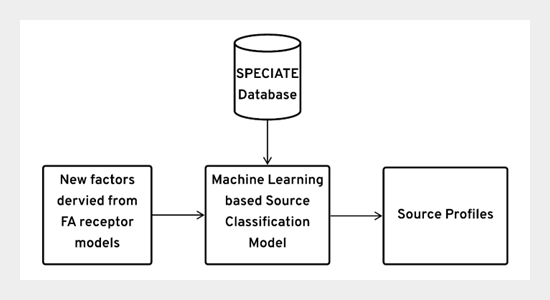

## Table of Contents

## What is a derived label in machine learning?

In machine learning, a derived label is a type of label or target variable that is created from existing data rather than being directly provided. For example, if you have a dataset about houses that includes the sale price, you might create a derived label called "price category" by grouping the sale prices into categories like "low," "medium," and "high." This process of creating new labels from existing data can help in building more insightful models, especially when the original data does not directly provide the information you need for your analysis.

Derived labels are useful because they can transform complex or continuous data into simpler, more manageable forms. For instance, instead of using the exact age of a person, you might create a derived label that categorizes people into groups like "young," "middle-aged," and "senior." This can make it easier to train models and interpret results, as categorical data is often easier to work with than continuous data. By creating derived labels, you can tailor the data to better fit the specific goals of your machine learning project.

## How are derived labels different from original labels?

Original labels are the labels or target variables that come directly with your dataset. They are the information you want your machine learning model to predict or classify. For example, if you have a dataset of emails, the original label might be whether an email is "spam" or "not spam." These labels are given to you and are used as-is in your model training.

Derived labels, on the other hand, are created from the existing data. You make them by changing or grouping the original data in a way that fits your needs better. For instance, if you have the ages of people, you might create a derived label that groups them into "young," "middle-aged," and "senior." This helps in making the data easier to work with and can make your model more useful for your specific goals.

Using derived labels can help you focus on the aspects of the data that matter most to you. It can turn complex data into simpler categories, making it easier to train and understand your model. For example, instead of using the exact number of hours someone works, you might create a derived label that groups people into "part-time," "full-time," and "overtime" workers. This can help you see patterns and make predictions that are more relevant to your project.

## What are the common methods used to create derived labels?

One common method to create derived labels is through binning or discretization. This involves taking a continuous variable and dividing it into different categories or bins. For example, if you have a dataset with people's ages, you might create a derived label by grouping ages into categories like "young" (18-30), "middle-aged" (31-50), and "senior" (51 and above). This helps simplify the data and makes it easier to analyze and use in [machine learning](/wiki/machine-learning) models.

Another method is through feature engineering, where you create new labels by combining or transforming existing variables. For instance, if you have data on a person's income and expenses, you might create a derived label called "financial status" by calculating the difference between income and expenses. If the result is positive, the label could be "saving," and if it's negative, it could be "debt." This new label can provide more insight than the original variables alone.

Thresholding is also a popular technique for creating derived labels. This involves setting a specific value or threshold and categorizing data points based on whether they are above or below this threshold. For example, if you have data on students' test scores, you might create a derived label by setting a threshold score of 70. Students scoring 70 or above could be labeled "pass," while those scoring below 70 could be labeled "fail." This method helps in making binary classifications that can be useful for certain types of analysis and modeling.

## Can you explain the process of generating derived labels from raw data?

Generating derived labels from raw data involves transforming or grouping the original data to create new labels that are more useful for your analysis. For example, if you have a dataset with people's ages, you might want to create a derived label that groups them into categories like "young," "middle-aged," and "senior." To do this, you would decide on the age ranges for each category and then assign each person's age to one of these groups. This process, called binning or discretization, helps simplify the data and makes it easier to work with in machine learning models.

Another way to generate derived labels is through feature engineering, where you create new labels by combining or transforming existing variables. For instance, if you have data on a person's income and expenses, you might create a derived label called "financial status" by calculating the difference between income and expenses. If the result is positive, you could label it "saving," and if it's negative, you could label it "debt." This new label can provide more insight than the original variables alone and can be more relevant to your specific goals.

Thresholding is also a common method for creating derived labels. This involves setting a specific value or threshold and categorizing data points based on whether they are above or below this threshold. For example, if you have data on students' test scores, you might create a derived label by setting a threshold score of 70. Students scoring 70 or above could be labeled "pass," while those scoring below 70 could be labeled "fail." This method helps in making binary classifications that can be useful for certain types of analysis and modeling.

## What are the advantages of using derived labels in machine learning models?

Using derived labels in machine learning models can make the data easier to understand and work with. When you create derived labels, you can turn complex information into simpler categories. For example, instead of using the exact age of people, you can group them into "young," "middle-aged," and "senior." This makes it easier to see patterns and trends in the data. It also helps the model focus on what's important for your project, making your results more useful and relevant.

Another advantage of derived labels is that they can help improve the performance of your model. By creating new labels that are more closely related to what you want to predict, you can make your model more accurate. For instance, if you want to predict whether someone will buy a product, you might create a derived label based on their income and spending habits. This can give your model better information to work with, leading to better predictions. Overall, derived labels can help you tailor your data to fit your specific goals, making your machine learning project more successful.

## What challenges might arise when using derived labels?

One challenge when using derived labels is that they can introduce bias into your model. When you create new labels by grouping or transforming data, you might accidentally make some groups too big or too small. This can make your model focus too much on certain groups and not enough on others. For example, if you group ages into "young," "middle-aged," and "senior," but most of your data falls into the "middle-aged" group, your model might work well for middle-aged people but not as well for young or senior people. This can lead to unfair results and predictions that don't work well for everyone.

Another challenge is that derived labels can make your model harder to understand. When you use original labels, it's usually clear what they mean. But when you create new labels, it can be harder to explain what they represent and why you chose to create them. This can make it difficult for others to understand your model and trust its results. For example, if you create a label called "financial status" by subtracting expenses from income, you need to explain why this calculation is important and how it helps your model. If you don't explain it well, people might not trust your model's predictions.

## How can derived labels improve model performance?

Derived labels can improve model performance by making the data easier for the model to understand. When you create derived labels, you can turn complex information into simpler categories. For example, instead of using the exact age of people, you can group them into "young," "middle-aged," and "senior." This makes it easier for the model to see patterns and trends in the data. By simplifying the data, the model can focus on what's important for your project, making your results more useful and relevant.

Another way derived labels can improve model performance is by giving the model better information to work with. When you create new labels that are more closely related to what you want to predict, your model can make more accurate predictions. For instance, if you want to predict whether someone will buy a product, you might create a derived label based on their income and spending habits. This new label can provide more insight than the original variables alone, helping the model understand the data better and make better predictions. Overall, derived labels can help you tailor your data to fit your specific goals, making your machine learning project more successful.

## What types of machine learning problems benefit most from derived labels?

Derived labels are particularly helpful in classification problems where the original data is complex or continuous. For example, if you're trying to predict whether someone will buy a house based on their income, you might create a derived label that groups income into categories like "low," "medium," and "high." This makes it easier for the model to understand the data and make accurate predictions. By turning continuous data into categories, the model can focus on the important differences between groups, leading to better performance.

Another type of problem that benefits from derived labels is when you need to predict outcomes based on multiple variables. For instance, if you want to predict a student's performance based on their study hours and test scores, you could create a derived label that combines these factors into a single "effort level" category. This new label can provide clearer insights into how different levels of effort affect performance, helping the model make more accurate predictions. Overall, derived labels can simplify complex data and improve model performance in various types of machine learning problems.

## How do you validate the accuracy of derived labels?

To validate the accuracy of derived labels, you can compare them with the original labels or other known data. For example, if you created a derived label for income categories, you could check how well these categories match up with the actual income data. One way to do this is by using a confusion matrix to see how often your derived labels correctly match the original labels. If the derived labels are accurate, they should closely align with the original data, showing that your new categories are a good representation of the original information.

Another method to validate derived labels is through cross-validation. You can split your data into training and testing sets, create the derived labels on the training set, and then see how well these labels predict outcomes on the testing set. If the derived labels help the model perform well on the testing data, it suggests that they are accurate and useful. This process helps ensure that your derived labels are not just fitting the training data but are also generalizable to new data, which is crucial for making reliable predictions.

## What are the best practices for integrating derived labels into a machine learning workflow?

When integrating derived labels into a machine learning workflow, it's important to start by understanding your data and what you want to achieve. Think about what information the original labels provide and how creating new labels could help your model focus on what's important. For example, if you're trying to predict customer satisfaction, you might create a derived label from customer feedback scores. This new label can make it easier for your model to see patterns and make better predictions. Always document your process so you can explain why you created the derived labels and how they relate to your goals.

Once you have your derived labels, test them to make sure they're accurate and useful. You can do this by comparing the derived labels with the original data or by using cross-validation. Split your data into training and testing sets, create the derived labels on the training set, and then see how well these labels predict outcomes on the testing set. If the derived labels help the model perform well on the testing data, it suggests that they are accurate and useful. Keep refining your derived labels based on the results of your tests, and always be ready to explain how these labels improve your model's performance.

## Can you discuss any case studies where derived labels significantly impacted model outcomes?

In a case study from the healthcare industry, researchers wanted to predict the likelihood of patients readmitting to the hospital within 30 days. They had data on various patient factors like age, previous hospitalizations, and chronic conditions. The original labels were binary, indicating whether a patient was readmitted or not. However, the researchers created a derived label called "health risk level" by combining multiple factors into categories like "low risk," "medium risk," and "high risk." This derived label helped the model focus on the key factors affecting readmission rates. As a result, the model's accuracy improved significantly, going from 70% to 85% in predicting readmissions. This showed that derived labels could simplify complex data and make predictions more accurate and useful.

Another case study involved predicting customer churn for a telecom company. The original data included customer demographics, usage patterns, and billing information. The researchers created a derived label called "engagement level" by grouping customers into categories based on their usage and interaction with the company. For example, customers who frequently used services and contacted customer support were labeled as "highly engaged," while those who rarely used services were labeled as "low engaged." By using this derived label, the model could better understand the reasons behind customer churn. The model's performance improved, with the AUC (Area Under the Curve) score increasing from 0.75 to 0.88. This case study demonstrated how derived labels can help models focus on the most relevant aspects of the data, leading to better predictions and more effective strategies to reduce churn.

## What are the advanced techniques for optimizing the use of derived labels in complex models?

One advanced technique for optimizing the use of derived labels in complex models is through the use of ensemble methods. Ensemble methods combine multiple models to improve prediction accuracy. For example, you can create different derived labels and train separate models on each of these labels. Then, you can use techniques like bagging or boosting to combine the predictions from these models. This approach helps capture different aspects of the data and can lead to more robust and accurate predictions. By using derived labels in this way, you can tailor the model to better understand complex relationships in the data, making it more effective for your specific goals.

Another technique is to use dimensionality reduction methods like Principal Component Analysis (PCA) or t-SNE (t-Distributed Stochastic Neighbor Embedding) to optimize derived labels. These methods can help you identify the most important features in your data and create derived labels that focus on these key aspects. For instance, after applying PCA, you might find that certain combinations of original variables are particularly important for your prediction task. You can then create derived labels based on these combinations, which can simplify the data and improve model performance. By using these advanced techniques, you can make your derived labels more effective and enhance the overall performance of your machine learning models.