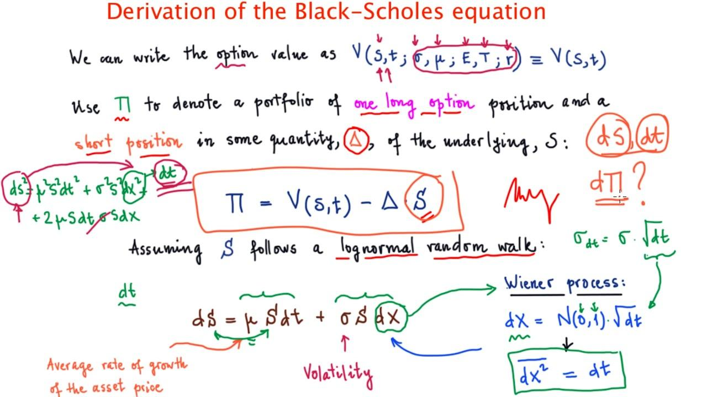

Algorithmic trading, commonly referred to as algo trading, leverages sophisticated mathematical models and state-of-the-art software to execute trades at high velocities and significant volumes. This has transformed the trading landscape, allowing market participants to capitalize on minuscule price discrepancies by executing numerous transactions in fractions of a second. Among the many tools in a trader's toolkit, the Black-Scholes model stands out as one of the fundamental frameworks in financial mathematics, primarily known for its role in option pricing. Developed in the early 1970s by Fischer Black, Myron Scholes, and later expanded by Robert Merton, the Black-Scholes model provides a systematic approach to determining the fair value of options, which are critical financial derivatives in markets.

The significance of the model extends beyond its application in pricing. It also plays a crucial role in comprehending the market dynamics through the analysis of volatility and other risk factors—parameters that are pivotal for strategic trading decisions. The model's formulation offers insights that are integral to constructing algorithms aimed at optimizing financial strategies.



Understanding the derivation of the Black-Scholes model is vital for enhancing the precision and efficacy of trading algorithms. The model is based on a set of assumptions, such as constant volatility and a lognormal distribution of stock prices, which provide a theoretical foundation for determining option prices over time. By mastering these theoretical underpinnings, traders can develop algorithms that are not only efficient in terms of execution but also resilient to market fluctuations, thereby gaining a competitive edge. 

Furthermore, the components of the Black-Scholes model are widely utilized in algorithmic trading to calibrate and refine trading strategies. By integrating these components, traders can adapt to the ever-evolving market conditions and optimize their financial strategies effectively. This article aims to elaborate on how the Black-Scholes model is applied within algorithmic trading frameworks, ensuring that quantitative traders are equipped with the necessary tools to succeed in contemporary market environments.

## Table of Contents

## Understanding the Black-Scholes Model

The Black-Scholes model, introduced by Fischer Black, Myron Scholes, and further expanded by Robert Merton in the early 1970s, offers a systematic approach to pricing European-style options. It transformed the field of financial engineering and is considered a pivotal advancement in the understanding and application of derivatives markets.

At the heart of the Black-Scholes model are several key assumptions that simplify the complexity of financial markets to enable tractable mathematical analysis. These assumptions include constant volatility, which implies that the standard deviation of the stock returns remains unchanged over the option's life. Additionally, the model assumes a lognormal distribution for stock prices, meaning that while stock prices can theoretically take any positive value, the logarithm of prices follows a normal distribution. This characteristic is suitable for modeling price movements over time, as it accommodates both the possibility of large fluctuations and the non-negative nature of stock prices.

Another crucial assumption is the absence of [arbitrage](/wiki/arbitrage) opportunities, which suggests that the market is efficient and no riskless profit could be made by buying and selling equivalent financial instruments. This principle underlies much of financial theory and ensures that the model reflects realistic market behavior.

Using these foundational assumptions, the Black-Scholes model provides a theoretical estimate for an option's price by establishing a relationship between the stock price, time, [volatility](/wiki/volatility-trading-strategies), and other parameters. The resultant Black-Scholes formula for pricing a European call option is given by:

$$
C(S, t) = S_0N(d_1) - Xe^{-r(T-t)}N(d_2)
$$

where:
- $S_0$ is the current stock price,
- $X$ is the strike price of the option,
- $r$ is the risk-free interest rate,
- $T$ is the time to expiration,
- $N(\cdot)$ represents the cumulative distribution function of the standard normal distribution,
- $d_1$ and $d_2$ are given by:

$$
d_1 = \frac{\ln(S_0/X) + (r + \sigma^2/2)(T-t)}{\sigma\sqrt{T-t}}
$$

$$
d_2 = d_1 - \sigma\sqrt{T-t}
$$

Here, $\sigma$ symbolizes the volatility of the stock. Understanding these terms facilitates the use of the model in predicting future prices and assessing the associated risks.

The Black-Scholes model plays a vital role in risk management and strategic trading. By providing a standardized framework, it allows traders and investors to make informed decisions based on consistently derived option prices, thus enhancing the accuracy of financial strategies. Despite its simplifying assumptions that do not capture all market phenomena, its utility in providing a baseline and reducing uncertainty in pricing cannot be overstated.

## Derivation of the Black-Scholes Equation

The derivation of the Black-Scholes equation is rooted in the application of Itô's calculus within the framework of stochastic differential equations (SDEs). This process begins with the creation of a hedged portfolio, combining a long position in a stock and a short position in a European call option on the same stock. 

The value of this portfolio $\Pi$ at time $t$ can be expressed as:

$$
\Pi = \Delta S - C
$$

where $\Delta$ represents the number of stocks held, $S$ is the stock price, and $C$ is the price of the call option. The objective is to determine the proportion $\Delta$ such that the portfolio is risk-free over an infinitesimal time period $dt$.

The stock price $S$ evolves according to a geometric Brownian motion, described by:

$$
dS = \mu S \, dt + \sigma S \, dW_t
$$

where $\mu$ is the expected return of the stock, $\sigma$ is the volatility, and $dW_t$ is a Wiener process increment.

To eliminate risk, the changes in the stock and option prices need to offset each other. This leads to the application of no-arbitrage by matching the drift terms. Using Itô's lemma, the change in the option price $C$ is given by:

$$
dC = \left( \frac{\partial C}{\partial t} + \frac{\partial C}{\partial S}\mu S + \frac{1}{2} \frac{\partial^2 C}{\partial S^2}\sigma^2 S^2 \right) dt + \frac{\partial C}{\partial S} \sigma S \, dW_t
$$

Assuming a risk-free portfolio means setting the aggregate stochastic component to zero, implying:

$$
\Delta = \frac{\partial C}{\partial S}
$$

So the change in the portfolio's value $d\Pi$ becomes:

$$
d\Pi = \Delta \, dS - dC = \Delta (\mu S \, dt + \sigma S \, dW_t) - \left( \frac{\partial C}{\partial t} + \frac{\partial C}{\partial S} \mu S + \frac{1}{2} \frac{\partial^2 C}{\partial S^2} \sigma^2 S^2 \right) dt - \frac{\partial C}{\partial S} \sigma S \, dW_t
$$

Substituting $\Delta = \frac{\partial C}{\partial S}$ and simplifying, the result leads to:

$$
d\Pi = \left( \frac{\partial C}{\partial S} \sigma S - \frac{\partial C}{\partial S} \sigma S \right) dW_t - \left( \frac{\partial C}{\partial t} + \frac{1}{2} \frac{\partial^2 C}{\partial S^2} \sigma^2 S^2 \right) dt
$$

The stochastic component cancels out, and since the portfolio is risk-free, it must earn the risk-free rate $r$, leading to:

$$
d\Pi = r(\Delta S - C) \, dt
$$

Equating the drift terms results in the Black-Scholes partial differential equation:

$$
\frac{\partial C}{\partial t} + \frac{1}{2} \sigma^2 S^2 \frac{\partial^2 C}{\partial S^2} + rS \frac{\partial C}{\partial S} - rC = 0
$$

This equation can be solved under specific boundary conditions applicable to European options to derive the Black-Scholes formula, given as:

$$
C(S, t) = S N(d_1) - Ke^{-r(T-t)} N(d_2)
$$

where 

$$
d_1 = \frac{\ln\left(\frac{S}{K}\right) + \left(r + \frac{\sigma^2}{2}\right)(T-t)}{\sigma \sqrt{T-t}}
$$

$$
d_2 = d_1 - \sigma \sqrt{T-t}
$$

Here, $N$ denotes the cumulative distribution function of the standard normal distribution, $K$ is the strike price, and $T$ is the expiration time. This formula generates key inputs for [algorithmic trading](/wiki/algorithmic-trading) systems, enabling precise strategies for determining optimal entry and [exit](/wiki/exit-strategy) points.

## Application of Black-Scholes in Algorithmic Trading

Algorithmic traders frequently use the Black-Scholes model to determine the fair value of options and execute trades based on these valuations. The model's outputs, such as implied volatility and the Greeks—Delta, Gamma, Theta, Vega, and Rho—are vital for portfolio management and risk assessment. These metrics allow traders to dynamically adjust their positions, ensuring they can respond adeptly to market fluctuations. For instance, Delta measures the sensitivity of the option's price to changes in the underlying asset's price, enabling traders to hedge their portfolios effectively.

In high-frequency trading ([HFT](/wiki/high-frequency-trading-strategies)), the speed and precision required in applying the Black-Scholes formula can significantly enhance profitability. Algorithms execute trades within fractions of a second, requiring rapid calculations of option prices and implied volatility. Python, C++, and Java are common programming languages in HFT due to their computational efficiency and versatility. Below is a simplified Python example demonstrating how to calculate the Black-Scholes call option price using the `numpy` library for numerical operations:

```python
import numpy as np
from scipy.stats import norm

def black_scholes_call(S, K, T, r, sigma):
    d1 = (np.log(S / K) + (r + 0.5 * sigma ** 2) * T) / (sigma * np.sqrt(T))
    d2 = d1 - sigma * np.sqrt(T)
    call_price = S * norm.cdf(d1) - K * np.exp(-r * T) * norm.cdf(d2)
    return call_price

# Parameters: spot price (S), strike price (K), time to expiration (T), risk-free rate (r), volatility (sigma)
S = 100  # Example spot price
K = 100  # Example strike price
T = 1    # Time to expiration in years
r = 0.05 # Risk-free interest rate
sigma = 0.2 # Volatility

call_price = black_scholes_call(S, K, T, r, sigma)
print(f"Call option price: {call_price:.2f}")
```

Traders often tailor the Black-Scholes model to tackle real-world complexities, such as volatility smiles and jumps in asset prices. These adaptations help account for deviations from the model’s assumptions, such as constant volatility. For example, the volatility smile phenomenon, where implied volatility varies with strike price, contradicts the model's assumption of constant volatility. 

Additionally, integrating the Black-Scholes model into trading algorithms supports real-time decision-making and risk management. Modern trading systems can simultaneously monitor a vast array of market data, process the necessary computations, and execute trades autonomously. By leveraging these advanced capabilities, traders ensure their strategies are both agile and robust, adapting to volatile market conditions and optimizing their risk exposures effectively.

## Advantages and Limitations

One of the primary advantages of using the Black-Scholes model in trading algorithms is its established and widely accepted framework, which provides a standardized approach to pricing options, managing risks, and developing trading strategies. The mathematical elegance and simplicity of the model enable it to serve as a universal benchmark in both academic and professional financial communities.

The Black-Scholes model's equation is expressed as:

$$
C(S, t) = S_tN(d_1) - Ke^{-r(T-t)}N(d_2)
$$

where:

- $C$ is the call option price.
- $S_t$ is the current stock price.
- $K$ is the strike price of the option.
- $T$ is the time to maturity.
- $r$ is the risk-free interest rate.
- $N$ represents the cumulative distribution function of the standard normal distribution.
- $d_1$ and $d_2$ are calculated as follows:

$$
d_1 = \frac{\ln(S_t/K) + (r + \sigma^2/2)(T-t)}{\sigma\sqrt{T-t}}
$$

$$
d_2 = d_1 - \sigma\sqrt{T-t}
$$

Despite its merits, the Black-Scholes model carries inherent limitations. It assumes constant volatility and a lognormal distribution of asset prices, which may not accurately reflect real-world market conditions. Financial markets often experience volatility clustering and sudden jumps in asset prices, leading to significant discrepancies from the model's predictions.

Moreover, the model assumes continuous trading and ignores transaction costs, both of which are impractical in actual trading environments marked by discrete trading times and various fees. During periods of market turbulence, deviations between theoretical pricing and market prices can become pronounced, thus challenging the model's reliability.

To address these limitations, algorithmic traders often incorporate adaptive models that better capture the market's dynamic nature. Adjustments can include stochastic volatility models or incorporation of volatility surfaces to account for volatility smiles and skews. By doing so, traders can enhance their algorithms to reflect underlying market conditions more closely, thereby improving decision-making and risk management outcomes. Ultimately, a comprehensive understanding of the Black-Scholes model, coupled with awareness of its constraints, allows traders to optimize their strategies effectively.

## Conclusion

The Black-Scholes model stands as a pivotal component of modern financial theory, offering indispensable methodologies for option pricing. Its mathematical rigor and practical utility extend beyond theoretical constructs, providing quantitative traders with the precision necessary to make informed decisions in algorithmic trading environments. By mastering the derivation and application of the Black-Scholes model, traders can adeptly navigate the complexities and fluctuations inherent in financial markets. The model equips traders with the analytical tools needed to better anticipate market movements and adjust strategies accordingly.

Despite its mathematical elegance, the Black-Scholes model is not without limitations. Its assumptions of constant volatility and lognormal price distribution often contrast sharply with the more dynamic and unpredictable nature of real-world markets. However, by acknowledging these constraints, traders can refine their algorithmic strategies, incorporating adaptive measures that more accurately capture market realities. Such enhancements can lead to more effective risk management and the strategic exploitation of market inefficiencies.

In summary, the Black-Scholes model is a critical tool for algorithmic traders striving for success in modern financial markets. By integrating the model's insights into their trading algorithms, these traders can enhance their precision, optimize their decision-making processes, and maximize their opportunities for profitability.

## Further Resources

To dive deeper into the Black-Scholes model and its application in algorithmic trading, there are several resources that provide foundational knowledge and advanced insights. One essential textbook is "Options, Futures, and Other Derivatives" by John C. Hull. This book offers comprehensive coverage of derivative securities and the fundamental principles underpinning the Black-Scholes model. It is highly regarded for both beginners and seasoned professionals in finance.

For a more interactive and practical learning experience, online courses focusing on Quantitative Finance and Financial Engineering are invaluable. These courses often include modules dedicated to the implementation of the Black-Scholes model, enabling learners to gain practical experience with trading strategies in real-time environments. Platforms such as Coursera, edX, and Udacity offer courses from top universities and industry experts.

Research papers and academic journals provide deeper insights into the theoretical advancements and empirical tests of financial models. Journals such as the "Journal of Financial Economics" and "Review of Financial Studies" frequently publish articles on algorithmic trading innovations and the evolution of option pricing models. These publications are excellent resources for traders looking to stay informed about the latest developments in financial mathematics.

Forums and professional networks can be particularly useful for gaining practical insights and understanding the nuances of implementing the Black-Scholes model in live trading scenarios. Sites like Quantitative Finance Stack Exchange and professional networks such as LinkedIn groups focused on algorithmic trading offer valuable interaction with experienced traders and quantitative analysts. These platforms allow for the exchange of ideas, troubleshooting of model implementations, and discussion of market trends that impact trading algorithms.

Incorporating these resources into your learning path can significantly enhance your comprehension and application of the Black-Scholes model, thereby increasing your effectiveness in the field of algorithmic trading.

## References & Further Reading

[1]: Black, F., & Scholes, M. (1973). ["The Pricing of Options and Corporate Liabilities."](https://www.cs.princeton.edu/courses/archive/fall09/cos323/papers/black_scholes73.pdf) Journal of Political Economy, 81(3), 637-654.

[2]: Merton, R. C. (1973). ["Theory of Rational Option Pricing."](https://www.semanticscholar.org/paper/Theory-of-Rational-Option-Pricing-Merton/f22256599cc513be281a2a82082d4bac7031def2) The Bell Journal of Economics and Management Science, 4(1), 141-183.

[3]: Hull, J. C. (2017). ["Options, Futures, and Other Derivatives"](https://books.google.com/books/about/Options_Futures_and_Other_Derivatives_eB.html?id=2iopDwAAQBAJ). Pearson Education.

[4]: Wilmott, P. (2013). ["Paul Wilmott Introduces Quantitative Finance"](https://www.amazon.com/Paul-Wilmott-Introduces-Quantitative-Finance/dp/0470319585). Wiley.

[5]: ["Journal of Financial Economics"](https://www.sciencedirect.com/journal/journal-of-financial-economics) - A leading academic journal that publishes articles on financial economics and topics relevant to the Black-Scholes model.