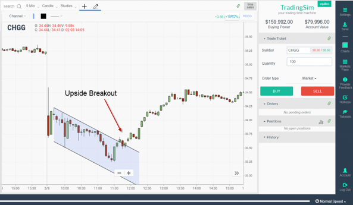

## Table of Contents

## What is a descending channel in trading?

A descending channel in trading is a chart pattern that shows a downward trend in the price of a security. It is formed by drawing two parallel lines that slope downwards. The upper line connects the highs of the price movements, while the lower line connects the lows. Traders use this pattern to predict future price movements and make trading decisions based on the trend.

When a price is moving within a descending channel, it means that the security is experiencing a bearish trend, where sellers are more active than buyers. Traders often look for opportunities to sell when the price touches the upper line of the channel, expecting the price to fall back towards the lower line. Conversely, some traders might buy when the price reaches the lower line, anticipating a small bounce back up to the upper line before the downtrend continues.

## How can you identify a descending channel on a price chart?

To identify a descending channel on a price chart, you need to look for two lines that slope downwards and run parallel to each other. The top line should connect the highest points of the price movements over time. These are the peaks where the price reached its highest before falling again. The bottom line should connect the lowest points of the price movements. These are the troughs where the price dropped to its lowest before rising again.

Once you see these two lines forming and they are parallel, you have spotted a descending channel. The price will move up and down between these two lines, showing that the overall trend is going down. It's like the price is sliding down a slope but bouncing between two rails. This pattern helps traders see that the market is in a bearish phase, meaning more people are selling than buying.

## What does a descending channel indicate about market sentiment?

A descending channel shows that people are feeling more negative about the market. When you see this pattern on a chart, it means that more traders are selling their stocks or other things they own, which makes the price go down. It's like a sign that says, "Hey, people are not so happy with this stock right now."

This pattern helps traders understand that the market is in a bearish phase. That means more folks are trying to get out of their investments than those who want to buy in. It's a good clue for traders to be careful and maybe think about selling their own stuff before the prices drop even more.

## How do traders typically use descending channels in their strategy?

Traders often use descending channels to decide when to buy or sell. When they see the price touching the top line of the channel, they might think it's a good time to sell. They believe the price will go back down to the bottom line soon. So, they sell at the top to make some money before the price drops.

On the other hand, some traders might see the price hitting the bottom line as a chance to buy. They think the price might bounce back up a little to the top line. They buy at the bottom, hoping to sell later at a higher price before the overall downward trend continues. By using the descending channel, traders can try to make the most of small price movements within the bigger downward trend.

## What are the key components of a descending channel?

A descending channel has two main parts that help traders see the trend. The first part is the top line, which connects the highest points the price reaches before it starts to fall again. This line shows the peaks of the price movements. The second part is the bottom line, which connects the lowest points the price hits before it starts to go up a bit. This line shows the troughs of the price movements.

Both lines in a descending channel are important because they slope downwards and run parallel to each other. When traders see these two lines, they know the overall trend is going down. This pattern helps them understand that the market is in a bearish phase, where more people are selling than buying. By watching how the price moves between these lines, traders can make better choices about when to buy or sell.

## Can you explain the difference between a descending channel and other chart patterns?

A descending channel is a chart pattern that shows a downward trend where the price moves between two sloping lines. The top line connects the highest points, and the bottom line connects the lowest points, both running parallel to each other and sloping downwards. This pattern tells traders that the market is bearish, with more people selling than buying. Traders use this pattern to decide when to sell at the top line or buy at the bottom line, hoping to make small profits within the larger downward trend.

Other chart patterns, like an ascending channel, show the opposite trend. In an ascending channel, the price moves between two upward-sloping parallel lines, indicating a bullish market where more people are buying than selling. Another pattern, like a head and shoulders, signals a potential reversal in the trend. It looks like a head with two shoulders and can indicate that an upward trend might be ending and turning into a downward one. Each pattern gives different information about market sentiment and helps traders make different kinds of decisions.

## What are the potential entry and exit points when trading within a descending channel?

When trading within a descending channel, a common entry point for buying is when the price touches the bottom line of the channel. Traders see this as a chance to buy low, hoping the price will bounce back up to the top line. They might expect to make a small profit from this bounce. On the other hand, a popular entry point for selling is when the price reaches the top line. Traders think the price will fall back down to the bottom line, so they sell high to avoid losing money when the price drops.

Exit points are just as important. If you bought at the bottom line, you might want to sell when the price gets close to the top line to lock in your profit. It's like getting out before the price starts to fall again. If you sold at the top line, you might buy back at the bottom line to cover your position or even make a small profit if the price keeps falling. The key is to watch how the price moves between the two lines and use these points to decide when to get in and out of the trade.

## How does volume play a role in confirming a descending channel?

Volume can help confirm if a descending channel is strong and likely to keep going. When the price hits the top line of the channel and starts to fall again, you want to see high volume. High volume at the top means lots of people are selling, which makes the downward trend stronger. If the volume is low when the price touches the top, it might mean the channel is weak and could break soon.

On the other hand, when the price bounces off the bottom line and starts to go up a bit, you want to see lower volume. Low volume at the bottom means fewer people are buying, so the upward bounce is not strong. This shows that the overall downward trend is still in control. By watching the volume at these key points, traders can feel more sure about the descending channel and make better trading choices.

## What are common mistakes traders make when trading descending channels?

One common mistake traders make when trading descending channels is not waiting for the price to hit the top or bottom line before making a move. They might get too eager and buy or sell too early, missing out on the best entry points. For example, if they buy before the price reaches the bottom line, they might end up buying at a higher price than needed. If they sell before the price hits the top line, they might miss out on selling at the highest possible price.

Another mistake is ignoring the volume. Volume is important because it shows how strong the trend is. If traders don't pay attention to the volume when the price touches the top or bottom line, they might not see that the channel is weak and about to break. For instance, if the volume is low when the price hits the top line, it might be a sign that the downward trend is losing steam, and the channel could soon end. By not watching the volume, traders can make bad decisions and lose money.

## How can technical indicators enhance the analysis of a descending channel?

Technical indicators can help traders understand a descending channel better by giving more information about the trend and possible price movements. For example, the Moving Average Convergence Divergence (MACD) can show if the downward trend is getting stronger or weaker. If the MACD line crosses below the signal line while the price is in a descending channel, it can confirm that the bearish trend is still strong. This helps traders feel more sure about selling when the price hits the top line of the channel. Also, the Relative Strength Index (RSI) can show if a stock is overbought or oversold. If the RSI is below 30 when the price touches the bottom line, it might mean the price is due for a small bounce, making it a good time to buy.

Another helpful indicator is the Average True Range (ATR), which measures how much the price moves up and down. When trading within a descending channel, a high ATR can show that the price is moving a lot, which might mean the channel could break soon. On the other hand, a low ATR suggests the price is moving less, making the channel more reliable. By using these indicators, traders can get a clearer picture of what's happening in the market and make smarter choices about when to buy or sell within the descending channel.

## What are the psychological aspects traders should consider when trading a descending channel?

When trading a descending channel, it's important for traders to think about their feelings and how they might affect their choices. Seeing prices go down can make people feel worried or scared. This might make them want to sell their stocks quickly, even if it's not the best time. It's easy to get caught up in the fear of losing money and make rushed decisions. Traders need to stay calm and stick to their plan, even when the market is going down. By keeping their emotions in check, they can make smarter choices and avoid selling at the wrong time.

Another thing to think about is the hope that the price will go back up. Sometimes, traders might see the price bounce a little and think the downward trend is over. They might buy more stocks, hoping for a big recovery. But if the descending channel is still strong, this can lead to more losses. Traders need to be careful not to let hope cloud their judgment. They should look at the whole picture, including the technical indicators and the overall trend, before deciding to buy or sell. By understanding these psychological aspects, traders can trade more wisely within a descending channel.

## How can advanced traders use descending channels in conjunction with other analysis techniques?

Advanced traders can use descending channels along with other analysis techniques to make better trading decisions. They might combine the descending channel with technical indicators like the Moving Average Convergence Divergence (MACD) or the Relative Strength Index (RSI). For example, if the MACD shows a bearish crossover while the price is within a descending channel, it can confirm that the downward trend is strong. This gives traders more confidence to sell when the price hits the top line of the channel. Also, if the RSI is below 30 when the price touches the bottom line, it might suggest that the price is due for a small bounce, making it a good time to buy.

Another technique advanced traders might use is combining descending channels with chart patterns and volume analysis. For instance, they might look for a head and shoulders pattern forming within the descending channel, which could signal a stronger bearish trend. Volume is also key. High volume when the price hits the top line and low volume when it reaches the bottom line can confirm the strength of the channel. By using these additional techniques, traders can get a clearer picture of the market and make more informed decisions about when to enter or exit trades within a descending channel.

## References & Further Reading

[1]: Bergstra, J., Bardenet, R., Bengio, Y., & Kégl, B. (2011). ["Algorithms for Hyper-Parameter Optimization."](https://papers.nips.cc/paper/4443-algorithms-for-hyper-parameter-optimization) Advances in Neural Information Processing Systems 24.

[2]: ["Advances in Financial Machine Learning"](https://www.amazon.com/Advances-Financial-Machine-Learning-Marcos/dp/1119482089) by Marcos Lopez de Prado

[3]: ["Evidence-Based Technical Analysis: Applying the Scientific Method and Statistical Inference to Trading Signals"](https://www.amazon.com/Evidence-Based-Technical-Analysis-Scientific-Statistical/dp/0470008741) by David Aronson

[4]: ["Machine Learning for Algorithmic Trading"](https://github.com/stefan-jansen/machine-learning-for-trading) by Stefan Jansen

[5]: ["Quantitative Trading: How to Build Your Own Algorithmic Trading Business"](https://www.amazon.com/Quantitative-Trading-Build-Algorithmic-Business/dp/1119800064) by Ernest P. Chan