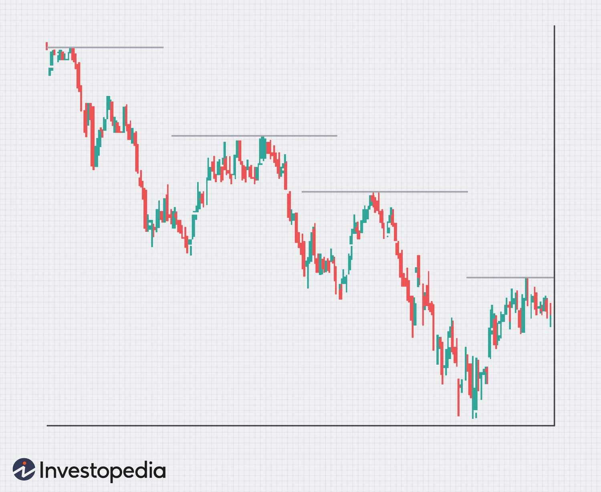

## Table of Contents

## What is a descending top pattern in technical analysis?

A descending top pattern, also known as a lower high, is a chart pattern used in technical analysis to spot when a stock or asset might be starting to trend downward. It happens when the price of an asset reaches a peak that is lower than its previous peak. This pattern suggests that the upward momentum is weakening, and it could be a sign that sellers are starting to take control over buyers.

Traders and investors watch for this pattern because it can help them make decisions about when to sell or short an asset. For example, if someone sees a series of lower highs forming on a stock chart, they might decide it's time to sell their shares before the price drops further. It's important to use this pattern along with other indicators and analysis to make well-informed trading decisions.

## How does a descending top pattern form on a chart?

A descending top pattern forms on a chart when the price of an asset reaches a high point, then falls, and later tries to go up again but only reaches a lower high than before. Imagine you're watching a ball bounce. The first time it bounces, it goes really high. The next time, it doesn't go as high. That's what a descending top looks like on a chart. The peaks, or tops, keep getting lower each time.

This pattern shows that the strength of buyers is getting weaker. Each time the price tries to go up, it can't get as high as it did before. This can be a warning sign for traders that the price might keep going down. When they see this pattern, they might decide to sell their shares or wait for a better time to buy.

## What are the key characteristics of a descending top?

A descending top is a pattern on a chart where the price of something goes up to a high point, then goes down, and then goes up again but not as high as before. It's like the price is trying to climb a mountain but can't get as high each time it tries. This pattern shows that people who want to buy are getting tired and can't push the price up as much as they did before.

When you see this pattern, it means the price might keep going down. It's a warning sign for people who are watching the price. They might decide to sell what they have before the price drops more, or they might wait for a better time to buy. Seeing this pattern helps them make choices about what to do with their money.

## Can you explain the psychological factors behind a descending top pattern?

The descending top pattern shows what people are thinking when they buy and sell things. When the price goes up to a high point and then goes down, it means that people who want to buy are feeling excited and hopeful. But when the price goes up again and doesn't reach as high as before, it shows that those people are starting to feel less sure and less excited. They're not as willing to pay as much for the thing as they were before.

This change in how people feel can make the price keep going down. When people see that the price isn't going up as high each time, they might start to think that it's not a good time to buy. They might decide to sell what they have or wait for the price to go down more before buying. This pattern helps people see that the excitement about the thing is fading, and it might be time to be careful with their money.

## What is the significance of volume in confirming a descending top?

Volume is really important when you're looking at a descending top pattern. It helps you know if the pattern is strong or if it might not mean much. When the price goes up to a high point but the [volume](/wiki/volume-trading-strategy) is low, it means not many people are buying. This can show that the high point might not last long because there's not enough interest. But if the volume is high when the price goes up, it means a lot of people are buying, and the high point might be more important.

When the price starts making lower highs and the volume gets higher as the price goes down, it's a sign that more people are selling. This can make the descending top pattern stronger and more likely to keep going. Watching the volume can help you decide if the pattern is a good sign to sell or if you should wait and see what happens next.

## How can traders identify a valid descending top pattern?

To spot a real descending top pattern, traders need to look at the chart and see if the price is making lower highs each time it goes up. This means the first time the price goes up, it reaches a high point. Then it goes down and tries to go up again, but it doesn't get as high as it did the first time. If this keeps happening, and the highs keep getting lower, it's a sign of a descending top. Traders should also check if each new high is followed by a lower low, which shows that the price is not just going down but also losing its upward strength.

Volume is another important thing to watch. When the price makes a new high but the volume is low, it means fewer people are buying, and the high might not be very strong. But if the volume gets higher as the price starts going down after each new high, it shows that more people are selling, making the descending top pattern stronger. By looking at both the price and the volume, traders can better tell if the descending top they see is a good sign to make a trading decision.

## What are common entry points for trading a descending top pattern?

When traders see a descending top pattern, they often look for the right moment to start trading. A common entry point is when the price breaks below the most recent low after forming a lower high. This break can show that the sellers are now in control, and the price might keep going down. Traders might decide to sell or short the asset at this point, hoping to make money as the price falls.

Another entry point is when the price tries to go up again but fails to break above the most recent lower high. This failure can confirm that the descending top pattern is strong and that the price is likely to keep dropping. Traders might enter a short position or sell their holdings when they see this, expecting the price to continue its downward trend.

## What risk management strategies should be used when trading descending tops?

When trading a descending top pattern, it's important to use good risk management to keep your money safe. One way to do this is by setting a stop-loss order. A stop-loss is like a safety net that tells your trading platform to sell your asset if the price goes up a bit after you've sold it or gone short. This helps limit how much money you could lose if the price suddenly goes up instead of down like you expected. Another strategy is to only use a small part of your money for each trade. This way, even if you lose on one trade, you won't lose all your money.

It's also smart to watch the market closely and be ready to change your plan if things don't go as you thought. Sometimes the price might not keep going down like the descending top pattern suggests. If you see that happening, you might want to get out of your trade early to avoid losing more money. Using other tools like volume and other chart patterns can help you make better decisions and manage your risks better. By being careful and using these strategies, you can trade descending tops more safely.

## How does a descending top pattern differ from other bearish reversal patterns?

A descending top pattern is different from other bearish reversal patterns because it shows a specific way the price moves over time. With a descending top, you see the price going up to a high point, then dropping, and then going up again but not as high as before. This keeps happening, making a series of lower highs. This pattern tells traders that the buying power is getting weaker, and the price might keep going down. Other bearish reversal patterns, like a head and shoulders or a double top, might show a different shape on the chart and can signal a change in trend in different ways.

For example, a head and shoulders pattern has three peaks, with the middle one being the highest, looking like a head with two shoulders. This pattern suggests a big change in the trend from going up to going down. A double top pattern shows two peaks at about the same level, which means the price couldn't go higher and might start to fall. Both of these patterns are about the price reaching a high and then turning around, but they look different from the series of lower highs you see in a descending top. By understanding these differences, traders can better decide when to sell or short an asset.

## Can descending tops be used in conjunction with other technical indicators?

Yes, traders often use descending tops along with other technical indicators to make better trading decisions. One common indicator is the Relative Strength Index (RSI), which helps show if an asset is overbought or oversold. If a descending top pattern is forming and the RSI is also showing that the asset is overbought, it can be a stronger sign that the price might go down soon. Another useful indicator is the Moving Average Convergence Divergence (MACD), which can help confirm if the trend is really changing. When the MACD line crosses below the signal line while a descending top is forming, it can give traders more confidence that it's time to sell or short the asset.

Using volume is also important when looking at descending tops. If the volume is high when the price is making lower highs, it can mean that more people are selling, making the pattern stronger. Traders might also look at support and resistance levels to see where the price might stop falling. If a descending top pattern breaks through a key support level, it can be a clear sign that the price will keep going down. By combining these indicators with the descending top pattern, traders can get a fuller picture of what's happening in the market and make smarter trading choices.

## What are some real-world examples of descending top patterns in stock charts?

One real-world example of a descending top pattern can be seen in the stock chart of Tesla Inc. (TSLA) during a specific period in 2022. In this case, after reaching a high in April, the stock price started to decline. When it tried to bounce back in May, it couldn't reach the same high as in April. This pattern continued into June, with each new peak being lower than the one before it. This series of lower highs signaled to traders that the upward [momentum](/wiki/momentum) was weakening, and many decided to sell their shares as they saw the descending top forming.

Another example is found in the chart of Apple Inc. (AAPL) in late 2018. After hitting a peak in early October, the stock price dropped significantly. When it tried to recover in November, it reached a new high but one that was lower than the October peak. The price made another attempt in December but again failed to surpass the November high. This formation of a descending top pattern indicated to investors that the bullish trend was losing steam, prompting some to [exit](/wiki/exit-strategy) their positions before the stock continued to decline into the new year.

## How can algorithmic trading systems be optimized to recognize descending tops?

To make an [algorithmic trading](/wiki/algorithmic-trading) system better at spotting descending tops, you need to program it to look for the right signs on a stock chart. The system should be able to find when the price goes up to a high point, then drops, and then tries to go up again but doesn't reach as high as before. It should keep track of these lower highs and make sure they happen more than once to confirm the pattern. The system can also be set up to watch the trading volume, making sure it's higher when the price is going down after each new high, which makes the pattern stronger.

Another way to improve the system is by adding other technical indicators to help confirm the descending top pattern. For example, the system can use the Relative Strength Index (RSI) to see if the stock is overbought, which could mean it's more likely to go down soon. It can also use the Moving Average Convergence Divergence (MACD) to check if the trend is really changing. By combining these indicators with the descending top pattern, the system can make better decisions about when to buy or sell, making it more accurate and useful for traders.

## References & Further Reading

[1]: Bergstra, J., Bardenet, R., Bengio, Y., & Kégl, B. (2011). ["Algorithms for Hyper-Parameter Optimization."](https://dl.acm.org/doi/10.5555/2986459.2986743) Advances in Neural Information Processing Systems 24.

[2]: ["Advances in Financial Machine Learning"](https://www.amazon.com/Advances-Financial-Machine-Learning-Marcos/dp/1119482089) by Marcos Lopez de Prado

[3]: ["Evidence-Based Technical Analysis: Applying the Scientific Method and Statistical Inference to Trading Signals"](https://www.amazon.com/Evidence-Based-Technical-Analysis-Scientific-Statistical/dp/0470008741) by David Aronson

[4]: ["Machine Learning for Algorithmic Trading"](https://github.com/stefan-jansen/machine-learning-for-trading) by Stefan Jansen

[5]: Chande, T. S. (1997). ["Beyond Technical Analysis: How to Develop and Implement a Winning Trading System"](https://cdn.preterhuman.net/texts/finance_and_marketing/stock_market/Chande,%20Tushar%20-%20Technical%20Analysis%20-%20How%20To%20Develop%20And%20Imp.pdf). John Wiley & Sons.

[6]: Chen, Y. (2018). ["Algorithmic Trading: Winning Strategies and Their Rationale"](https://dl.acm.org/doi/10.5555/2528260) by Ernie Chan

[7]: Achelis, S. B. (2000). ["Technical Analysis from A to Z, 2nd Edition"](https://www.mhebooklibrary.com/doi/book/10.1036/9780071380119). McGraw-Hill.