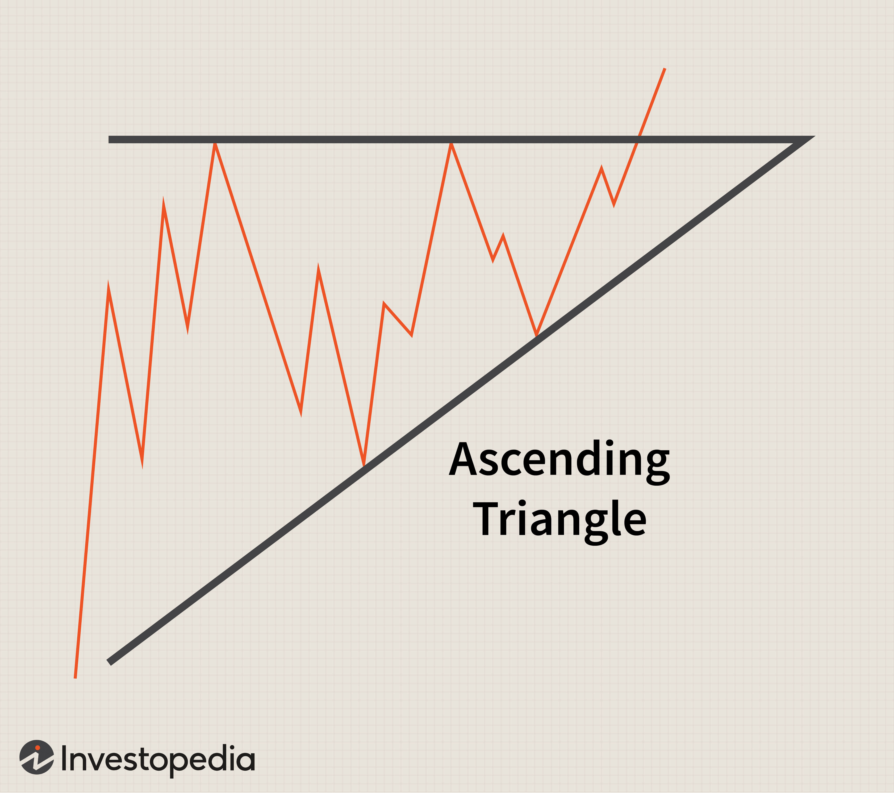

Descending tops are a key concept in trading, particularly within the realm of technical analysis. This price pattern occurs when each successive peak on a price chart is lower than the previous one, indicating a general bearish sentiment among traders. The identification of descending tops is crucial for traders as it may signal a potential downtrend, prompting decisions related to selling or shorting assets to capitalize on anticipated price decreases.

In technical analysis, descending tops serve as a visual representation of decreasing investor confidence and selling pressure building over time. By recognizing these patterns, traders can gain insights into market sentiment and potential future price movements. The ability to accurately identify and interpret descending tops can lead to informed trading decisions, maximizing the probability of profitable outcomes. This article aims to provide a comprehensive exploration of descending tops, detailing their characteristics, identification methods, and implications for trading strategies.



Readers can expect to learn about the definition and mechanism of descending tops, including how technical analysts utilize these patterns to predict market trends. Examples of descending tops will be provided to illustrate their application in real-world trading scenarios. Additionally, the article will address the practicality of descending tops in algorithmic trading, where automated systems are programmed to detect these patterns and execute trades accordingly.

The relevance of descending tops is particularly pronounced in algorithmic trading, where speed and accuracy are paramount. Algorithmic trading systems can process vast amounts of data and identify descending top patterns much faster than a human could. Once identified, these patterns can trigger automated trading strategies designed to exploit the predicted downtrend, enabling traders to respond to market movements with unparalleled efficiency.

Overall, understanding descending tops is essential for traders aiming to harness technical analysis in their trading strategies. This article will serve as a resource for understanding this critical price pattern and its integration into both manual and algorithmic trading approaches.

## Table of Contents

## What Are Descending Tops?

Descending tops form a key price pattern used by technical analysts to discern market trends. This pattern is defined by a sequence in which each peak on a price chart is lower than the preceding one. In mathematical terms, if $P_1, P_2, P_3, \ldots, P_n$ are successive peak values, then the pattern of descending tops implies $P_1 > P_2 > P_3 > \cdots > P_n$. This progressive decrease in peak values signals weakening buying pressure and increasing selling dominance, characterizing a bearish market trend. 

In a bearish landscape, descending tops indicate investors' waning confidence, leading to lower highs as the market attempts but fails to return to previous peaks. This pattern is often interpreted as a precursor to further declines, suggesting that sellers have the upper hand and the asset's price may continue to decrease. These patterns are most visible in downtrending markets where persistent selling pressure suppresses recovery attempts. 

Typical characteristics of descending tops include a series of lower highs that exhibit a consistent trajectory downward, often accompanied by increasing [volume](/wiki/volume-trading-strategy) as the trend establishes itself. Traders might use additional technical indicators, like moving averages or the relative strength index (RSI), to confirm the bearish outlook. For instance, a downward-sloping moving average may coincide with the descending tops, reinforcing the downtrend signal.

Recognizing descending tops is crucial for traders seeking to mitigate risks associated with prolonged downtrends. By identifying these patterns early, investors can make informed decisions, such as initiating short positions or adjusting stop-loss levels, to manage their exposure strategically.

## Understanding the Descending Tops Mechanism

Descending tops are a notable pattern in technical analysis, easily identified on price charts due to their distinctive formation. Recognizing this pattern involves observing a series of price peaks wherein each successive peak is lower than the preceding one. This presents a downward sloping line when plotted on a chart, hence characterized as "descending". 

To begin with, it is crucial to identify at least three successive peaks to confirm the presence of a descending tops pattern. The repetition of these lower highs serves as a critical indication of the prevailing bearish sentiment in the market. The three-peaks rule is essential, as encountering only one or two lower peaks could easily result from normal market fluctuations and may not represent a sustained trend.

The identification process typically involves technical indicators and visual charting tools. Traders often employ trendlines and moving averages to enhance clarity in determining whether a descending tops pattern is indeed forming. A descending trendline, for instance, is drawn by connecting the peaks, thereby providing a visual confirmation of the trend's direction. Here’s an example of how you might use Python and matplotlib to visualize descending tops:

```python
import matplotlib.pyplot as plt
import numpy as np

# Sample data for descending tops
dates = np.arange('2023-01', '2023-08', dtype='datetime64[M]')
prices = [105, 100, 98, 95, 93, 90, 88]

# Plot
plt.figure(figsize=(10, 6))
plt.plot(dates, prices, marker='o', linestyle='-')
plt.title('Descending Tops Example')
plt.xlabel('Date')
plt.ylabel('Price')
plt.show()
```

Technical analysts leverage the descending tops pattern to forecast potential market movements. Given the pattern's bearish implications, traders often anticipate further declines in the asset’s value. This expectation prompts them to consider strategies such as selling short or enhancing their portfolio’s risk management through protective measures.

It's essential when utilizing descending tops as a predictive tool to integrate other technical indicators such as Relative Strength Index (RSI) or Moving Average Convergence Divergence (MACD) to corroborate the bearish signals. This multi-faceted approach helps in validating the observed trend, reducing the likelihood of false signals, and increasing confidence in decision-making.

In conclusion, understanding and identifying descending tops is a fundamental aspect of technical analysis critical for anticipating market movements. By adhering to the pattern's criteria and corroborating with additional technical indicators, traders can effectively gauge market sentiment, strategize accordingly, and potentially enhance trading outcomes.

## Examples of Descending Tops

To illustrate the concept of descending tops, consider a hypothetical stock, XYZ Corp., which demonstrates a classic descending tops pattern over a period of several weeks. Suppose the stock initially trades at $100 per share, with its first peak occurring at this price. As market conditions shift, the stock begins to experience lower peaks in successive trading sessions.

### Detailed Example

**Initial Peak and Subsequent Decline**

- **Week 1:** The stock price hits a peak of $100 before closing down at $95.
- **Week 2:** The stock attempts to rally but only reaches a peak of $97 before falling back to $93.
- **Week 3:** The upward movement is weaker, and the peak maxes out at $94, closing the week at $89.

### Chart Analysis

A trader observing the price chart would note the formation of descending tops as the peaks observed over the three weeks are consistently lower than the last. This forms a downward-sloping trendline, suggesting rising bearish sentiment. The visual representation on a price chart would somewhat resemble the following schematic:

```
Price ($)
|
|   * (100)
|
|      * (97)
|
|         * (94)
|
|____________________
   W1   W2   W3
```

### Market Signals

**Indicators of a Bearish Trend**

The descending tops pattern in XYZ Corp.'s stock chart signals increased selling pressure as each attempt to reach a new high is met with resistance at progressively lower levels. This suggests that traders are increasingly willing to sell at lower prices, indicative of deteriorating confidence in XYZ Corp.'s market position. This pattern can be a precursor to a further decline if underlying fundamentals or market conditions do not improve.

**Technical Analysis Implications**

To forecast potential further downside, traders often look for confirmations such as the following:

1. **Volume Analysis:** A significant drop in volume during rally attempts, coupled with increasing volume during declines, reinforces the bearish trend insinuated by descending tops.

2. **Support Levels:** Analysts might identify key support levels near $88, where the stock previously consolidated before the descent. Breaching this level could trigger additional sell-offs.

### Python Illustration

Here's a hypothetical Python snippet to identify descending tops in stock price data:

```python
import pandas as pd
import numpy as np

# Simulated stock prices for each week
prices = {'Week': ['W1', 'W2', 'W3'], 'Peak': [100, 97, 94]}
df = pd.DataFrame(prices)

# Determine descending tops
df['is_descending'] = df['Peak'] < df['Peak'].shift(1)

# Calculate signal for trading
df['Bearish_Signal'] = np.where(df['is_descending'], 'Sell', 'Hold')

print(df)
```

The result identifies whether each peak is descending compared to its predecessor and suggests possible trading actions based on the formation.

### Conclusion

In summary, the descending tops pattern serves as an essential indicator for traders awaiting confirmation of a continued bearish trend in stock prices. By analyzing historical peaks and their descending nature, investors and analysts can make informed decisions, whether about exiting existing positions, short-selling, or preparing for a potential market turnover.

## Descending Tops in Algo Trading

Descending tops play a significant role in automated trading strategies by serving as critical indicators of bearish trends in financial markets. Algorithms can be designed to recognize these patterns by employing straightforward logic and mathematical rules. A descending tops pattern can be identified when a series of price peaks progressively decreases over time. Traders leverage this understanding to program algorithms that can initiate trades based on the detection of these patterns.

To detect descending tops, algorithms typically analyze historical price data to identify the relevant peaks and compare them. The detection criteria could involve setting a condition where each subsequent peak must be lower than the preceding one by a pre-specified percentage or value. The algorithm could be structured as follows in Python:

```python
def detect_descending_tops(prices):
    descending_tops = []
    for i in range(1, len(prices) - 1):
        if prices[i] > prices[i - 1] and prices[i] > prices[i + 1]:
            peak = prices[i]
            if len(descending_tops) == 0 or peak < descending_tops[-1]:
                descending_tops.append(peak)
    return descending_tops
```

This simple code identifies peaks in a time series of `prices` and records them as descending tops if each is lower than the last identified peak. The effectiveness of this pattern recognition in short-term trading algorithms hinges on accurate peak detection and responsiveness to rapid market changes.

Once descending tops are identified, trading strategies can be executed. Algorithms might automatically initiate short positions when a descending tops pattern emerges, anticipating further price declines. The effectiveness of descending tops in short-term trading algorithms is primarily due to their ability to signal potential entry points for trades aligned with the existing bearish trend. They help traders capitalize on expected declines, increasing the likelihood of successful trades.

Despite their utility, the effectiveness of descending tops in [algorithmic trading](/wiki/algorithmic-trading) also depends on market conditions and the broader context of the trading strategy. Algorithms need to incorporate additional criteria, such as volume indicators, [momentum](/wiki/momentum) oscillators, and divergent trends, to improve the accuracy of trading signals derived from descending tops patterns. Overreliance on descending tops without considering other market signals might result in lower success rates due to market noise and anomalies.

Adaptive algorithms that continually refine their criteria for detecting descending tops and update their parameters based on evolving market conditions tend to be more successful. The key to harnessing descending tops effectively in algorithmic trading lies in developing a balanced strategy that includes risk management techniques such as stop-loss orders to mitigate potential losses.

In conclusion, descending tops are a valuable component of automated trading systems. They provide timely signals that traders can use to navigate fluctuating markets, particularly when correcting bearish scenarios. However, algorithms need to be dynamic and context-aware to fully leverage the predictive power of descending tops in diverse trading environments.

## Descending Tops vs. Ascending Tops

Descending tops and ascending tops are distinct price patterns observed in technical analysis, each signaling different market trends. 

### Descending Tops
Descending tops are characterized by a series of peaks, each lower than the previous one, indicating a bearish market. This pattern suggests that selling pressure is increasing, and buyers are less willing or able to push prices higher over time. As each subsequent peak fails to surpass the height of the previous one, it reflects a weakening in bullish sentiment and often precedes further declines in price.

### Ascending Tops
Conversely, ascending tops illustrate a bullish market trend. In this pattern, each peak is higher than the last, signaling increasing buying pressure. Investors are successively willing to buy at higher prices, indicating confidence in future price increases. This trend often corresponds with upward momentum in the market, suggesting favorable conditions for a continued rise in prices.

### Reversal Scenarios
Reversals between descending and ascending tops can occur under specific market conditions. A reversal from descending to ascending tops might happen when external factors, such as positive economic data or company earnings reports, shift market sentiment, leading to increased buying activity. Conversely, an ascending to descending reversal may occur when negative news or deteriorating market conditions erode investor confidence, resulting in heightened selling pressure.

For example, consider a stock trading at descending tops due to poor financial performance. If the company unveils a new successful product line, investors' confidence may revive, sparking a reversal to ascending tops as buying interest drives prices up.

These patterns are vital in technical analysis, offering insights into potential market directions. Traders often use these indicators in conjunction with other tools to make informed decisions, as identifying the proper conditions for reversals can significantly impact trading strategies and outcomes. In essence, understanding descending and ascending tops provides traders valuable foresight into market dynamics.

## Trading Strategies Using Descending Tops

In trading, descending tops serve as crucial indicators for traders aiming to capitalize on bearish market trends. Leveraging this pattern involves employing specific strategies designed to mitigate risk and maximize potential returns. 

**Basic Trading Strategies Leveraging Descending Tops**

Descending tops suggest a market in decline, thereby offering opportunities for traders to open short positions. When a stock consistently forms lower peaks, it often confirms a downward trend, signaling traders to initiate trades that align with this bearish momentum. A typical strategy involves selling short when a new descending top forms and covering the position as the price declines further.

**Stop-Loss and Profit-Taking Strategies**

Risk management is paramount when trading on descending tops. Traders employ stop-loss orders to limit potential losses if the market moves contrary to their expectations. A common practice is to set stop-loss levels just above the last descending top. This strategy ensures that if the price reverses and surpasses the recent peak, the trade is exited automatically, minimizing potential losses.

For profit-taking, traders often set target levels based on previous support levels or measured moves. This involves calculating the difference between previous peaks and valleys, then projecting this distance downward from the latest peak to identify a potential price target.

**Use of Channel Indicators and Breakout Strategies**

Channel indicators, such as trendlines or envelope channels, help traders visualize the direction and strength of the trend defined by descending tops. These indicators can aid in identifying key levels where price may potentially reverse or accelerate in the same direction. For descending tops, the downward trendline typically serves as resistance, while a channel may indicate areas of support.

Breakout strategies involve monitoring for a price move beyond established channel boundaries. If the price breaks below the lower trendline of a channel formed by descending tops, it may signal a strong continuation of the downtrend, prompting traders to increase their short positions. Traders might use the following Python code snippet to identify such breakouts in historical price data:

```python
import pandas as pd

# Assuming 'data' is a DataFrame with columns 'Date' and 'Close'
data['Trendline'] = data['Close'].rolling(window=20).max()

# Identify breakout point
breakout = data[data['Close'] < data['Trendline'].shift(1)]
print(breakout)
```

This snippet calculates a rolling maximum, approximating descending resistance levels, and identifies breakouts below this level. 

By combining these strategies, traders can effectively harness the descending tops pattern to make informed decisions in bearish markets, while managing risks through judicious stop-loss placements and strategic profit-taking.

## Conclusion

Descending tops are a critical pattern in technical analysis, providing valuable insights into bearish market trends. Recognizing this pattern involves identifying a series of peaks where each successive peak is lower than the previous one. This disposition suggests a persistent decline in buyer enthusiasm and can be indicative of a market ready to reverse, leading to potential price decreases.

One of the advantages of using descending tops is their utility in signaling potential downturns. Traders can preempt bearish shifts by analyzing these patterns, positioning themselves to benefit from declining markets. For algorithmic trading, descending tops offer structured, quantifiable data that can be embedded into trading algorithms, allowing for efficient and timely trade executions. Algorithms can be specifically programmed to detect these patterns, automatically initiating sell orders when a descending top formation is confirmed, thus exploiting short-term market inefficiencies.

However, descending tops are not without limitations. The pattern may not always result in a significant downturn, as false signals can occur, particularly in volatile markets. Furthermore, reliance solely on this pattern without considering other market indicators could lead to suboptimal trading decisions.

Despite these limitations, the role of descending tops in technical and algorithmic trading provides opportunities for further exploration. Their predictability and clarity make them an appealing subject for developing sophisticated trading algorithms. By continuing to refine these patterns' detection and response mechanisms, traders and developers can enhance their strategies within both manual and automated trading environments. Encouraging further research and development in capturing descending tops more robustly will likely lead to increasingly effective trading strategies.

## References & Further Reading

[1]: Bergstra, J., Bardenet, R., Bengio, Y., & Kégl, B. (2011). ["Algorithms for Hyper-Parameter Optimization."](https://dl.acm.org/doi/10.5555/2986459.2986743) Advances in Neural Information Processing Systems 24.

[2]: ["Advances in Financial Machine Learning"](https://www.amazon.com/Advances-Financial-Machine-Learning-Marcos/dp/1119482089) by Marcos Lopez de Prado

[3]: ["Evidence-Based Technical Analysis: Applying the Scientific Method and Statistical Inference to Trading Signals"](https://www.amazon.com/Evidence-Based-Technical-Analysis-Scientific-Statistical/dp/0470008741) by David Aronson

[4]: ["Machine Learning for Algorithmic Trading"](https://github.com/stefan-jansen/machine-learning-for-trading) by Stefan Jansen

[5]: Chande, T. S. (1997). ["Beyond Technical Analysis: How to Develop and Implement a Winning Trading System"](https://cdn.preterhuman.net/texts/finance_and_marketing/stock_market/Chande,%20Tushar%20-%20Technical%20Analysis%20-%20How%20To%20Develop%20And%20Imp.pdf). John Wiley & Sons.

[6]: Chen, Y. (2018). ["Algorithmic Trading: Winning Strategies and Their Rationale"](https://dl.acm.org/doi/10.5555/2528260) by Ernie Chan

[7]: Achelis, S. B. (2000). ["Technical Analysis from A to Z, 2nd Edition"](https://www.mhebooklibrary.com/doi/book/10.1036/9780071380119). McGraw-Hill.