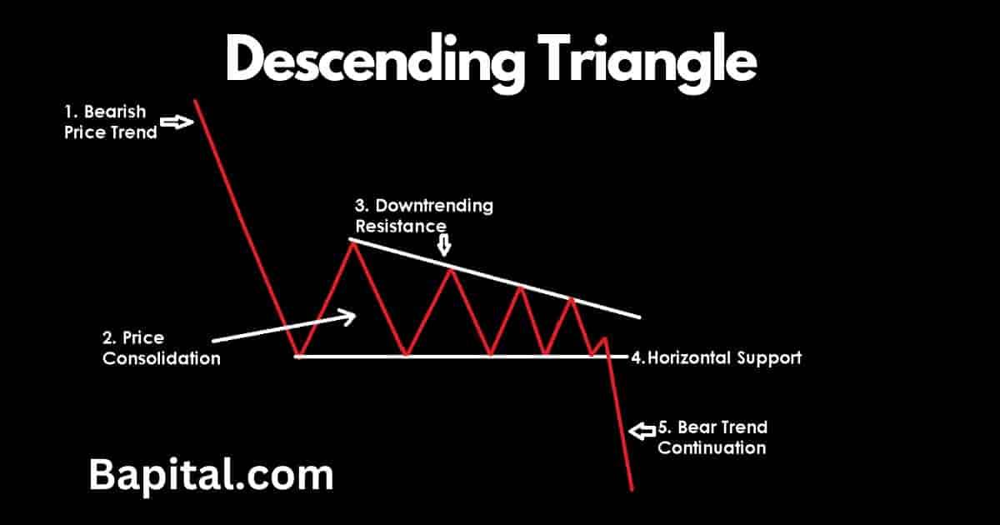

## Table of Contents

## What is a descending triangle pattern in technical analysis?

A descending triangle pattern in technical analysis is a chart pattern that traders use to predict future price movements. It forms when the price of an asset makes a series of lower highs while the support level stays the same. This creates a triangle shape on the chart with a flat bottom and a downward sloping top. The pattern suggests that sellers are becoming more aggressive, pushing the price down, while buyers are trying to hold the price at the same support level.

When the price finally breaks below the support level, it often signals that a bearish trend is starting. Traders might see this as a sign to sell the asset or to take a short position. The target price for the move down can be estimated by measuring the height of the triangle at its widest part and subtracting that from the breakout point. However, if the price breaks above the upper trendline instead, it could mean the pattern has failed, and the price might go up.

## How can you identify a descending triangle on a price chart?

To spot a descending triangle on a price chart, look for a pattern that looks like a triangle pointing down. The top line of the triangle slopes down, making lower highs each time the price goes up. The bottom line of the triangle is flat, showing that the price keeps hitting the same low point without going lower. This happens because sellers keep pushing the price down, but buyers keep stepping in at the same support level to stop it from falling further.

You'll know the pattern is complete when the price finally breaks through the bottom, flat line of the triangle. This break usually means the price will keep going down, starting a bearish trend. But, if the price suddenly goes above the top, sloping line instead, the pattern might not work as expected, and the price could start going up. So, keep an eye on both lines to see what happens next.

## What does the descending triangle pattern signify about market sentiment?

The descending triangle pattern shows that sellers are getting stronger and more in control of the market. When you see this pattern, it means that every time the price tries to go up, it doesn't go as high as before. This makes a downward sloping line at the top of the triangle. It's like sellers are pushing the price down more and more each time.

On the other hand, the bottom of the triangle stays flat because buyers keep stepping in at the same price, trying to stop the price from falling more. But if the price finally breaks through this flat line, it's a sign that the sellers have won, and the price is likely to keep going down. This tells us that the overall mood in the market is turning more negative, and people are feeling less confident about the asset's value.

## Can you explain the key components of a descending triangle?

A descending triangle has two main parts that you can see on a price chart. The first part is the top line of the triangle, which slopes down. This line is made because each time the price tries to go up, it doesn't go as high as it did before. It's like the sellers are getting stronger and pushing the price down more each time. This shows that the people who want to sell the asset are becoming more in control.

The second part is the bottom line of the triangle, which stays flat. This line is where the price keeps hitting the same low point without going lower. It happens because buyers keep stepping in at this level, trying to stop the price from falling more. But if the price finally breaks through this flat line, it means the sellers have won, and the price is likely to keep going down. This tells us that the overall mood in the market is turning more negative.

## How does the volume play a role in confirming a descending triangle pattern?

Volume plays an important part in making sure a descending triangle pattern is real. When you see the price making lower highs and hitting the same low point over and over, you should also watch the [volume](/wiki/volume-trading-strategy). If the volume is going down as the pattern forms, it means that fewer people are trading, and the pattern is more likely to be a true sign of what's going to happen next. This lower volume shows that the market is getting ready for a big move.

When the price finally breaks through the bottom flat line of the triangle, you want to see the volume go up. A big jump in volume when the price breaks out tells you that a lot of people are now selling, and it makes the bearish signal stronger. If the volume doesn't go up much when the price breaks out, the signal might not be as strong, and you should be careful about making big moves based on it.

## What are the typical price targets after a breakout from a descending triangle?

After the price breaks out of the bottom of a descending triangle, traders often try to guess where the price might go next. A common way to do this is by looking at how tall the triangle is at its widest part. You measure from the highest point of the triangle to the flat bottom line. Then, you take that height and subtract it from the point where the price breaks out. This gives you a target price that the asset might reach as it keeps going down.

Sometimes, the price might not go all the way to this target. It can stop or bounce back before it gets there. But this target gives traders a rough idea of where the price could end up. If the price breaks out with a lot of trading happening, it's more likely to reach this target. If there isn't much trading when it breaks out, the price might not go as far.

## How reliable is the descending triangle pattern in predicting future price movements?

The descending triangle pattern can be pretty good at guessing what the price will do next, but it's not perfect. It works best when the price breaks out with a lot of trading happening, which shows that many people agree on the new direction. If the volume is high when the price breaks out of the bottom of the triangle, it's more likely that the price will keep going down like the pattern says. But, if the volume is low, the pattern might not be as reliable, and the price might not move as much as you expect.

Sometimes, the descending triangle pattern can fail. If the price suddenly goes above the top, sloping line of the triangle instead of breaking out below, it means the pattern didn't work, and the price might start going up. Also, even if the price does break out downwards, it might not reach the target price that you figured out by measuring the height of the triangle. So, while the descending triangle can be a helpful tool, it's important to use it with other signs and not just rely on it alone.

## What are some common mistakes traders make when trading descending triangles?

One common mistake traders make with descending triangles is jumping into a trade too early. They see the triangle forming and think it's a sure thing, so they start selling or shorting the asset before the price actually breaks out of the bottom of the triangle. This can be risky because the pattern might not finish the way they expect, and they could lose money if the price goes up instead of down.

Another mistake is ignoring the volume when the [breakout](/wiki/breakout-trading) happens. If the price breaks out with low volume, it might not be a strong signal, and the price might not keep going down like the trader hopes. Traders need to wait for a big jump in volume to confirm that the breakout is real and that many people are selling. If they don't pay attention to volume, they might make decisions based on a weak signal and end up losing money.

Lastly, some traders don't set a clear target price or stop-loss when trading descending triangles. They might not measure the height of the triangle to figure out where the price could go after the breakout, or they might not set a stop-loss to limit their losses if the trade goes against them. This can lead to bigger losses if the price doesn't reach the expected target or if the pattern fails and the price goes up instead.

## How does the descending triangle pattern differ from an ascending triangle pattern?

A descending triangle and an ascending triangle are both chart patterns used in technical analysis, but they look different and mean different things. In a descending triangle, the price makes lower highs while the support level stays the same. This makes the top of the triangle slope down, and the bottom stays flat. It shows that sellers are getting stronger and pushing the price down, but buyers keep trying to hold it at the same low point. When the price finally breaks below the flat bottom, it usually means the price will keep going down, starting a bearish trend.

On the other hand, an ascending triangle has the price making higher lows while the resistance level stays the same. This makes the bottom of the triangle slope up, and the top stays flat. It shows that buyers are getting stronger and pushing the price up, but sellers keep trying to hold it at the same high point. When the price breaks above the flat top, it usually means the price will keep going up, starting a bullish trend. So, while both patterns predict a big move after the breakout, a descending triangle suggests a move down, and an ascending triangle suggests a move up.

## Can descending triangles be used effectively in different time frames, and how?

Descending triangles can be used on different time frames like daily, hourly, or even minute charts. The pattern looks the same on all time frames, but the time it takes to form can be different. On a daily chart, it might take weeks or months for the pattern to finish, while on an hourly chart, it could take just a few days. Traders need to be patient and watch the pattern carefully no matter what time frame they are using.

Using descending triangles on different time frames can help traders make better choices. For example, if you see a descending triangle on a daily chart and it also shows up on a shorter time frame like an hourly chart, it can make the signal stronger. This means the pattern is more likely to work, and the price is more likely to go down after the breakout. But traders should always look at other signs and use tools like volume to make sure the pattern is real before making a trade.

## What advanced techniques can be used to enhance the accuracy of trading descending triangles?

To make trading descending triangles more accurate, traders can use other signs along with the pattern. One way is to use other chart patterns or indicators like moving averages, the Relative Strength Index (RSI), or the Moving Average Convergence Divergence (MACD). These tools can help confirm that the price is likely to go down after the breakout. For example, if the RSI shows the asset is overbought right before the breakout, it adds to the chance that the price will fall. Also, looking at the volume when the price breaks out is very important. A big jump in volume when the price breaks the bottom of the triangle makes the signal stronger and more likely to be right.

Another advanced technique is to look at different time frames. If a descending triangle shows up on both a longer time frame like a daily chart and a shorter one like an hourly chart, it can make the pattern more reliable. This is called "multi-time frame analysis." Traders can also use trend lines or Fibonacci retracement levels to find out where the price might go after the breakout. By drawing these lines on the chart, traders can see support and resistance levels that the price might hit. Using all these tools together can help traders make better choices and increase their chances of making money when trading descending triangles.

## How do you manage risk when trading based on a descending triangle pattern?

When trading based on a descending triangle pattern, it's important to manage your risk carefully. One way to do this is by setting a stop-loss order. A stop-loss is like a safety net that tells your trading platform to sell your asset if the price goes up instead of down after the breakout. You can set it just above the top sloping line of the triangle. This way, if the pattern fails and the price goes up, you won't lose too much money. It's also smart to only risk a small part of your money on each trade, like 1% or 2% of your total trading money. This keeps you from losing everything if one trade goes wrong.

Another way to manage risk is by setting a clear target price for your trade. You can find this target by measuring the height of the triangle at its widest part and subtracting it from the breakout point. But remember, the price might not always reach this target, so be ready to take some profit along the way. If the price starts to go down like you expected, you can sell some of your asset to lock in some gains, and then let the rest of your trade run to see if it reaches the full target. By using these simple steps, you can keep your risk low and protect your money while trading descending triangles.

## References & Further Reading

[1]: Bulkowski, T. (2008). ["Encyclopedia of Chart Patterns"](https://books.google.com/books/about/Encyclopedia_of_Chart_Patterns.html?id=zZAsEAAAQBAJ). Wiley.

[2]: Pring, M. J. (2002). ["Technical Analysis Explained"](https://www.amazon.com/Technical-Analysis-Explained-Fifth-Successful/dp/0071825177). McGraw-Hill.

[3]: Murphy, J. J. (1999). ["Technical Analysis of the Financial Markets"](https://archive.org/details/technicalanalysi0000murp). New York Institute of Finance.

[4]: Schwager, J. D. (1993). ["Market Wizards: Interviews with Top Traders"](https://books.google.com/books/about/Market_Wizards.html?id=jNG7r-Ul7jwC). Wiley.

[5]: Kirkpatrick, C. D., & Dahlquist, J. R. (2010). ["Technical Analysis: The Complete Resource for Financial Market Technicians"](https://ptgmedia.pearsoncmg.com/images/9780134137049/samplepages/9780134137049.pdf). FT Press.