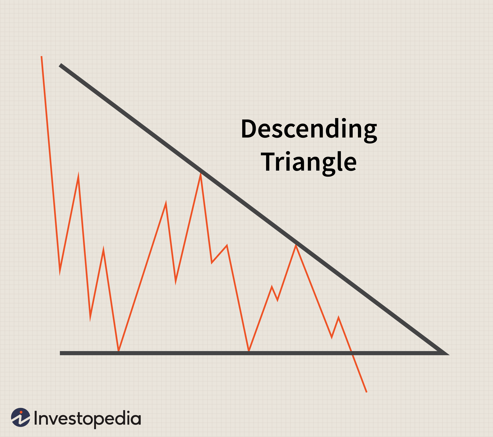

Technical analysis serves as a foundational tool in trading by utilizing historical price data to anticipate future market movements. At the heart of technical analysis are chart patterns, such as triangles, which signify important potential shifts in market trends. This article concentrates on the descending triangle chart pattern, a significant indicator for traders aiming to forecast market dynamics accurately. Descending triangles offer valuable insights into both manual and algorithmic trading strategies, making them indispensable for traders seeking a strategic edge in financial markets. By studying these patterns, traders can gain a better understanding of market behavior, enhancing their decision-making processes in a competitive trading environment.

## Table of Contents



## Understanding Descending Triangle Chart Patterns

A descending triangle chart pattern emerges when the price action is confined within two converging trendlines: a descending upper trendline and a stable horizontal lower trendline. This formation typically implies a bearish sentiment in the market, suggesting a likely continuation to the downside. As the price forms lower highs while consistently testing the horizontal support level, it reflects decreasing demand among buyers.

The descending upper trendline acts as a resistance, with each subsequent price high being lower than the previous one. Mathematically, this can be viewed as a sequence of declining peaks, indicating a pressure from sellers overpowering buying efforts. The horizontal lower trendline represents a support level that the price repeatedly tests without breaking through, until sufficient selling pressure eventually causes a breakdown.

While the descending triangle is primarily seen as a bearish pattern, forecasting potential breakdowns, it is not an absolute indicator of a market downturn. In certain scenarios, the descending triangle may precede bullish reversals. This occurs if a breakout above the descending trendline happens against the broader market expectation of a breakdown. The likelihood of such reversals increases if the market environment or other technical indicators support a bullish bias.

The significance of the descending triangle in predicting market movements lies in its ability to reveal underlying market psychology; the convergence of these trendlines is a visual representation of diminished buying interest. Recognizing and interpreting this pattern provides traders with insights into possible future price actions, helping them make informed trading decisions.

## Significance in Technical Analysis

Descending triangle patterns are important indicators in technical analysis, often utilized for predicting potential trends. Characterized by a flat horizontal support line and a downward-sloping resistance line, descending triangles typically signify a bearish market sentiment. These patterns can indicate both continuation of a downtrend as well as potential reversals, depending on market dynamics and accompanying signals.

A crucial component in interpreting descending triangle patterns is trading [volume](/wiki/volume-trading-strategy). When the price approaches the apex of the triangle, a significant volume increase can confirm a breakdown, reinforcing the continuation of an existing downtrend. This breakdown manifests itself when the price falls decisively below the horizontal support line, providing traders with a signal to enter short positions.

The predictive power of descending triangles lies in their ability to allow traders to strategize effectively. By analyzing the convergence of trendlines and monitoring volume patterns, traders can infer market sentiment and adapt their strategies accordingly. For example, a confirmed breakdown accompanied by high trading volumes suggests sustained selling pressure, prompting traders to consider aggressive short-selling strategies.

For traders, both experienced and beginners, mastering the interpretation of descending triangles is essential. This involves recognizing the pattern’s implications, calculating potential price targets, and setting stop-loss orders to mitigate risks. For instance, the expected price movement following a descending triangle breakdown can be approximately calculated by subtracting the height of the triangle from the breakdown point. This offers a quantitative tool to forecast probable price declines, aiding traders in decision-making.

Therefore, understanding descending triangle patterns not only aids traders in anticipating market moves but also sharpens their ability to spot investment opportunities. Enhancing skills in interpreting these signals can significantly improve a trader's performance by providing a structured approach to trading decisions.

## How to Identify and Trade Descending Triangles

Identifying a descending triangle pattern requires a keen eye for price movement and an understanding of how trendlines interact. This pattern forms when prices are contained within two converging trendlines: a descending upper line, formed by progressively lower highs, and a horizontal lower line, which usually represents consistent support levels. The key to recognizing the pattern is verifying that each subsequent high is lower than the last, while the lows remain roughly constant.

To effectively trade descending triangles, traders must pay attention to volume dynamics. Typically, volume will decrease as the pattern develops, consolidating within the triangle. However, as the price approaches the lower trendline, traders should be vigilant for volume spikes, which can indicate an imminent breakdown. Volume increase is crucial as it serves as a confirmation signal that enhances the reliability of the [breakout](/wiki/breakout-trading).

A common trading strategy is to enter a short position once the price breaches the horizontal support line with significant volume. This breakdown suggests a trend continuation, providing an opportunity to capitalize on the anticipated downtrend. It's essential, however, to manage risk effectively by setting stop-loss orders. Traders generally place stop-loss levels just above the upper descending trendline. This strategy ensures that if the market reverses unexpectedly, losses are minimized.

Example Python code for detecting descending triangles could include the use of libraries such as Pandas for handling data and Matplotlib for visualizations. An essential technique in this automated identification is assessing peak and trough data, calculating moving averages, and employing algorithms to determine trendline slopes.

```python
import pandas as pd
import matplotlib.pyplot as plt
import numpy as np

# Assuming df is a DataFrame with columns ['Date', 'Price']
df['Highs'] = df['Price'].rolling(window=5).max()    # Calculate rolling max for highs
df['Lows'] = df['Price'].rolling(window=5).min()     # Calculate rolling min for lows

# Identify potential points for trendlines
highs = df['Highs'].dropna().values
lows = df['Lows'].dropna().values

# Plotting the data
plt.plot(df['Date'], df['Price'], label='Price')
plt.plot(df['Date'], df['Highs'], label='Potential Upper Trendline', linestyle='--')
plt.plot(df['Date'], df['Lows'], label='Potential Lower Trendline', linestyle='--')
plt.legend()
plt.show()

# Further complexity can include slope calculations and convergence checks
```

This script first smoothens price data using a rolling maximum to identify potential highs and lows over a set window, helping draw preliminary trendlines. For robust pattern detection, additional logic is necessary to check trendline convergence and verify breakout volume, which advanced algorithms can automate. 

These mathematical and algorithmic approaches not only aid in identifying descending triangles but also in executing entries and exits with precision, thereby optimizing profit potential and managing risks effectively.

## Descending Triangle Patterns in Algorithmic Trading

Algorithmic trading systems are at the forefront of enabling efficient execution and real-time decision-making in financial markets, particularly when leveraging descending triangle patterns. These systems utilize advanced algorithms to identify and react to such patterns, which are characterized by a descending upper trendline and a horizontal lower trendline. The automation facilitated by algorithms helps reduce human error and enhance the speed and accuracy of trading operations, ultimately allowing traders to capitalize on high-frequency trading strategies.

The primary advantage of [algorithmic trading](/wiki/algorithmic-trading) lies in its ability to process large volumes of data at speeds unattainable by manual analysis. Algorithms can scan multiple trading instruments and historical price data to spot descending triangle formations as they develop. Once detected, these algorithms can execute pre-programmed trading strategies automatically, such as entering a short position when the price breaks below the support level identified by the horizontal trendline.

To illustrate how these algorithms function, consider a basic Python code snippet using a popular library like `pandas` for data manipulation and `numpy` for mathematical computations. Here's an example:

```python
import pandas as pd
import numpy as np

# Simulated price data
data = pd.DataFrame({
    'price': [100, 98, 97, 96, 95, 94, 95, 96, 97, 96, 94, 93, 92, 90]
})

# Rolling maximum and minimum to establish the trendlines
data['max_price'] = data['price'].rolling(window=4).max()
data['min_price'] = data['price'].rolling(window=4).min()

# Detecting potential descending triangles
def detect_descending_triangle(df):
    trendline_breaks = []
    for i in range(1, len(df) - 1):
        if df['price'][i] < df['min_price'][i - 1]:
            trendline_breaks.append((i, df['price'][i]))
    return trendline_breaks

break_points = detect_descending_triangle(data)
print("Descending Triangle Break Points:", break_points)
```

In this code, a rolling window function is used to determine local maxima and minima, approximating the descending upper trendline and horizontal lower trendline, respectively. When the current price drops below the previous minimum, it is logged as a potential breakout signal of a descending triangle pattern.

The use of algorithms ensures that these patterns are identified consistently and acted upon quickly, allowing traders to maintain competitive advantages within fast-paced markets. In addition, automation supports high-frequency trading strategies that would be nearly impossible to execute manually. By minimizing the time spent on decision-making and the potential for emotional bias, algorithmic systems enhance overall trading efficiency.

Despite these advantages, it is crucial to acknowledge the limitations associated with relying solely on algorithmic detection of chart patterns. Market conditions can change rapidly, and false signals pose significant risks. Hence, it's advisable to incorporate additional confirmation indicators or risk management techniques to optimize the reliability and profitability of trading strategies employing descending triangles.

## Limitations of Descending Triangle Patterns

Descending triangle patterns, like all chart patterns, are subject to various limitations that can affect their reliability in predicting market movements. One significant limitation of descending triangles is the potential for false breakouts. A false breakout occurs when the price appears to break through the horizontal support line, suggesting a continuation of the downtrend, but then reverses direction, failing to maintain the breakout. This can lead traders into unfavorable positions if they act hastily without further confirmation.

To mitigate the risk of false breakouts, traders often seek additional confirmation through volume analysis or other technical indicators. A genuine breakout is generally accompanied by a surge in trading volume, reinforcing the strength of the move. Conversely, a breakout accompanied by low volume might suggest a lack of conviction, increasing the possibility of a reversal. Indicators such as the Relative Strength Index (RSI) or Moving Average Convergence Divergence (MACD) can also be used to assess the [momentum](/wiki/momentum) and confirm the breakout's validity.

Risk management is paramount when trading descending triangles, given their limitations. Establishing stop-loss orders is a common risk management strategy. By setting a stop-loss order slightly above the upper descending trendline, traders can limit potential losses in case of a false breakout. This approach helps protect capital and manage the risk-return profile of trades.

Moreover, it's important for traders to consider the broader market context and other influencing factors. Economic data releases, geopolitical events, and market sentiment can all impact the effectiveness of descending triangle patterns. Consequently, traders should integrate descending triangles within a comprehensive trading strategy that considers multiple aspects of market analysis.

In conclusion, while descending triangle patterns offer valuable insights into market trends, their limitations, such as false breakouts, necessitate a cautious approach. By seeking additional confirmations, employing risk management techniques, and considering broader market dynamics, traders can enhance the reliability of their trading decisions based on this chart pattern.

## Conclusion

Descending triangle patterns can significantly enhance technical analysis by providing traders with the ability to forecast price movements with greater accuracy. These patterns are crucial in both manual and automated trading strategies, allowing traders to make more informed decisions. The adaptability of descending triangle patterns to various trading approaches highlights their significance in evolving financial markets. With their ability to indicate potential trend continuations or reversals, descending triangles help traders navigate the complexities of market behavior.

Incorporating descending triangle patterns into trading strategies is pivotal for maintaining a competitive edge. As financial markets undergo continual changes, traders who effectively integrate these patterns can improve their ability to anticipate market dynamics and adjust their positions accordingly. The strategic application of descending triangles enhances a trader's ability to identify optimal entry and [exit](/wiki/exit-strategy) points, ultimately increasing the probability of executing successful trades.

For traders, a comprehensive understanding of descending triangles can significantly bolster their market presence. Mastery of these patterns equips traders with the tools necessary to exploit market opportunities and mitigate risks. By leveraging the insights provided by descending triangles, traders can refine their analysis and strategy, leading to more confident and well-informed trading decisions. The depth of understanding required to interpret these patterns underscores their value, making them indispensable in any trader's toolkit.

## References & Further Reading

[1]: Bulkowski, T. (2008). ["Encyclopedia of Chart Patterns"](https://books.google.com/books/about/Encyclopedia_of_Chart_Patterns.html?id=zZAsEAAAQBAJ). Wiley.

[2]: Pring, M. J. (2002). ["Technical Analysis Explained"](https://www.amazon.com/Technical-Analysis-Explained-Fifth-Successful/dp/0071825177). McGraw-Hill.

[3]: Murphy, J. J. (1999). ["Technical Analysis of the Financial Markets"](https://archive.org/details/technicalanalysi0000murp). New York Institute of Finance.

[4]: Schwager, J. D. (1993). ["Market Wizards: Interviews with Top Traders"](https://books.google.com/books/about/Market_Wizards.html?id=jNG7r-Ul7jwC). Wiley.

[5]: Kirkpatrick, C. D., & Dahlquist, J. R. (2010). ["Technical Analysis: The Complete Resource for Financial Market Technicians"](https://ptgmedia.pearsoncmg.com/images/9780134137049/samplepages/9780134137049.pdf). FT Press.