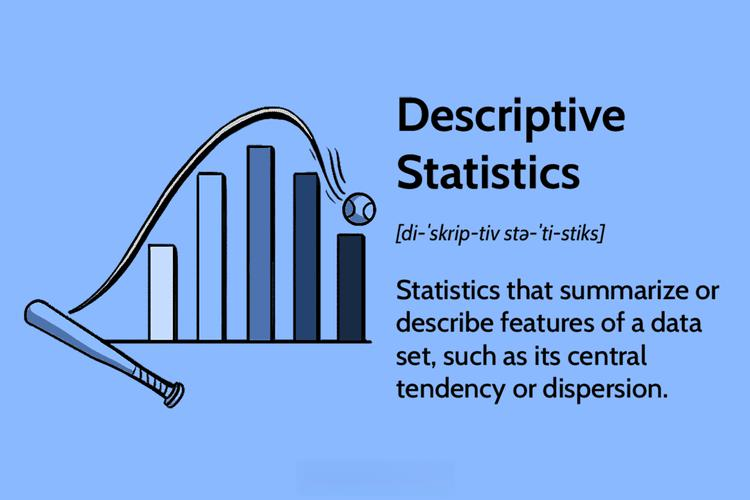

In today's fast-paced financial markets, the ability to make informed, data-driven decisions is critical to achieving success. One of the foremost approaches in this area is algorithmic trading (algo trading), which utilizes advanced quantitative data analysis to exploit market inefficiencies. By leveraging sophisticated algorithms, traders can execute trades at speeds and frequencies that are impossible for human traders, often capitalizing on fleeting opportunities in the market.

Statistical methods, with an emphasis on descriptive statistics, are integral to the process of analyzing financial data within algo trading. Descriptive statistics provide a means to summarize and describe the essential features of a dataset, allowing traders to discern underlying patterns and trends. Fundamental measures such as mean, median, and mode reveal central tendencies within financial data, while variance and standard deviation offer insights into market volatility and risk.



This article will explore the intersection of data analysis, descriptive statistics, and algo trading, highlighting the pivotal role that statistical methods play in shaping trading strategies. By examining key statistical methods and their applications, we aim to underscore their impact on market dynamics and demonstrate how they enable traders to construct robust, data-driven models for informed decision-making. As financial markets and algorithmic strategies continue to evolve, the importance of statistical analysis in maintaining competitive advantage is likely to grow even further.

## Table of Contents

## Understanding Descriptive Statistics

Descriptive statistics serve as foundational tools for summarizing and interpreting large datasets, which is vital in algorithmic trading. These statistics condense information about financial data into easily digestible metrics, providing traders and analysts with critical insights into market conditions.

Key measures of central tendency—mean, median, and mode—are essential for understanding the average or most common values within a dataset. The mean offers a mathematical average, calculated by dividing the sum of all data points by the number of observations. In contrast, the median represents the middle value in a sorted dataset, offering a measure resilient to extreme values. The mode identifies the most frequent data point, which can reveal trends in trading volumes or price movements.

Variability measures, such as variance and standard deviation, are crucial for assessing the spread and volatility of financial data. Variance quantifies the average squared deviation from the mean, providing an indication of the dataset's dispersion. Standard deviation, the square root of variance, is often more intuitive, as it shares the same units as the original data. High standard deviation suggests greater volatility, a key consideration for risk management in trading strategies.

Descriptive [statistics](/wiki/bayesian-statistics) also employ visual aids to enhance data interpretation. Histograms effectively display the frequency distribution of a dataset, illustrating the distribution of returns or price changes. Boxplots offer a concise summary of data distribution, highlighting the median, quartiles, and potential outliers, which are essential for spotting anomalies that can affect trading decisions.

In [algorithmic trading](/wiki/algorithmic-trading), descriptive statistics translate complex market data into straightforward metrics that inform decision-making. These statistics enable traders to rapidly assess market conditions, identify patterns, and track changes over time. In high-frequency trading scenarios, the quick interpretation of large datasets is critical, demanding efficient summarization tools to maintain a competitive edge. 

The ability to summarize and visualize data efficiently helps algo traders fine-tune their models and adapt to dynamic market environments. By leveraging these statistical tools, traders can optimize their strategies for improved performance and reduced risk.

## Statistical Methods in Data Analysis

Statistical analysis in the context of algorithmic trading encompasses both descriptive and inferential methods, each serving a distinct purpose. Descriptive statistics primarily aim to summarize large datasets to extract meaningful insights without making predictions. Through tools such as measures of central tendency—mean, median, and mode—traders can understand the typical values or trends within a dataset. For example, the mean (average) provides an aggregate value, while the median indicates the middle point in a dataset, offering insights less skewed by outliers.

Variability measures such as variance and standard deviation further enrich this analysis by providing insight into the spread or [dispersion](/wiki/dispersion-trading) of data points. Variance ($\sigma^2$) is calculated using:

$$
\sigma^2 = \frac{\sum (X_i - \bar{X})^2}{N}
$$

where $X_i$ represents each data point, $\bar{X}$ is the mean of the data, and $N$ is the number of data points. Standard deviation ($\sigma$), the square root of variance, gives a clearer indication of how data points differ from the mean in the same units as the data.

Descriptive statistics serve as foundational tools for informing and validating data-driven trading strategies. By summarizing historical performance and variability, these statistics help algo traders identify patterns and trends necessary for model development. In algorithmic trading, statistical analysis aids in constructing robust models that make informed trading decisions. By analyzing patterns and formulating trading models based on statistical output, traders can enhance their ability to predict future market behavior more accurately.

Python, a widely-used tool in data analysis, simplifies the computation of these statistics using libraries like NumPy and pandas. Here's an example of calculating basic descriptive statistics using Python:

```python
import pandas as pd

# Sample financial data
data = {'price': [100, 102, 101, 105, 107, 106]}
df = pd.DataFrame(data)

# Calculating descriptive statistics
mean = df['price'].mean()
median = df['price'].median()
std_dev = df['price'].std()

print(f'Mean: {mean}, Median: {median}, Standard Deviation: {std_dev}')
```

This script computes the mean, median, and standard deviation of a small dataset, providing essential insights into the dataset's characteristics. Such analyses are crucial for algo traders when developing and refining trading strategies, ensuring that they are statistically robust and adaptable to dynamic market conditions. By employing these descriptive techniques, traders can effectively capture market behaviors, support decision-making processes, and optimize their algorithmic models for better trading outcomes.

## Role of Descriptive Statistics in Algo Trading

Descriptive statistics serve as an integral part of algorithmic trading by enabling traders to identify potential trading opportunities. These statistics provide a structured way to assess and interpret complex data sets, which is essential in making informed trading decisions.

By applying statistical measures such as mean, median, variance, and standard deviation, traders can evaluate the risk and [volatility](/wiki/volatility-trading-strategies) inherent in various trading strategies. For example, the standard deviation is often used to measure the amount of variation or dispersion in a set of financial returns. A higher standard deviation indicates more risk due to higher volatility, which can be crucial for traders when developing or adjusting their strategies.

Furthermore, descriptive statistics offer a basis for predictive modeling in algo trading by summarizing historical data. Historical patterns and data distributions can reveal underlying trends and behaviors in the markets, which can be exploited for predictive models. For instance, calculating the average return and volatility of a stock over a specific period can help predict future price movements.

In high-frequency trading ([HFT](/wiki/high-frequency-trading-strategies)) environments, where rapid decision-making is crucial, descriptive statistics are used for real-time analysis. Traders can compute rolling averages or moving averages to smooth out short-term fluctuations and highlight longer-term trends, allowing for immediate adjustments to trading algorithms. Here is an example of Python code used to calculate a moving average:

```python
def moving_average(data, window_size):
    return [sum(data[i:i + window_size]) / window_size for i in range(len(data) - window_size + 1)]

# Example usage
price_data = [100, 102, 101, 104, 107, 110]
window_size = 3
ma = moving_average(price_data, window_size)
print(ma)  # Output: [101.0, 102.33333333333333, 104.0, 107.0]
```

Additionally, traders leverage descriptive statistics to fine-tune their algorithms based on summarized data characteristics. For instance, outlier detection techniques can be used to identify and exclude unusual data points that could potentially skew trading decisions. These methods allow for more precise calibration of trading models, enhancing their performance.

In conclusion, descriptive statistics provide algorithmic traders with the tools necessary to effectively interpret, analyze, and act upon vast amounts of financial data, ultimately improving the efficacy of their trading strategies.

## Advanced Descriptive Methods and Algo Trading

Advanced descriptive methods play an essential role in algorithmic trading by identifying data anomalies and outliers that can bias trading decisions if left unaddressed. Outlier detection is crucial as these data points, which deviate significantly from other observations, can result from errors or rare events (Aggarwal, C.C. 2017). Such aberrations can lead to incorrect assumptions about market conditions, hence detecting and correcting for them helps maintain the integrity of trading algorithms.

Several sophisticated techniques are employed for outlier detection, including Z-scores, Tukey’s fences, and the Interquartile Range (IQR). The use of these methods allows traders to filter out data points that could compromise the reliability of subsequent analyses. In Python, for example, outliers can be detected using a simple method like this:

```python
import numpy as np

# Example dataset
data = np.array([10, 12, 12, 13, 20, 100, 12, 12, 13, 15])

# Calculate the Z-scores
z_scores = np.abs((data - np.mean(data)) / np.std(data))

# Define a threshold
threshold = 2

# Identify outliers
outliers = np.where(z_scores > threshold)

print("Outliers:", data[outliers])
```

These advanced methods not only aid in cleaning the data but also complement inferential statistics, allowing for more precise and robust trading models. Inferential statistics estimate and make predictions about a population based on sample data. By ensuring the sample data is devoid of outliers, the predictive models' reliability and accuracy are significantly enhanced, resulting in better-informed trading decisions.

Furthermore, visual tools like scatter plots and line graphs are indispensable for quick interpretation and analysis of market data trends. These visualizations facilitate rapid adjustments to trading strategies in response to market shifts. A scatter plot, for example, allows traders to see the initial plausibility of a relationship between two variables, while a line graph might help track and project price trends over time. Here is how a simple scatter plot might be implemented using Python's matplotlib library:

```python
import matplotlib.pyplot as plt

# Example data
x = np.random.rand(100)
y = np.random.rand(100)

plt.scatter(x, y)
plt.title('Scatter Plot Example')
plt.xlabel('Variable X')
plt.ylabel('Variable Y')
plt.show()
```

The integration of these advanced descriptive methods and visual tools into algorithmic trading platforms not only improves operational precision but also enhances traders’ ability to adapt strategically. As algorithmic trading continually evolves, the capacity to efficiently interpret and respond to data becomes increasingly valuable, underscoring the critical role these methodologies play in shaping effective trading strategies.

## Challenges and Considerations

High-frequency trading (HFT) significantly complicates data analysis, primarily because it operates at a microsecond pace, requiring traders to continuously evaluate and react to market information. One of the foremost challenges is balancing computational efficiency with statistical accuracy. In HFT systems, algorithms are designed to execute trades in fractions of a second, necessitating rapid computational processes. However, hasty computations often risk sacrificing the precision required for extracting meaningful insights from statistical data. 

For precise trade execution, data quality and integrity are paramount. Descriptive statistics are fundamentally reliant on the accuracy of the input data, and any erroneous or incomplete data can lead to misleading summaries. High-frequency trading systems typically process vast volumes of data, increasing the difficulty of maintaining data quality. Sophisticated data cleaning and validation procedures must be implemented to ensure data reliability. A basic Python pseudocode for data validation might resemble:

```python
import pandas as pd

# Simulating data for validation
data = pd.DataFrame({
    'price': [100, 101, None, 103, 'error', 105],
    'volume': [10, 12, None, 13, 15, 'error']
})

# Function to clean and validate the data
def validate_data(data):
    # Converting data types to numeric, coercing errors to NaN
    data = data.apply(pd.to_numeric, errors='coerce')
    # Dropping rows with NaN values
    data.dropna(inplace=True)
    return data

cleaned_data = validate_data(data)
print(cleaned_data)
```

Ethical considerations in automated decision-making add another layer of complexity. With algorithms autonomously executing trades, there is a constant risk of these systems acting on biased or flawed algorithms. This raises questions about accountability and the potential for market manipulation or unfair trading practices. Regulating bodies often enforce stringent guidelines to ensure ethical compliance and transparency in algorithmic operations.

Finally, the dynamic nature of financial markets mandates that algorithms be continuously refined. Market conditions are unpredictable, and static models can quickly become obsolete, leading to inefficient trading strategies. To adapt to changing conditions, trading algorithms must be periodically updated with new data and reevaluated for performance and accuracy. This iterative process might include re-calibrating the statistical models or incorporating new features into the algorithms to maintain competitiveness and effectiveness.

In conclusion, while the integration of descriptive statistics and HFT has transformed financial markets, it also introduces multifaceted challenges, necessitating a careful balance between speed, accuracy, data integrity, ethics, and adaptability.

## Conclusion

Descriptive statistics are an essential component of algorithmic trading, offering traders precise, actionable insights into market behavior. By summarizing complex datasets through measures such as mean, variance, and standard deviation, these statistics enable traders to understand and react to market trends efficiently. As financial markets continue to evolve rapidly, the ability to leverage advanced statistical methods will become crucial to maintaining a competitive edge. 

The future of algorithmic trading appears promising with continued advancements in statistical analysis, which will further enhance traders' ability to develop sophisticated models and strategies. As these tools and techniques advance, traders must integrate them seamlessly with algorithmic systems to optimize decision-making processes. A successful trading strategy will increasingly depend on the trader's ability to combine comprehensive data analysis with descriptive statistics and algorithmic trading methodologies. This integration will be key to navigating the complexities and dynamics of modern financial markets effectively.

## References & Further Reading

[1]: Bergstra, J., Bardenet, R., Bengio, Y., & Kégl, B. (2011). ["Algorithms for Hyper-Parameter Optimization."](https://papers.nips.cc/paper/4443-algorithms-for-hyper-parameter-optimization) Advances in Neural Information Processing Systems 24.

[2]: ["Advances in Financial Machine Learning"](https://www.amazon.com/Advances-Financial-Machine-Learning-Marcos/dp/1119482089) by Marcos Lopez de Prado

[3]: ["Evidence-Based Technical Analysis: Applying the Scientific Method and Statistical Inference to Trading Signals"](https://www.amazon.com/Evidence-Based-Technical-Analysis-Scientific-Statistical/dp/0470008741) by David Aronson

[4]: ["Machine Learning for Algorithmic Trading"](https://github.com/stefan-jansen/machine-learning-for-trading) by Stefan Jansen

[5]: ["Quantitative Trading: How to Build Your Own Algorithmic Trading Business"](https://www.amazon.com/Quantitative-Trading-Build-Algorithmic-Business/dp/1119800064) by Ernest P. Chan