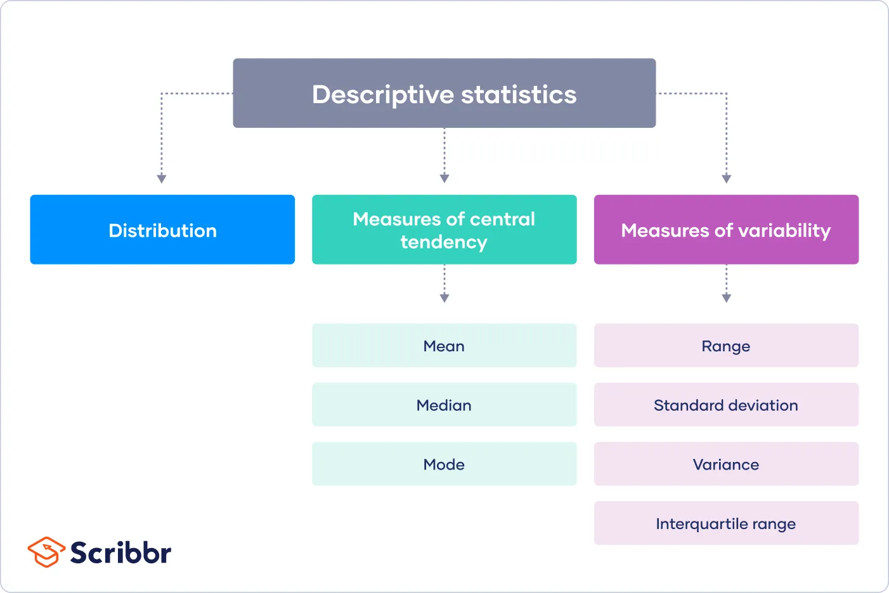

## Table of Contents

## What is descriptive statistics?

Descriptive statistics is a way to summarize and describe the main features of a set of data. It helps to make large amounts of data easier to understand by using numbers like averages, percentages, and measures of how spread out the data is. For example, if you want to know the average height of students in a class, descriptive statistics can give you that number quickly.

There are two main types of descriptive statistics: measures of central tendency and measures of variability. Measures of central tendency, like the mean, median, and mode, tell you about the center of the data. The mean is the average, the median is the middle number when the data is ordered, and the mode is the number that appears most often. Measures of variability, like the range, variance, and standard deviation, tell you how spread out the data is. The range is the difference between the highest and lowest numbers, while variance and standard deviation show how much the numbers differ from the average.

Descriptive statistics are useful in many fields, such as business, healthcare, and education. They help people make sense of data without needing to look at every single number. For instance, a teacher might use descriptive statistics to understand the overall performance of a class on a test, or a doctor might use them to summarize patient data. By using descriptive statistics, people can get a clear picture of their data and make better decisions.

## Why is descriptive statistics important in data analysis?

Descriptive [statistics](/wiki/bayesian-statistics) is important in data analysis because it helps to make sense of large amounts of data. It gives a quick summary of the data, showing things like the average, the middle value, and how spread out the numbers are. This makes it easier for people to understand what the data is saying without having to look at every single number. For example, if you have test scores from a whole school, descriptive statistics can tell you the average score, which can help you see how the school is doing overall.

Another reason descriptive statistics is important is that it helps people make better decisions. By looking at the summary of the data, people can see patterns and trends that might not be obvious when looking at all the numbers. This can be useful in many areas, like business, where a company might use descriptive statistics to understand customer behavior, or in healthcare, where doctors might use it to see how patients are responding to a treatment. By using descriptive statistics, people can get a clear picture of their data and use that information to make smarter choices.

## What are the main types of descriptive statistics?

The main types of descriptive statistics are measures of central tendency and measures of variability. Measures of central tendency help you find the center of your data. They include the mean, which is the average of all the numbers; the median, which is the middle number when you line up all the numbers in order; and the mode, which is the number that shows up the most often. These measures give you a quick idea of what a typical value in your data set looks like.

Measures of variability tell you how spread out your data is. The range is one measure of variability, and it's the difference between the highest and lowest numbers in your data. Variance and standard deviation are other measures of variability. Variance shows how much the numbers in your data differ from the average, and standard deviation is the square root of variance, which gives you a more straightforward number to understand how spread out the data is.

Using both types of descriptive statistics together gives you a full picture of your data. You can see not only what the typical value is but also how much the values vary. This helps in understanding the data better and making more informed decisions based on it.

## How do measures of central tendency like mean, median, and mode work?

Measures of central tendency help you find the middle or typical value in a set of data. The mean is what most people call the average. You find it by adding up all the numbers in your data and then dividing by how many numbers there are. For example, if you have test scores of 80, 90, and 70, the mean would be (80 + 90 + 70) divided by 3, which equals 80. The mean is useful because it gives you a single number that represents the whole set of data, but it can be affected a lot by very high or very low numbers.

The median is another way to find the middle of your data. To find the median, you line up all your numbers from smallest to largest and pick the one in the middle. If you have an odd number of values, it's easy to find the middle one. If you have an even number of values, the median is the average of the two middle numbers. For example, with the numbers 10, 20, 30, 40, the median is (20 + 30) divided by 2, which is 25. The median is good because it's not affected by very high or very low numbers, so it gives you a better idea of the middle when you have some extreme values.

The mode is the number that shows up the most in your data. If you have a list of numbers like 1, 2, 2, 3, 4, the mode is 2 because it appears more often than any other number. Sometimes, there can be more than one mode if multiple numbers appear the same number of times, and sometimes there is no mode if all numbers appear equally often. The mode is useful for understanding what value is most common in your data, which can be important in certain situations, like knowing the most popular size of a product.

## What are measures of variability and how are they calculated?

Measures of variability help us understand how spread out the numbers in a set of data are. The most common measures of variability are the range, variance, and standard deviation. The range is the simplest to calculate. You find it by taking the highest number in your data and subtracting the lowest number. For example, if your data is 10, 20, 30, 40, and 50, the range is 50 minus 10, which equals 40. The range gives a quick idea of how spread out the data is, but it doesn't tell you about the spread of all the numbers in between.

Variance and standard deviation give more detailed information about how spread out the data is. To calculate variance, you first find the mean of your data. Then, for each number in your data, you subtract the mean and square the result. You add up all these squared differences and divide by the number of data points to get the variance. For example, if your data is 2, 4, and 6, the mean is 4. The squared differences are (2-4)^2 = 4, (4-4)^2 = 0, and (6-4)^2 = 4. Adding these up gives 8, and dividing by 3 gives a variance of about 2.67. Standard deviation is the square root of the variance, so in this case, it would be the square root of 2.67, which is about 1.63. Standard deviation is useful because it's in the same units as your original data, making it easier to understand how spread out the numbers are.

## Can you explain the difference between a sample and a population in descriptive statistics?

In descriptive statistics, a population is all the people or things you want to study. For example, if you want to know the average height of all students in a school, the population is every student in that school. It's important because it gives you the complete picture of what you're studying. But studying the whole population can be hard, especially if it's very large. That's why we often use samples instead.

A sample is a smaller group of people or things from the population that you actually study. For example, instead of measuring the height of every student in the school, you might measure the height of just a few students. The sample should be chosen carefully so it represents the whole population well. If it does, you can use the results from the sample to make good guesses about the whole population. This makes studying large groups easier and more practical.

## How do you choose the right type of descriptive statistics for your data?

Choosing the right type of descriptive statistics depends on what you want to know about your data. If you're interested in finding a typical or middle value, you'll use measures of central tendency like the mean, median, or mode. The mean, or average, is good for data where all values are important and there are no extreme outliers. The median is better when you have some very high or very low numbers because it's not affected by these extremes. The mode is useful if you want to know what value occurs most often, which can be important for things like product sizes or popular choices.

On the other hand, if you want to understand how spread out your data is, you'll use measures of variability like the range, variance, or standard deviation. The range is simple to calculate and gives a quick idea of the spread, but it only looks at the highest and lowest values. Variance and standard deviation give a more detailed view of how much the numbers vary from the average. Standard deviation is often used because it's easier to understand, as it's in the same units as your data. So, the right type of descriptive statistics depends on whether you want to focus on the center of your data or how spread out it is.

## What are some common graphical methods used in descriptive statistics?

Graphical methods in descriptive statistics help show data in a way that's easy to understand. Some common types are histograms, bar charts, and pie charts. A histogram shows how often different values occur in your data. It's like a bar chart but used for continuous data, like test scores or heights. Each bar represents a range of values, and the height of the bar shows how many data points fall into that range. Bar charts are good for comparing different categories, like the number of students in different grades. Each bar represents a category, and the height shows the count or percentage for that category. Pie charts are useful for showing parts of a whole, like how much of a budget goes to different things. Each slice of the pie represents a category, and the size of the slice shows its proportion of the whole.

Another common graphical method is the box plot, which helps you see the spread and center of your data at a glance. A box plot shows the median, the first and third quartiles, and any outliers. The box itself represents the middle 50% of the data, with a line inside showing the median. The "whiskers" extend to the highest and lowest values within a certain range, and any points outside this range are shown as outliers. Box plots are especially useful for comparing different groups or distributions. For example, you could use box plots to compare test scores between different classes. By using these graphical methods, you can quickly understand and communicate the main features of your data.

## How can descriptive statistics be used to summarize large datasets?

Descriptive statistics help to summarize large datasets by giving you a quick and easy way to understand the main points of the data. Instead of looking at every single number, you can use measures like the average, the middle value, and the most common value to get a good idea of what the data looks like. For example, if you have test scores from a whole school, you don't need to look at each score. You can just find the average score, which tells you how well the school did overall. This makes it much easier to see patterns and trends without getting lost in all the numbers.

Another way descriptive statistics help with large datasets is by showing how spread out the numbers are. Measures like the range, variance, and standard deviation tell you if the numbers are close together or all over the place. If the range is small, it means the numbers are similar, but if it's big, it means they're very different. This can be important for understanding things like how consistent students' test scores are or how much people's incomes vary in a city. By using these measures, you can get a clear picture of your data and make better decisions without having to go through every single piece of information.

## What are the limitations of descriptive statistics?

Descriptive statistics are great for giving a quick summary of data, but they have some limits. One big problem is that they don't tell you why things happen. For example, if you know the average test score of a class, you can't tell if the students did well because they studied hard, had a good teacher, or just got lucky. Descriptive statistics just show you what the data looks like, not why it looks that way. This means you need to be careful not to jump to conclusions about what caused the results you see.

Another limit of descriptive statistics is that they can hide important details. If you only look at the average, you might miss important differences within the data. For example, if half the students in a class got very high scores and the other half got very low scores, the average might look okay, but it doesn't show you that there's a big difference between the students. Also, descriptive statistics can be affected by extreme values, or outliers. If one student got a very high or very low score, it could change the average a lot, even if most students scored around the middle. So, while descriptive statistics are useful, you need to use them carefully and look at the data in different ways to get the full picture.

## How do advanced techniques like skewness and kurtosis enhance descriptive statistics?

Skewness and kurtosis are advanced techniques that help us understand more about our data than just the basics like the average and spread. Skewness tells us if our data is lopsided or not. Imagine a bell-shaped curve that's perfectly balanced; if your data is like this, it's not skewed. But if the data is pushed more to one side, like if a lot of people have low incomes and just a few have very high incomes, the data is skewed. Knowing the skewness helps us see if our data is normal or if it's pulled in one direction, which can affect how we interpret and use the data.

Kurtosis, on the other hand, tells us about the tails of the data distribution. It shows if the data has more or fewer extreme values than a normal bell-shaped curve. If the data has a lot of extreme values, we say it has high kurtosis, or is "leptokurtic." If it has fewer extreme values, it has low kurtosis, or is "platykurtic." Understanding kurtosis helps us know if our data is more likely to have big surprises or if it's more predictable. By using skewness and kurtosis, we can get a deeper understanding of our data and make better decisions based on it.

## Can you provide examples of how descriptive statistics are applied in real-world scenarios?

In a school, teachers use descriptive statistics to understand how their students are doing. For example, after a big test, a teacher might calculate the average score to see how the class did overall. They might also look at the range of scores to see if some students did much better or worse than others. If the average is high but the range is also big, it might mean that while some students did well, others struggled. This helps the teacher know if they need to give extra help to some students or if the whole class needs more practice. By using these simple numbers, the teacher can make better decisions about how to help their students learn.

In a business, descriptive statistics help companies understand their customers and sales. For example, a store might look at the average amount of money customers spend each time they shop. This helps the store see if people are buying more or less over time. They might also look at the most common items sold, which is the mode, to know what products are popular. If they see that one product is bought a lot more than others, they might decide to stock more of that item. By using these statistics, the business can make better choices about what to sell and how to serve their customers better.

## What are the statistical methods used in data analysis?

Statistical analysis in the context of [algorithmic trading](/wiki/algorithmic-trading) encompasses both descriptive and inferential methods, each serving a distinct purpose. Descriptive statistics primarily aim to summarize large datasets to extract meaningful insights without making predictions. Through tools such as measures of central tendency—mean, median, and mode—traders can understand the typical values or trends within a dataset. For example, the mean (average) provides an aggregate value, while the median indicates the middle point in a dataset, offering insights less skewed by outliers.

Variability measures such as variance and standard deviation further enrich this analysis by providing insight into the spread or [dispersion](/wiki/dispersion-trading) of data points. Variance ($\sigma^2$) is calculated using:

$$
\sigma^2 = \frac{\sum (X_i - \bar{X})^2}{N}
$$

where $X_i$ represents each data point, $\bar{X}$ is the mean of the data, and $N$ is the number of data points. Standard deviation ($\sigma$), the square root of variance, gives a clearer indication of how data points differ from the mean in the same units as the data.

Descriptive statistics serve as foundational tools for informing and validating data-driven trading strategies. By summarizing historical performance and variability, these statistics help algo traders identify patterns and trends necessary for model development. In algorithmic trading, statistical analysis aids in constructing robust models that make informed trading decisions. By analyzing patterns and formulating trading models based on statistical output, traders can enhance their ability to predict future market behavior more accurately.

Python, a widely-used tool in data analysis, simplifies the computation of these statistics using libraries like NumPy and pandas. Here's an example of calculating basic descriptive statistics using Python:

```python
import pandas as pd

# Sample financial data
data = {'price': [100, 102, 101, 105, 107, 106]}
df = pd.DataFrame(data)

# Calculating descriptive statistics
mean = df['price'].mean()
median = df['price'].median()
std_dev = df['price'].std()

print(f'Mean: {mean}, Median: {median}, Standard Deviation: {std_dev}')
```

This script computes the mean, median, and standard deviation of a small dataset, providing essential insights into the dataset's characteristics. Such analyses are crucial for algo traders when developing and refining trading strategies, ensuring that they are statistically robust and adaptable to dynamic market conditions. By employing these descriptive techniques, traders can effectively capture market behaviors, support decision-making processes, and optimize their algorithmic models for better trading outcomes.

## References & Further Reading

[1]: Bergstra, J., Bardenet, R., Bengio, Y., & Kégl, B. (2011). ["Algorithms for Hyper-Parameter Optimization."](https://papers.nips.cc/paper/4443-algorithms-for-hyper-parameter-optimization) Advances in Neural Information Processing Systems 24.

[2]: ["Advances in Financial Machine Learning"](https://www.amazon.com/Advances-Financial-Machine-Learning-Marcos/dp/1119482089) by Marcos Lopez de Prado

[3]: ["Evidence-Based Technical Analysis: Applying the Scientific Method and Statistical Inference to Trading Signals"](https://www.amazon.com/Evidence-Based-Technical-Analysis-Scientific-Statistical/dp/0470008741) by David Aronson

[4]: ["Machine Learning for Algorithmic Trading"](https://github.com/stefan-jansen/machine-learning-for-trading) by Stefan Jansen

[5]: ["Quantitative Trading: How to Build Your Own Algorithmic Trading Business"](https://www.amazon.com/Quantitative-Trading-Build-Algorithmic-Business/dp/1119800064) by Ernest P. Chan