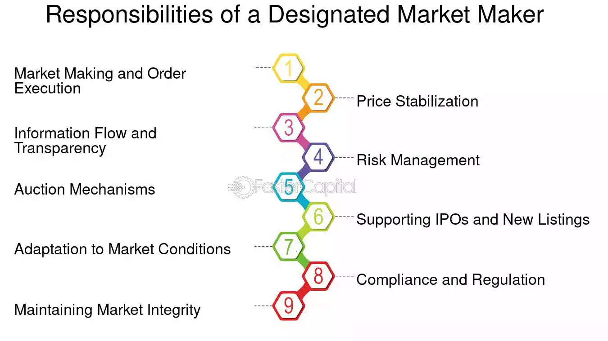

## Table of Contents

## What is a Designated Market Maker (DMM)?

A Designated Market Maker (DMM) is a person or a firm that is responsible for maintaining a fair and orderly market for a specific set of stocks on a stock exchange. They work at the exchange and their main job is to make sure that there are always buyers and sellers for the stocks they are assigned to. This helps to keep the market stable and makes it easier for people to buy and sell shares.

DMMs do this by buying and selling shares from their own inventory when there aren't enough buyers or sellers in the market. This helps to keep the price of the stock from moving too wildly. They also help to start trading at the beginning of the day and can help to stop trading if something goes wrong. Overall, DMMs play an important role in making sure that the stock market runs smoothly.

## How does a DMM operate at the New York Stock Exchange (NYSE)?

At the New York Stock Exchange (NYSE), a Designated Market Maker (DMM) has a special job to keep trading smooth for certain stocks. They stand right on the trading floor and watch the stocks they are in charge of. If there are not enough people wanting to buy or sell a stock, the DMM steps in. They use their own shares to buy or sell, which helps keep the price of the stock steady. This is important because it stops the price from going up or down too fast, which can be bad for people trading.

DMMs also help start the trading day. Before the market opens, they look at all the orders that came in overnight and decide a good starting price for the stock. This is called setting the opening price. If something big happens during the day, like a company announcing big news, the DMM can pause trading to keep things calm. This way, everyone gets a fair chance to trade without the market getting too crazy.

## What are the primary responsibilities of a DMM at the NYSE?

At the New York Stock Exchange, a Designated Market Maker (DMM) has the job of making sure trading goes smoothly for certain stocks. They watch the stocks they are responsible for and step in when there aren't enough buyers or sellers. If there aren't enough people wanting to trade, the DMM uses their own shares to buy or sell. This helps keep the price of the stock from changing too quickly, which is good for everyone trading.

DMMs also help start the trading day. Before the market opens, they look at all the orders that came in overnight and decide a good starting price for the stock. This is called setting the opening price. During the day, if something big happens, like a company announcing important news, the DMM can pause trading to keep things calm. This way, everyone gets a fair chance to trade without the market getting too wild.

## How does a DMM differ from a broker?

A Designated Market Maker (DMM) and a broker have different jobs at the stock exchange. A DMM is like a guardian for certain stocks. They stand on the trading floor and make sure there are always people buying and selling those stocks. If there aren't enough buyers or sellers, the DMM steps in and uses their own shares to keep the trading smooth. They also help set the opening price for the day and can pause trading if something big happens.

A broker, on the other hand, is like a helper for people who want to buy or sell stocks. They don't own the stocks themselves but act as a middleman. When someone wants to trade, they tell their broker what they want to do, and the broker finds someone on the other side of the trade. Brokers don't control the market like DMMs do; they just make sure their clients' orders get done.

## What are the qualifications required to become a DMM at the NYSE?

To become a Designated Market Maker (DMM) at the New York Stock Exchange (NYSE), you need to have a lot of experience and knowledge about how the stock market works. You usually need to have worked in the financial industry for many years, often in roles like trading or [market making](/wiki/market-making). You also need to understand the rules of the NYSE really well and be good at making quick decisions under pressure. The NYSE looks for people who can keep the market fair and orderly, so they want someone who is trustworthy and experienced.

Besides experience, becoming a DMM also requires passing certain tests and getting the right licenses. You need to have a Series 7 license, which lets you trade stocks, and a Series 24 license, which shows you can supervise others in a brokerage. Sometimes, you might need other licenses too, depending on what you will be trading. The NYSE also has its own training program that you have to complete before you can start working as a DMM. This program helps you learn all the specific things you need to know to do the job well.

## How does a DMM contribute to market stability and liquidity?

A Designated Market Maker (DMM) helps keep the stock market stable by making sure there are always people who want to buy and sell stocks. If there aren't enough buyers or sellers, the DMM steps in and uses their own shares to trade. This keeps the price of the stock from going up or down too fast, which can be bad for people trading. By doing this, the DMM helps make the market calmer and more predictable.

DMMs also add to the market's [liquidity](/wiki/liquidity-risk-premium), which means it's easier for people to buy and sell stocks. When someone wants to trade, the DMM is there to make sure the trade can happen quickly. They do this by always being ready to buy or sell shares from their own inventory. This makes it easier for everyone to trade because there's always someone to trade with. Overall, DMMs play a big role in making sure the stock market runs smoothly and fairly.

## What are the technological tools used by DMMs to manage their responsibilities?

DMMs use special computer programs and systems to help them do their job. These tools let them see all the buy and sell orders for the stocks they are in charge of. They can quickly check how many people want to buy or sell and at what prices. This helps them decide when to step in and use their own shares to keep the market stable. The systems also show them important news and events that might affect the stocks, so they can react fast.

Another important tool for DMMs is the trading platform at the NYSE. This platform helps them set the opening price for stocks each day by looking at all the orders that came in overnight. It also lets them pause trading if something big happens, like a company announcing important news. These tools make it easier for DMMs to keep the market fair and orderly, and help them make quick decisions to keep trading smooth.

## Can you explain the historical evolution of the DMM role at the NYSE?

The role of the Designated Market Maker (DMM) at the New York Stock Exchange (NYSE) has changed a lot over time. In the old days, they were called "specialists." These specialists stood right on the trading floor and made sure that trading was fair and orderly for the stocks they were in charge of. They did this by buying and selling shares from their own inventory when there weren't enough buyers or sellers. This helped keep the price of the stock steady and made it easier for everyone to trade.

As time went on and technology got better, the role of the specialist changed. In 2008, the NYSE decided to call them Designated Market Makers instead. This was because the job started to include more than just standing on the trading floor. DMMs now use computers and special software to help them see all the buy and sell orders and make quick decisions. They still make sure the market stays stable, but they do it with the help of new technology. This change has made the job of the DMM more modern and efficient, helping to keep the market fair and orderly in today's fast-paced world.

## How do DMMs interact with algorithmic trading and high-frequency trading?

DMMs at the NYSE work alongside [algorithmic trading](/wiki/algorithmic-trading) and high-frequency trading to keep the market stable. Algorithmic trading uses computer programs to make trades based on set rules, while high-frequency trading does this very quickly, often in milliseconds. DMMs use their own technology to watch what these fast traders are doing. If the market starts to move too much because of these trades, DMMs can step in and use their own shares to buy or sell. This helps to keep the price of the stock from changing too wildly and keeps the market calm.

Even though algorithmic and high-frequency trading can happen very quickly, DMMs are still important. They help make sure there is always someone to trade with, which adds to the market's liquidity. This means it's easier for everyone to buy and sell stocks. DMMs also help set the opening price each day, taking into account all the orders that came in overnight, including those from algorithmic and high-frequency traders. By doing this, DMMs make sure the market starts the day in a fair and orderly way, even with all the fast trading going on.

## What are the performance metrics used to evaluate the effectiveness of DMMs?

DMMs are evaluated based on how well they keep the market fair and orderly. One important metric is how much they help with the market's liquidity. This means checking if they make it easier for people to buy and sell stocks by always being ready to trade. Another metric is how stable they keep the stock prices. If a DMM can stop the price from moving too wildly, they are doing a good job. They also look at how often DMMs step in to trade when there aren't enough buyers or sellers, which shows how active they are in keeping the market smooth.

Another way to measure a DMM's performance is by looking at how well they set the opening price for the day. This is important because it sets the tone for trading. If the opening price is fair and based on all the orders that came in overnight, it shows the DMM is doing their job well. They also check how quickly DMMs can react to big news or events that might affect the stocks they are in charge of. If a DMM can pause trading at the right time to keep things calm, it's a sign they are effective. Overall, these metrics help make sure DMMs are doing what they need to keep the market working smoothly.

## How have regulatory changes affected the role and operations of DMMs at the NYSE?

Regulatory changes have had a big impact on how DMMs work at the NYSE. One big change was the move from specialists to DMMs in 2008. This was part of a bigger plan to make trading more open and fair. The rules now say DMMs have to use technology to watch the market closely and step in when needed. They also have to report more about what they are doing, so everyone can see they are keeping the market stable and fair.

These changes have made the DMM's job more about using computers and less about standing on the trading floor. New rules also focus on making sure DMMs don't use their power to make unfair trades. They have to follow strict guidelines to keep the market honest. All these changes have made the DMM's role more modern and important in today's fast-moving stock market.

## What future trends might impact the role of DMMs at the NYSE?

In the future, technology might change the role of DMMs at the NYSE a lot. As computers get better, more trading could be done by machines using algorithms. This might mean DMMs will need to use even more advanced tools to keep up with these fast trades. They might also need to focus more on making sure the market stays fair and stable when so much trading is done by computers. This could make their job more about watching over the market and less about trading themselves.

Another trend that could affect DMMs is how rules and laws about trading might change. Governments and the NYSE might make new rules to make sure trading is fair, especially with more computers doing the trading. DMMs might have to follow even stricter rules about how they trade and report what they do. This could make their job more about following rules and making sure everyone plays fair. Overall, these trends could make the DMM's role more important but also more challenging as they work to keep the market running smoothly in a world with more technology and rules.

## References & Further Reading

[1]: ["Advances in Financial Machine Learning"](https://www.amazon.com/Advances-Financial-Machine-Learning-Marcos/dp/1119482089) by Marcos Lopez de Prado

[2]: ["Quantitative Trading: How to Build Your Own Algorithmic Trading Business"](https://www.amazon.com/Quantitative-Trading-Build-Algorithmic-Business/dp/1119800064) by Ernest P. Chan

[3]: ["Machine Learning for Algorithmic Trading"](https://github.com/stefan-jansen/machine-learning-for-trading) by Stefan Jansen

[4]: Madhavan, A. (2000). ["Market microstructure: A survey."](https://www.sciencedirect.com/science/article/pii/S1386418100000070) Journal of Financial Markets, 3(3), 205-258.

[5]: Fama, E.F. (1970). ["Efficient Capital Markets: A Review of Theory and Empirical Work."](https://www.jstor.org/stable/2325486) The Journal of Finance, 25(2), 383-417.