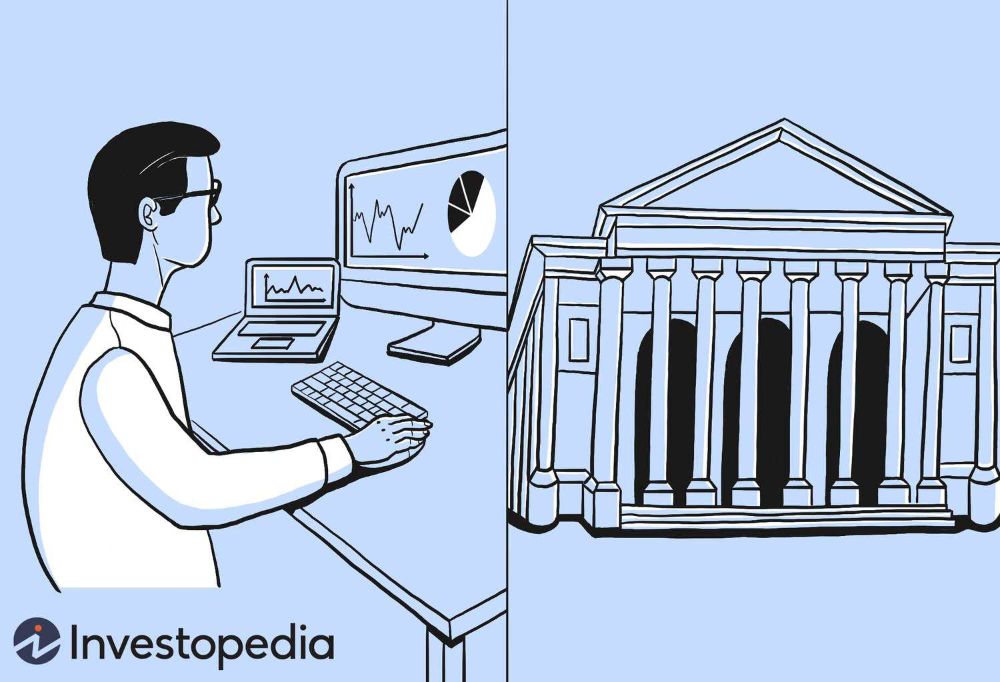

The financial sector is witnessing a significant transformation driven by technological advancements, particularly through algorithmic trading. This form of trading, which relies on complex algorithms to automate and expedite trading decisions, has become a linchpin in modern financial markets. Among the key participants shaping this evolving landscape are the Designated Market Makers (DMMs) on the New York Stock Exchange (NYSE). DMMs, formerly known as specialists, are tasked with maintaining order, efficiency, and stability in the market. They play a crucial role by providing liquidity and ensuring fair trading conditions. 

DMMs are not alone on the NYSE trading floor; brokers also play a vital role. While DMMs focus on managing liquidity and order imbalances, brokers are responsible for executing trades on behalf of clients. The synergy between DMMs and brokers is essential for ensuring a smooth and efficient marketplace. This coordination is particularly important in the context of algorithmic trading, where speed and precision are paramount. 



Algorithmic trading has transformed the roles of market participants. DMMs now use advanced algorithms to enhance their market-making capabilities, enabling them to respond quickly to market fluctuations and maintain stability, especially during periods of high volatility. This integration of technology into traditional market roles highlights the adaptive nature of the NYSE’s market model, which successfully blends human oversight with automated processes. Through this dynamic interaction, the NYSE maintains its status as a leading global financial market, demonstrating the critical importance of DMMs and brokers in enhancing market efficiency and resilience.

## Table of Contents

## Understanding Designated Market Makers

Designated Market Makers (DMMs) are crucial entities within the operating framework of the New York Stock Exchange (NYSE). They play a pivotal role in maintaining the orderly functioning of financial markets, which includes ensuring market liquidity and stabilizing the prices of securities. This helps in mitigating the adverse effects of trading imbalances that could otherwise lead to market disruptions.

At the core of their responsibilities, DMMs act as liquidity providers. They achieve this by taking opposing positions in trades, stepping in whenever there is an imbalance between buying and selling pressures. This behavior is essential for two main reasons: it ensures that investors can execute transactions without significant delays, and it helps stabilize prices, which contributes to the overall market reliability.

Historically, DMMs were known as specialists. The transition from specialists to DMMs marks a significant evolution, primarily driven by technological advancements and changes in market structure. While specialists were primarily focused on manual trading and direct market interaction, the modern DMMs have embraced technological integration, incorporating sophisticated market operations into their daily activities.

This evolution involves the adoption of complex algorithms and automated systems that enable DMMs to perform their market-making functions more efficiently. These tools allow DMMs to process a vast amount of data at high speeds, providing them with the capability to react quickly to market changes, anticipate shifts in supply and demand, and adapt their strategies accordingly.

The transformation from specialists to DMMs reflects the broader changes within the trading world, where technology and automation have taken a more prominent role. This change not only enhances the capabilities of DMMs but also aligns with the NYSE's efforts to ensure its market remains competitive and resilient in the face of evolving financial landscapes. Through their advanced market mechanisms, DMMs play an instrumental role in sustaining the integrity and efficiency of the stock exchange.

## The Role of Algorithmic Trading in the NYSE

Algorithmic trading has revolutionized the operations on the New York Stock Exchange (NYSE), particularly affecting the role of Designated Market Makers (DMMs). Utilizing advanced algorithms, these market participants execute trades with unparalleled speed and precision, significantly enhancing market [liquidity](/wiki/liquidity-risk-premium) and stability. This technological leap enables DMMs to respond more effectively and efficiently to the constant fluctuations characteristic of global financial markets.

DMMs on the NYSE strategically use proprietary algorithms to continuously provide liquidity by automatically quoting buy and sell prices. This practice ensures that securities have buyers and sellers at all times, which is essential for maintaining market fluidity. In periods of high market [volatility](/wiki/volatility-trading-strategies), these algorithms adjust dynamically, allowing DMMs to absorb shocks and prevent drastic price swings. 

Algorithmic trading has transformed the role of DMMs, expanding their traditional functions which included solely matching orders. Today, they not only match but predict order flows using real-time data analytics, thus optimizing their market-making strategies. For example, algorithms can identify patterns and anomalies in trading data and execute trades that either capitalize on expected market movements or mitigate potential risks.

Furthermore, advancements in [machine learning](/wiki/machine-learning) and [artificial intelligence](/wiki/ai-artificial-intelligence) have further empowered DMMs. These technologies enhance the ability of algorithms to learn from historical data, identify complex market patterns, and improve accuracy over time. As a result, this integration has bolstered the market-making capabilities of DMMs, enabling them to operate with increased foresight and agility.

Overall, [algorithmic trading](/wiki/algorithmic-trading) underpins the modern operations of DMMs on the NYSE, playing a pivotal role in the development of an efficient, stable trading environment. Through continuous technological innovation, DMMs are better equipped to handle the challenges of contemporary markets, ultimately contributing to a more fluid and resilient exchange system.

## Comparing DMMs and Brokers

On the New York Stock Exchange (NYSE), both Designated Market Makers (DMMs) and brokers serve crucial yet distinct roles contributing to market efficiency. DMMs are primarily responsible for maintaining liquidity and ensuring that the trading of specific securities occurs smoothly. They engage in buying and selling activities to balance order imbalances, thus stabilizing the market. Their role involves managing bid-ask spreads and staying active in the market to facilitate trades where liquidity might ordinarily be lacking.

In contrast, brokers act as intermediaries executing buy and sell orders on behalf of their clients, who can be individuals or institutions. Brokers do not generally hold inventory of securities for themselves but instead focus on efficiently fulfilling their clients' orders, seeking the best possible trade execution in terms of price and speed. This service often involves routing orders to the exchange and sometimes negotiating terms with other market participants to achieve optimal outcomes for their clients.

The interplay between DMMs and brokers is vital for the seamless operation of the trading floor. DMMs enhance market liquidity, which benefits brokers by providing more options and better prices for executing their clients' trades. In turn, brokers bring a steady flow of orders to the market, allowing DMMs to perform their role of maintaining equilibrium in trading activity more effectively. 

The synergy between these roles helps ensure that price discovery is efficient, market transactions are executed with minimal friction, and the overall functionality of the NYSE is heightened. Such collaboration is particularly evident during periods of volatility, where the expertise of both DMMs and brokers is crucial in preventing market disruptions and maintaining investor confidence.

## DMMs and Market Volatility

Designated Market Makers (DMMs) on the New York Stock Exchange (NYSE) play an instrumental role in curbing market volatility, a significant challenge that manifests during market openings and closings. Their primary function is to ensure that trading is conducted in an orderly manner, even amidst turbulent conditions. By ensuring continuous price quotes and managing order imbalances, DMMs provide liquidity and stability, thereby reducing the risk of erratic market movements.

Market volatility may increase due to several factors, including unexpected news announcements, economic data releases, or geopolitical events. During such periods, the demand and supply dynamics can become skewed, generating substantial buying and selling pressures. DMMs are equipped to counter these pressures by utilizing sophisticated algorithmic strategies. Through these algorithms, DMMs automate the process of buying and selling securities to match opposing orders, thus maintaining market equilibrium.

Algorithmic trading methods used by DMMs involve complex mathematical models to predict price movements and order flow patterns. By employing historical and real-time market data, these algorithms can adapt to changing market conditions with remarkable speed. For example, DMMs may use mean-reversion strategies, which capitalize on the tendency of a security's price to return to its average over time. Another common approach is the implementation of liquidity-providing strategies, where DMMs quote buy and sell orders at prices determined to encourage trading activity and dampen volatility.

Python, with its robust libraries for data analysis and machine learning, is often used to develop these algorithms. The use of libraries like NumPy and Pandas allows DMMs to process vast amounts of data efficiently. An example of a simple Python snippet to calculate moving averages, a common component in many trading algorithms, is as follows:

```python
import pandas as pd

# Assume `price_data` is a pandas DataFrame with columns ['time', 'price']
def calculate_moving_average(price_data, window_size):
    return price_data['price'].rolling(window=window_size).mean()

# Example usage for a 20-period moving average
moving_avg = calculate_moving_average(price_data, 20)
```

DMMs also play a proactive role during high-stress trading periods by implementing volatility control mechanisms. These mechanisms involve strategically pausing trading in a particular security if volatility exceeds a predefined threshold, thus giving the market time to assimilate information and stabilize. This method, akin to circuit breakers, prevents panic selling or buying.

In summary, the strategic actions of DMMs and their adept use of algorithmic strategies highlights their importance in maintaining market stability. Their commitment to continuous quotes and effective management of order imbalances sustains the NYSE's integrity, particularly during periods of heightened volatility.

## The Future of DMMs and Algorithmic Trading

As technology continues to evolve, Designated Market Makers (DMMs) at the New York Stock Exchange (NYSE) are increasingly leaning on sophisticated algorithms to enhance their trading capabilities. The amalgamation of human oversight with automated systems presents a robust model that fosters a dynamic and adaptive trading environment. This blend ensures that while technology drives efficiency and speed, human expertise retains a critical role in decision-making and managing unforeseen market complexities.

The future landscape of DMMs is characterized by an intensified application of advanced algorithmic practices. These algorithms, equipped with machine learning and artificial intelligence, enable DMMs to process vast amounts of data swiftly, identify patterns, and predict market movements with greater accuracy. As such, DMMs are not only able to provide liquidity more efficiently but also ensure more accurate pricing and tighter spreads.

Potential innovations in this area include the development of predictive analytics tools that could allow DMMs to anticipate order flows and adjust their strategies proactively. Moreover, the use of blockchain technology could further streamline transactions, enhance transparency, and secure trading processes.

Furthermore, the NYSE's commitment to integrating technological advancements while maintaining a human touch aims to build resilience against market volatility. This strategic synergy between humans and machines ensures a balanced approach, where algorithms handle the bulk of routine tasks, and human judgment is reserved for complex decision-making scenarios that require a nuanced understanding of the market.

In conclusion, the role of DMMs on the NYSE is poised to continue its transformation, driven by cutting-edge technological advancements. This evolution promises not only to refine the efficiency and stability of market operations but also potentially redefine the fundamentals of [market making](/wiki/market-making) in the years to come.

## Conclusion

Designated Market Makers (DMMs) on the New York Stock Exchange (NYSE) have a pivotal role in ensuring the smooth functioning of the stock market. By acting as intermediaries, DMMs are instrumental in maintaining balance and continuity in trading. Their involvement is crucial in preventing sharp fluctuations by providing consistent bids and offers, thus fostering a stable trading environment.

The integration of algorithmic trading further augments the capabilities of DMMs. Algorithms allow these market makers to respond swiftly to market changes, efficiently adapting their strategies to provide liquidity and minimize disruptions, particularly during periods of market volatility. The ability of DMMs to leverage algorithmic tools ensures that they can effectively manage order imbalances and price fluctuations, thereby enhancing market transparency and investor confidence.

Moreover, the synergy between DMMs and brokers highlights the intricacies of the stock exchange ecosystem. While brokers are responsible for executing trades on behalf of clients, DMMs focus on the orderliness and liquidity of the market. This collaboration ensures that trades are executed at fair prices and that market disruptions are kept to a minimum.

In conclusion, the combination of human expertise and algorithmic precision in the role of DMMs is essential for the NYSE. This blend not only improves liquidity and stabilizes markets but also provides a robust framework within which brokers and DMMs work together, enriching the overall functionality and efficiency of the stock exchange. Understanding this dynamic interplay offers valuable insights into managing and participating in modern financial markets.

## References & Further Reading

[1]: ["Advances in Financial Machine Learning"](https://www.amazon.com/Advances-Financial-Machine-Learning-Marcos/dp/1119482089) by Marcos Lopez de Prado

[2]: ["Quantitative Trading: How to Build Your Own Algorithmic Trading Business"](https://www.amazon.com/Quantitative-Trading-Build-Algorithmic-Business/dp/1119800064) by Ernest P. Chan

[3]: ["Machine Learning for Algorithmic Trading"](https://github.com/stefan-jansen/machine-learning-for-trading) by Stefan Jansen

[4]: Madhavan, A. (2000). ["Market microstructure: A survey."](https://www.sciencedirect.com/science/article/pii/S1386418100000070) Journal of Financial Markets, 3(3), 205-258.

[5]: Fama, E.F. (1970). ["Efficient Capital Markets: A Review of Theory and Empirical Work."](https://www.jstor.org/stable/2325486) The Journal of Finance, 25(2), 383-417.