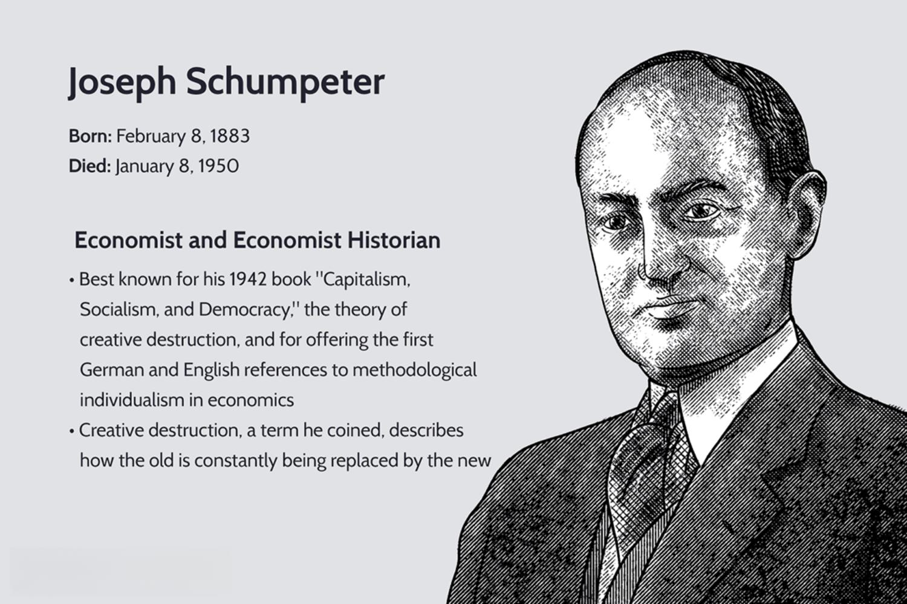

## Table of Contents

## What is the basic concept of destructive creation?

Destructive creation, often called creative destruction, is a concept where old ways of doing things are destroyed to make room for new and better ways. It's like tearing down an old, broken building to build a new, modern one in its place. This idea was first talked about by an economist named Joseph Schumpeter. He said that in a healthy economy, new businesses and inventions come along and replace the old ones, even if it means some jobs and companies disappear.

This process can be tough because it means some people might lose their jobs or their businesses might fail. But it's important because it helps the economy grow and improve. For example, when smartphones came out, they replaced many old cell phones and even some cameras and music players. This change created new jobs in smartphone companies but also meant that some people working in old cell phone factories lost their jobs. In the end, though, the economy benefits from having better technology and more efficient ways of doing things.

## How does destructive creation differ from creative destruction?

Destructive creation and creative destruction are actually the same idea but with different names. The main concept is that old things need to be destroyed to make way for new and better things. This idea was first talked about by an economist named Joseph Schumpeter, who called it creative destruction. Some people use the term destructive creation to describe the same process, but it's not as common.

This process can be hard because it means some jobs and businesses will disappear. But it's important for the economy to grow and get better. For example, when cars were invented, they replaced horse-drawn carriages. This change created new jobs in the car industry but also meant that people who made carriages lost their jobs. In the end, though, the economy benefits from having better technology and more efficient ways of doing things.

## Can you provide historical examples of destructive creation?

One big example of destructive creation happened when the steam engine was invented. Before steam engines, people used horses, wind, and water to move things and do work. When steam engines came along, they changed everything. They made it easier and faster to move heavy stuff like coal and goods. This meant that people who worked with horses or at water mills lost their jobs. But it also meant that new jobs were created in factories and railroads. The steam engine helped start the Industrial Revolution, which changed the world a lot.

Another example is when computers started to be used in offices. Before computers, people used typewriters and did a lot of things by hand. When computers came, they could do the work much faster and with fewer mistakes. This was great for businesses, but it meant that people who typed on typewriters or did other jobs by hand might lose their jobs. But it also created new jobs for people who could work with computers. This change helped make businesses more efficient and helped the economy grow.

## What are the key mechanisms driving destructive creation?

The main thing that drives destructive creation is new technology. When someone invents something new, like a smartphone or a computer, it can do things better than the old ways. This new technology can make old jobs and businesses go away because people don't need them anymore. For example, when cars were invented, they replaced horse-drawn carriages. People stopped needing to work with horses as much, but new jobs were created in car factories.

Another important thing is how businesses compete with each other. Companies are always trying to find new ways to make their products better or cheaper. When a company comes up with a new idea, it can take over the market and push out older companies. This can lead to some businesses failing, but it also encourages other companies to keep coming up with new ideas. This competition helps the economy grow and improve because it pushes everyone to keep getting better.

Lastly, changes in what people want also drive destructive creation. As people's needs and wants change, businesses have to change too. For example, when more people started wanting to shop online, many traditional stores had to close. But this also created new jobs in companies like Amazon. These shifts in what people want help make sure that the economy keeps moving forward and improving.

## How does destructive creation impact economic systems?

Destructive creation, or creative destruction, has a big impact on economic systems. It helps the economy grow and get better by replacing old ways of doing things with new and more efficient ways. When new inventions come along, like computers or smartphones, they can do things faster and better than the old ways. This means that new businesses and jobs are created, which helps the economy grow. But it also means that some old jobs and businesses might go away because people don't need them anymore. This can be tough for the people who lose their jobs, but overall, it makes the economy stronger and more efficient.

The competition between businesses is another way destructive creation impacts the economy. Companies are always trying to come up with new ideas to make their products better or cheaper. When one company comes up with a new idea, it can take over the market and push out older companies. This can lead to some businesses failing, but it also encourages other companies to keep coming up with new ideas. This competition helps the economy grow and improve because it pushes everyone to keep getting better. In the end, even though some businesses might fail, the economy benefits from having better technology and more efficient ways of doing things.

## What are the social consequences of destructive creation?

Destructive creation can have big effects on people and communities. When new inventions come along and change the way things are done, some people lose their jobs. For example, when factories started using machines instead of people, many workers lost their jobs. This can make life hard for those people because they might not be able to find new jobs easily. It can also affect whole towns if a big factory closes down. People might have to move away to find work, which can break up families and communities.

But destructive creation also has good sides for society. When new technology comes, it can make life better for a lot of people. For example, when computers were invented, they made it easier for people to do their work and learn new things. New jobs are created in new industries, like making smartphones or working in tech companies. These new jobs can bring more money into the economy and help people live better lives. So while destructive creation can be tough on some people, it also brings a lot of benefits to society in the long run.

## How can businesses strategically use destructive creation?

Businesses can use destructive creation to their advantage by always looking for new ways to make their products better or cheaper. When a business finds a new way to do things, it can take over the market and push out older companies. For example, a company might invent a new type of phone that is better than the old ones. This can make the old phone companies lose customers and money, but it can also make the new company grow fast. By being the first to use new technology or ideas, a business can become a leader in its industry.

But businesses need to be careful too. They have to keep coming up with new ideas because if they don't, another company might come along and take their place. This means they need to spend money on research and development to keep finding new ways to do things. They also need to be ready to change their business if new technology comes along that makes their old ways of doing things outdated. By staying ahead of the game and being ready to change, businesses can use destructive creation to keep growing and doing well.

## What ethical considerations arise from the practice of destructive creation?

When businesses use destructive creation, they have to think about what is right and wrong. One big problem is that when new technology comes, some people lose their jobs. This can be really hard for those people and their families. It can make them feel sad and worried about how they will pay for things they need. Businesses need to think about how they can help these people, maybe by giving them training for new jobs or helping them find work in other places. It's important to try to make things easier for people who are hurt by these changes.

But there are also good things to think about. New technology can make life better for a lot of people. It can help people do their jobs better and faster, and it can make new jobs in new industries. This can help the economy grow and give people more chances to have a good life. So, businesses need to find a balance. They should try to use new technology to make things better, but they also need to think about how to help people who might be hurt by these changes. It's all about making sure that everyone can benefit from the new ways of doing things.

## How can policymakers manage the effects of destructive creation?

Policymakers can help manage the effects of destructive creation by making rules that protect people who lose their jobs. When new technology comes and old jobs go away, the government can give money to those people or help them learn new skills. This way, people can find new jobs and not feel so worried. Policymakers can also make sure that companies that use new technology do it in a way that doesn't hurt the environment or make life worse for people.

Another thing policymakers can do is encourage new businesses and jobs. They can give money or other help to new companies that use new technology. This can help create new jobs and make the economy grow. By doing this, policymakers can make sure that the good things about destructive creation, like new and better ways of doing things, help more people. It's all about finding a balance so that everyone can benefit from the changes that new technology brings.

## What role does technology play in accelerating destructive creation?

Technology is the main thing that speeds up destructive creation. When new inventions come out, like smartphones or computers, they can do things better and faster than the old ways. This means that old jobs and businesses can go away quickly because people don't need them anymore. For example, when cars were invented, they replaced horse-drawn carriages fast. People stopped needing to work with horses, and new jobs were created in car factories. Technology makes these changes happen faster than ever before.

But technology also helps make new jobs and businesses. When new technology comes, it can create whole new industries. For example, the internet created jobs in tech companies and online businesses. Even though some old jobs might go away, new ones are created that can be even better. So, while technology can make destructive creation happen quickly, it also brings a lot of good things by making life easier and creating new opportunities for people.

## How can destructive creation be measured and analyzed?

Destructive creation can be measured and analyzed by looking at how many old jobs and businesses go away and how many new ones are created. Economists can count the number of jobs lost in old industries, like when factories close down because of new technology. They can also count the number of new jobs created in new industries, like when new tech companies start up. By comparing these numbers, they can see how destructive creation is affecting the economy. They might also look at how fast these changes are happening and how they are affecting different parts of the economy.

Another way to measure and analyze destructive creation is by looking at how much money people are making and spending. When new technology comes, it can make businesses more efficient and help them make more money. This can lead to more money being spent in the economy, which is good for growth. But it can also mean that some people lose their jobs and have less money to spend. Economists can look at these changes to see how destructive creation is affecting people's lives and the overall economy. By studying these things, they can understand the good and bad effects of destructive creation and how to manage them better.

## What future trends might influence the concept of destructive creation?

In the future, the idea of destructive creation might be influenced a lot by new technology like artificial intelligence (AI) and automation. These technologies can do jobs that people used to do, which means some people might lose their jobs. For example, robots in factories can make things faster and without getting tired, but this can mean fewer jobs for factory workers. Also, AI can do things like driving cars or helping doctors, which could change a lot of jobs. These changes might happen faster than ever before because technology is always getting better and quicker.

But there are also good things that can come from these new technologies. They can make new jobs in areas like programming and maintaining the new machines. For example, if more cars are driven by computers, there will be jobs for people who can fix and update those systems. Also, new technology can make life easier and better for a lot of people. So while destructive creation might cause some problems, it can also bring a lot of good things if we manage it the right way. It's all about finding a balance so that everyone can benefit from the changes that new technology brings.

## References & Further Reading

[1]: Schumpeter, J. A. (1942). "Capitalism, Socialism, and Democracy." Harper & Brothers.

[2]: UNEP. "Single-Use Plastics: A Roadmap for Sustainability." United Nations Environment Programme. 2018.

[3]: Gomber, P., Arndt, B., Lutat, M., & Uhle, T. (2011). ["High-Frequency Trading."](https://papers.ssrn.com/sol3/papers.cfm?abstract_id=1858626) Wirtschaftsinformatik, 53(5), 371-375.

[4]: Johnson, B., Menkveld, A. J., & Yao, M. (2013). ["The Flash Crash: The Impact of High-Frequency Trading on an Electronic Market."](https://www.annualreviews.org/content/journals/10.1146/annurev-financial-121415-033010) The Review of Financial Studies, 26(11), 2754-2787.

[5]: Biais, B., Foucault, T., & Moinas, S. (2015). ["Equilibrium Fast Trading."](https://www.sciencedirect.com/science/article/pii/S0304405X15000288) Journal of Financial Economics, 116(2), 292-313. 

[6]: Carney, M. (2019). ["The Future of Financial Stability."](https://www.bankofengland.co.uk/-/media/boe/files/speech/2019/the-growing-challenges-for-monetary-policy-speech-by-mark-carney.pdf) Bank of England.

[7]: Kirilenko, A. A., & Lo, A. W. (2013). ["Moore's Law versus Murphy's Law: Algorithmic Trading and Its Discontents."](https://www.aeaweb.org/articles?id=10.1257/jep.27.2.51) The Journal of Economic Perspectives, 27(2), 51-72.