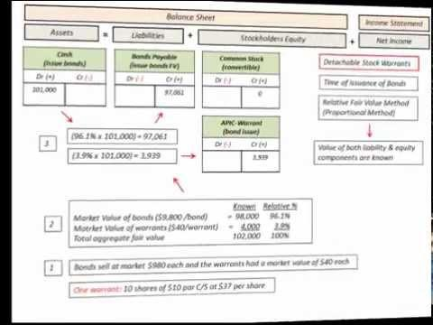

The modern financial market is filled with a myriad of complex instruments and strategies designed to optimize investment returns. Among these concepts, detachable warrants offer unique investment opportunities, while algorithmic trading promises precision and speed. This article explores the mechanisms behind financial instruments like detachable warrants and algorithmic trading, providing a deep dive into their roles and potential in today's investment landscape.

Detachable warrants, a type of derivative, are particularly attractive due to their ability to enhance the leverage of investments while allowing for strategic detachment from their issuing securities. They provide investors with the right, but not the obligation, to purchase stock at a predetermined price, adding layers of flexibility and potential profitability to their portfolios.



Algorithmic trading, often referred to as algo trading, employs complex algorithms to conduct trades at optimal speeds and prices. By analyzing vast amounts of market data using mathematical models, algo trading eliminates emotional decision-making, enabling more efficient trade execution and increased liquidity.

Understanding these components can empower investors to make informed decisions and capitalize on their benefits. Detachable warrants and algorithmic trading each play a pivotal role in modern investment strategies, offering investors the tools needed to navigate market complexities and seek improved financial returns.

We will explore the defining aspects of detachable warrants and examine how algorithmic trading integrates into financial strategies. Additionally, we will discuss how these elements collectively influence market dynamics, providing insights into their impact on investment landscapes.

## Table of Contents

## Understanding Financial Instruments: Detachable Warrants

Detachable warrants are sophisticated financial derivatives offering the holder the right to purchase the underlying assets, typically stocks, at a predetermined price within a specific period. They are most commonly issued alongside bonds or preferred stock, which can attract investors seeking to leverage their positions without initially committing to a full purchase of the underlying security. By attaching potential equity appreciation to fixed-income securities, they provide an appealing hybrid investment opportunity.

One defining feature that differentiates detachable warrants from options is their separability. Detachable warrants can be traded independently of the security they were initially issued with, granting investors greater flexibility and strategic options. This capacity for independent trading makes them particularly valuable in financial markets, as investors can exploit market conditions specific to the warrant or the underlying security.

The intrinsic and extrinsic components drive the pricing of detachable warrants. The intrinsic value is derived from the difference between the current price of the underlying asset and the strike price of the warrant, representing the immediate profit from exercising it. On the other hand, the extrinsic value is influenced by market conditions, including implied [volatility](/wiki/volatility-trading-strategies) and time value—factors akin to those affecting options pricing. The Black-Scholes model, a fundamental tool in financial engineering, can often be employed to estimate the theoretical price of warrants:

$$

C = S_0 N(d_1) - X e^{-rT} N(d_2)
$$

where

$$
d_1 = \frac{ \ln(S_0/X) + (r + \sigma^2/2)T }{\sigma\sqrt{T}}
$$

$$
d_2 = d_1 - \sigma\sqrt{T}
$$

Here, $S_0$ is the current price of the underlying asset, $X$ is the strike price, $r$ is the risk-free [interest rate](/wiki/interest-rate-trading-strategies), $T$ is the time to expiration, and $\sigma$ is the volatility of the underlying asset. $N(d)$ represents the cumulative distribution function of the standard normal distribution.

While the potential for leveraged returns is attractive, investors must also be mindful of the risks associated with detachable warrants. One significant risk is expiry. If the warrant is not exercised within the given timeframe, it becomes worthless. Market volatility can also pose challenges, as fluctuations in the price of the underlying asset can rapidly alter the intrinsic value of the warrant. Moreover, market conditions such as [liquidity](/wiki/liquidity-risk-premium) constraints and interest rate changes may affect detachable warrants' pricing and tradability.

Successful investment in detachable warrants requires carefully evaluating potential returns against inherent risks. Investors often employ complex models and strategies to forecast movements in the underlying assets and to hedge against adverse conditions, maximizing the strategic advantages offered by these versatile instruments.

## Algorithmic Trading: The Investment Mechanism

Algorithmic trading, often referred to as algo trading, employs automated algorithms to execute trades, delivering optimal speed and price execution. By utilizing sophisticated mathematical models, [algorithmic trading](/wiki/algorithmic-trading) systems analyze large quantities of market data to make trading decisions, eschewing the potential biases and emotional influences associated with human traders. This reliance on quantitative data enhances the capability of managing complex trading strategies that exploit market inefficiencies effectively.

The efficiency of algo trading lies in its ability to process data and execute trades at a speed unmatched by human traders. It ensures increased market liquidity by facilitating large volumes of trades seamlessly. This automatic execution reduces the market impact, which is the adverse effect that large orders can have on the price of a security. By spreading trades over time and across different venues, algo trading minimizes the price shifts associated with large trade volumes.

Another significant advantage of algorithmic trading is its ability to backtest strategies using historical market data. Backtesting allows traders to simulate their strategies with past data to evaluate their performance before deploying them in real-time markets. This process involves coding the trading strategy, such as:

```python
import pandas as pd
import numpy as np

# Example: Simple Moving Average Crossover Strategy
# Load historical price data
data = pd.read_csv('historical_prices.csv')

# Calculate moving averages
short_window = 40
long_window = 100

data['short_mavg'] = data['Close'].rolling(window=short_window, min_periods=1).mean()
data['long_mavg'] = data['Close'].rolling(window=long_window, min_periods=1).mean()

# Generate signals
data['signal'] = 0.0
data['signal'][short_window:] = np.where(data['short_mavg'][short_window:] > data['long_mavg'][short_window:], 1.0, 0.0)

# Calculate positions
data['positions'] = data['signal'].diff()
```

This sample Python code demonstrates a simple moving average crossover strategy, where buy and sell signals are generated based on the crossover of short-term and long-term moving averages.

In summary, algorithmic trading's strength lies in its ability to trade efficiently, leverage vast amounts of data, systematically and unemotionally execute complex strategies, and continuously refine these strategies via [backtesting](/wiki/backtesting). Such capabilities make it an integral component of modern financial markets, consistently driving innovation and operational improvements in trading activities across the globe.

## Integration of Detachable Warrants and Algo Trading: Strategic Advantages

Combining detachable warrants with algorithmic trading stands to offer a distinct advantage in financial markets. This integration leverages the benefits of each component to create an optimized trading strategy with unique potential returns. Algorithmic trading systems have the capacity to identify market inefficiencies and exploit them with unparalleled speed and precision, crucial in the trading of detachable warrants, which often exhibit rapid price movements.

Detachable warrants, which can be traded independently from their original securities, inherently possess a high degree of flexibility. This flexibility becomes a strategic asset when partnered with algorithmic trading. Algorithmic systems can be designed to track specific market anomalies or price shifts that may influence the value of a warrant, allowing traders to respond almost instantaneously. For example, automated systems can effectively implement volatility [arbitrage](/wiki/arbitrage), targeting fluctuations in market volatility to secure profits. Similarly, trend-following algorithms can capitalize on directional movements, adjusting warrant positions in response to emerging trends.

Enhanced risk management is a pivotal advantage when incorporating algorithmic trading with warrants. Algorithms provide the ability to continuously monitor market conditions, allowing real-time adjustments to trading strategies, which helps in mitigating risks associated with market volatility or sudden price changes. This capability is further amplified by the integration of [machine learning](/wiki/machine-learning) and [artificial intelligence](/wiki/ai-artificial-intelligence) technologies, which enhance the predictive power of trading algorithms. By employing AI, traders can improve the accuracy of their models, refine their response strategies, and even automate the decision-making process for certain trades, minimizing human error and maximizing speed.

Machine learning advances continue to reshape algorithmic trading, providing ever more refined and automated opportunities. These technologies enable traders to not only react to market changes but also to anticipate future movements based on historical data and predictive analytics. As algorithms become more sophisticated, they can incorporate complex data sets, adapt to evolving market conditions, and continue to deliver efficient trading solutions.

In summary, the strategic integration of detachable warrants with algorithmic trading creates a formidable synergy that enhances trading efficiency and precision, offering a considerable competitive advantage. The real-time execution and risk management capabilities provided by algorithmic systems, combined with the flexibility of detachable warrants, empower investors to navigate the financial markets with increased confidence and potential for success.

## Challenges and Risk Considerations

Implementing algorithmic trading with detachable warrants involves a range of challenges and risk considerations. One of the prominent issues is related to the liquidity of warrants. Compared to stocks, the market for warrants tends to be less liquid. This lack of liquidity can result in wider bid-ask spreads, increasing the cost of trading and posing potential execution risks. Investors may face difficulties in executing large orders without significantly affecting the market price, making the management of trading strategies more complex and potentially less profitable.

Another significant challenge is the reliance on robust technological infrastructure and accurate data. Algorithmic trading systems require a seamless integration of hardware and software resources to function optimally. Should these systems encounter failures, it can lead to substantial financial losses. Therefore, a reliable technological setup is essential, but not immune to potential disruptions such as power outages, network issues, or hardware malfunctions. Ensuring data accuracy is equally critical, as erroneous or delayed data inputs can lead to incorrect trading decisions, compounding financial risks.

Regulatory considerations add another layer of complexity to the integration of algorithmic trading strategies involving detachable warrants. These activities must adhere to strict regulatory frameworks designed to ensure market integrity and protect investors. Compliance involves transparent operations and meticulous record-keeping, affecting how algorithms are designed and executed. Additionally, frequent changes in regulations require continuous updates and adaptations in trading strategies, imposing an operational burden on trading firms and individual investors.

To mitigate these risks, investors must engage in thorough backtesting of their trading algorithms. Backtesting involves applying historical market data to test the performance of trading strategies, allowing for the identification of potential weaknesses and optimization opportunities before live execution. Robust risk management strategies are crucial as well. They include setting pre-defined risk limits, employing stop-loss mechanisms, and conducting stress testing to evaluate how strategies perform under adverse market conditions. These practices help in minimizing potential adverse impacts and in achieving more consistent returns.

In conclusion, while algorithmic trading with detachable warrants offers significant advantages, it also demands careful consideration of various challenges and risks. A comprehensive approach to managing these aspects can enhance the effectiveness of investment strategies and safeguard against potential pitfalls.

## Conclusion

Detachable warrants and algorithmic trading stand as influential tools within modern investment strategies, providing both potential for leveraged gains and the promise of efficient trade execution. These instruments, when understood in depth, allow investors to navigate the complex landscape of today's financial markets with greater precision. The operation and integration of these mechanisms help optimize returns by allowing strategic responses to market conditions and dynamics.

As technological advancements continue, the nature of trading is set to transform, offering investors new challenges and prospects. The growing sophistication of algorithmic models and the evolving market scenarios present opportunities for enhanced strategies and better risk management. By leveraging technology, investors can refine their approaches and execute trades with increased accuracy and speed.

Investors are encouraged to embrace these innovations with a well-informed and strategic mindset. Success in future investment opportunities will rely heavily on the ability to adapt and respond to technological and market changes. Continuous learning and adaptation are essential as investors strive to enhance their expertise in the dynamically evolving financial landscape, ensuring they remain competitive and poised for success.

## References & Further Reading

[1]: ["Options, Futures, and Other Derivatives"](https://www.amazon.com/Options-Futures-Other-Derivatives-10th/dp/013447208X) by John C. Hull

[2]: ["Algorithmic Trading: Winning Strategies and Their Rationale"](https://www.wiley.com/en-us/Algorithmic+Trading%3A+Winning+Strategies+and+Their+Rationale-p-9781118746912) by Ernie Chan

[3]: Black, F., & Scholes, M. (1973). ["The Pricing of Options and Corporate Liabilities."](https://www.cs.princeton.edu/courses/archive/fall09/cos323/papers/black_scholes73.pdf) Journal of Political Economy, 81(3), 637-654.

[4]: Aldridge, I. (2013). ["High-Frequency Trading: A Practical Guide to Algorithmic Strategies and Trading Systems"](https://www.amazon.com/High-Frequency-Trading-Practical-Algorithmic-Strategies/dp/1118343506)

[5]: ["The Handbook of International Financial Terms"](https://www.amazon.com/Handbook-International-Financial-Terms/dp/0198288859) by Peter Moles & Nicholas Terry