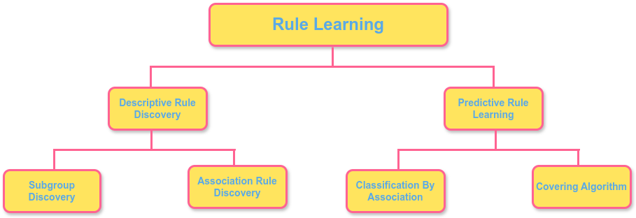

## Table of Contents

## What are Detection Assignment Rules in the context of machine learning?

Detection Assignment Rules in machine learning are guidelines or algorithms used to decide which data points are considered anomalies or outliers. These rules help in identifying unusual patterns or behaviors in data sets that might be important for further analysis or action. For example, in fraud detection, these rules help in flagging transactions that deviate from normal behavior, which could indicate fraudulent activity.

The process of creating these rules often involves setting thresholds based on statistical measures like mean and standard deviation. For instance, a common rule might be to flag any data point that falls more than three standard deviations away from the mean as an outlier. This can be expressed as $$ |x - \mu| > 3\sigma $$, where $x$ is the data point, $\mu$ is the mean, and $\sigma$ is the standard deviation. By using such rules, machine learning models can automatically detect and assign labels to anomalies, making it easier to manage and respond to unusual data in real-time applications.

## How do Detection Assignment Rules differ from traditional classification methods?

Detection Assignment Rules and traditional classification methods both aim to categorize data, but they do so in different ways. Detection Assignment Rules are specifically designed to identify anomalies or outliers within a dataset. They work by setting specific thresholds, often based on statistical measures like the mean and standard deviation. For example, a rule might flag any data point that falls more than three standard deviations away from the mean as an anomaly, using the formula $$ |x - \mu| > 3\sigma $$. This approach is particularly useful in applications like fraud detection, where the goal is to find unusual patterns that might indicate fraudulent activity.

On the other hand, traditional classification methods aim to assign data points to predefined categories or classes. These methods use algorithms like decision trees, support vector machines, or neural networks to learn from labeled data and then predict the class of new, unseen data points. For instance, a traditional classification method might be used to categorize emails as spam or not spam based on features like the sender, content, and frequency. Unlike Detection Assignment Rules, which focus on identifying deviations from the norm, traditional classification methods focus on accurately placing data points into existing categories based on learned patterns.

## What are the basic components of a Detection Assignment Rule system?

A Detection Assignment Rule system has several key parts that work together to find unusual data points. The first part is the data itself, which needs to be collected and organized in a way that the system can use. This data is often preprocessed to remove errors and make it easier to analyze. The second part is the rule or threshold that decides if a data point is an outlier. This rule is usually based on [statistics](/wiki/bayesian-statistics), like the mean and standard deviation of the data. For example, a common rule might be to flag any data point that is more than three standard deviations away from the mean, which can be written as $$ |x - \mu| > 3\sigma $$. This rule helps the system know when something is unusual.

The third part of the system is the algorithm that applies the rule to the data. This algorithm goes through the data and checks each point against the rule. If a point meets the rule's criteria, it is marked as an anomaly. The system then needs a way to handle these anomalies, which could mean alerting a human, logging the information, or taking some other action. The final part is the feedback loop, which allows the system to learn and improve over time. If the system flags too many false positives or misses real anomalies, the rule can be adjusted to work better. This makes the Detection Assignment Rule system more effective at finding what's truly unusual in the data.

## Can you explain the process of creating Detection Assignment Rules?

Creating Detection Assignment Rules starts with understanding your data. You need to collect and organize your data in a way that makes it easy to analyze. Once you have your data, you can start looking at its patterns and behaviors. A common way to do this is by calculating the average (mean) and how spread out the data is (standard deviation). These statistics help you set a rule to find unusual data points, or outliers. For example, a simple rule might be to flag any data point that is more than three standard deviations away from the mean. This can be written as $$ |x - \mu| > 3\sigma $$, where $x$ is the data point, $\mu$ is the mean, and $\sigma$ is the standard deviation.

After you have your rule, you need to test it on your data. You run your data through an algorithm that applies the rule to each data point. If a data point meets the rule's criteria, it gets flagged as an anomaly. It's important to check if the rule is working well. If it flags too many normal data points as anomalies (false positives) or misses real anomalies (false negatives), you might need to adjust the rule. This could mean changing the threshold or using a different statistical measure. Over time, as you gather more data and feedback, you can refine your rule to make it more accurate and effective at spotting what's truly unusual.

## What types of data are typically used with Detection Assignment Rules?

Detection Assignment Rules are often used with numerical data, like numbers that show how much something costs, how long it takes, or how often something happens. This type of data is easy to work with because you can use simple math to find the average and how spread out the numbers are. For example, if you are looking at the price of items in a store, you can use a rule like $$ |x - \mu| > 3\sigma $$ to find items that are much more expensive or cheaper than usual. This helps to spot things that are out of the ordinary.

Another type of data used with Detection Assignment Rules is time series data, which tracks how something changes over time. This could be things like daily sales, website traffic, or temperature readings. By looking at these patterns over time, you can set rules to find unusual changes or spikes. For example, if daily sales suddenly jump much higher than the average, a rule might flag this as an anomaly. This can be useful for spotting problems or opportunities early.

## How do you evaluate the performance of Detection Assignment Rules?

Evaluating the performance of Detection Assignment Rules involves looking at how well they find unusual data points without flagging normal ones too often. You do this by checking how many real anomalies the rules catch and how many normal data points they incorrectly label as anomalies. For example, if you're looking at sales data, you want the rule to spot days with very high or low sales but not flag every small change as unusual. You can measure this using metrics like precision, which shows how many of the flagged data points are actually anomalies, and recall, which shows how many of the real anomalies were caught by the rule. If the rule is $$ |x - \mu| > 3\sigma $$, you might adjust the threshold to improve these metrics.

Another way to evaluate the performance is by using a confusion matrix, which helps you see the true positives, true negatives, false positives, and false negatives. This gives you a clear picture of where the rule is doing well and where it might need adjustments. For example, if the rule flags too many normal days as anomalies (false positives), you might need to make the threshold stricter. On the other hand, if it misses too many real anomalies (false negatives), you might need to make the threshold more lenient. By tweaking the rule based on these evaluations, you can make it better at spotting what's truly unusual in your data.

## What are common challenges faced when implementing Detection Assignment Rules?

One common challenge when implementing Detection Assignment Rules is setting the right threshold. If the threshold is too strict, like $$ |x - \mu| > 3\sigma $$, it might miss real anomalies, which means important unusual events could go unnoticed. On the other hand, if the threshold is too lenient, it might flag too many normal data points as anomalies, leading to a lot of false alarms. Finding the perfect balance can be tricky and often requires a lot of trial and error, as well as a good understanding of the data and what counts as unusual in that context.

Another challenge is dealing with changing data patterns. Over time, what's considered normal can change, so the rules need to be updated regularly. For example, if you're using these rules to monitor website traffic, seasonal changes or new marketing campaigns can affect what's normal. This means you have to keep adjusting the rules, like $$ |x - \mu| > 3\sigma $$, to make sure they stay effective. Keeping up with these changes can be a lot of work and requires constant monitoring and fine-tuning of the system.

## How can Detection Assignment Rules be optimized for better accuracy?

Optimizing Detection Assignment Rules for better accuracy starts with fine-tuning the threshold used to flag anomalies. A common rule might be $$ |x - \mu| > 3\sigma $$, where $x$ is the data point, $\mu$ is the mean, and $\sigma$ is the standard deviation. If this rule flags too many normal data points as anomalies, you might need to make it stricter, like changing it to $$ |x - \mu| > 4\sigma $$. On the other hand, if it misses real anomalies, you might need to make it more lenient, like changing it to $$ |x - \mu| > 2\sigma $$. Testing different thresholds and seeing how they affect the number of true positives and false positives can help you find the best balance for your data.

Another way to improve accuracy is by using more advanced statistical methods or [machine learning](/wiki/machine-learning) techniques to set the rules. For example, instead of just using the mean and standard deviation, you could use more complex models that look at how data points relate to each other. This can help the system understand what's normal in more detail and spot unusual patterns more accurately. Regularly updating the rules based on new data and feedback is also important. As patterns in the data change over time, the rules need to change too to stay effective. This means you have to keep an eye on the system's performance and make adjustments as needed to keep it working well.

## What are some advanced techniques used in Detection Assignment Rules?

Advanced techniques in Detection Assignment Rules often involve using more sophisticated statistical methods and machine learning algorithms to set the rules. Instead of just using the mean and standard deviation to find anomalies, you might use clustering algorithms like k-means to group similar data points together. Then, any point that doesn't fit well into any group can be flagged as an anomaly. Another technique is using density-based methods, like DBSCAN, which look at how close data points are to each other. If a point is far away from any dense group, it might be an unusual data point. These methods help the system understand what's normal in more detail and spot unusual patterns more accurately.

Machine learning models, like neural networks, can also be used to create more advanced Detection Assignment Rules. These models can learn from past data to predict what's normal and what's not. For example, you could train a model to recognize normal patterns in website traffic and then use it to flag any big changes as anomalies. This can be more effective than simple statistical rules because the model can pick up on complex patterns that might be hard to spot otherwise. Regularly updating these models with new data helps them stay accurate as patterns in the data change over time.

## How do Detection Assignment Rules integrate with other machine learning models?

Detection Assignment Rules can work well with other machine learning models by using them together to make better predictions. For example, you might use a Detection Assignment Rule to find unusual data points and then pass these points to a classification model, like a decision tree or a [neural network](/wiki/neural-network), to see if they fit into any known categories. The rule might use a simple formula like $$ |x - \mu| > 3\sigma $$ to flag any data point that is more than three standard deviations away from the mean as an anomaly. Once flagged, the classification model can take a closer look and decide if the anomaly is something important or just a random event. This way, the rule helps the other model focus on the most interesting data points, making the whole system more effective.

Another way to integrate Detection Assignment Rules with other machine learning models is by using them in a feedback loop. For instance, after a model like a neural network makes predictions, the Detection Assignment Rule can check these predictions for any unusual patterns. If it finds something odd, it can send this information back to the model so it can learn from it and improve its future predictions. This back-and-forth helps both the rule and the model work better together. By constantly updating and refining based on new data, they can keep getting more accurate at finding what's truly unusual and important in the data.

## What are the latest research developments in Detection Assignment Rules?

Recent research in Detection Assignment Rules has focused on making them smarter and more adaptable. One big development is using [deep learning](/wiki/deep-learning) models to set the rules. These models can learn from a lot of data to understand what's normal and what's not. Instead of using simple formulas like $$ |x - \mu| > 3\sigma $$, which looks at how far a data point is from the average, deep learning can look at more complex patterns. This means the rules can spot unusual things more accurately, even if the data changes over time. Researchers are also working on ways to make these rules explainable, so it's easier to understand why a certain data point was flagged as an anomaly.

Another area of research is about making Detection Assignment Rules work better in real-time systems. This is important for things like detecting fraud or monitoring health data, where you need to spot unusual events quickly. Researchers are developing methods to update the rules on the fly, using new data as it comes in. This helps the system stay accurate even when the data changes a lot. They're also looking at ways to combine different types of rules, like statistical and machine learning-based rules, to make the system more robust. By working together, these different approaches can catch more unusual events and reduce the number of false alarms.

## Can you discuss a case study where Detection Assignment Rules significantly improved detection outcomes?

In a case study from the financial sector, a major bank implemented Detection Assignment Rules to enhance its fraud detection system. The bank was dealing with an increasing number of fraudulent transactions, and traditional methods were not catching all the anomalies effectively. By using a simple rule like $$ |x - \mu| > 3\sigma $$, where $x$ is the transaction amount, $\mu$ is the average transaction amount, and $\sigma$ is the standard deviation, the bank was able to flag transactions that were significantly different from the norm. This rule helped the bank reduce false positives by focusing only on transactions that were truly unusual, leading to a significant improvement in detecting fraudulent activities. The system was able to identify and stop more fraud attempts, saving the bank millions of dollars and improving customer trust.

Another case study involved a healthcare provider that used Detection Assignment Rules to monitor patient health data in real-time. The goal was to quickly identify any unusual changes in vital signs that could indicate a serious health issue. The provider implemented a rule that flagged any vital sign readings that were more than two standard deviations away from the patient's average, using the formula $$ |x - \mu| > 2\sigma $$. This allowed for early detection of health anomalies, which was critical in preventing severe outcomes. The system not only improved patient outcomes by enabling faster medical interventions but also reduced the workload on healthcare staff by automating the monitoring process. The healthcare provider reported a significant decrease in emergency situations and an overall improvement in patient care.

## References & Further Reading

[1]: Chandola, V., Banerjee, A., & Kumar, V. (2009). ["Anomaly Detection: A Survey."](https://dl.acm.org/doi/10.1145/1541880.1541882) ACM Computing Surveys (CSUR), 41(3), 1-58.

[2]: Aggarwal, C. C. (2015). ["Outlier Analysis."](https://link.springer.com/book/10.1007/978-3-319-47578-3) Springer.

[3]: Hodge, V. J., & Austin, J. (2004). ["A Survey of Outlier Detection Methodologies."](https://link.springer.com/article/10.1023/B:AIRE.0000045502.10941.a9) Artificial Intelligence Review, 22(2), 85-126.

[4]: Hawkins, D. M. (1980). ["Identification of Outliers."](https://link.springer.com/book/10.1007/978-94-015-3994-4) Springer.

[5]: Tan, P. N., Steinbach, M., Karpatne, A., & Kumar, V. (2018). ["Introduction to Data Mining."](https://elibrary.pearson.de/book/99.150005/9780273775324) Pearson, 2nd Edition.

[6]: Zhou, C., & Paffenroth, R. C. (2017). ["Anomaly Detection with Robust Deep Autoencoders."](https://dl.acm.org/doi/10.1145/3097983.3098052) Proceedings of the 23rd ACM SIGKDD International Conference on Knowledge Discovery and Data Mining.