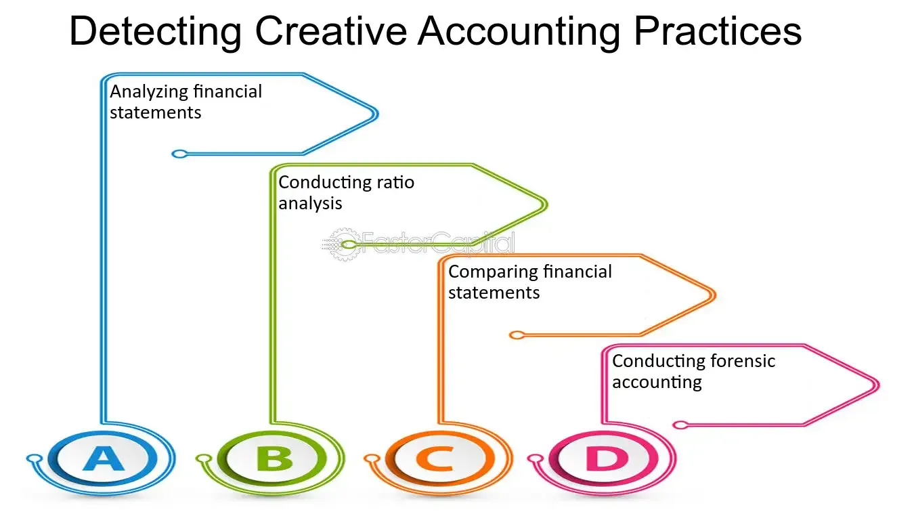

In today's fast-paced financial environment, integrating balance sheet financial analysis, creative accounting, and algorithmic trading is essential for investors and professionals. These components play significant roles in optimizing financial performance and ensuring transparency in increasingly complex markets. Understanding their interplay is crucial for assessing financial health, forecasting potential outcomes, and making informed decisions.

Balance sheet financial analysis provides a snapshot of a company's financial position, revealing critical insights into assets, liabilities, and equity. This analysis is fundamental in deriving key financial metrics such as liquidity, profitability, and solvency ratios, which serve as indicators of a company's financial stability and efficiency. Professionals utilize this information to inform strategic planning and decisiveness.



Creative accounting, while operating within legal frameworks, involves the manipulation of financial records to present a more favorable picture of a company's performance. Although this practice is often compliant with regulations, it can obscure the actual financial health, leading to challenges in discerning the true performance of financial entities.

Algorithmic trading represents the intersection where technology meets financial analysis. It automates trade executions using pre-set rules and large datasets, thus enhancing efficiency and minimizing human error. When balance sheet analysis is integrated into algorithmic trading, it amplifies the predictive power of trading algorithms, enabling better risk management and optimized returns.

The combination of these elements forms a comprehensive approach, equipping investors with the necessary tools to navigate complex markets efficiently. Moreover, awareness of creative accounting practices and the ethical considerations they entail, alongside regulatory oversight, are vital in maintaining market integrity and transparency.

## Table of Contents

## Understanding Balance Sheet Financial Analysis

A balance sheet serves as a fundamental financial statement that offers a detailed view of a company's financial standing at a particular point in time. It encapsulates three primary components: assets, liabilities, and equity. Assets can be categorized into current and non-current assets, which represent resources owned by the company. Liabilities denote the obligations the company must fulfill, while equity represents the residual interest in the assets after deducting liabilities, often referred to as the shareholders' equity.

Evaluating a company's financial health and operational efficiency involves analyzing key financial metrics derived from the balance sheet. Among the most critical metrics are [liquidity](/wiki/liquidity-risk-premium) ratios, such as the Current Ratio and Quick Ratio. These ratios measure the company's ability to cover short-term liabilities with its short-term assets:

- **Current Ratio** = $\frac{\text{Current Assets}}{\text{Current Liabilities}}$

- **Quick Ratio** = $\frac{\text{Current Assets} - \text{Inventories}}{\text{Current Liabilities}}$

Profitability ratios, although not directly derived from the balance sheet, can be influenced by information contained within it, such as return on equity (ROE), which measures the company's efficiency at generating profits from shareholders' equity:

- **Return on Equity (ROE)** = $\frac{\text{Net Income}}{\text{Shareholders' Equity}}$

Solvency ratios, such as the Debt to Equity Ratio, provide insights into the company’s long-term financial stability by comparing a firm's total liabilities to its shareholder equity:

- **Debt to Equity Ratio** = $\frac{\text{Total Liabilities}}{\text{Shareholders' Equity}}$

Balance sheet analysis plays a pivotal role in strategic planning and decision-making. It enables management and investors to forecast financial health, assess risks, and identify areas for improvement or investment. Furthermore, a robust balance sheet can be instrumental in securing funding, negotiating terms with suppliers, and setting strategic objectives in alignment with a company’s financial capabilities.

In conclusion, mastering balance sheet analysis not only aids in evaluating a single company's financial status but also enhances understanding of its position within the broader market context. Such analysis is crucial for those involved in investment decisions, ensuring comprehensive evaluations that encompass both micro and macro-economic considerations.

## Exploring Creative Accounting

Creative accounting is the practice of reshaping financial statements to portray a more advantageous picture of a company's financial position. It often stays within the bounds of legality but can distort the genuine economic performance, making it challenging for investors and analysts to discern the actual health of a business. This manipulation may involve flexible interpretation of accounting standards, selective timing of revenue recognition, or strategic classification of expenses.

One method of creative accounting is through the technique known as "earnings management." Managers may shift earnings between financial periods to achieve desired financial outcomes, exploiting the flexibility allowed by Generally Accepted Accounting Principles (GAAP). For instance, they might defer expenses to future periods or accelerate revenue recognition to meet financial targets and forecasts.

While creative accounting may initially boost perceived financial performance, it can obscure the true financial condition, leading to misallocations of resources and misguided business decisions. Its practice can also undermine stakeholder trust. The collapse of Enron in the early 2000s remains one of the most notorious examples of aggressive creative accounting. Enron used Special Purpose Entities (SPEs) to hide substantial liabilities from the balance sheet, falsely inflating its profitability and stock price. When the truth emerged, it led to one of the largest bankruptcies in U.S. history, resulting in significant financial and reputational damage.

The case of WorldCom further exemplifies the risks associated with creative accounting. WorldCom improperly recorded operating expenses as capital expenses, effectively inflating profits by reducing immediate expenses on the income statement. The fallout from this misreporting was catastrophic, culminating in a $11 billion accounting fraud revelation and the company's eventual bankruptcy.

As financial markets evolve, awareness and understanding of creative accounting practices are paramount. Regulatory frameworks, such as the Sarbanes-Oxley Act, have been developed to curtail such practices, mandating stricter compliance and oversight. Nevertheless, the onus remains on investors and financial professionals to critically analyze financial reports to identify irregularities potentially indicative of creative accounting.

## Algorithmic Trading and Financial Analysis

Algorithmic trading automates trade execution by applying pre-determined rules and processing large datasets, which significantly increases trading efficiency and reduces human error. This type of trading relies heavily on computational algorithms that can analyze market variables and execute trades at speeds and frequencies that are impossible for a human trader.

Integrating balance sheet financial analysis into [algorithmic trading](/wiki/algorithmic-trading) can significantly enhance the predictive power of trading algorithms. By incorporating financial metrics derived from balance sheets, such as liquidity ratios and leverage indicators, algorithms can better predict market movements and improve risk management. For example, liquidity ratios like the Current Ratio or Quick Ratio provide insights into a company's ability to meet short-term obligations, which might influence stock price movement and, consequently, trading decisions.

During periods of market [volatility](/wiki/volatility-trading-strategies), the adaptability of trading algorithms is crucial. Algorithms that include financial analysis can adjust trade executions based on financial health indicators, ensuring effective trading strategies. For instance, a balance sheet analysis might reveal an increased debt level in a company, prompting the algorithm to adjust the trading plan due to the higher financial risk involved.

Incorporating financial analysis into algorithmic trading involves using computer programs to process and interpret financial data. A simple Python script can parse balance sheet data to derive key financial ratios:

```python
def calculate_current_ratio(current_assets, current_liabilities):
    current_ratio = current_assets / current_liabilities
    return current_ratio

def calculate_leverage_ratio(total_debt, total_equity):
    leverage_ratio = total_debt / total_equity
    return leverage_ratio

# Example usage:
current_assets = 1000000
current_liabilities = 500000
total_debt = 300000
total_equity = 200000

print("Current Ratio:", calculate_current_ratio(current_assets, current_liabilities))
print("Leverage Ratio:", calculate_leverage_ratio(total_debt, total_equity))
```

Through such integration, algorithmic trading systems become more robust and capable of generating potentially higher returns by considering a range of financial factors beyond basic price and [volume](/wiki/volume-trading-strategy) data. This approach enables more strategic decision-making rooted in comprehensive financial analysis, thereby fostering better market prediction capabilities and optimized trading outcomes.

## Integration of Financial Analysis in Algorithmic Trading

Integrating financial analysis into algorithmic trading involves incorporating specific financial metrics derived from balance sheets, such as liquidity and leverage ratios, to improve market prediction capabilities. This approach allows algorithms to evaluate company performance more comprehensively, enabling more informed decision-making and ultimately optimizing investment returns.

Balance sheet analysis provides vital metrics such as the current ratio (liquidity) and debt-to-equity ratio (leverage), which are crucial for assessing a company's financial health. The current ratio, calculated as current assets divided by current liabilities, helps determine a company's ability to cover short-term obligations, while the debt-to-equity ratio measures financial leverage, indicating how much of a company's financing comes from debt versus equity.

Using Python, an algorithm can be designed to utilize these ratios effectively. For instance, Python scripts can automate the filtering of investment opportunities by setting thresholds for these financial ratios, thus identifying companies with robust financial health. An example script might be as follows:

```python
import pandas as pd

def filter_stocks(df):
    # Define threshold values
    liquidity_threshold = 1.5
    leverage_threshold = 0.5

    # Filter stocks based on liquidity and leverage ratios
    filtered_stocks = df[(df['current_ratio'] >= liquidity_threshold) & 
                         (df['debt_to_equity_ratio'] <= leverage_threshold)]
    return filtered_stocks

# Sample DataFrame
data = {
    'company': ['Company A', 'Company B', 'Company C'],
    'current_ratio': [1.6, 1.4, 1.8],
    'debt_to_equity_ratio': [0.4, 0.6, 0.3]
}

df = pd.DataFrame(data)
filtered_df = filter_stocks(df)
print(filtered_df)
```

This script filters out companies with a current ratio below 1.5 and a debt-to-equity ratio above 0.5, potentially highlighting firms with better liquidity and lower leverage.

By integrating such financial analysis, algorithmic trading systems become more sophisticated, enhancing their ability to adapt to volatile market conditions. Algorithms that efficiently integrate balance sheet metrics reduce the risk of poor investment decisions and, therefore, capitalize on opportunities for potentially higher returns. This strategic enhancement underscores the value of combining financial analytical rigor with computational trading technologies to sustain a competitive edge in financial markets.

## Conclusion

The synthesis of balance sheet financial analysis, creative accounting awareness, and algorithmic trading constitutes a robust financial strategy, pivotal for thriving in today’s complex market environments. Each component plays an integral role in equipping investors and financial professionals with the necessary tools to make informed decisions and maintain a competitive edge.

Balance sheet financial analysis provides the foundational understanding of a company’s financial standing, offering insights into its liquidity, profitability, and solvency. These insights are essential for strategic decision-making and risk assessment. By comprehensively analyzing financial statements, investors can assess the true health and efficiency of a company, thereby making informed investment choices.

Awareness of creative accounting practices is equally crucial. While creative accounting can paint a more favorable image of a company’s performance within legal bounds, it also has the potential to mask underlying issues. Being vigilant about these practices helps investors and regulators ensure that financial representations remain truthful and transparent. Historical instances of aggressive creative accounting, such as the Enron scandal, highlight the severe repercussions that can arise from obscured financial realities. Therefore, maintaining skepticism and insisting on transparency are vital for preserving market integrity.

Algorithmic trading offers a modern and efficient way to execute trades swiftly and accurately. When combined with balance sheet analyses, algorithmic trading systems can be fine-tuned to predict market movements and optimize returns. This integration allows for the automation of complex financial strategies that consider liquidity and leverage, further enhancing trading efficiency. For instance, Python scripts can be deployed to automate the filtering of investment opportunities based on specific financial metrics, leading to more nuanced and potentially profitable trading strategies.

Moreover, ethical considerations and regulatory oversight are critical components in maintaining the stability and transparency of financial markets. As financial markets evolve with technological advancements, regulators must ensure that market practices remain ethical and that investors are protected from manipulative behaviors. Establishing strict regulatory frameworks helps in deterring fraudulent activities and sustaining investor confidence.

In conclusion, the intersection of these disciplinary fields reinforces a holistic understanding required for effective financial strategy formulation. By harmonizing financial analysis, being cognizant of creative accounting, and leveraging algorithmic trading, investors can navigate the complexities of modern markets more adeptly. However, this must be accompanied by a strong commitment to ethical practices and regulatory adherence to safeguard market integrity and ensure long-term success.

## References & Further Reading

Rosenbaum, P., & Pearl, J. (2010). *Algorithmic Trading and DMA: An Introduction to Direct Access Trading Strategies*. This book offers an in-depth analysis of algorithmic trading, providing insights into how direct market access (DMA) is changing the landscape of trading. It serves as a valuable resource for understanding the technical and operational aspects of executing trades electronically, which is fundamental for those looking to integrate algorithmic trading with financial analysis.

Penman, S. (2012). *Financial Statement Analysis and Security Valuation*. Penman’s work is a comprehensive resource that emphasizes the interpretation of financial statements to evaluate the true value of companies. This book aids investors in performing nuanced balance sheet analyses, contributing to more informed decision-making processes, crucial for assessing financial health in algorithmic trading strategies.

Bodie, Z., Kane, A., & Marcus, A. J. (2020). *Investments*. This textbook covers a broad spectrum of investment strategies, focusing on the principles that guide the selection, risk management, and optimization of investment portfolios. The discussions on asset valuation and market analysis provide essential knowledge for merging traditional financial analysis with algorithmic models, aiming for optimal investment outcomes.

Examples of practical Python implementations in algorithmic trading contexts can be found in various online repositories and forums. Python, being a versatile and powerful language for data analysis, is extensively used for scripting algorithms that process balance sheet metrics and other financial data to make informed trading decisions. Libraries such as `pandas`, `numpy`, and `scikit-learn` are often utilized to construct sophisticated models that interpret and react to financial data autonomously. An example of a simple trading strategy might include:

```python
import pandas as pd
import numpy as np

# Load financial data
data = pd.read_csv('financial_data.csv')

# Calculate financial ratios
data['liquidity_ratio'] = data['Current Assets'] / data['Current Liabilities']
data['leverage_ratio'] = data['Total Liabilities'] / data['Equity']

# Simple strategy: Buy when liquidity is high and leverage is low
def trading_strategy(row):
    if row['liquidity_ratio'] > 2 and row['leverage_ratio'] < 0.5:
        return "Buy"
    return "Hold"

data['signal'] = data.apply(trading_strategy, axis=1)

print(data[['Date', 'liquidity_ratio', 'leverage_ratio', 'signal']])
```

This example demonstrates how balance sheet analysis is embedded into algorithmic trading strategies, filtering investment opportunities based on predefined financial metrics. Such methodologies are integral for sustaining a competitive trading edge in today's complex financial markets.