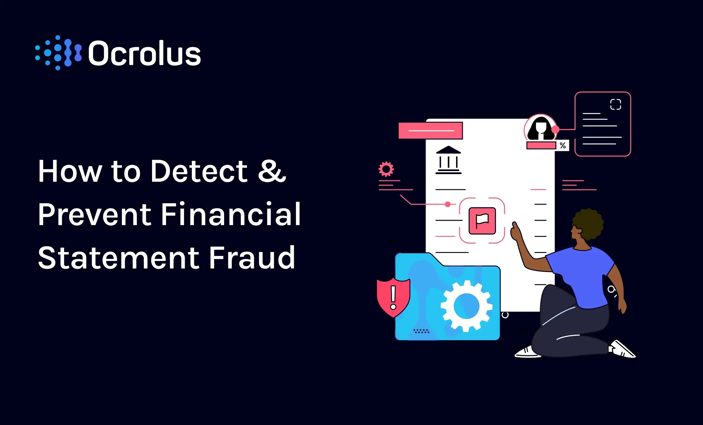

## Table of Contents

## What is financial statement fraud?

Financial statement fraud happens when a company lies about its money situation on purpose. They might change numbers in their financial reports to make the company look better than it really is. This can trick people who want to invest in the company or do business with it. They might think the company is doing well when it's not.

This kind of fraud can be very harmful. It can make people lose a lot of money if they invest in the company. It can also make other companies and the whole economy less trusting. That's why there are rules and people who check financial statements to try to stop this from happening. But sometimes, the fraud is hard to find because the people doing it are very clever.

## Why is detecting financial statement fraud important?

Detecting financial statement fraud is important because it helps keep the economy honest and safe. When companies lie about their financial health, it can trick people into making bad choices, like investing in a company that's not doing well. This can lead to big losses for investors and can hurt the trust people have in the market. If fraud goes unnoticed, it can spread and cause more damage, making it harder for honest companies to do business.

Also, catching financial statement fraud early can prevent bigger problems. If a company is found to be lying about its finances, it can be stopped before it causes a major crisis. This helps protect jobs and the money of people who have invested in the company. By keeping a close watch and being quick to act, we can make sure that the financial world stays fair and that people can trust the information they use to make decisions.

## What are the common types of financial statement fraud?

One common type of financial statement fraud is called revenue recognition fraud. This happens when a company pretends to have more sales than it really does. They might record sales that haven't happened yet or make up sales completely. This makes the company look like it's earning more money than it actually is, which can fool investors and lenders.

Another type is called expense manipulation. This is when a company hides or delays reporting its costs. They might move expenses to a different time period or not report them at all. By doing this, the company can make it seem like it's making more profit than it really is. This type of fraud can also involve hiding debts or other liabilities to make the company's financial situation look better.

A third type is asset overvaluation. This happens when a company says its assets, like buildings or equipment, are worth more than they really are. By overvaluing assets, the company can make its balance sheet look stronger. This can mislead investors into thinking the company is more valuable than it actually is. All these types of fraud can seriously harm the trust in financial markets.

## What are the red flags that might indicate financial statement fraud?

One red flag that might show financial statement fraud is when a company's reported earnings are growing much faster than its cash flow. This can happen if the company is making up sales or not reporting all its costs. Another sign is if a company is always just meeting or beating Wall Street's expectations by a small amount. This can suggest that the numbers are being manipulated to look good to investors.

Another red flag is if there are a lot of complicated transactions or if the company's financial statements are hard to understand. This can be a way to hide fraud. Also, if there are big changes in how the company accounts for things, like suddenly changing how it values its inventory, it might be trying to make its financial situation look better than it is.

Finally, watch out for weak internal controls or a lack of oversight. If the people in charge of checking the company's finances are not doing their job well, or if there is a lot of pressure on them to meet certain targets, it can lead to fraud. Also, if key executives are selling a lot of their stock, it might mean they know something bad about the company's finances that others don't.

## What are the basic techniques used to detect financial statement fraud?

One basic technique to detect financial statement fraud is called ratio analysis. This means looking at numbers in the financial statements and comparing them to see if they make sense. For example, if a company says it made a lot more money but its cash didn't go up by much, that could be a sign of fraud. Another technique is called trend analysis, where you look at the company's financial numbers over time. If something looks too good to be true or if the numbers change in a strange way, it might mean someone is lying about the finances.

Another important technique is called horizontal and vertical analysis. Horizontal analysis looks at how financial numbers change from one year to the next. If there are big jumps or drops that don't match what's happening in the company or the economy, it could be a red flag. Vertical analysis looks at the parts of the financial statements as percentages of a whole. If these percentages change in a way that doesn't make sense, it might show that the numbers have been changed on purpose. Both of these methods help find things that don't look right and could mean fraud.

A third technique is using data analytics and software tools. These tools can look at a lot of data quickly and find patterns or odd things that might be signs of fraud. For example, they can check if the numbers in the financial statements follow normal patterns, like Benford's Law, which says certain numbers should appear more often in real data. If the numbers don't follow these patterns, it might mean they've been made up. Using these tools can help catch fraud faster and more accurately than just looking at the numbers by hand.

## How can data analytics be used to detect financial statement fraud?

Data analytics can help find financial statement fraud by looking at a lot of numbers quickly and finding patterns that might show someone is lying about the money. For example, it can check if the numbers in the financial statements follow normal patterns, like Benford's Law. This law says that in real data, certain numbers should show up more often than others. If the numbers in a company's financial statements don't follow this pattern, it might mean they've been made up. Data analytics can also look for strange changes in numbers over time, like big jumps or drops that don't make sense. If something looks too good to be true, data analytics can help spot it.

Using data analytics tools can also help by comparing a company's numbers to other similar companies. If one company's numbers are very different, it might be a sign that something is wrong. These tools can also find unusual transactions or changes in how a company reports its money. By looking at all this data, data analytics can help find things that don't look right and might mean someone is trying to hide fraud. This makes it easier and faster to catch fraud than just looking at the numbers by hand.

## What role do internal controls play in preventing and detecting financial statement fraud?

Internal controls are really important for stopping and finding financial statement fraud. They are like the rules and checks a company puts in place to make sure its financial reports are honest. For example, having different people check each other's work can stop one person from lying about the numbers. Also, having clear rules about how to report money and who can do what with the company's money helps keep things honest. If these controls are strong, it's harder for someone to change the numbers without getting caught.

Internal controls also help find fraud if it happens. Regular checks and balances, like audits, can spot things that don't look right. If the company has a good system for reporting problems, people can speak up if they see something fishy. This means fraud can be caught early before it causes big problems. By making sure everyone knows the rules and follows them, internal controls keep the company's financial statements honest and trustworthy.

## How can forensic accounting help in detecting financial statement fraud?

Forensic accounting is a special way of looking at a company's money to find out if anyone is lying about it. People who do forensic accounting are like detectives for financial statements. They use their skills to dig deep into the numbers and find clues that might show fraud. They look for things that don't make sense, like if the company says it made a lot of money but its cash didn't go up much. They also check if the company is following the right rules for reporting its money and if there are any strange transactions that could be hiding fraud.

By using special techniques and tools, forensic accountants can spot signs of financial statement fraud that might be hard to see otherwise. They might use data analytics to look at a lot of numbers quickly and find patterns that show someone is lying. They can also interview people in the company to find out more about what's going on. By putting all these pieces together, forensic accountants can help catch fraud early and stop it from causing bigger problems. This makes the financial world safer and more honest for everyone.

## What are the advanced statistical methods used in detecting financial statement fraud?

Advanced statistical methods are powerful tools for finding financial statement fraud. One method is called regression analysis. This helps experts see if there's a strange relationship between different numbers in the financial statements. For example, if a company's reported earnings are growing much faster than its cash flow, regression analysis can help spot this. Another method is called time-series analysis, which looks at how financial numbers change over time. If there are big, unexpected changes that don't match what's happening in the company or the economy, this method can help find them. Both of these methods help experts find things that don't look right and might show that someone is lying about the money.

Another important method is called cluster analysis. This helps group similar data together, so experts can see if a company's numbers are very different from other similar companies. If a company's financial statements are way off from what's normal, it might be a sign of fraud. Also, there's a method called anomaly detection, which uses special algorithms to find unusual transactions or numbers that stand out. This can help catch things that don't fit the usual patterns and might be hiding fraud. By using these advanced statistical methods, experts can dig deep into the numbers and find clues that might be hard to see otherwise.

## How do regulatory bodies and standards contribute to the detection of financial statement fraud?

Regulatory bodies and standards help a lot in finding financial statement fraud. They make rules that companies have to follow when they report their money. For example, in the United States, the Securities and Exchange Commission (SEC) makes sure companies follow these rules. If a company doesn't follow the rules, it might be trying to hide something. The rules also say that companies need to be checked by independent auditors. These auditors look at the company's numbers to make sure they are right. If they find something strange, they can report it, which helps catch fraud early.

Standards like Generally Accepted Accounting Principles (GAAP) and International Financial Reporting Standards (IFRS) also help. They give clear ways for companies to report their money, so it's easier to see if something is wrong. If a company's financial statements don't follow these standards, it's a red flag. Regulatory bodies can also do their own checks and investigations if they think a company might be lying about its money. By making sure everyone follows the same rules and checks, regulatory bodies and standards make it harder for fraud to happen and easier to find it if it does.

## What are the challenges faced in detecting financial statement fraud?

Detecting financial statement fraud can be really hard because the people doing it are often very clever. They might use complicated ways to hide what they're doing, like making up fake sales or hiding costs. It's also hard because companies can have a lot of transactions, and it's tough to look at all of them to find the ones that don't look right. Sometimes, the people who are supposed to check the company's money might not do a good job, either because they don't have enough time or because they're not trained well enough. This makes it even harder to spot fraud.

Another big challenge is that the rules and ways of checking for fraud are always changing. What worked to find fraud last year might not work this year because the people doing the fraud have found new ways to trick the system. Also, it can be hard to tell the difference between honest mistakes and real fraud. Sometimes, things that look like fraud might just be because someone made a mistake. All these things make detecting financial statement fraud a tough job, but it's important to keep trying to make the financial world safer and more honest.

## How can machine learning and AI enhance the detection of financial statement fraud?

Machine learning and AI can make finding financial statement fraud easier and faster. They can look at a lot of data quickly and find patterns that might show someone is lying about the money. For example, they can use something called anomaly detection to spot unusual transactions or numbers that don't fit the usual patterns. This can help find things that might be hard to see otherwise. Machine learning can also learn from past fraud cases to get better at spotting new ones. By using these smart tools, experts can catch fraud earlier and stop it from causing big problems.

Another way machine learning and AI help is by making it easier to check a lot of financial statements at once. They can compare a company's numbers to other similar companies to see if anything looks off. This can help find fraud that might be hidden in the numbers. Also, these tools can keep learning and getting better over time, so they can keep up with new ways people might try to trick the system. By using machine learning and AI, the process of finding financial statement fraud becomes more accurate and efficient, making the financial world safer for everyone.

## References & Further Reading

[1]: Association of Certified Fraud Examiners (ACFE). ["Report to the Nations: 2022 Global Study on Occupational Fraud and Abuse."](https://legacy.acfe.com/rtm2022/documents/ACFE-2022-Report-to-Members.pdf)

[2]: Enron scandal reference in "Anatomy of Greed: The Unshredded Truth from an Enron Insider" by Brian Cruver.

[3]: Sarbanes-Oxley Act information in "The Sarbanes-Oxley Act: Understanding Financial Statements and its Impact on Corporate Governance" by Sanjay Anand.

[4]: COSO. (2013). ["Internal Control - Integrated Framework."](https://www.coso.org/internal-control) Committee of Sponsoring Organizations of the Treadway Commission.

[5]: Marcos López de Prado, ["Advances in Financial Machine Learning"](https://www.amazon.com/Advances-Financial-Machine-Learning-Marcos/dp/1119482089), Wiley.

[6]: Barton, T. L., Shenkir, W. G., & Walker, P. L. (2002). ["Making Enterprise Risk Management Pay Off."](https://books.google.com/books/about/Making_Enterprise_Risk_Management_Pay_Of.html?id=ZdpPil_wyJgC) Financial Times Prentice Hall.

[7]: Google AI Blog. ["Machine Learning, Fairness, and Financial Markets."](https://developers.google.com/machine-learning/guides/intro-responsible-ai/fairness)

[8]: J.P. Morgan Research. ["Machine Learning and Artificial Intelligence in Investment: The Future of Financial Technology."](https://www.jpmorgan.com/technology/artificial-intelligence)