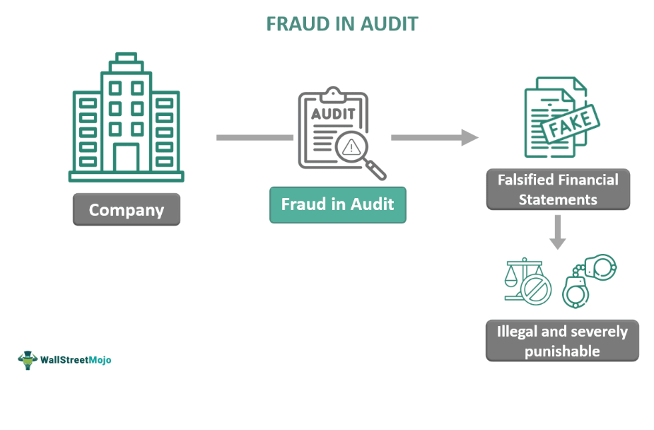

The increasing complexity of financial markets, coupled with rapid advancements in technology, has created fertile ground for financial statement fraud. In an age where transactions occur at lightning speed and datasets grow exponentially, the risk of deceptive financial activities has multiplied. Financial statement fraud involves the intentional misstatement of financial reports, aimed at misleading stakeholders about a company's health, often leading to severe repercussions for investors, employees, and the broader economy.

This article examines the convergence of financial fraud detection and algorithmic trading, emphasizing technology's vital part in this domain. The potential for misuse is marked, as technological tools that can drive forward efficiency and decision-making can also serve as conduits for fraudulent practices. However, these same tools offer unprecedented capabilities in fraud detection and prevention. Advancements such as artificial intelligence (AI) and machine learning have emerged as essential allies in the fight against financial deceit. These technologies enable the scrutiny of vast and complex datasets, allowing for the identification of anomalies that might signify fraudulent activities.



Detecting and preventing financial statement fraud in the current digital era involves a synthesis of traditional auditing methods and modern technological innovations. Traditional methods, while foundational, often cannot match the speed and scale required to address today's fraud tactics. Thus, integrating technology into these frameworks is necessary to provide a more robust defense against financial misrepresentation.

The repercussions of financial statement fraud extend beyond immediate financial losses. Such deceit can undermine the integrity and trust that underpin the financial system. Past incidents have shown that unchecked fraud can lead to systemic crises, emphasizing the need for resilient fraud detection mechanisms. Effective monitoring and early detection are pivotal in safeguarding market stability and investor trust.

Algorithmic trading presents both an opportunity and a challenge in this context. While it offers significant efficiencies and market opportunities, algorithmic systems can also be vulnerable to manipulative interventions. Therefore, ensuring that these systems operate transparently and securely is critical. The intersection of algorithmic trading and fraud detection highlights the necessity for robust controls and the integration of advanced detection technologies to monitor and respond to potentially fraudulent activities.

This introduction sets the stage for a deeper exploration of financial statement fraud detection and the dual-edged nature of algorithmic trading. It will outline the importance of maintaining vigilance and the strategic use of technology to protect the financial ecosystem from the threats posed by fraudulent activities.

## Table of Contents

## Understanding Financial Statement Fraud

Financial statement fraud involves intentionally altering or misrepresenting a company's financial data to deceive stakeholders, including investors, creditors, and regulatory bodies. This type of fraud aims to present a more favorable financial position than reality, manipulating financial outcomes for various benefits such as inflated stock prices, acquisition opportunities, or favorable loan terms.

Common tactics associated with financial statement fraud include inflating revenues and concealing liabilities. Inflating revenues can occur through fictitious sales, premature revenue recognition, or non-existent income, providing a distorted view of a company’s growth and financial health. On the other hand, hiding liabilities often involves off-balance-sheet arrangements or improper categorization of expenses, obscuring the actual level of risk and financial obligations.

The Enron scandal serves as a notable example of financial statement fraud, illustrating the significant consequences of such deceptive practices. Enron's collapse was primarily due to its use of special purpose entities (SPEs) to hide debt and inflate profits, misleading investors and stakeholders regarding its financial stability. The seismic impact of Enron underscored the critical importance of accurate and transparent financial reporting, prompting regulatory reforms such as the Sarbanes-Oxley Act to tighten corporate governance and financial accountability.

According to the Association of Certified Fraud Examiners (ACFE), financial statement fraud comprises a small percentage of overall fraud cases but results in substantial financial losses. Their reports highlight that while such frauds are infrequent, the financial damage is disproportionately large, affecting not only the victims but also the broader financial market by eroding trust and increasing [volatility](/wiki/volatility-trading-strategies).

Detecting financial statement fraud necessitates a robust approach that combines traditional auditing methods with modern technological advancements. Traditional methods, such as auditing standards and financial ratio analysis, focus on identifying discrepancies and ensuring that financial statements adhere to accepted accounting principles. However, these methods can be complemented by technology-driven solutions such as data analytics and [artificial intelligence](/wiki/ai-artificial-intelligence), which can process large datasets to identify patterns or anomalies indicative of fraudulent activity. This dual approach ensures a comprehensive defense against evolving fraud tactics, safeguarding the integrity of financial markets.

## Traditional Methods for Detecting Financial Statement Fraud

Traditional methods for detecting financial statement fraud have long served as foundational techniques in the auditing process, facilitating the identification of discrepancies within financial reports. Among these methods, vertical and horizontal financial statement analysis are prevalent tools. Vertical analysis involves examining financial statements in the context of a single reporting period. It expresses each entry as a percentage of a base figure within the statement, such as sales revenue or total assets. This approach aids in identifying unusual fluctuations in account balances that might suggest potential fraud.

Complementing vertical analysis is horizontal analysis, which looks across multiple periods. This method highlights changes in financial statement items over time. By comparing line items across several reporting periods, it becomes easier to spot trends or irregularities that might indicate fraudulent activity. For example, a sudden and unexplained increase in revenue over consecutive quarters could warrant further investigation.

Ratio analysis is another traditional method employed by auditors to identify inconsistencies. Key financial ratios, such as [liquidity](/wiki/liquidity-risk-premium) ratios, profitability ratios, and leverage ratios, provide insights into a company's financial health and operational performance. Deviations from industry norms or unexpected changes in these ratios can serve as red flags for auditors. For instance, an unusually high current ratio might suggest inventory manipulation, where inventory is overstated.

Regulatory frameworks have bolstered these traditional methods, with laws such as the Sarbanes-Oxley Act imposing stricter audit requirements. The Act mandates enhanced internal controls and requires top management to certify the accuracy of financial statements, thus providing auditors with more robust mechanisms to catch discrepancies. It also mandates regular independent audits, providing an additional layer of scrutiny to the financial reporting process.

Internal controls and corporate governance are pivotal in preventing unchecked fraudulent activities. Effective internal controls ensure that accounting procedures are followed correctly, reducing opportunities for fraud. Good corporate governance, characterized by transparent business practices and ethical leadership, further mitigates the risk of fraudulent behavior.

However, the dynamic nature of fraudulent schemes presents ongoing challenges to traditional detection methods. Fraudsters continually evolve their tactics to circumvent established controls, making it essential for auditors and regulatory bodies to stay vigilant. Continuous training and updates to auditing standards are necessary to maintain the effectiveness of traditional detection methods in exposing financial statement fraud.

## The Role of Technology in Fraud Detection

Advancements in artificial intelligence (AI) and [machine learning](/wiki/machine-learning) are revolutionizing fraud detection in financial statement analysis. These technologies enable the examination of large and complex datasets, which traditional methods may struggle to analyze effectively. AI algorithms have the capability to sift through enormous quantities of financial data, identifying anomalies that might indicate fraudulent activities. This capacity to detect deviations from normative data patterns is invaluable in scrutinizing subtle inconsistencies that humans might overlook.

Natural language processing (NLP) plays a significant role in analyzing unstructured data, such as financial disclosures, press releases, or social media mentions. By parsing language data, NLP can identify unusual patterns or sentiment changes that warrant further investigation. This supplementary layer of analysis enriches the traditional structured data analysis by providing context and qualitative insight into potential fraudulent activities.

Data mining techniques are also instrumental in uncovering concealed patterns within financial datasets. By using clustering, classification, and association rule mining, these techniques can reveal previously unnoticed trends or relationships that suggest fraudulent activity. These insights can then be used to refine fraud detection models, ensuring they adapt to evolving fraud methodologies.

However, the application of AI in fraud detection requires careful calibration to ensure effectiveness and reduce false positives. Machine learning models must be trained on comprehensive datasets that include examples of both fraudulent and non-fraudulent cases to accurately discern patterns of interest. This process often involves feature selection, where relevant inputs are chosen to enhance model accuracy and reduce computational complexity.

In practice, developing efficient AI models for fraud detection requires knowledge of programming and data science. Below is a simple example of using Python to implement an anomaly detection model using the Isolation Forest algorithm from the scikit-learn library:

```python
from sklearn.ensemble import IsolationForest
import numpy as np

# Example dataset with features that could be indicative of fraud
X = np.array([[100, 50], [98, 52], [95, 47], [102, 48], [200, 150]])  # [Normal data, Fraudulent data]

# Initialize the Isolation Forest instance
clf = IsolationForest(contamination=0.1, random_state=0)
clf.fit(X)

# Predict anomalies (fraudulent activity)
predictions = clf.predict(X)
# Output: [-1 indicates anomaly, 1 indicates normal]
print(predictions)
```

In this code example, the Isolation Forest algorithm is used to separate normal transactions from outliers, which are potential indicators of fraud. The model learns from the data provided, identifying transactions that deviate significantly from the norm.

In conclusion, while technology offers powerful tools for detecting fraud, its implementation must be judicious. AI models must be continuously updated to reflect new fraud tactics and balanced against human oversight to ensure their decisions align with business contexts and ethical standards.

## Algorithmic Trading and Financial Fraud

Algorithmic trading systems, characterized by their speed and precision, are increasingly integral to modern financial markets. These systems, which automate trading decisions and executions, can be both instrumental in achieving efficient market outcomes and vulnerable to exploitation for financial fraud. 

At the core of [algorithmic trading](/wiki/algorithmic-trading) are sophisticated algorithms designed to make rapid trading decisions based on predefined criteria. However, this reliance necessitates robust safeguards against manipulative interventions. Manipulators may exploit algorithmic systems through strategies such as spoofing or layering, wherein they place deceptive orders to manipulate market prices. In response, it is crucial to develop algorithms that are resilient to these kinds of market abuses.

Ensuring data integrity is another fundamental requirement in preventing manipulation in algorithmic trading environments. Data feeds supplying real-time price and [volume](/wiki/volume-trading-strategy) information must be secure and reliable, as any compromise can lead to erroneous trading decisions, resulting in significant financial losses. Implementing cryptographic protocols and regular audits of data sources can bolster data integrity.

Advanced monitoring systems play a critical role in detecting unusual trading patterns that could indicate fraudulent activities. These systems employ techniques like anomaly detection and pattern recognition to identify discrepancies that deviate from normal trading behavior. For example, machine learning models can be trained to detect patterns in trade executions that signal spoofing or other illicit activities. Here is an example in Python using a simple anomaly detection model:

```python
from sklearn.ensemble import IsolationForest
import numpy as np

# Example trading data: [volume, price change]
data = np.array([
    [100, 0.02], [150, 0.015], [200, 0.015], [10000, 0.50], # Large spike potentially indicating an anomaly
    [200, 0.02], [180, 0.02], [220, 0.015]
])

# Train isolation forest
model = IsolationForest(contamination=0.1)
model.fit(data)

# Detect anomalies
anomalies = model.predict(data)
print("Anomalies detected at indices:", np.where(anomalies == -1)[0])
```

This code snippet demonstrates a basic use of the Isolation Forest algorithm, which identifies outliers - potentially indicative of market manipulation - in trading data.

Consequently, integrating robust fraud detection mechanisms within algorithmic trading systems is indispensable. This integration involves embedding real-time surveillance tools and ensuring compliance with regulatory standards designed to mitigate financial fraud risks. By continuously updating these mechanisms to adapt to evolving fraudulent tactics, financial institutions can better safeguard their trading operations.

The dual nature of algorithmic trading as both an innovation enabler and a target for exploitation necessitates a proactive approach. Strengthening the resilience of these systems through comprehensive fraud prevention strategies is crucial in maintaining market integrity and fairness.

## Case Studies of Financial Statement Fraud

Notable examples of financial statement fraud include the Enron and WorldCom scandals, which significantly impacted regulatory frameworks and highlighted the critical role of auditing.

Enron Corporation, once celebrated as a leading innovator in the energy sector, collapsed in 2001 due to the revelation of fraudulent financial practices. Enron's management engaged in complex accounting maneuvers, such as special purpose entities (SPEs), to hide debt and inflate profits. These off-balance-sheet partnerships allowed Enron to misrepresent its financial health, thereby misleading investors and analysts. The fraud was uncovered when Enron's accounting practices began to unravel, notably through the revelations by internal whistleblowers and investigative journalism. The company's bankruptcy led to significant financial losses, with shareholders losing tens of billions of dollars. In response to the scandal, the U.S. government enacted the Sarbanes-Oxley Act of 2002, which introduced stricter regulatory standards for public companies and their auditors, aimed at restoring confidence in financial reporting.

Similarly, the WorldCom scandal surfaced in 2002 when the telecommunications giant disclosed that it had falsely inflated its earnings by $3.8 billion through improper accounting practices. WorldCom's fraudulent activities primarily involved capitalizing expenses as assets, thereby artificially boosting reported profits. This manipulation went undetected until internal auditors uncovered the discrepancies, subsequent to which the CEO, Bernie Ebbers, and other executives faced legal action. WorldCom's bankruptcy was one of the largest in history, with severe repercussions for investors and employees. The aftermath intensified the calls for better corporate governance and more stringent accounting standards, reinforcing the changes instigated by the Sarbanes-Oxley Act.

The analysis of these frauds underlines several critical lessons. The Enron and WorldCom cases highlighted the importance of transparency and accountability in financial reporting. They revealed significant shortcomings in the role of external auditors, who failed to identify and report the fraudulent activities due to conflicts of interest and inadequate scrutiny. These cases also underscored the need for robust internal controls and independent auditing oversight to prevent similar occurrences.

Moreover, these frauds prompted a reevaluation of the ethical responsibilities of corporate executives and auditors, leading to enhanced measures for protecting whistleblowers and improving corporate whistleblower policies. The cases served as a catalyst for a global shift towards more comprehensive regulatory frameworks, aiming to increase transparency and uphold the integrity of financial markets.

## Challenges and Future Directions

The landscape of financial statement fraud is constantly evolving, with increasingly sophisticated tactics deployed by fraudsters. This ongoing evolution necessitates a dynamic approach to detection, where traditional methods are continuously updated and enhanced to match the ingenuity of fraudulent strategies. It is imperative that the systems in place are adaptive and flexible, capable of identifying new patterns of deception as they emerge. 

A critical aspect of this modern approach is the balance between technological solutions and human oversight. While artificial intelligence (AI) and automated systems offer significant advantages in processing large volumes of data and detecting anomalies, they are not infallible. False positives can occur, risking unnecessary scrutiny of legitimate transactions, while subtle fraudulent activities might slip through without raising alarms. To mitigate these risks, human auditors must complement automated systems, providing contextual insights and critical thinking that technology alone cannot offer. 

The integration of AI with traditional auditing practices presents a promising avenue for enhancing fraud detection efficacy. By leveraging machine learning algorithms, auditors can analyze data patterns that were previously too complex or voluminous to interpret manually. For instance, unsupervised learning techniques like clustering can identify outliers in financial transactions, which might indicate fraudulent activity. Moreover, AI can continually learn from new data, improving its detection capabilities over time. Here's a simple Python example illustrating the use of anomaly detection with clustering:

```python
from sklearn.cluster import KMeans
import numpy as np

# Example data: feature matrix with three variables
data = np.array([[25, 28000, 4],
                 [34, 54000, 8],
                 [28, 32000, 6],
                 [24, 36000, 9],
                 [30, 40000, 5]])

# KMeans clustering
kmeans = KMeans(n_clusters=2, random_state=0).fit(data)

# Identify anomalies
anomalies = data[kmeans.labels_ != kmeans.predict(data)]
print("Anomalies detected:", anomalies)
```

Regulatory frameworks must evolve alongside these technological advancements to ensure robust fraud prevention. Continuous education and training for financial professionals are essential to keep pace with new detecting techniques and evolving fraud tactics. Updated regulations can provide a standardized approach that incorporates the latest technological tools and methodologies, ensuring consistency and reliability in financial fraud prevention.

Collaborative efforts between financial institutions and regulatory bodies are vital for enhancing fraud detection capabilities. By sharing insights, data, and methodologies, these entities can develop more comprehensive strategies and frameworks to address the multifaceted nature of financial fraud. This collaborative approach fosters an environment of transparency and trust, crucial for maintaining the integrity of financial markets.

In summary, as fraud tactics continue to evolve, the methods employed to detect and prevent such activities must adapt accordingly. This requires a synergistic approach that incorporates advanced technology, human oversight, ongoing education, and close collaboration between all stakeholders involved in the financial ecosystem.

## Conclusion

Financial statement fraud poses a significant threat to the integrity of financial markets by undermining both investor confidence and the functioning of financial systems. The complexity and scale of modern financial markets demand robust fraud detection mechanisms that blend traditional analytical techniques with cutting-edge technological tools. Traditional methods, such as vertical and horizontal analysis, ratio assessment, and stringent audits, have long been the backbone of financial scrutiny. Nonetheless, these approaches must be augmented with advanced technologies like Artificial Intelligence (AI) and machine learning to keep pace with sophisticated fraud tactics.

The integration of AI into fraud detection systems offers the ability to analyze vast datasets with high accuracy, identifying anomalies that may signal fraudulent activities. These systems are capable of handling both structured and unstructured data, providing comprehensive insights that traditional methods might miss. This synergy creates a multi-layered defense against financial statement fraud, enhancing both detection efficiency and accuracy. For instance, using Python, machine learning algorithms can be implemented to predict potential fraud:

```python
from sklearn.ensemble import RandomForestClassifier
from sklearn.model_selection import train_test_split

# Example dataset: 'financial_data'
X = financial_data.drop('fraudulent', axis=1)
y = financial_data['fraudulent']

# Train-test split
X_train, X_test, y_train, y_test = train_test_split(X, y, test_size=0.3, random_state=42)

# Random Forest model
model = RandomForestClassifier(n_estimators=100, random_state=42)
model.fit(X_train, y_train)

# Predicting and assessing accuracy
y_pred = model.predict(X_test)
```

Meanwhile, algorithmic trading, which automates and accelerates transactions, further complicates the fraud detection landscape. While algorithmic strategies can optimize trading efficiency, they must be safeguarded to prevent exploitation. Unauthorized manipulations in algorithmic trading can lead to significant misrepresentations, necessitating stringent oversight and transparent protocols to ensure data integrity.

Fraud detection methodologies must continuously evolve in response to changing fraud tactics. This evolution requires not only technological advancement but also regulatory measures and regular updates to financial auditing practices. Collaboration between financial institutions, technology providers, and regulatory bodies is essential to develop effective and adaptive fraud prevention strategies.

Ultimately, maintaining trust in financial reporting necessitates vigilant and innovative strategies in fraud detection. As technology continues to advance, combining human oversight with automated systems will be crucial. This strategic cooperation will be pivotal in safeguarding the financial markets, ensuring their reliability, and promoting a transparent economic environment for all stakeholders.

## References & Further Reading

[1]: Association of Certified Fraud Examiners (ACFE). ["Report to the Nations: 2022 Global Study on Occupational Fraud and Abuse."](https://legacy.acfe.com/rtm2022/documents/ACFE-2022-Report-to-Members.pdf)

[2]: Enron scandal reference in "Anatomy of Greed: The Unshredded Truth from an Enron Insider" by Brian Cruver.

[3]: Sarbanes-Oxley Act information in "The Sarbanes-Oxley Act: Understanding Financial Statements and its Impact on Corporate Governance" by Sanjay Anand.

[4]: COSO. (2013). ["Internal Control - Integrated Framework."](https://www.coso.org/internal-control) Committee of Sponsoring Organizations of the Treadway Commission.

[5]: Marcos López de Prado, ["Advances in Financial Machine Learning"](https://www.amazon.com/Advances-Financial-Machine-Learning-Marcos/dp/1119482089), Wiley.

[6]: Barton, T. L., Shenkir, W. G., & Walker, P. L. (2002). ["Making Enterprise Risk Management Pay Off."](https://books.google.com/books/about/Making_Enterprise_Risk_Management_Pay_Of.html?id=ZdpPil_wyJgC) Financial Times Prentice Hall.

[7]: Google AI Blog. ["Machine Learning, Fairness, and Financial Markets."](https://developers.google.com/machine-learning/guides/intro-responsible-ai/fairness)

[8]: J.P. Morgan Research. ["Machine Learning and Artificial Intelligence in Investment: The Future of Financial Technology."](https://www.jpmorgan.com/technology/artificial-intelligence)