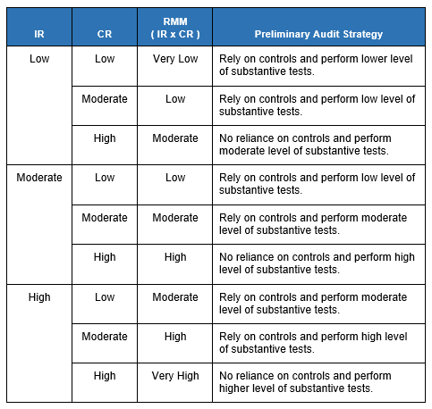

## Table of Contents

## What is detection risk in the context of auditing?

Detection risk in auditing is the chance that an auditor might not catch mistakes or fraud in a company's financial statements. It's one part of the overall audit risk, which also includes the risks of the company's internal controls failing and the financial statements being wrong in the first place. If detection risk is high, it means there's a bigger chance that the auditor will miss something important.

Auditors try to keep detection risk low by doing their work carefully. They use different methods like checking samples of transactions, testing the company's controls, and using their professional judgment. If they think the risk of missing something is too high, they might do more checks or use different techniques to make sure they find any problems. Keeping detection risk low helps make sure the audit is reliable and the financial statements can be trusted.

## How does detection risk relate to other audit risks?

Detection risk is part of the bigger picture of audit risk, which also includes inherent risk and control risk. Inherent risk is the chance that there are mistakes or fraud in the financial statements before anyone tries to fix them. Control risk is the chance that the company's own systems and checks won't catch these problems. Detection risk is the chance that the auditor misses these issues even after the company has tried to find them.

All three risks work together. If inherent risk or control risk is high, the auditor might need to work harder to keep detection risk low. For example, if a company has weak internal controls (high control risk), the auditor will need to do more thorough checks to make sure they don't miss anything (lowering detection risk). The goal is to keep the total audit risk at an acceptable level, so the financial statements can be trusted.

## What are the main components of detection risk?

Detection risk has three main parts: sampling risk, non-sampling risk, and the effectiveness of the audit procedures. Sampling risk is the chance that the auditor's tests on a small part of the data won't catch errors in the whole set of data. Non-sampling risk is when the auditor makes mistakes, like not understanding the rules or missing something important. The effectiveness of the audit procedures is about how well the tests and checks the auditor uses can find problems in the financial statements.

These parts all affect how likely it is that the auditor will miss something wrong in the financial statements. If the sample the auditor checks is too small or not chosen well, sampling risk goes up. If the auditor is not careful or doesn't know the rules well, non-sampling risk increases. And if the audit procedures are not strong enough or not used in the right way, they won't be effective at finding errors. Keeping all these parts in check helps the auditor lower detection risk and do a good job.

## Can you explain the difference between inherent risk, control risk, and detection risk?

Inherent risk is the chance that there are mistakes or fraud in a company's financial statements before anyone tries to fix them. It's about how likely it is for errors to happen in the first place, without anyone trying to stop them. For example, if a company deals with a lot of cash, there might be a higher chance of fraud because cash is easy to steal. Inherent risk is something the company can't really control, but auditors need to think about it when planning their work.

Control risk is the chance that the company's own systems and checks won't catch these problems. Every company has ways to keep an eye on things, like rules and checks, to make sure the numbers in the financial statements are right. But sometimes these systems don't work well, and mistakes or fraud can slip through. Control risk is about how good the company's own checks are at finding and fixing problems. If the company's controls are weak, control risk is high.

Detection risk is the chance that the auditor might not catch mistakes or fraud even after the company has tried to find them. It's the risk that the auditor's tests and checks won't spot the errors. If detection risk is high, it means there's a bigger chance that the auditor will miss something important. Auditors try to keep detection risk low by doing their work carefully and using different methods to check the financial statements. The goal is to make sure the audit is reliable and the financial statements can be trusted.

## How is detection risk assessed during an audit?

During an audit, detection risk is assessed by looking at how well the auditor's tests and checks can find mistakes or fraud in the financial statements. The auditor thinks about how good their methods are at catching errors and how likely it is that they might miss something. They consider things like how many items they check, how they choose what to check, and how carefully they do their work. If the auditor thinks the risk of missing something is too high, they might do more checks or use different ways to make sure they find any problems.

The assessment of detection risk also depends on the other risks, like inherent risk and control risk. If the company has a high chance of mistakes happening in the first place (high inherent risk) or if the company's own checks are not very good (high control risk), the auditor knows they need to work harder to keep detection risk low. They might test more items or use more careful methods to make sure they don't miss anything important. By understanding all these risks together, the auditor can plan their work to keep the overall audit risk at an acceptable level and make sure the financial statements can be trusted.

## What are some common methods used to mitigate detection risk?

Auditors use several methods to lower detection risk. One way is by doing more checks on the financial statements. If they think there's a higher chance of missing something, they might look at more records or test more transactions. They also try to pick a good mix of items to check, so they don't just look at the easy ones. This helps make sure they catch any mistakes or fraud that might be hiding in the numbers.

Another method is using different kinds of tests. Auditors might do detailed checks where they look at every part of a transaction, or they might use computer programs to check lots of data quickly. They also talk to people in the company to understand how things work and where problems might happen. By using different ways to check the financial statements, auditors can find more errors and keep detection risk low.

Finally, auditors need to be careful and use their professional judgment. They should know the rules well and pay close attention to their work. If they make a mistake or don't understand something, they might miss important errors. By being thorough and using good judgment, auditors can make sure their checks are effective and detection risk stays low.

## How does the effectiveness of an audit procedure impact detection risk?

The effectiveness of an audit procedure directly affects detection risk. If the procedures are good at finding mistakes or fraud, then detection risk goes down. This means the auditor is more likely to catch any problems in the financial statements. For example, if an auditor uses a computer program to check a lot of data quickly and accurately, it can help find errors that might be missed if they only looked at a few records by hand.

On the other hand, if the audit procedures are not effective, detection risk goes up. This can happen if the tests are not strong enough or if they are not used in the right way. For instance, if an auditor only checks a small number of transactions or doesn't pick them carefully, they might miss important mistakes. To keep detection risk low, auditors need to make sure their procedures are good at finding problems and use them carefully.

## What role does materiality play in assessing detection risk?

Materiality is about how big a mistake has to be before it matters a lot. In auditing, it helps decide how hard the auditor needs to work to find problems. If something is material, it means it's important enough that it could change what people think about the company's financial health. So, if the auditor thinks there might be big mistakes, they'll want to make sure their tests are good enough to find them. This means they'll try to keep detection risk low for those big, important mistakes.

To assess detection risk, the auditor thinks about materiality. If the risk of missing a big mistake is high, they'll do more checks or use better methods to make sure they catch it. Materiality helps the auditor focus on the most important parts of the financial statements. By understanding what's material, the auditor can plan their work to make sure they don't miss the big problems, which helps keep detection risk under control.

## How can auditors use analytical procedures to manage detection risk?

Auditors use analytical procedures to help manage detection risk by looking at numbers and seeing if they make sense. They might compare this year's numbers to last year's, or look at what they expected to happen compared to what really happened. If something looks weird or different, it might mean there's a mistake or fraud that needs a closer look. By using these checks, auditors can find problems early and decide where to focus their work.

For example, if sales went up a lot but the costs stayed the same, that might not make sense and could mean there's a problem. The auditor can then do more detailed checks in that area to find out what's going on. By using analytical procedures, auditors can make their work more effective and lower the chance of missing important mistakes. This helps keep detection risk low and makes the audit more reliable.

## What are the implications of high detection risk on an audit's outcome?

High detection risk means there's a bigger chance that the auditor might miss important mistakes or fraud in the financial statements. If this happens, the audit might not be very reliable. People who use the financial statements, like investors or lenders, could make bad decisions because they think the numbers are right when they're not. This can lead to big problems for the company and the people who rely on the audit.

To deal with high detection risk, auditors need to be extra careful. They might need to do more checks, test more records, or use different methods to make sure they catch any problems. If they don't, the audit report might say the financial statements are okay when they're not, which can harm the company's reputation and cause legal issues. Keeping detection risk low is important to make sure the audit is trustworthy and the financial statements can be used safely.

## How do technological advancements affect the management of detection risk?

Technological advancements help auditors manage detection risk better. With new tools like data analytics and [artificial intelligence](/wiki/ai-artificial-intelligence), auditors can check a lot more information quickly and accurately. These tools can spot unusual patterns or mistakes that might be hard to find by just looking at a few records. For example, software can go through all the sales data to see if anything looks off, which helps auditors focus on the parts that need a closer look. By using technology, auditors can do their job more effectively and lower the chance of missing important errors.

But technology also brings new challenges. While it can help find problems, it can also make things more complicated. Auditors need to understand how to use these new tools well and make sure they're using them the right way. If they don't, they might miss things or trust the technology too much. Also, as companies use more digital systems, there might be new risks like cyber attacks that auditors need to think about. So, while technology can help manage detection risk, auditors still need to be careful and use their judgment to make sure the audit is reliable.

## Can you discuss a case study where detection risk significantly impacted an audit?

In the case of Enron, detection risk played a big role in the failure of the audit. Enron was a big energy company that went bankrupt in 2001 because of fraud and false financial statements. The auditors at Arthur Andersen didn't catch the problems, even though they were there. They missed the chance to find out that Enron was hiding debts and making up profits. This high detection risk meant the auditors didn't do enough checks or use the right methods to find the big mistakes. As a result, people thought Enron was doing well when it was really in trouble, leading to huge losses for investors and a big scandal.

After the Enron case, rules changed to make sure auditors do a better job at managing detection risk. Now, auditors have to be more careful and use better methods to check financial statements. They need to think about where big mistakes could happen and do more tests in those areas. The Enron case showed how important it is to keep detection risk low, so auditors can find problems before they cause big trouble. It also made companies and auditors more aware of the need to be thorough and use technology to help with the audit process.

## References & Further Reading

[1]: Dixon, M. J., Halperin, I., & Bilokon, P. (2020). ["Machine Learning in Finance: From Theory to Practice."](https://books.google.com/books/about/Machine_Learning_in_Finance.html?id=0pruDwAAQBAJ) Springer.

[2]: Gleim, N., & O’Leary, D. E. (2006). ["Continuous Auditing: Using Automated Tools to Expand Audit Coverage."](https://scholar.google.com/citations?user=DVk7EKAAAAAJ&hl=en) International Journal of Accounting Information Systems.

[3]: P. H. Reisenbichler. (2022). ["Algorithmic Trading and the Dynamics of Markets."](http://www.reutterer.com/papers/reisenbichler&reutterer&schweidel&dan_2022.pdf) Routledge.

[4]: Spiliopoulos, A. (2017). ["Risk Management and Simulation in Algorithmic Trading."](https://www.ncbi.nlm.nih.gov/pmc/articles/PMC8978471/) Springer.

[5]: Trotman, K. T., Tan, H. T., & Ang, N. (2011). ["Fifty-Year Overview of Judgment and Decision-Making Research in Auditing"](https://www.semanticscholar.org/paper/Fifty-Year-Overview-of-Judgment-and-Decision-Making-Trotman-Tan/da6092cc133b66e300431cb5c926cbce51eea882) Accounting, Organizations and Society.

[6]: Moeller, R. R. (2016). ["Brink's Modern Internal Auditing: A Common Body of Knowledge."](https://onlinelibrary.wiley.com/doi/book/10.1002/9781119180012) Wiley.