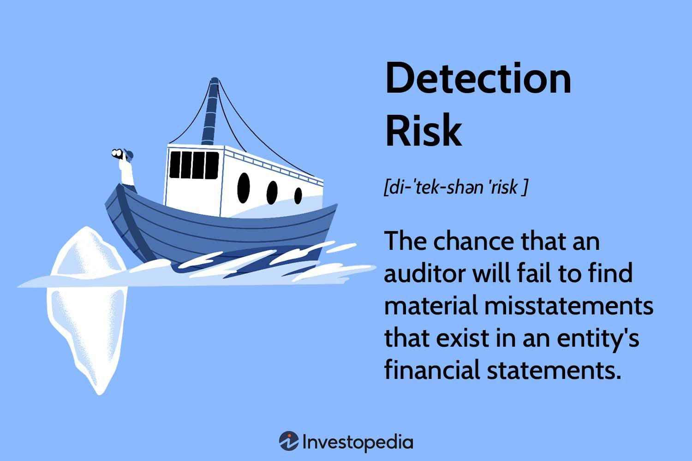

In the fast-paced world of financial markets, risk analysis is a critical component for making informed investment decisions. Investors and traders must grasp several interconnected concepts: detection risk, audit risk, and algorithmic trading. Each plays a vital role in shaping financial strategy and ensuring market stability.

Detection risk, within the context of auditing, pertains to the possibility that auditors might fail to identify significant inaccuracies or misstatements within financial statements, whether due to fraudulent activities or simple errors. Accurately identifying this risk is essential to maintaining the integrity of financial reporting.

Audit risk further encompasses detection risk, alongside inherent risk and control risk. Inherent risk is associated with the nature of the business and its operational framework, whereas control risk examines the efficiency of a company's internal controls. Balancing these risks is fundamental to ensuring the reliability of financial statements and preserving stakeholder confidence.

Algorithmic trading, on the other hand, utilizes complex algorithms to execute trades at high speeds, offering improved efficiency and reducing human error. Although advantageous, this trading method presents its own set of risks, including system failures and algorithmic errors, which must be meticulously managed to prevent adverse outcomes.

For financial professionals, timely and accurate risk assessment, underpinned by data-driven approaches, is of utmost importance. By thoroughly understanding and mitigating these diverse risks, firms are better equipped to safeguard their assets and enhance profitability. As financial markets continue to evolve, robust risk management strategies will be integral to both maintaining stability and achieving competitive advantages.

## Table of Contents

## Understanding Detection Risk

Detection risk is a fundamental concept in auditing, encapsulating the likelihood that an auditor will fail to recognize material misstatements within financial statements. This risk is an intrinsic part of the audit process, stemming from the inevitable limitations auditors face despite employing rigorous procedures designed to unearth errors, whether they arise from fraudulent activities or inadvertent mistakes.

Auditors employ a variety of procedures to uncover such misstatements, such as tests of details, substantive analytical procedures, and compliance tests. Nonetheless, no matter how comprehensive these procedures might be, the complexity and variability of financial transactions mean that detection risk can never be completely eliminated. This perpetual risk underscores the importance of understanding and managing it to ensure the integrity of financial reporting.

Several factors contribute to detection risk. Firstly, the incorrect application of audit procedures can lead to oversight. For instance, failing to adhere strictly to prescribed methodologies or using inappropriate audit techniques can result in material misstatements slipping through the audit process unnoticed. Secondly, the selection of testing methods is crucial; using insufficient or unrepresentative samples can skew results and thus increase detection risk. Lastly, the misinterpretation of audit results, possibly due to inadequate experience or biases, can further augment this risk.

To mitigate detection risk effectively, auditors can adopt several strategies. Increasing sample sizes is one approach, providing a more reliable foundation for extrapolating results and identifying potential anomalies. Refining audit procedures is another critical strategy, which involves continuously updating methodologies to align with the evolving financial landscape and regulatory requirements. Additionally, implementing robust interpretation frameworks can aid auditors in making accurate judgments based on the data obtained during audits, reducing the likelihood of misinterpretations that could lead to oversight.

By focusing on these strategies, auditors can optimize their procedures to reduce detection risk, thereby enhancing the reliability of financial statements and maintaining stakeholder trust.

## Exploring Audit Risk

Audit risk is a critical concept in the auditing process, encompassing three main components: detection risk, inherent risk, and control risk. Collectively, these components impact the reliability of an entity's financial statements and determine the degree to which auditors can place reliance on them. Proper management of audit risk is essential for maintaining the credibility of financial disclosures and ensuring stakeholder confidence.

Detection risk is the risk that an auditor's procedures will not detect a material misstatement that exists within the financial statements. This risk is influenced by the extent and effectiveness of audit procedures. While auditors can reduce detection risk through increased substantive testing and more rigorous audit methodologies, it can never be entirely eliminated due to inherent limitations in auditing techniques.

Inherent risk refers to the susceptibility of an assertion within a financial statement to a material misstatement, assuming no related controls are in place. This type of risk is driven by external factors related to the nature of a business, the complexity of its operations, and its industry environment. For instance, entities operating in sectors with rapid technological change or high levels of regulatory scrutiny may have higher inherent risks.

Control risk arises from the potential that a company's internal controls will fail to prevent or detect material misstatements. It is contingent upon the design and effectiveness of the entity's internal control systems. Weak internal controls heighten control risk, requiring auditors to perform additional substantive procedures to compensate for the increased level of risk.

Managing audit risk requires auditors to assess and balance these components effectively. This balancing act involves determining the acceptable level of overall audit risk and planning audit procedures accordingly to ensure detection risk is managed. A model often used in this context is the Audit Risk Model:

1. Audit Risk (AR) = Inherent Risk (IR) × Control Risk (CR) × Detection Risk (DR)

Auditors aim to manage detection risk such that when multiplied by inherent and control risks, the overall audit risk remains at an acceptable level. Practical steps include enhancing audit procedures, such as increasing sample sizes or employing advanced analytical techniques, and refining risk assessment processes to target high-risk areas more effectively.

Ultimately, the primary goal of audit risk management is to produce a set of financial statements that faithfully represent the financial position of an entity, thereby sustaining the trust of investors, regulators, and other stakeholders. Effective audit risk management supports the integrity of financial reporting and enhances the functioning of capital markets.

## Algorithmic Trading and Risk Management

Algorithmic trading involves the use of complex algorithms to [carry](/wiki/carry-trading) out trades automatically at high speeds, providing significant advantages in terms of efficiency and reduction of human error. These algorithms capitalize on patterns found within financial markets, executing trades based on predefined criteria. The increased speed and precision of execution reduce the likelihood of human mistakes and allow traders to capitalize on market opportunities rapidly.

Despite these benefits, [algorithmic trading](/wiki/algorithmic-trading) introduces several unique risks. System failures can occur due to software glitches or hardware issues, leading to the potential for substantial financial losses. Market [volatility](/wiki/volatility-trading-strategies) poses another significant risk; rapid price fluctuations can lead to unexpected trading outcomes. Algorithmic errors, which may stem from flaws in the algorithmic logic or incorrect assumptions, can compound these risks, resulting in significant financial repercussions. Additionally, cybersecurity threats pose a critical risk, as unauthorized access or attacks on the trading system can compromise sensitive data and disrupt trading operations.

Effective risk management is crucial for mitigating these risks associated with algorithmic trading. Backtesting is a core component, involving the simulation of trading algorithms on historical data to assess their performance and identify potential weaknesses. This process helps ensure that the algorithms operate as intended under various market conditions before they are deployed in live trading environments.

Real-time monitoring is also essential, enabling traders to observe the performance of their algorithms during market hours. Through continuous monitoring, traders can promptly detect anomalies or deviations from expected behavior, allowing for immediate corrective action. Setting risk limits is another critical strategy, where parameters are defined to cap the amount of risk undertaken in any given trade or series of trades, thus controlling exposure to potential losses.

Robust cybersecurity measures are imperative to protect trading systems from external threats. Ensuring that trading systems are secure involves implementing strong authentication protocols, regular security audits, and establishing a secure infrastructure to safeguard against cyber intrusions. 

By employing comprehensive risk management strategies, algorithmic traders can enhance the stability of their operations and safeguard their investments against unforeseen events. These strategies not only minimize potential losses but also position traders to effectively capitalize on market opportunities as they arise, maintaining a competitive edge in the financial markets.

## Risk Analysis in Algorithmic Trading

Risk analysis in algorithmic trading is a critical component for safeguarding trading strategies against potential adverse outcomes. It involves a comprehensive assessment of various risk factors, including market risk, operational risk, model risk, and [liquidity](/wiki/liquidity-risk-premium) risk. Each of these risks necessitates tailored management approaches to ensure effective mitigation and enhance trading performance.

Market risk arises from fluctuations in financial markets that can adversely affect trading positions. To manage this type of risk, traders employ strategies such as diversification, hedging, and position sizing. Advanced predictive models and real-time data analysis can further aid in anticipating market movements and adjusting trading strategies accordingly.

Operational risk encompasses failures in internal processes, systems, or controls that can lead to trading losses. Reducing operational risk involves ensuring robust infrastructure, regular system maintenance, and comprehensive compliance controls. Additionally, implementing automated monitoring systems can detect and rectify operational anomalies swiftly.

Model risk is associated with inaccuracies in the mathematical models used to predict market behavior. This risk can be mitigated by rigorously [backtesting](/wiki/backtesting) models and validating their performance under various market conditions. Employing sensitivity analysis to understand the model's response to changing inputs can also provide insights into potential vulnerabilities.

Liquidity risk refers to the potential difficulty in executing trades without significantly impacting the market price. Effective liquidity management involves selecting highly liquid assets and understanding market depth to avoid substantial price slippage. Advanced algorithms can be designed to optimize order execution and minimize the impact on market prices.

One of the primary challenges in risk analysis lies in its reliance on historical data, which often fails to account for unprecedented market conditions. This necessitates constant system updates and strategy revisions to remain adaptive to evolving market landscapes. Incorporating [machine learning](/wiki/machine-learning) algorithms can enhance the capability of trading systems by automatically adapting to new data and identifying emerging patterns.

Continuous stress testing of trading strategies is vital to ensure resilience against extreme market scenarios. By simulating hypothetical situations, traders can evaluate the robustness of their strategies and identify potential weaknesses.

In conclusion, effective risk analysis in algorithmic trading requires a multifaceted approach that integrates advanced analytical tools and continuous strategy refinement. By proactively managing market, operational, model, and liquidity risks, traders can protect their investments and sustain profitability in the competitive trading environment.

## Conclusion

Risk management plays an essential role in the success of both auditing and algorithmic trading. In the context of auditing, the emphasis on reducing detection risk and audit risk is crucial for producing reliable financial statements. Auditors must employ meticulous strategies to identify material misstatements, ensuring stakeholder confidence in reported figures. An effective approach involves enhancing audit procedures and strengthening interpretative frameworks to decrease the possibility of oversight.

In algorithmic trading, the ability to continuously adapt and leverage technological advancements is vital for maintaining a competitive advantage and effectively managing associated risks. Algorithmic trading relies heavily on data analysis and rapid execution, which introduces unique risks such as market volatility, operational failures, and potential cybersecurity threats. However, by employing robust risk management strategies—such as backtesting algorithms, setting risk limits, and implementing cybersecurity measures—traders can mitigate these risks and safeguard their investments.

Understanding and addressing these risks is integral to enhancing the reliability and profitability of financial operations. As the financial landscape evolves, risk management practices must adapt accordingly. Future developments will likely focus on integrating more sophisticated analytical tools and AI-driven solutions. These technologies have the potential to enhance predictive risk assessment, allowing organizations to proactively manage emerging threats.

Overall, a comprehensive and dynamic risk management strategy is essential for financial professionals aiming to navigate the complexities of modern auditing and trading environments. By investing in advanced risk management approaches, firms can not only protect their assets but also capitalize on opportunities to improve profitability.

## References & Further Reading

[1]: Dixon, M. J., Halperin, I., & Bilokon, P. (2020). ["Machine Learning in Finance: From Theory to Practice."](https://books.google.com/books/about/Machine_Learning_in_Finance.html?id=0pruDwAAQBAJ) Springer.

[2]: Gleim, N., & O’Leary, D. E. (2006). ["Continuous Auditing: Using Automated Tools to Expand Audit Coverage."](https://scholar.google.com/citations?user=DVk7EKAAAAAJ&hl=en) International Journal of Accounting Information Systems.

[3]: P. H. Reisenbichler. (2022). ["Algorithmic Trading and the Dynamics of Markets."](http://www.reutterer.com/papers/reisenbichler&reutterer&schweidel&dan_2022.pdf) Routledge.

[4]: Spiliopoulos, A. (2017). ["Risk Management and Simulation in Algorithmic Trading."](https://www.ncbi.nlm.nih.gov/pmc/articles/PMC8978471/) Springer.

[5]: Trotman, K. T., Tan, H. T., & Ang, N. (2011). ["Fifty-Year Overview of Judgment and Decision-Making Research in Auditing"](https://www.semanticscholar.org/paper/Fifty-Year-Overview-of-Judgment-and-Decision-Making-Trotman-Tan/da6092cc133b66e300431cb5c926cbce51eea882) Accounting, Organizations and Society.

[6]: Moeller, R. R. (2016). ["Brink's Modern Internal Auditing: A Common Body of Knowledge."](https://onlinelibrary.wiley.com/doi/book/10.1002/9781119180012) Wiley.