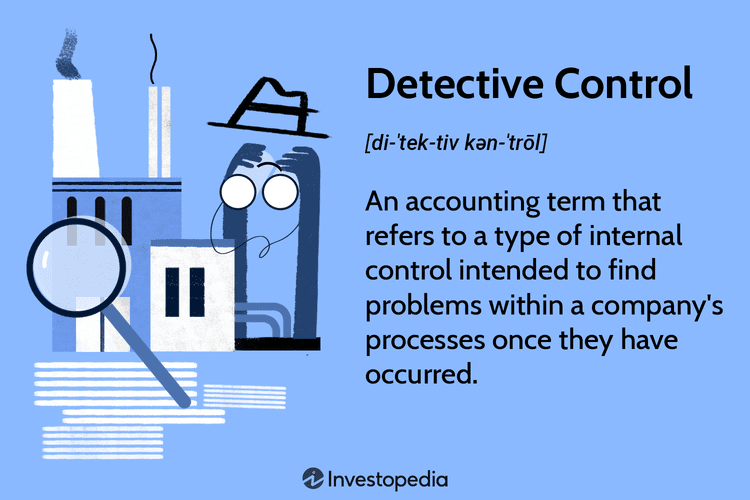

The financial landscape is undergoing a significant evolution driven by the rapid advancement of technology, particularly within trading systems. This transformation is characterized by the widespread adoption of algorithmic trading, which employs complex algorithms and high-speed data processing to execute trades with precision and efficiency. As these automated systems become more integral to market operations, the importance of robust control systems cannot be overstated.

Control systems play a crucial role in ensuring the stability, security, and efficiency of trading mechanisms. By providing a structured framework of checks and balances, they help manage and safeguard financial processes against errors and potential fraud. In algorithmic trading, the need for such systems is heightened due to the potential for rapid and large-scale transactions, which can lead to significant market impacts if not properly controlled.



Algorithmic trading has undeniably revolutionized financial markets, providing increased liquidity and the ability to respond swiftly to market changes. However, it also introduces specific risks, such as market volatility, technical failures, and manipulation. These risks necessitate the implementation of robust control measures that can safeguard against such vulnerabilities. Key among these are detective and preventive controls, which work together to identify and mitigate potential issues.

This article examines the concepts of detective and preventive controls within the context of algorithmic trading. Understanding these control mechanisms is essential for traders and financial institutions aiming to mitigate risks and ensure compliance with regulatory standards. By effectively managing these risks, institutions can maintain investor trust and uphold market integrity in an increasingly digitized trading environment.

## Table of Contents

## Understanding Control Systems in Trading

Control systems are a foundational framework established to manage and protect financial processes within trading environments. These systems comprise a series of checks and balances intended to prevent and detect potential errors or fraudulent activities. They are critical for ensuring the integrity and trustworthiness of financial operations.

The primary role of control systems in trading is to safeguard these processes against inaccuracies and irregularities. By implementing various control mechanisms, trading systems can achieve enhanced accuracy and transparency. These mechanisms include both manual checks and automated processes that monitor trading activities, verify compliance with regulatory requirements, and ensure that trades are executed according to pre-defined criteria.

Algorithmic trading, characterized by high-speed transactions and complex decision-making processes, relies heavily on control systems to maintain seamless operations and manage risks effectively. These systems are programmed to follow specific algorithms that can execute trades autonomously without human intervention. Therefore, robust control mechanisms are essential to monitor these automated processes and ensure they function as intended.

Advanced control systems also play a crucial role in maintaining market integrity. By integrating sophisticated technologies such as [machine learning](/wiki/machine-learning) and [artificial intelligence](/wiki/ai-artificial-intelligence), these systems can enhance the detection and prevention of unusual trading patterns that might indicate manipulative behavior or other forms of market abuse. Such technologies enable the continuous monitoring and analysis of vast amounts of trading data, identifying discrepancies that could signal underlying issues requiring attention.

The integration of these advanced control systems is thus essential for financial institutions and trading platforms aiming to uphold high standards of market integrity and operational reliability. Given the rapid technological advancements in trading environments, control systems must evolve to address emerging challenges and threats, ensuring that trading remains fair, efficient, and transparent for all participants.

## Detective Control in Algorithmic Trading

Detective controls in [algorithmic trading](/wiki/algorithmic-trading) are mechanisms that focus on identifying and resolving issues after they have occurred. These controls are essential for maintaining transparency, accuracy, and stability within trading systems. They play a pivotal role in recognizing erroneous trades and uncovering potential market manipulations. By utilizing detective controls, trading firms can effectively analyze historical data to identify patterns and flag any irregularities.

One fundamental aspect of detective controls is continuous transaction monitoring. This involves the real-time observation of trading activities to spot any anomalies or unusual patterns. For instance, if a particular trading algorithm is suspected of executing trades outside its predefined parameters, monitoring systems would detect this variance promptly. This ability to monitor transactions continuously is crucial in setting a benchmark for identifying deviations and ensuring that any exception is immediately brought to attention.

Reconciliation processes also form a critical part of detective controls. These processes involve cross-verifying transaction records against external reports or data to ensure consistency and accuracy. By doing so, businesses can detect discrepancies such as unmatched trades or missing entries, which may indicate errors or fraudulent activities. Reconciliation ensures that transaction data aligns across all systems, which is vital for both compliance and operational integrity.

Detective controls also employ sophisticated anomaly detection software. Such tools leverage advanced analytics and machine learning algorithms to identify patterns that deviate from the norm. For instance, clustering and classification algorithms can be employed to discern typical trading behaviors from potential outliers. By learning these patterns, anomaly detection systems can alert traders and risk managers to possible errors or manipulative behaviors that require further investigation.

Implementing detective controls helps in understanding systematic problems within trading platforms. Tools like anomaly detection and monitoring systems provide data-driven insights that can guide corrective measures. For example, if a trading anomaly consistently triggers alarms, it might point towards a systemic issue that requires resolving, such as flawed logic in an algorithm or a vulnerability in the trading infrastructure.

In conclusion, detective controls are vital for the identification and resolution of post-occurrence issues in algorithmic trading. Through continuous transaction monitoring, reconciliation processes, and anomaly detection software, these controls enable the identification of errors and manipulations. They are not only instrumental in ensuring compliance and maintaining market integrity but also invaluable for enhancing the overall effectiveness and reliability of trading operations.

## Preventive Control in Algorithmic Trading

Preventive controls are proactive measures designed to avert potential issues before they can arise within algorithmic trading systems. These controls serve as safeguards that protect trading platforms from unauthorized access and operational errors, ultimately supporting the integrity and efficiency of trading activities.

Setting trading limits is a fundamental preventive control. By defining maximum allowable positions or volumes for trades, systems can prevent excessive risk-taking. For example, a simple Python script to enforce a trading limit might look like the following:

```python
def execute_trade(order_volume, max_limit):
    if order_volume > max_limit:
        return "Trade rejected: Volume exceeds the limit."
    else:
        # Code to execute the trade
        return "Trade executed successfully."

# Example usage
order_volume = 150
max_limit = 100
print(execute_trade(order_volume, max_limit))
```

Implementing robust authentication measures is another critical aspect. These measures ensure that only authorized individuals can access trading systems. Techniques such as multi-[factor](/wiki/factor-investing) authentication increase security by requiring users to provide multiple forms of verification before granting access. 

Moreover, the use of secure protocols in the transmission of sensitive data is essential. Protocols such as Secure Sockets Layer (SSL) and Transport Layer Security (TLS) encrypt data between systems, preventing unauthorized interception and tampering during the data transfer process.

In the context of algorithmic trading, maintaining system integrity and preventing fraudulent activities are vital for smooth operations. Preventive controls help achieve this by addressing potential vulnerabilities upfront, thus significantly reducing the need for after-the-fact remediation. By prioritizing these controls, financial institutions can not only enhance security but also ensure a more stable and reliable trading environment.

## Comparing Detective and Preventive Controls

Detective controls and preventive controls are integral components of risk management frameworks in algorithmic trading. Despite serving different functions, they complement each other effectively to safeguard trading systems against various risks. 

Preventive controls are proactive measures designed to stop errors and unauthorized activities before they occur. Their purpose is to fortify trading systems against potential vulnerabilities. These controls often include setting trade limits, robust authentication processes, and secure communication protocols. By enforcing these rules and constraints, preventive controls enhance the overall security and reliability of trading operations. For instance, implementing role-based access controls can prevent unauthorized personnel from executing trades, thereby reducing the likelihood of human-induced errors or fraudulent activities.

Conversely, detective controls identify and address issues after they have occurred. These controls are crucial for diagnosing unusual trading patterns or errors that slipped past preventive measures. For instance, transaction monitoring systems and anomaly detection algorithms play a significant role in this regard. They continuously scan trade activities for discrepancies, flagging potential issues for further investigation. Detective controls provide insights into the trading system's behavior, helping identify systematic problems and inform corrective measures.

Both control types are necessary to establish a comprehensive risk management strategy in algorithmic trading. While preventive controls aim to eliminate errors and threats at the outset, detective controls offer feedback and insights to facilitate ongoing improvement of these systems. When combined, they create a robust framework that reduces trading risks and enhances operational integrity. By continuously refining detective and preventive controls, financial institutions can adapt to technological advancements and maintain the integrity and stability of their trading systems.

## Importance of Controls in Algorithmic Trading

Algorithmic trading, often characterized by its rapid execution and high-speed transactions, necessitates the implementation of precise control systems. These systems are crucial in mitigating various risks associated with trading activities, including market [volatility](/wiki/volatility-trading-strategies), manipulative practices, and technical failures. Effective controls ensure a robust trading environment capable of withstanding the complexities of modern financial markets.

One of the primary roles of control mechanisms in algorithmic trading is to address market volatility. The fast-paced nature of algorithmic transactions can amplify market movements, leading to significant fluctuations in asset prices. By integrating robust control systems, financial institutions can monitor trade executions and market conditions in real-time, allowing for quick adjustments to trading strategies and minimizing the potential impact of sudden market shifts.

Manipulative trading practices pose a significant threat to market integrity and investor confidence. Algorithmic trading systems, if not properly controlled, can be susceptible to manipulations such as spoofing or layering, which involve placing trades with the intention of creating false market signals. By deploying effective control mechanisms, including pattern recognition and anomaly detection, institutions can identify and prevent these manipulative tactics, thus preserving market fairness and transparency.

Technical failures, such as software glitches or system outages, present additional risks in algorithmic trading. The integration of comprehensive control systems helps detect and respond to such issues before they escalate into larger problems, ensuring uninterrupted trading operations. These systems often include fail-safes, redundancy measures, and automated alerts that prompt immediate action to rectify technical disruptions.

Adherence to regulatory standards forms another cornerstone of effective control systems within algorithmic trading. Compliance with these standards is crucial for maintaining the trust of investors and the broader financial ecosystem. Regulations often mandate specific risk management protocols, which control systems can help implement and maintain. By ensuring regulatory compliance, institutions safeguard their operations against legal and financial penalties.

Moreover, the incorporation of control systems enhances the overall efficiency and reliability of trading operations. By streamlining processes and minimizing errors, these systems contribute to optimal performance and reduced operational costs. Financial institutions, therefore, must prioritize the establishment of strong control environments. This prioritization is not merely a regulatory requirement but a strategic imperative for sustaining long-term trading practices.

In summary, control systems are integral to the functioning of algorithmic trading, tasked with mitigating risks, ensuring compliance, and enhancing operational efficiency. Their importance cannot be overstated, as they are vital to the sustainability and integrity of financial markets in the digital age.

## Conclusion

In the fast-paced world of algorithmic trading, control systems are indispensable for ensuring the stability and security of financial markets. Both detective and preventive controls must be effectively implemented to safeguard against trading risks. Detective controls, such as monitoring systems and anomaly detection, help identify and rectify issues post-occurrence, while preventive controls focus on preempting potential problems by setting trading limits and employing robust authentication measures.

A strategic approach to implementing these controls is crucial for maintaining compliance, enhancing security, and building trust among stakeholders. Financial institutions must continuously evaluate and update their control systems to keep pace with rapid technological advancements and evolving market dynamics. This proactive adaptation ensures that trading systems remain resilient against emerging threats, maintaining both market integrity and stability.

As the technological landscape continues to evolve, so must the controls that govern algorithmic trading systems. By combining detective and preventive control measures, institutions can create a comprehensive risk management framework that not only minimizes the likelihood of errors and fraudulent activities but also enhances the overall efficiency and reliability of trading operations. Prioritizing these control systems is essential for supporting sustainable trading practices and maintaining investor confidence in an increasingly digital economy.

## References & Further Reading

[1]: Bergstra, J., Bardenet, R., Bengio, Y., & Kégl, B. (2011). ["Algorithms for Hyper-Parameter Optimization."](https://dl.acm.org/doi/10.5555/2986459.2986743) Advances in Neural Information Processing Systems 24.

[2]: ["Advances in Financial Machine Learning"](https://www.amazon.com/Advances-Financial-Machine-Learning-Marcos/dp/1119482089) by Marcos Lopez de Prado

[3]: ["Evidence-Based Technical Analysis: Applying the Scientific Method and Statistical Inference to Trading Signals"](https://www.amazon.com/Evidence-Based-Technical-Analysis-Scientific-Statistical/dp/0470008741) by David Aronson

[4]: ["Machine Learning for Algorithmic Trading"](https://github.com/PacktPublishing/Machine-Learning-for-Algorithmic-Trading-Second-Edition) by Stefan Jansen

[5]: ["Quantitative Trading: How to Build Your Own Algorithmic Trading Business"](https://www.amazon.com/Quantitative-Trading-Build-Algorithmic-Business/dp/1119800064) by Ernest P. Chan