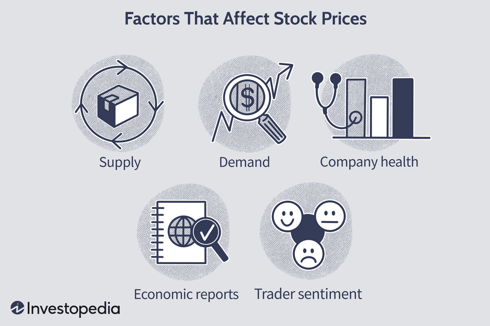

## Table of Contents

## What are bank share prices and why are they important?

Bank share prices are the values at which the stocks of banks are bought and sold in the stock market. These prices change all the time, based on things like how well the bank is doing, what's happening in the economy, and what people think will happen in the future. When a bank does well, its share price usually goes up. If people think the bank might have problems, the share price can go down.

Share prices are important because they show how healthy a bank is and how much people trust it. If the share price is high, it means people think the bank is doing well and they want to invest in it. This can help the bank get more money to grow and do new things. On the other hand, if the share price is low, it might mean people are worried about the bank's future, which can make it harder for the bank to get money and grow. So, watching bank share prices can tell us a lot about the bank and the economy.

## How do macroeconomic factors influence bank share prices?

Macroeconomic factors are big things that affect the whole economy, like interest rates, inflation, and how fast the economy is growing. These factors can really change how people feel about banks and their share prices. For example, if interest rates go up, banks can make more money from loans, which might make their share prices go up because people think the banks will make more profit. But if the economy is slowing down, people might worry that fewer people will take out loans, which could make bank share prices go down.

Inflation is another big factor. If prices are going up a lot, it might make people think that the money they have in the bank is worth less, so they might move their money somewhere else. This can hurt banks because they make money from keeping people's money. Also, if inflation is high, the central bank might raise interest rates to slow it down, which can affect how much money people borrow and how much banks make. So, all these big economic things can push bank share prices up or down depending on what's happening.

## What role do interest rates play in determining bank share prices?

Interest rates are a big deal for banks and their share prices. When interest rates go up, banks can charge more for loans. This means they can make more money, which is good for them. When people see that banks are making more money, they might want to buy more bank shares, which can push the share price up. But if interest rates go down, banks make less money from loans. This can make people worry about the bank's profits, and they might sell their shares, which can make the share price go down.

But it's not just about the money banks make from loans. When interest rates change, it also affects how much people want to borrow. If rates are low, more people might take out loans, which is good for banks because they can lend more money. But if rates are high, fewer people might want to borrow, which can hurt banks because they lend less money. So, interest rates can move bank share prices by changing how much money banks make and how much people want to borrow.

## How does a bank's financial performance affect its share price?

A bank's financial performance is a big reason why its share price goes up or down. When a bank makes a lot of money, people think it's doing well. They might want to buy the bank's shares because they think the bank will keep making money. This demand for shares can push the price up. On the other hand, if a bank is losing money or not making as much as people expected, people might not want to buy its shares. They might even sell the shares they have, which can make the price go down.

Another thing that matters is how the bank's financial performance compares to what people were expecting. If a bank does better than what people thought it would, its share price might go up a lot because people are surprised and happy. But if the bank does worse than expected, the share price might drop a lot because people are disappointed. So, it's not just about making money; it's also about meeting or beating what people thought the bank would do.

## What impact does regulatory environment have on bank share prices?

The rules that banks have to follow, called the regulatory environment, can really affect their share prices. When there are strict rules, banks might have to spend more money to make sure they're following them. This can mean less profit for the bank, which can make people less interested in buying its shares. If people think the rules are going to make it harder for the bank to make money, they might sell their shares, which can make the share price go down.

On the other hand, if the rules are relaxed or if there's less chance of getting in trouble for not following them, banks might be able to make more money. This can make people more interested in buying the bank's shares, which can push the share price up. So, the rules that banks have to follow can change how much money they make and how people feel about investing in them, which can move their share prices up or down.

## How do market sentiment and investor perception affect bank share prices?

Market sentiment and investor perception are big reasons why bank share prices go up or down. If people feel good about the economy and think banks are doing well, they might want to buy more bank shares. This can make the share price go up because a lot of people want to buy them. On the other hand, if people are worried about the economy or think a bank might have problems, they might sell their shares. This can make the share price go down because fewer people want to keep them.

News and rumors can also change how people feel about banks. If there's good news about a bank, like it's making more money than expected, people might think it's a good time to buy its shares. This can push the share price up. But if there's bad news, like the bank is losing money or might get in trouble, people might want to sell their shares fast. This can make the share price drop quickly. So, what people think and feel about a bank can really move its share price a lot.

## What are the effects of bank-specific risk factors on share prices?

Bank-specific risk factors are things that can make people worry about one bank more than others. These can be things like bad loans, where people can't pay back the money they borrowed from the bank. If a bank has a lot of these bad loans, people might think it's not doing well and could lose money. This can make them want to sell their shares in that bank, which can make the share price go down. Another risk factor could be if the bank is caught doing something wrong, like breaking rules or laws. This can make people lose trust in the bank, and they might sell their shares, making the price drop.

Also, if a bank is not managing its money well, like if it's spending too much or not making enough from its investments, this can be a risk factor. People might think the bank's leaders are not good at their jobs, and this can make them less interested in buying the bank's shares. When people are less interested, the share price can go down. So, any problems that are special to one bank can make people worry and change how much they want to buy or sell the bank's shares, which can move the share price up or down.

## How do global economic conditions influence bank share prices?

Global economic conditions are big things that happen all over the world that can change how people feel about banks and their share prices. For example, if the world economy is doing well, people might think that banks will make more money from loans and other things. This can make them want to buy more bank shares, which can push the share price up. But if there's a global economic problem, like a big slowdown or a crisis, people might worry that banks won't make as much money. They might sell their shares, which can make the share price go down.

Another way global conditions can affect bank share prices is through things like trade and currency. If countries are trading a lot with each other, banks can make more money from helping with these trades. This can make people feel good about buying bank shares, which can help the share price go up. But if there are problems with trade, like new rules or tariffs, it can make it harder for banks to make money. This can make people worry and sell their shares, which can make the share price go down. So, what's happening all over the world can really change how people feel about banks and their shares.

## What is the significance of a bank's asset quality in determining its share price?

A bank's asset quality is really important for its share price. Asset quality means how good the things are that the bank owns, like the loans it gives out. If a bank has a lot of good loans, where people are paying back the money they borrowed, it's a sign that the bank is doing well. People might want to buy more shares in the bank because they think it will keep making money. This can make the share price go up.

But if a bank has a lot of bad loans, where people can't pay back the money, it's a problem. Bad loans can make people worry that the bank might lose money. When people are worried, they might sell their shares in the bank, which can make the share price go down. So, the quality of a bank's assets can tell people a lot about how healthy the bank is, and this can really change how much they want to buy or sell the bank's shares.

## How do technological advancements and digital transformation impact bank share prices?

Technological advancements and digital transformation can really change how people feel about banks and their share prices. When a bank uses new technology well, like having a good app for people to use on their phones, it can make the bank more popular. People might think the bank is modern and easy to use, so they might want to buy more shares in that bank. This can make the share price go up because a lot of people want to invest in a bank that's doing well with technology.

On the other hand, if a bank is slow to use new technology, it can be a problem. People might think the bank is old-fashioned and not keeping up with the times. They might worry that the bank will lose customers to other banks that are more modern. This can make them want to sell their shares, which can make the share price go down. So, how a bank deals with technology and digital changes can really affect what people think about it and how much they want to buy or sell its shares.

## What advanced statistical models are used to predict bank share price movements?

To predict bank share price movements, people often use advanced statistical models like time series analysis and machine learning. Time series analysis looks at how share prices have changed over time to find patterns. It uses things like moving averages and autoregressive models to guess what might happen next. For example, if a bank's share price usually goes up in the summer, time series analysis might predict it will go up again next summer. Machine learning models, on the other hand, can learn from a lot of different data, not just past share prices. They can look at things like news articles, economic reports, and even social media to make predictions. These models can get better over time as they learn from new data.

Another model that's often used is the GARCH (Generalized Autoregressive Conditional Heteroskedasticity) model. This model is good at predicting how much a share price might move up or down, which is called volatility. It's important for banks because their share prices can be affected by a lot of different things, and knowing how much they might change can help people make better decisions about buying or selling shares. The GARCH model looks at how volatility has changed in the past to guess what might happen in the future. By using these advanced models, people can try to understand and predict what might happen to bank share prices, even though it's never perfect because the future is always uncertain.

## How do geopolitical events and stability influence bank share prices?

Geopolitical events and stability can really change how people feel about banks and their share prices. When there's a big event like a war or a political crisis in a country, it can make people worried about the economy. If people think the economy might get worse because of these events, they might sell their bank shares. This can make the share price go down because fewer people want to keep them. For example, if there's a war in a country where a bank has a lot of business, people might worry that the bank will lose money and sell their shares.

On the other hand, if things are stable and there are no big problems, people might feel good about the economy. They might think banks will keep making money and want to buy more shares. This can make the share price go up because more people want to invest in the bank. So, what's happening in the world with politics and stability can really affect how people think about banks and their shares, which can move the share price up or down.

## What are the risks impacting bank shares?

Bank shares are subject to various risks that can significantly influence their valuations and stability. Among these, interest rate risk, counterparty risk, and regulatory risk are particularly pertinent.

Interest rate risk is a crucial factor affecting bank stocks. Banks' assets and liabilities are sensitive to interest rate fluctuations because they hold significant amounts of interest-bearing assets such as loans and interest-bearing liabilities like deposits. When interest rates change, the cost of borrowing or the returns on lending also change, influencing a bank's net interest margin (NIM), which is a key performance indicator. For example, an increase in interest rates typically raises the cost of deposits, potentially squeezing the NIM if loan rates do not adjust correspondingly. The management of this risk is therefore vital to maintain balanced profitability.

Next, counterparty risk refers to the risk that a counterparty in a financial transaction might default on its obligations. For banks, this primarily involves borrowers defaulting on loans, which can affect the bank's asset quality and profitability adversely. To manage this risk, banks engage in rigorous credit risk assessment processes to gauge the probability of default and set aside capital reserves as a cushion against potential losses. The equation for expected loss due to counterparty risk can be represented as:

$$
\text{Expected Loss} = \text{Probability of Default} \times \text{Loss Given Default} \times \text{Exposure at Default}
$$

This formula helps in quantifying the risk and in strategizing ways to mitigate it.

Regulatory risk is another critical factor impacting bank shares. Banks operate in heavily regulated environments, and changes in regulation can dramatically alter their business models and financial performance. Historical examples include the deregulation phases in the late 20th century, which resulted in increased competition and risk-taking, and periods of heightened oversight, like after the 2008 financial crisis, which imposed stricter capital and liquidity requirements. These regulatory shifts can influence banks' cost structures and strategic choices, thereby affecting their stock prices.

Overall, understanding the intricacies of these risks is essential for investors, as they play a fundamental role in shaping the financial health and market perception of banks.

## How do earnings relate to future returns?

Earnings potential is a critical aspect when evaluating bank share prices, and the price-to-earnings (P/E) ratio is a fundamental tool in this analysis. The P/E ratio, calculated by dividing a company's current share price by its earnings per share (EPS), provides an indicator of market expectations regarding a bank's future profitability. A higher P/E ratio typically suggests that investors anticipate substantial future earnings growth. This expectation can lead to an increase in the bank's share price, reflecting the positive sentiment towards its future performance. It's mathematically expressed as:  

$$
\text{P/E Ratio} = \frac{\text{Market Value per Share}}{\text{Earnings per Share (EPS)}}
$$

While the P/E ratio is essential, it’s not the sole metric used by value investors who also rely on the price-to-book (P/B) ratio to identify undervalued opportunities. The P/B ratio compares a firm's market capitalization to its book value, providing a view of what the market is willing to pay for each dollar of net assets. A P/B ratio below 1 indicates that the stock is trading for less than the value of the bank's net assets, often attracting investors seeking potential price appreciation. 

The formula for the P/B ratio is:

$$
\text{P/B Ratio} = \frac{\text{Market Price per Share}}{\text{Book Value per Share}}
$$

By employing these financial ratios, investors are better equipped to assess a bank’s earnings potential and identify shares that are either overvalued or undervalued, guiding their investment decisions towards more lucrative opportunities.

## References & Further Reading

[1]: Marcos Lopez de Prado (2018). ["Advances in Financial Machine Learning,"](https://www.amazon.com/Advances-Financial-Machine-Learning-Marcos/dp/1119482089) John Wiley & Sons.

[2]: David Aronson (2006). ["Evidence-Based Technical Analysis: Applying the Scientific Method and Statistical Inference to Trading Signals,"](https://www.amazon.com/Evidence-Based-Technical-Analysis-Scientific-Statistical/dp/0470008741) John Wiley & Sons.

[3]: Stefan Jansen (2020). ["Machine Learning for Algorithmic Trading: Predictive models to extract signals from market and alternative data for systematic trading strategies,"](https://github.com/stefan-jansen/machine-learning-for-trading) Packt Publishing.

[4]: Ernest P. Chan (2008). ["Quantitative Trading: How to Build Your Own Algorithmic Trading Business,"](https://www.amazon.com/Quantitative-Trading-Build-Algorithmic-Business/dp/0470284889) John Wiley & Sons.

[5]: Hull, J.C. (2021). ["Options, Futures, and Other Derivatives,"](https://elibrary.pearson.de/book/99.150005/9781292410623) Pearson.