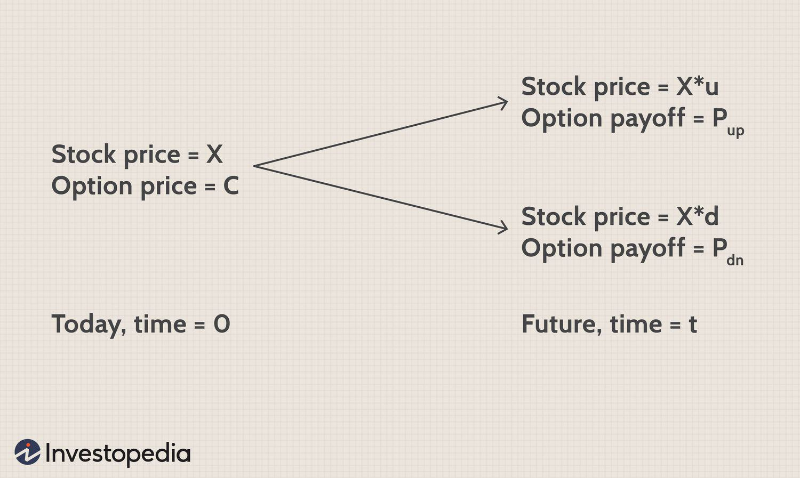

The banking sector plays a crucial role in the financial markets, acting as a central intermediary in the flow of capital and risk management. Understanding the dynamics that affect bank share prices is essential for investors, analysts, and policymakers as these prices reflect the underlying health and prospects of financial institutions and the broader economy. A myriad of financial determinants and stock drivers come into play when valuing bank shares, offering insights into their performance and potential.

This article examines the key factors that influence the valuation of bank stocks, with particular attention to the evolving impact of algorithmic trading. Algorithmic trading has transformed how financial markets operate, affecting liquidity, transparency, and volatility, which in turn impacts bank share prices. Combining this with fundamental analysis, which considers factors like earnings, growth potential, risk, and cost of capital, provides a comprehensive framework for evaluating bank stocks.



Moreover, bank shares are exposed to a distinct set of risks compared to other industries. These include interest rate risk, regulatory changes, and credit risk due to their core banking operations. Such risks require careful analysis and consideration.

By the end of this article, readers will gain a clearer understanding of the various factors, including complex trading dynamics and inherent banking risks, that investors must consider when evaluating bank share prices. Let's embark on this exploration of bank share price dynamics, equipping ourselves with the knowledge to better navigate the intricacies of the banking sector.

## Table of Contents

## Common Valuation Factors Affecting Bank Share Prices

Investors appraise bank stocks using a variety of valuation factors that help determine their market price. Among the most critical of these factors are expected growth, banking risks, earnings potential, and the cost of capital. Understanding these factors can provide investors with valuable insights into whether a bank's stock is overvalued, undervalued, or appropriately priced.

Expected growth is a fundamental aspect of valuing bank shares. It encompasses projected revenue expansion that can enhance shareholder value. Investors often examine a bank’s historical performance, strategic initiatives, and market position to gauge its potential for future growth. Sustainable revenue growth tends to support higher share valuations, while signs of stagnation or decline can depress stock prices.

Banking risks are inherent in the financial sector and significantly influence share valuations. Key risks include [interest rate](/wiki/interest-rate-trading-strategies) risk, which affects a bank’s net interest margin; counterparty risk, which addresses the probability of default by borrowers; and regulatory risk, which involves the potential impact of new or evolving regulations. Effective risk management can lead to a more stable earnings trajectory and positively affect stock valuations.

Earnings potential is typically assessed through financial ratios such as the price-to-earnings (P/E) ratio and the price-to-book (P/B) ratio. These metrics offer investors insights into how much they are paying for a bank’s earnings or net assets. A higher P/E ratio often indicates high expectations for future earnings growth, while a low P/B ratio may suggest undervaluation, offering potential for price appreciation if the bank’s performance improves.

The cost of capital is another critical determinant of bank share prices. This [factor](/wiki/factor-investing) involves the costs associated with raising funds through both equity and deposits. Interest rates heavily influence the cost of capital, as they impact the expense of securing funds from depositors. Furthermore, off-balance sheet activities and relationships with central banks can complicate the analysis of costs and must be factored into stock valuations.

By thoroughly analyzing these valuation factors, investors can gain a clearer picture of a bank's financial health and market positioning. This knowledge aids in making well-informed investment decisions regarding bank stocks.

## Growth Potential in Banks

Growth potential is a crucial determinant of bank share prices, as it reflects the future profitability and expansion capacity of financial institutions. Investors typically focus on evaluating revenue growth and its sustainability over time. This includes a detailed analysis of annual and quarterly income statements, which provide insights into both bottom-line and top-line growth.

Bottom-line growth refers to the increase in net income, whereas top-line growth pertains to revenue expansion. Investors assess these metrics to determine how efficiently a bank converts its revenue into profits and its ability to increase sales over time. For example, a bank with consistent top-line growth but stagnant bottom-line performance may indicate inefficiencies or increased operational costs.

Monetary policy and interest rates significantly impact the growth and profitability of banks. Central banks, such as the Federal Reserve, influence interest rates through monetary policy decisions, affecting banks' lending rates and net interest margins. High-interest rates generally increase the cost of borrowing, potentially slowing economic growth and, in turn, affecting banks' revenue. Conversely, lower rates can stimulate borrowing and economic activity, boosting banks' growth prospects. Analytical models often utilize interest rate risk assessments, considering how changes in the benchmark interest rates influence a bank's asset-liability management.

Post-crisis periods often lead to governmental interventions aimed at stabilizing the banking sector. During such times, banks may receive capital injections, [liquidity](/wiki/liquidity-risk-premium) support, or regulatory adjustments to ensure financial stability, which can positively influence their growth trajectories. For instance, the 2007-2009 financial crisis saw significant government and central bank interventions globally, altering the growth patterns of banks by providing them with the necessary support to regain footing. While these interventions can safeguard against insolvency and stimulate near-term growth, they can also lead to long-term regulatory changes that affect banks' operational frameworks and profitability.

In summary, understanding a bank's growth potential involves a multi-faceted analysis of financial statements, interest rate environments, and potential external interventions, each contributing to the valuation dynamics of bank stocks.

## Risks Impacting Bank Shares

Bank shares are subject to various risks that can significantly influence their valuations and stability. Among these, interest rate risk, counterparty risk, and regulatory risk are particularly pertinent.

Interest rate risk is a crucial factor affecting bank stocks. Banks' assets and liabilities are sensitive to interest rate fluctuations because they hold significant amounts of interest-bearing assets such as loans and interest-bearing liabilities like deposits. When interest rates change, the cost of borrowing or the returns on lending also change, influencing a bank's net interest margin (NIM), which is a key performance indicator. For example, an increase in interest rates typically raises the cost of deposits, potentially squeezing the NIM if loan rates do not adjust correspondingly. The management of this risk is therefore vital to maintain balanced profitability.

Next, counterparty risk refers to the risk that a counterparty in a financial transaction might default on its obligations. For banks, this primarily involves borrowers defaulting on loans, which can affect the bank's asset quality and profitability adversely. To manage this risk, banks engage in rigorous credit risk assessment processes to gauge the probability of default and set aside capital reserves as a cushion against potential losses. The equation for expected loss due to counterparty risk can be represented as:

$$
\text{Expected Loss} = \text{Probability of Default} \times \text{Loss Given Default} \times \text{Exposure at Default}
$$

This formula helps in quantifying the risk and in strategizing ways to mitigate it.

Regulatory risk is another critical factor impacting bank shares. Banks operate in heavily regulated environments, and changes in regulation can dramatically alter their business models and financial performance. Historical examples include the deregulation phases in the late 20th century, which resulted in increased competition and risk-taking, and periods of heightened oversight, like after the 2008 financial crisis, which imposed stricter capital and liquidity requirements. These regulatory shifts can influence banks' cost structures and strategic choices, thereby affecting their stock prices.

Overall, understanding the intricacies of these risks is essential for investors, as they play a fundamental role in shaping the financial health and market perception of banks.

## Earnings and Future Returns

Earnings potential is a critical aspect when evaluating bank share prices, and the price-to-earnings (P/E) ratio is a fundamental tool in this analysis. The P/E ratio, calculated by dividing a company's current share price by its earnings per share (EPS), provides an indicator of market expectations regarding a bank's future profitability. A higher P/E ratio typically suggests that investors anticipate substantial future earnings growth. This expectation can lead to an increase in the bank's share price, reflecting the positive sentiment towards its future performance. It's mathematically expressed as:  

$$
\text{P/E Ratio} = \frac{\text{Market Value per Share}}{\text{Earnings per Share (EPS)}}
$$

While the P/E ratio is essential, it’s not the sole metric used by value investors who also rely on the price-to-book (P/B) ratio to identify undervalued opportunities. The P/B ratio compares a firm's market capitalization to its book value, providing a view of what the market is willing to pay for each dollar of net assets. A P/B ratio below 1 indicates that the stock is trading for less than the value of the bank's net assets, often attracting investors seeking potential price appreciation. 

The formula for the P/B ratio is:

$$
\text{P/B Ratio} = \frac{\text{Market Price per Share}}{\text{Book Value per Share}}
$$

By employing these financial ratios, investors are better equipped to assess a bank’s earnings potential and identify shares that are either overvalued or undervalued, guiding their investment decisions towards more lucrative opportunities.

## Cost of Capital and Its Implications

The cost of capital is a crucial, albeit complex, factor in bank valuations, directly impacting their profitability and stock performance. Banks primarily derive their capital from deposits, which are influenced by prevailing interest rates. When interest rates are low, banks can attract deposits at a lower cost, enhancing their profitability margins. Conversely, high interest rates increase the cost of capital as banks must offer more attractive rates to depositors, affecting their overall financial performance.

Interest rates are a double-edged sword, as they influence not only the cost of deposits but also the returns banks can generate from lending activities. The net interest margin, which is the difference between the interest income generated by banks and the amount of interest paid out to their lenders, is a direct measure of this dynamic. Consequently, fluctuations in interest rates can significantly impact a bank’s net interest margin and, by extension, its valuation.

Off-balance sheet activities, such as derivatives trading and securitization, also play a significant role in influencing the cost of capital for banks. These activities, while generating additional revenue streams, [carry](/wiki/carry-trading) inherent risks that can affect a bank's capital structure. For instance, during periods of financial stress, the value of off-balance sheet items can lead to substantial liabilities, necessitating a buffer of additional capital, thereby increasing the overall cost of capital.

Additionally, banks' relationships with the Federal Reserve can further complicate the cost of capital analysis. The Federal Reserve regulates monetary policy, which can alter interest rates and, consequently, the cost of capital for banks. Facilities such as the discount window and other Federal Reserve programs provide banks with liquidity during times of need, which can mitigate some of the capital cost implications but also require careful collateral management.

In summary, the cost of capital for banks is a multifaceted issue influenced by interest rates, off-balance sheet activities, and regulatory relationships. Understanding these factors is essential for investors and analysts to assess the true valuation and potential risks associated with bank stocks.

## Algorithmic Trading and Its Influence on Bank Stocks

Algorithmic trading has fundamentally altered the landscape of bank stock valuation and [volatility](/wiki/volatility-trading-strategies). This method of trading employs automated systems to execute transactions at speeds and frequencies unimaginable with traditional trading. Algorithms, designed to track a multitude of inputs, constantly analyze market conditions, news, and stock price movements to make informed trading decisions in fractions of a second.

The automation facilitated by [algorithmic trading](/wiki/algorithmic-trading) enables rapid adjustments to ever-changing market sentiment and economic news, directly affecting the price of bank stocks. For example, interest rate shifts or policy announcements can trigger immediate trading actions through pre-set algorithms, impacting prices before most human traders can react.

Algorithms consider numerous valuation factors and market signals. They analyze metrics such as price-to-earnings (P/E) ratios, interest rates, and economic indicators to assess the intrinsic value of bank stocks. More sophisticated algorithms incorporate [machine learning](/wiki/machine-learning) techniques, allowing them to adapt over time based on new data inputs and market behaviors. These capabilities enable traders to uncover patterns and potential opportunities that may be hidden from conventional analytical methods.

To illustrate, consider a Python snippet that could form part of an algorithmic trading strategy analyzing price movements:

```python
import pandas as pd
import talib

# Load data
data = pd.read_csv('bank_stock_data.csv')
closing_prices = data['Close']

# Compute technical indicators
sma = talib.SMA(closing_prices, timeperiod=50)
rsi = talib.RSI(closing_prices, timeperiod=14)

# Define trading signals
buy_signal = (closing_prices > sma) & (rsi < 30)
sell_signal = (closing_prices < sma) & (rsi > 70)

# Execute trades based on signals
data['Position'] = 0
data.loc[buy_signal, 'Position'] = 1
data.loc[sell_signal, 'Position'] = -1
```

In this example, the algorithm tracks the Simple Moving Average (SMA) and the Relative Strength Index (RSI) to determine buy or sell positions. While this is a basic demonstration, in reality, algorithms employ a far wider array of technical and fundamental indicators.

The influence of algorithmic trading also extends to market volatility. High-frequency trading ([HFT](/wiki/high-frequency-trading-strategies)), a subset of algorithmic trading, can cause significant price swings, especially in highly liquid bank stocks. The speed at which trades are executed can lead to momentary pricing inefficiencies, as seen in phenomena like flash crashes, where algorithmic missteps or errors can result in rapid, albeit often short-lived, drops in stock prices.

Overall, algorithmic trading's impact on bank stocks is multifaceted, significantly shaping modern financial markets by enhancing liquidity and market efficiency while introducing new sources of volatility. Investors and analysts must consider these elements when evaluating bank stock performance and potential investment opportunities.

## Conclusion

Investing in bank shares demands an in-depth understanding of diverse financial determinants and stock drivers. Key considerations include growth prospects influenced by monetary policies and interest rates. Additionally, risks such as interest rate fluctuations, counterparty defaults, and regulatory changes require careful assessment due to their potential impact on bank valuations.

Earnings potential is another pivotal factor, often evaluated using financial ratios like the price-to-earnings (P/E) and price-to-book (P/B) values. A higher P/E ratio may reflect anticipated improved future earnings, while value investors seek favorable P/B ratios to identify undervalued investment opportunities.

The cost of capital, influenced by factors such as interest rates and Federal Reserve relationships, also plays a vital role in assessing bank share prices. Algorithmic trading adds a further dimension, utilizing automation to adapt swiftly to market changes and impacting stock price volatility.

By staying informed and harnessing [fundamental analysis](/wiki/fundamental-analysis), investors can navigate the complexities of the banking sector with greater precision, leading to more informed investment decisions.

## References & Further Reading

[1]: Marcos Lopez de Prado (2018). ["Advances in Financial Machine Learning,"](https://www.amazon.com/Advances-Financial-Machine-Learning-Marcos/dp/1119482089) John Wiley & Sons.

[2]: David Aronson (2006). ["Evidence-Based Technical Analysis: Applying the Scientific Method and Statistical Inference to Trading Signals,"](https://www.amazon.com/Evidence-Based-Technical-Analysis-Scientific-Statistical/dp/0470008741) John Wiley & Sons.

[3]: Stefan Jansen (2020). ["Machine Learning for Algorithmic Trading: Predictive models to extract signals from market and alternative data for systematic trading strategies,"](https://github.com/stefan-jansen/machine-learning-for-trading) Packt Publishing.

[4]: Ernest P. Chan (2008). ["Quantitative Trading: How to Build Your Own Algorithmic Trading Business,"](https://www.amazon.com/Quantitative-Trading-Build-Algorithmic-Business/dp/0470284889) John Wiley & Sons.

[5]: Hull, J.C. (2021). ["Options, Futures, and Other Derivatives,"](https://elibrary.pearson.de/book/99.150005/9781292410623) Pearson.