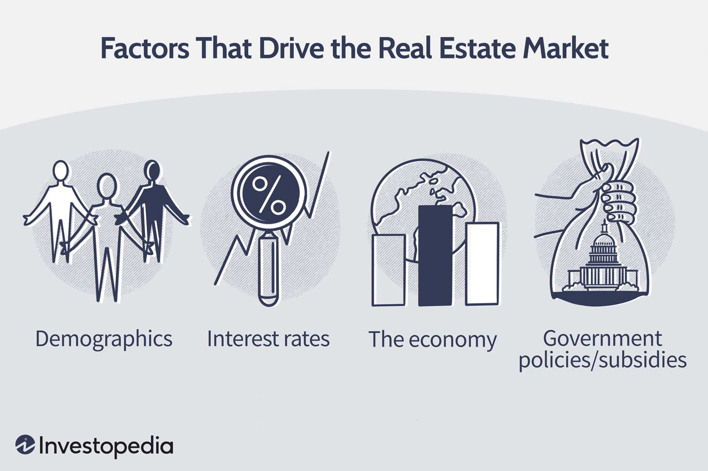

## Table of Contents

## What is a home value and why is it important?

Home value is the estimated worth of a house or property. It's like a price tag that tells you how much money a house could be sold for if someone wanted to buy it. People figure out home values by looking at things like how big the house is, where it's located, and what other houses nearby have sold for.

Knowing the home value is important for a few reasons. If you want to sell your house, you need to know its value so you can set a fair price. It also helps if you want to borrow money using your house as a guarantee, like getting a home loan. Banks will look at your home's value to decide how much money they can lend you. Plus, understanding home value can help you see if your house is growing in worth over time, which can be good for your future plans.

## How does location affect home value?

Location is a big deal when it comes to how much a home is worth. If a house is in a popular area, like near good schools, shopping centers, or parks, it can be worth more money. People want to live in places that are convenient and nice, so they're willing to pay more for homes in those spots. Also, if a house is close to things like the beach or the mountains, that can make it more valuable because those are special places that not everyone can live near.

On the other hand, if a house is in a less popular area, maybe far from good jobs or in a neighborhood that people don't think is safe, it might not be worth as much. Things like being near noisy highways or factories can also bring the value down because people don't want to live with a lot of noise or pollution. So, where a house is located can really change how much it's worth, making it a key thing to think about when buying or selling a home.

## What role does the size of a home play in determining its value?

The size of a home is a big [factor](/wiki/factor-investing) in deciding its value. A bigger home usually costs more money because it has more space for people to live in. If you have a large family or like to have a lot of room, you might want a bigger house, and you'll have to pay more for it. Builders also use more materials and take more time to build a larger home, so the cost goes up.

But it's not just about how big the home is overall. The size of different rooms can matter too. For example, a home with a big kitchen might be worth more because people like to cook and entertain. A large living room can also make a home more valuable because it's a nice place for families to spend time together. So, when people look at the value of a home, they think about both the total size and how the space is used inside.

## How do the age and condition of a home influence its value?

The age of a home can have a big impact on its value. Older homes might be worth less money because they could need a lot of repairs and updates. Things like old plumbing, worn-out roofs, and outdated electrical systems can make a home less attractive to buyers. But, some older homes can actually be worth more if they have special features, like historic charm or unique architecture that people really like. So, the age of a home can lower its value if it needs a lot of work, but it can also raise the value if it has something special about it.

The condition of a home is also really important for its value. If a home is well taken care of, with everything working properly and looking nice, it will be worth more money. People are willing to pay more for a home that they don't have to fix right away. On the other hand, if a home is in bad shape, with problems like leaks, broken windows, or peeling paint, it will be worth less. Buyers will think about how much it will cost to fix these issues, and that will bring the home's value down. So, keeping a home in good condition can help keep its value high.

## What impact do local schools and amenities have on home values?

Local schools and amenities can make a big difference in how much a home is worth. If a neighborhood has good schools, more families want to live there. They are willing to pay more money for homes near good schools because they want their kids to have a good education. This demand can push up the value of homes in the area. Also, if there are nice parks, shopping centers, or community centers nearby, people see these as perks that make their life better. They are happy to pay more for homes that are close to these amenities because they add to their daily enjoyment and convenience.

On the other hand, if the local schools are not good, it can make home values go down. Families might not want to live in an area with poor schools, so there's less demand for homes there. This can lead to lower home prices. The same goes for amenities. If a neighborhood doesn't have nice parks or good shopping options, it might not be as attractive to buyers. They might think the area is less convenient or less fun to live in, which can make homes worth less money. So, good schools and amenities can really help boost home values, while their absence can have the opposite effect.

## How does the real estate market's supply and demand affect home values?

The real estate market's supply and demand can really change how much homes are worth. When there are a lot of people who want to buy homes but not many homes for sale, it's like a lot of kids wanting the same toy but there aren't many toys to go around. This makes the price of homes go up because people are willing to pay more to get one. On the other hand, if there are a lot of homes for sale but not many people wanting to buy them, it's like having too many toys and not enough kids to play with them. This can make home prices go down because sellers might need to lower their prices to find someone to buy their home.

It's also important to think about what's happening in the bigger world that can affect supply and demand. If the economy is doing well, more people might have good jobs and feel confident about buying a home, which can push prices up. But if things like a recession happen, people might be scared to buy homes because they're worried about their jobs and money. This can make fewer people want to buy, which can lower home prices. So, the balance between how many homes are available and how many people want to buy them can really shake up home values, and it's all connected to what's going on around us.

## What are the effects of economic conditions on home values?

Economic conditions can really change how much homes are worth. When the economy is doing well, people have good jobs and feel confident about spending money. They might want to buy homes, which can make home prices go up because there are more buyers than homes for sale. Also, when people feel good about their money, they might be willing to pay more for a home because they think it's a good investment. Banks might also be more willing to give out loans, which can help more people buy homes and push prices up even more.

But if the economy is not doing well, like during a recession, things can be different. People might be worried about losing their jobs or not having enough money, so they might not want to buy homes. This can make home prices go down because there are fewer buyers. Banks might also be more careful about giving out loans, which can make it harder for people to buy homes and keep prices from going up. So, the health of the economy can make a big difference in whether home values go up or down.

## How do interest rates influence home values?

Interest rates can have a big impact on how much homes are worth. When interest rates are low, it's cheaper for people to borrow money to buy a home. This means more people can afford to get a loan and buy a house, which can make home prices go up. More buyers means more demand, and when there's a lot of demand but not enough homes for sale, prices go up. So, low interest rates can help push home values higher because more people can afford to buy.

On the other hand, when interest rates are high, it costs more to borrow money. This can make it harder for people to afford a home loan, so fewer people might want to buy homes. With fewer buyers, the demand for homes goes down, and that can make home prices drop. High interest rates can make home values go down because fewer people can afford to buy, and sellers might have to lower their prices to find a buyer. So, interest rates play a big role in whether home values go up or down.

## What role do home improvements and renovations play in increasing home value?

Home improvements and renovations can make a big difference in how much a home is worth. When you fix up your home or add new things to it, it can become more valuable. For example, if you put in a new kitchen or a nice bathroom, people might be willing to pay more for your home because they like these updates. Also, things like adding a new room or fixing the roof can make your home worth more money. People see these improvements as making the home better and more worth buying.

But not all home improvements will help your home's value the same way. Some projects, like adding a swimming pool or a fancy home theater, might not make your home worth more to everyone. These things are special and some people might love them, but others might not want to pay extra for them. It's a good idea to think about what most buyers in your area would like. Simple, useful improvements like painting the house, fixing up the yard, or updating the floors usually help increase the home's value more because they appeal to a lot of people.

## How do zoning laws and future development plans impact home values?

Zoning laws and future development plans can really change how much a home is worth. Zoning laws are rules that say what can be built in certain areas. If a neighborhood is zoned for things like schools, parks, or shopping centers, it can make homes there more valuable. People like living near these places because they make life easier and more fun. But if a neighborhood is zoned for factories or other things that might be noisy or not so nice, it can make home values go down. People might not want to live near those things, so they won't pay as much for homes there.

Future development plans can also affect home values. If there are plans to build new things like a new mall, a train station, or a big park near a neighborhood, it can make home values go up. People get excited about these new things and think the area will be better to live in, so they're willing to pay more for homes there. But if the plans are for things like a landfill or a highway that will bring a lot of noise and traffic, it can make home values go down. People might not want to live near those things, so they'll pay less for homes in that area. So, both zoning laws and future development plans can make a big difference in how much a home is worth.

## What advanced statistical models are used to predict home values?

To predict home values, people often use advanced statistical models like regression analysis and machine learning algorithms. Regression analysis looks at how different things, like the size of a home, its location, and the age of the house, affect its value. By studying a lot of past home sales, these models can figure out how much each of these things matters and then guess how much a new home might be worth. This is helpful for people who want to buy or sell a home because it gives them a good idea of what price to expect.

Machine learning algorithms take this a step further. They can look at a huge amount of data, not just about homes but also about things like the economy, interest rates, and even social media trends. These models can learn from all this information and find patterns that might be hard for people to see. This helps them make very accurate guesses about future home values. Using these advanced models can help people make better decisions about buying, selling, or investing in homes.

## How can big data and machine learning be utilized to assess and forecast home value trends?

Big data and machine learning can help us understand and predict how home values will change over time. Big data means looking at a huge amount of information from different places, like home sales records, local economic data, and even social media posts. By putting all this information together, we can see patterns and trends that might not be obvious at first. Machine learning algorithms can then use this big data to learn how different things affect home values. For example, they can figure out how much things like new schools or changes in interest rates might change home prices in the future.

Using these tools, we can make better guesses about where home values might go. Machine learning can look at how home values have changed in the past and use that to predict what might happen next. It can also take into account new information as it comes in, so the predictions stay up-to-date. This is really helpful for people who want to buy or sell a home, or for those who invest in real estate. By understanding these trends, they can make smarter choices about when and where to buy or sell, and how much to pay or ask for.

## What are Real Estate Valuation Techniques?

Traditional real estate valuation techniques have long served the industry by providing a structured approach to determining property value. Two primary methods, comparative market analysis and the income approach, remain foundational in this process.

Comparative market analysis (CMA) involves evaluating similar properties that have recently sold in the same area. This method requires selecting comparables with similar characteristics, such as size, location, and condition. Adjustments are made for differences, allowing a valuation professional to estimate a property's market value with a relatively high degree of accuracy. For instance, if a comparable property is larger, an adjustment would be made to its value to equate it to the subject property's size. The formula typically used in CMA can be represented as:

$$
\text{Adjusted Comparable Value} = \text{Comparable Sale Price} \pm \text{Adjustment Amounts}
$$

The income approach, predominantly used for investment properties, bases value on the income a property can generate. It involves estimating the future income streams the property can achieve, then discounting them to present value using a capitalization rate. The key formula here is:

$$
\text{Property Value} = \frac{\text{Net Operating Income (NOI)}}{\text{Capitalization Rate}}
$$

Automated Valuation Models (AVMs) have emerged as powerful tools, leveraging AI and big data to streamline the valuation process. AVMs analyze large datasets, such as property records, market trends, and geographic data, to predict property values with speed and consistency. These models are particularly useful for lenders and institutional investors who require rapid assessments.

A simple Python example of an AVM using [machine learning](/wiki/machine-learning) could involve training a model on historical sales data:

```python
from sklearn.model_selection import train_test_split
from sklearn.ensemble import RandomForestRegressor
import pandas as pd

# Load dataset
data = pd.read_csv('real_estate_data.csv')

# Features and target variable
X = data[['size', 'location', 'condition']]
y = data['value']

# Split the data
X_train, X_test, y_train, y_test = train_test_split(X, y, test_size=0.2, random_state=42)

# Initialize and train model
model = RandomForestRegressor(n_estimators=100, random_state=42)
model.fit(X_train, y_train)

# Prediction
predictions = model.predict(X_test)
```

While AVMs provide significant efficiencies, they also face challenges. Data accuracy is paramount, as inaccurate inputs can lead to erroneous valuations. AVMs may struggle to account for qualitative property aspects, such as unique architectural styles or a well-maintained garden, which could significantly influence perceived value. 

Thus, while automation enhances efficiency in property valuation, the insights and adjustments provided by human appraisers remain integral to capturing the comprehensive value of a property. The ongoing development of AVMs aims to address these limitations, blending technological advancements with traditional human expertise to achieve more accurate and reliable valuations.

## References & Further Reading

[1]: Zheng, Y., & Zhang, L. (2012). ["Critical Factors Affecting Real Estate Market Development: A Review."](https://www.sciencedirect.com/science/article/pii/S0009250924014477) Journal of Real Estate Literature.

[2]: Deloitte. ["Blockchain in Real Estate."](https://www2.deloitte.com/us/en/pages/financial-services/articles/blockchain-in-commercial-real-estate.html) Deloitte Insights.

[3]: McKinsey & Company. ["Using Data to Capture New Real Estate Opportunities."](https://www.mckinsey.com/mx/our-insights/what-the-real-estate-industry-needs-to-know-about-data-centers) McKinsey Report.

[4]: Lopez de Prado, M. (2018). ["Advances in Financial Machine Learning."](https://www.amazon.com/Advances-Financial-Machine-Learning-Marcos/dp/1119482089) Wiley Finance.

[5]: Chan, E. P. (2008). ["Quantitative Trading: How to Build Your Own Algorithmic Trading Business."](https://github.com/ftvision/quant_trading_echan_book) Wiley Trading.

[6]: Zillow. ["Research and Insights into the Real Estate Market."](https://www.zillow.com/research/data/) Zillow Research.

[7]: Jansen, S. (2018). ["Machine Learning for Algorithmic Trading."](https://github.com/stefan-jansen/machine-learning-for-trading) Packt Publishing.