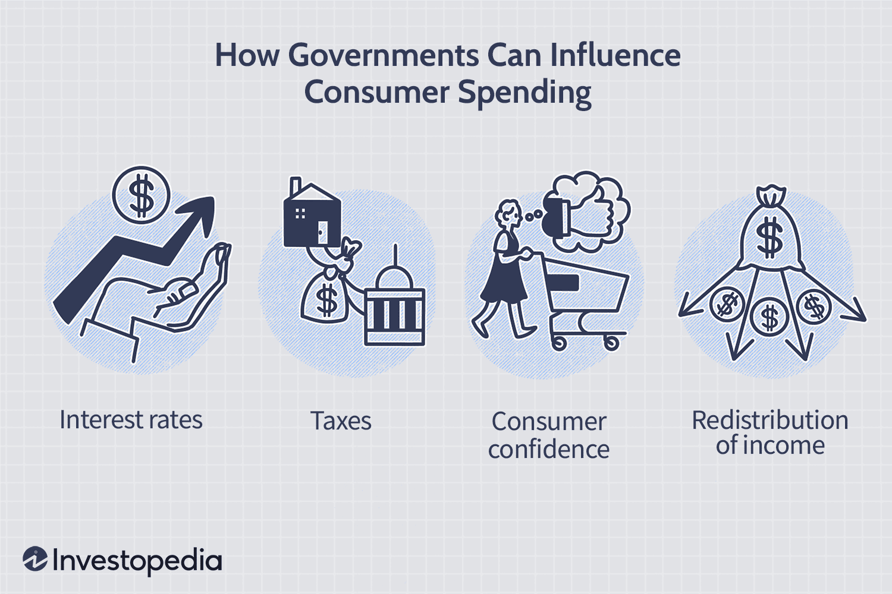

Understanding the economic factors that influence consumer behavior is crucial for both economists and traders as it aids in interpreting and predicting trends that affect economic stability and growth. One of the key concepts in this regard is the Marginal Propensity to Consume (MPC), a fundamental aspect of Keynesian macroeconomic theory. MPC quantifies the proportion of additional income that consumers are likely to spend on goods and services rather than saving. This ratio is essential in analyzing consumer behavior, shedding light on economic vitality, and influencing policy-making.

Marginal Propensity to Consume is not only a pivotal determinant of consumer spending patterns but also a significant driver of economic forecasting and policy strategies. As a metric, MPC has profound implications for the design of fiscal and monetary policies. It assists governments and financial institutions in understanding how adjustments in income, via tax cuts or increased spending, might stimulate or contract economic activity. Such insights are vital for crafting policies aimed at bolstering economic output and stability.



Furthermore, the integration of MPC with consumer behavior and algorithmic trading strategies presents an intriguing intersection of economics and technology. As market dynamics become increasingly complex, the role of MPC in forecasting economic trends and influencing investment strategies grows more significant. Traders use economic indicators like MPC to inform algorithmic trading models, optimizing their strategies by anticipating shifts in market demand and consumer confidence. 

By analyzing these intertwined concepts, economists and traders can better position themselves to adapt to the ever-evolving global economic landscape. Ongoing research and refined methodologies are necessary to enhance our understanding and application of MPC in forecasting and investment, ensuring that strategies are responsive to changes in consumer behavior and economic policies.

## Table of Contents

## Understanding the Marginal Propensity to Consume (MPC)

Marginal Propensity to Consume (MPC) is a key element in Keynesian macroeconomic theory. It quantifies the proportion of additional income that consumers are likely to spend rather than save. The concept of MPC provides valuable insights into consumer behavior, which is pivotal for understanding the broader economic health and informing policy-making.

The mathematical calculation of MPC is straightforward. It is expressed by the formula:

$$
\text{MPC} = \frac{\Delta C}{\Delta Y}
$$

where $\Delta C$ represents the change in consumption and $\Delta Y$ represents the change in income. This ratio indicates how much of each additional dollar of income will be used for consumption.

For example, if an individual receives an additional income of $100 and spends $80 of it, the MPC would be:

$$
\text{MPC} = \frac{80}{100} = 0.8
$$

An MPC of 0.8 suggests that 80% of any increase in income will be spent on goods and services, while the remaining 20% will be saved. Understanding these spending and saving patterns is crucial for economic modeling, as they influence aggregate demand within an economy.

In economic modeling, MPC plays a significant role in constructing consumption functions which reflect the total consumer spending at different income levels. These functions are essential for analyzing the potential effects of fiscal policies. A higher MPC implies that a greater portion of income changes will directly ripple through the economy, potentially leading to greater economic multiplier effects when policies such as tax cuts or stimulus measures are implemented.

The application of MPC extends to both theoretical models and empirical studies. Macroeconomists often leverage data on MPC to forecast economic conditions and to propose adjustments in monetary and fiscal policies. For instance, understanding the average MPC in a population can guide government decisions on how much economic stimulus is necessary to achieve desired increases in GDP.

In summary, an accurate assessment of MPC aids economists in predicting the consumption behavior of individuals and aggregates, allowing for informed policy prescriptions and economic planning.

## Economic Influence of MPC

Marginal Propensity to Consume (MPC) plays a significant role in shaping fiscal and monetary policies by influencing how economic stimuli translate into increased economic output. When policymakers implement fiscal measures such as tax cuts or government spending, the underlying values of MPC determine the extent to which these measures affect overall economic activity.

At its core, MPC quantifies the fraction of additional income that individuals spend on consumption as opposed to saving. This ratio directly impacts the multiplier effect, a fundamental concept in macroeconomics. The multiplier effect represents how initial changes in spending lead to more extensive economic activity. Mathematically, it is expressed as:

$$
\text{Multiplier} = \frac{1}{1 - \text{MPC}}
$$

This formula shows that a higher MPC results in a larger multiplier, indicating that a given increase in income will lead to a more substantial increase in total expenditures within an economy. For example, if the MPC is 0.75, this implies that a one-dollar increase in income leads to a seventy-five-cent increase in consumption. Consequently, the multiplier would be 4, suggesting that an initial increase in spending generates four times that amount in economic activity.

Effective policy-making considers the MPC to enhance economic outcomes. When MPC is high, tax cuts or direct government spending are particularly potent in stimulating growth since more of every dollar received is spent. Conversely, in economies with lower MPC, these interventions may yield limited results, requiring policymakers to seek alternative strategies to support economic expansion.

Understanding the influence of MPC enables governments and central banks to design policies that maximize economic impact, particularly during recessionary periods. By targeting measures that align with their population's spending habits, policymakers can optimize resource allocation and encourage sustainable economic growth.

## Consumer Behavior and Economic Growth

The relationship between income levels and consumption patterns is a cornerstone of macroeconomic analysis. At the heart of this relationship is the Marginal Propensity to Consume (MPC), a measure that indicates the proportion of additional income that consumers are likely to spend on goods and services, as opposed to saving. Economists use MPC to gauge potential consumer behavior and its subsequent impact on economic growth.

The importance of MPC is paramount when considering how changes influence consumer spending and consequently drive Gross Domestic Product (GDP) growth. A higher MPC implies that consumers are spending a larger share of each additional unit of income, which can lead to an increase in aggregate demand. This phenomenon often creates a ripple effect in the economy, where increased consumption leads to higher production levels, which then stimulates further economic activity and employment. Conversely, a lower MPC suggests that consumers are saving more, which can decelerate economic growth as less money circulates through the economy.

The multiplier effect is intrinsically linked to MPC and plays a crucial role in this context. The multiplier effect quantifies how an initial change in spending (due to changes in consumption patterns dictated by MPC) can lead to a larger overall increase in GDP. The mathematical representation of the simple spending multiplier is given by:

$$
\text{Multiplier} = \frac{1}{1 - MPC}
$$

This formula shows that even small changes in MPC can significantly influence the overall economic output. For instance, if MPC = 0.8, this indicates that for every additional dollar received, 80 cents are spent, promoting further economic activity.

Recognizing consumption trends via MPC is vital for predicting economic activity and shaping fiscal policies. Governments and policymakers rely on data regarding MPC to tailor interventions such as tax policies or public expenditure. For example, during economic downturns, policies aiming to increase disposable income (such as tax cuts) can be more effective if the MPC is high, thereby ensuring that the additional disposable income is quickly reinserted into the economy through consumer spending.

Moreover, understanding the dynamics of MPC allows for better anticipation of economic cycles. By analyzing past consumption trends and their correlation with GDP fluctuations, policymakers can devise strategies to mitigate potential recessions or overheating. Accurate assessment of the MPC's impact on consumption and growth maintains economic stability and can inform the direction of fiscal and monetary policy measures.

In summary, the interplay between income levels, consumption patterns, and MPC holds significant sway over economic growth trajectories. By carefully analyzing and interpreting these factors, economists can enhance forecasts of economic activity and policymakers can construct well-informed fiscal strategies that promote sustainable economic development.

## Algorithmic Trading: An Overview

Algorithmic trading employs computer algorithms to automate the execution of trades, using predefined criteria to determine the best times to buy or sell financial instruments. The automation of trading processes offers several advantages, including increased speed and accuracy in trade execution, which reduces the possibility of human error and emotional decision-making typical in manual trading. By leveraging historical data and sophisticated algorithms, traders can execute orders at speeds much faster than human traders, potentially taking advantage of small price fluctuations that occur over short time intervals.

One of the fundamental aspects of [algorithmic trading](/wiki/algorithmic-trading) is its reliance on quantitative models that incorporate various economic indicators. Among these indicators, the Marginal Propensity to Consume (MPC) can play a significant role in predicting market trajectories. MPC, which measures the portion of additional income consumers are likely to spend, can reflect broader economic trends that impact asset prices. By integrating MPC into trading models, algorithms can estimate future demand for goods and services, providing insights into consumer behavior and helping traders anticipate shifts in market dynamics.

Algorithmic trading systems often use techniques such as statistical [arbitrage](/wiki/arbitrage), [trend following](/wiki/trend-following), and mean reversion. These strategies involve complex computations and predictions that require robust data processing capabilities. Trend-following strategies, for instance, might analyze patterns in MPC-related data to forecast long-term economic trends and make corresponding trades in financial markets. Meanwhile, arbitrage strategies capitalize on price discrepancies in various markets, potentially informed by changes in consumer spending patterns indicated by MPC fluctuations.

An example of Python code that might form the backbone of a simple algorithmic trading strategy is as follows:

```python
import pandas as pd
import numpy as np

def calculate_moving_average(data, window):
    """Calculate the moving average for a given data series."""
    return data.rolling(window=window).mean()

def execute_trade(data, short_window, long_window):
    """Generate trading signals based on moving averages crossover."""
    signals = pd.DataFrame(index=data.index)
    signals['signal'] = 0.0

    signals['short_mavg'] = calculate_moving_average(data['price'], short_window)
    signals['long_mavg'] = calculate_moving_average(data['price'], long_window)

    # Create trading signal when short moving average crosses long moving average
    signals['signal'][short_window:] = np.where(signals['short_mavg'][short_window:] > signals['long_mavg'][short_window:], 1.0, 0.0)   

    # Generate trading orders
    signals['orders'] = signals['signal'].diff()

    return signals

# Example usage
price_data = pd.DataFrame({'price': [100, 102, 101, 105, 107, 110, 108]})
trading_signals = execute_trade(price_data, short_window=3, long_window=5)
print(trading_signals)
```

This example demonstrates a basic moving average crossover strategy, where buy and sell signals are generated based on two moving averages. Although relatively simple, more sophisticated algorithms would integrate complex data sources, including macroeconomic indicators like MPC, to refine strategy execution and enhance performance outcomes.

Ultimately, the integration of economic indicators such as MPC into algorithmic trading strategies can improve the adaptability and precision of trading systems. As technological advancements continue, the role of [machine learning](/wiki/machine-learning) and [artificial intelligence](/wiki/ai-artificial-intelligence) in refining these strategies highlights the increasing complexity and competitiveness of financial markets.

## Integrating MPC into Algorithmic Trading Strategies

The integration of Marginal Propensity to Consume (MPC) into algorithmic trading strategies provides a sophisticated approach to anticipating market movements and optimizing trading decisions. By leveraging MPC-related data, traders can enhance the predictive capabilities of their algorithms, allowing for more strategic positioning in financial markets.

MPC measures the proportion of additional income that a consumer spends on goods and services, as opposed to saving it. This metric can be pivotal in forecasting overall consumer spending and, by extension, market demand. As consumer expenditure is a significant component of Gross Domestic Product (GDP), understanding MPC can help traders forecast economic conditions and respond accordingly.

Algorithmic trading relies on mathematical models and statistical analyses to execute trades autonomously. By integrating MPC data into these algorithms, traders can develop strategies that more accurately reflect consumer spending trends. This can be executed by modeling the relationship between income changes and consumption patterns to predict demand fluctuations. For instance, if MPC data suggest an increase in consumer spending due to a recent tax rebate, an algorithm might predict a rise in stock prices for consumer goods companies and adjust trading positions to capitalize on expected market conditions.

A practical application of this approach is to incorporate an MPC-based forecasting model within a trading algorithm. The model can be constructed using Python, where MPC data are fed into a machine learning model like a time-series forecast to predict short-term market demand. Here is a simple example of such an integration using Python:

```python
import numpy as np
import pandas as pd
from sklearn.model_selection import train_test_split
from sklearn.linear_model import LinearRegression

# Assume 'data' is a DataFrame containing past income changes and consumption patterns
data = pd.read_csv('mpc_data.csv')  # Load MPC data
X = data[['income_change']]  # Predictor
y = data['consumption_change']  # Response

# Split data into training and testing sets
X_train, X_test, y_train, y_test = train_test_split(X, y, test_size=0.2, random_state=42)

# Create and train a linear regression model
model = LinearRegression()
model.fit(X_train, y_train)

# Predict future consumption changes based on new income data
new_income_data = np.array([[0.05]])  # Example of a 5% increase in income
predicted_consumption_change = model.predict(new_income_data)

# Output predicted consumption change
print("Predicted Consumption Change:", predicted_consumption_change)
```

In this example, the relationship between income change and consumption change is modeled using linear regression, providing a simplified forecast model that can inform trading decisions. As MPC data suggest alterations in consumer expenditure patterns, algorithms can adjust trading positions to primary market instruments, mitigating risks and capitalizing on favorable market conditions.

The integration of MPC into trading strategies involves not only the application of statistical models but also a continual update to reflect the latest economic data. By doing so, traders can optimize their strategies for a dynamic economic landscape, achieving a competitive edge in market analysis and execution.

## Conclusion

The interaction between the Marginal Propensity to Consume (MPC), economic policies, and algorithmic trading is pivotal in shaping market behaviors. A clear understanding of MPC is instrumental in formulating fiscal strategies that promote consumer expenditures effectively. When fiscal policies are designed with MPC in mind, they can stimulate economic activity by ensuring that a higher proportion of any additional disposable income is directed toward consumption rather than saving. For instance, during economic downturns, governments can implement tax cuts or increase public spending to boost demand, relying on high MPC values to maximize their multipliers and thus magnify the desired economic impact.

Incorporating MPC into algorithmic trading strategies provides significant advantages in investment decision-making. Trading algorithms that consider MPC data can improve their predictive accuracy by better estimating market demand. By comprehensively analyzing how consumers are likely to react to changes in income, traders can strategically position their assets to optimize returns. For example, during periods when MPC is rising, indicating increased consumer confidence and spending, trading algorithms might overweight assets related to consumer goods or services.

Continuous research is essential to keep pace with the evolving global market and economic landscape. This ongoing study allows policymakers and traders to refine their strategies and adapt to shifts in consumer behavior or other macroeconomic indicators. As economies become more interconnected and complex, the dynamic modeling of MPC and its integration into both economic policies and trading systems will be crucial for maintaining economic stability and fostering growth. By staying at the forefront of these changes, economists and traders can better predict and react to market trends, securing a competitive advantage.

## References & Further Reading

1. Keynes, J. M. (1936). *The General Theory of Employment, Interest, and Money.* This seminal work by John Maynard Keynes introduces the concept of the Marginal Propensity to Consume (MPC) and its relevance in macroeconomic theory and policy-making.

2. Samuelson, P. A. (1948). *Economics: An Introductory Analysis.* This foundational textbook by Paul Samuelson provides a comprehensive overview of Keynesian economics, with a detailed discussion on MPC.

3. Mankiw, N. G. (2019). *Principles of Economics.* An essential resource for understanding the principles of economic theory, including a thorough analysis of MPC and its implications for economic policies.

4. Chan, E. P. (2009). *Quantitative Trading: How to Build Your Own Algorithmic Trading Business.* This book by Ernest Chan offers insights into the development of algorithmic trading strategies, integrating economic indicators like MPC to enhance predictive models.

5. Barberis, N., & Thaler, R. (2003). "A Survey of Behavioral Finance," in *Handbook of the Economics of Finance.* This paper explores the intersection of consumer behavior, finance theory, and economic indicators such as MPC.

6. Poterba, J. M. (1988). "Are Consumers Forward Looking? Evidence from Fiscal Experiments," *American Economic Review.* This article evaluates the responsiveness of consumer spending to changes in disposable income, relevant for understanding MPC.

7. Caginalp, G., & Balenovich, D. (1999). "A theoretical foundation for technical analysis," *Applied Mathematical Finance.* This paper provides a foundation for using mathematical and statistical methods, akin to those used in algorithmic trading strategies.

8. Thaler, R. H. (1994). *Quasi Rational Economics.* This book presents psychological perspectives on economic behavior, offering an enhanced understanding of factors influencing consumer spending and MPC.

9. Mitchell, W., & Muysken, J. (2008). *Full Employment Abandoned: Shifting Sands and Policy Failures.* This text discusses macroeconomic policies in relation to employment and consumption patterns, emphasizing the role of MPC.

10. Chordia, T., Roll, R., & Subrahmanyam, A. (2001). "Market Liquidity and Trading Activity," *Journal of Finance.* This research examines how trading strategies and market liquidity might be informed by economic indicators, including MPC.

These resources encompass a range of literature that provides a deeper understanding of Marginal Propensity to Consume and its application within the economic and trading environments.