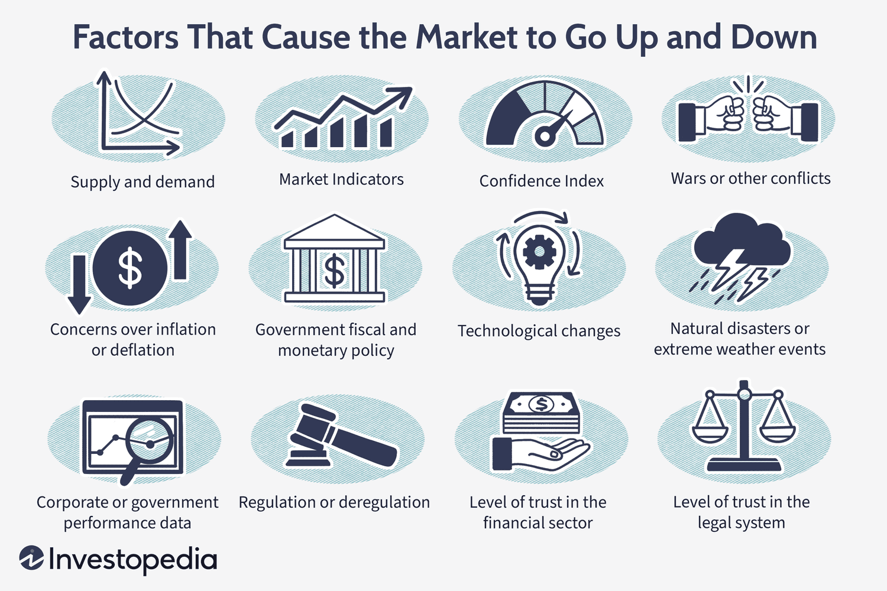

## Table of Contents

## What are market trends and why are they important?

Market trends are the general direction in which a market or a specific industry is moving. They can be influenced by many things like what customers want, new technology, and what the economy is doing. For example, if more people start wanting to buy electric cars, that would be a market trend in the car industry.

Understanding market trends is important for businesses because it helps them make smart decisions. If a company knows what customers will want in the future, they can make products that meet those needs. This can help them stay ahead of their competitors and make more money. For example, if a company sees that people are buying more organic food, they might decide to start selling organic products too.

## How do economic indicators influence market trends?

Economic indicators are important pieces of information that tell us how the economy is doing. Things like unemployment rates, inflation, and how much people are spending can all affect what happens in the market. For example, if the unemployment rate goes down, it means more people have jobs and might spend more money. This can make businesses feel more confident and might lead to more products being sold.

When economic indicators change, they can cause market trends to shift. If inflation starts to go up, it means that prices are getting higher, and people might not buy as much. This can slow down the market because businesses might sell less. On the other hand, if people are spending more money, it can create a trend where businesses start to grow and offer new products to meet the demand. So, keeping an eye on economic indicators helps businesses understand and predict market trends.

## What role do consumer behaviors play in shaping market trends?

Consumer behaviors are really important in deciding what happens in the market. When people start to like or want different things, businesses have to change to meet those new wants. For example, if more people start caring about the environment, they might choose to buy products that are good for the planet. This can make businesses start making more eco-friendly products, which then becomes a market trend.

Also, how consumers act can show businesses what might be popular in the future. If a lot of people start using a new app or buying a certain type of food, companies will notice and might start making similar things. This helps create new trends in the market. So, by watching what consumers do, businesses can guess what will be popular next and plan their products accordingly.

## How do technological advancements affect market trends?

Technological advancements can change market trends a lot. When new technology comes out, it can make old products seem outdated. For example, when smartphones became popular, they changed how people used phones and made older cell phones less popular. Businesses that can use new technology to make their products better or cheaper can get ahead of others. This can start new trends in the market, like how streaming services became a big trend after the internet got faster and more reliable.

Also, technology can create new markets that didn't exist before. Think about how the internet led to online shopping, which is now a huge part of the market. When new technology makes it easier to do things in a new way, it can lead to new trends. Companies that are quick to use new technology can find new ways to make money and grow, while others might fall behind if they don't keep up with the changes.

## What impact do government policies have on market trends?

Government policies can really change what happens in the market. If the government makes new rules or changes taxes, it can make some products cost more or less. For example, if the government puts a new tax on cigarettes, it might make people buy fewer of them. This can start a trend where people look for other things to buy instead, like e-cigarettes or nicotine patches. So, what the government does can make businesses change what they sell and how they sell it.

Also, government policies can help start new trends by supporting certain industries. If the government gives money or special help to companies that make green energy, like solar panels, it can make those products more popular. More people might start buying them because they are cheaper or because they want to help the environment. This can create a big trend in the market for green products. So, government actions can guide what people buy and what businesses do, which shapes market trends.

## How do global events and geopolitical tensions influence market trends?

Global events and geopolitical tensions can really shake up market trends. When something big happens around the world, like a war or a natural disaster, it can change how people buy things. For example, if there's a war in a country that makes a lot of oil, the price of oil might go up because it's harder to get. This can make everything that needs oil to be made or moved around cost more, like gas for cars or shipping goods. So, businesses might have to change what they sell or how they sell it because of these big events.

Geopolitical tensions, like fights between countries, can also make markets go up and down. If countries are not getting along, they might put up trade barriers or stop trading with each other. This can make it hard for businesses to get the things they need to make their products. For example, if two countries that usually trade a lot stop talking, companies in one country might not be able to get parts they need from the other. This can slow down the market and start new trends, like looking for new places to get those parts or making different products that don't need them.

## What are the psychological factors that drive market trends?

People's feelings and thoughts can really change what happens in the market. One big thing is how confident people feel about the future. If people think the economy will do well, they might spend more money and buy things they want, like new cars or houses. This can start a trend where businesses see more sales and decide to make more products. On the other hand, if people are worried about losing their jobs or think the economy will get worse, they might save their money instead of spending it. This can slow down the market and make businesses think twice about making new things.

Another thing that drives market trends is how people see certain products. Sometimes, a product becomes popular because everyone wants to be like others who have it. This is called the bandwagon effect. For example, if a famous person uses a certain brand of shoes, a lot of people might want to buy those shoes too. This can start a trend where that brand becomes really popular. Also, people's fears and hopes can make them buy things they think will protect them or help them in the future. If people are worried about their health, they might buy more vitamins or health products, which can create a trend in the health market.

## How can historical data be used to predict market trends?

Historical data is like a record of what happened in the past in the market. By looking at this data, people can see patterns and trends that happened before. For example, if a certain product always sells more in the summer, businesses can guess that it will probably sell more next summer too. This helps them plan ahead, make more of that product, and maybe even start selling it a bit earlier to catch the trend.

But, it's not just about looking at what happened last year or the year before. People also look at longer trends, like how the market changed over many years. This can show bigger changes, like how people's tastes have changed or how technology has affected what people buy. By understanding these big trends, businesses can make better guesses about what might happen in the future and be ready for it. So, historical data is a big help in predicting what the market will do next.

## What are the key differences between short-term and long-term market trends?

Short-term market trends are changes that happen quickly and don't last very long. They can be caused by things like a new product coming out, a special sale, or even the news. For example, if a famous person talks about a new gadget on TV, a lot of people might want to buy it right away, making it a short-term trend. These trends can be hard to predict because they can change fast, but they're important for businesses to watch because they can help sell more products in a short time.

Long-term market trends are changes that happen over a longer time and last for years or even decades. They are often caused by bigger things like changes in what people want, new technology, or what the economy is doing. For example, more people wanting to eat healthy food can start a long-term trend where businesses make more healthy products. These trends are easier to predict because they change more slowly, and businesses can plan for them by making new products or changing how they work to fit what people will want in the future.

## How do sector-specific factors contribute to market trends?

Sector-specific factors are things that happen in just one part of the market, like the car industry or the tech industry. These factors can start new trends that affect only that part of the market. For example, if a new law makes cars have to be more fuel-efficient, car companies might start making more electric cars. This can start a trend in the car industry where electric cars become more popular. So, what happens in one sector can change what people buy and what businesses do in that sector.

These sector-specific factors can also affect the whole market sometimes. If a big tech company comes out with a new phone that everyone wants, it can start a trend where other companies try to make similar phones. This can make the whole phone market change, not just the tech sector. So, even though sector-specific factors start in one part of the market, they can spread and change what happens in other parts too.

## What advanced statistical models are used to analyze market trends?

Advanced statistical models help people understand and predict market trends better. One popular model is called time series analysis. This model looks at how things change over time, like how the price of a product goes up and down. It can find patterns in the data, like if the price always goes up in the summer. Another model is regression analysis, which looks at how different things affect the market. For example, it can show how changes in the economy, like unemployment rates, affect what people buy. These models use math to make guesses about what will happen in the market next.

Another important model is [machine learning](/wiki/machine-learning). This is a type of computer program that can learn from data and make predictions. Machine learning can look at a lot of information at once, like what people are buying, what the economy is doing, and even what the weather is like. It can then find patterns that people might not see and use those patterns to predict future market trends. These models are really helpful because they can handle a lot of information and make smart guesses about what will happen next in the market.

## How can investors use market trend analysis to optimize their portfolios?

Investors can use market trend analysis to make better choices about what to buy and sell in their portfolios. By looking at market trends, they can see which industries or products are becoming more popular and might be good to invest in. For example, if electric cars are becoming a big trend, an investor might decide to buy stocks in companies that make electric cars or their parts. This can help them make more money if the trend keeps growing. Also, by understanding short-term trends, investors can take advantage of quick changes in the market to buy low and sell high.

Long-term trends are also important for investors because they show bigger changes in the market that can last for years. If an investor sees that people are starting to care more about the environment, they might choose to invest in companies that make green products or use renewable energy. This can help them build a portfolio that will do well over a long time. By using both short-term and long-term trend analysis, investors can make smart decisions that help their portfolios grow and stay safe from big drops in the market.

## References & Further Reading

[1]: Bergstra, J., Bardenet, R., Bengio, Y., & Kégl, B. (2011). ["Algorithms for Hyper-Parameter Optimization."](https://dl.acm.org/doi/10.5555/2986459.2986743) Advances in Neural Information Processing Systems 24.

[2]: ["Advances in Financial Machine Learning"](https://www.amazon.com/Advances-Financial-Machine-Learning-Marcos/dp/1119482089) by Marcos Lopez de Prado

[3]: ["Evidence-Based Technical Analysis: Applying the Scientific Method and Statistical Inference to Trading Signals"](https://www.amazon.com/Evidence-Based-Technical-Analysis-Scientific-Statistical/dp/0470008741) by David Aronson

[4]: ["Machine Learning for Algorithmic Trading"](https://github.com/PacktPublishing/Machine-Learning-for-Algorithmic-Trading-Second-Edition) by Stefan Jansen

[5]: ["Quantitative Trading: How to Build Your Own Algorithmic Trading Business"](https://www.amazon.com/Quantitative-Trading-Build-Algorithmic-Business/dp/1119800064) by Ernest P. Chan