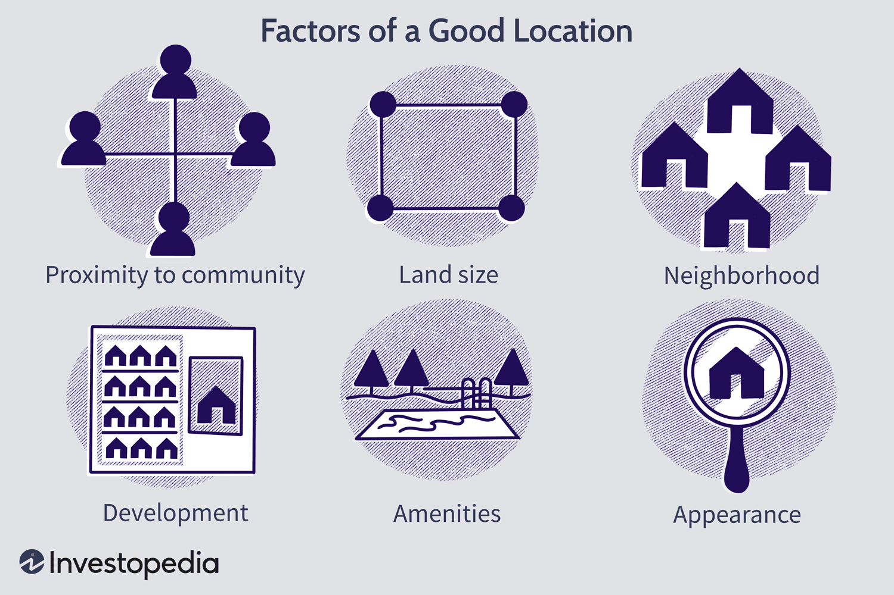

Real estate and algorithmic trading are two distinct fields, yet they share a common thread through the crucial role of location factors in decision-making processes. Real estate investors have long relied on the dictum of "location, location, location" to guide their investment choices, recognizing that the geographical attributes of a property can significantly influence its value and potential for appreciation. Meanwhile, algorithmic trading, driven by complex mathematical models and real-time data, thrives on identifying patterns and discrepancies that can be leveraged for profit.

In real estate, site selection encompasses a variety of location dynamics such as centrality, neighborhood quality, and proximity to amenities. Each of these factors plays a part in determining a property's market value and long-term investment returns. For traders, especially those employing algorithmic strategies, understanding how geographic and locational variables affect asset markets can provide a competitive edge. This knowledge can lead to the development of innovative trading strategies that mirror real estate analyses, albeit in digital and financial dimensions.



The objective of this article is to investigate the intersection of real estate location factors and algorithmic trading strategies. By understanding these connections, stakeholders in both industries can enhance their decision-making frameworks, potentially leading to greater economic returns. As technologies advance, particularly in processing and interpreting location-based data, the strategies derived from such insights might redefine both real estate investments and trading practices.

## Table of Contents

## Understanding Location Factors in Real Estate

Location is often cited as the most critical factor in real estate success. The adage 'location, location, location' underscores its importance in determining property value, buyer interest, and long-term investment returns. The concept of location encompasses various elements, each playing a significant role in shaping market value and influencing the rate at which a property appreciates over time.

1. **Centrality**: Centrality refers to how centrally located a property is with respect to city resources, employment opportunities, and potential buyers. Properties in densely populated metropolitan areas with limited land for expansion typically command higher values due to a constrained supply. The proximity to commercial centers, business districts, and major transportation hubs enhances a property's attractiveness, often leading to quicker market absorption and upward pressure on prices.

2. **Neighborhood Quality**: The quality of the neighborhood exerts a profound impact on real estate value. A neighborhood characterized by high levels of safety, well-maintained public spaces, access to quality schools, and convenient transportation links is inherently more desirable. These aspects contribute to increased demand, which in turn positively affects property values. The presence of parks, recreational facilities, and cultural amenities further enhances the neighborhood's appeal.

3. **Development Potential**: Areas with robust development potential often exhibit significant future value increases. Locations slated for new infrastructure, such as schools, transportation networks, or commercial complexes, are likely to experience heightened demand and appreciation in property values. Investors and developers seek regions with favorable zoning laws and planned urban development, as these factors can catalyze economic growth and increase the desirability of the area.

4. **Proximity to Amenities**: The accessibility of amenities such as shopping centers, restaurants, healthcare facilities, and entertainment options significantly affects real estate valuation. Properties located near essential services and lifestyle conveniences enjoy stronger market demand. Buyers often prioritize such proximity for its impact on quality of life and convenience, driving property values upward. 

5. **Lot Positioning**: The physical positioning of a lot can influence its marketability and price. For instance, properties situated on busy roads may face drawbacks due to noise and traffic, while those offering scenic views, waterfront access, or other unique features tend to command premium prices. The orientation and shape of the lot, as well as its exposure to sunlight, can also affect desirability and valuation.

In conclusion, the interplay of these factors makes 'location' a multi-faceted criterion essential to assessing and predicting real estate success. Understanding the nuances of each location [factor](/wiki/factor-investing) enables more informed decision-making in real estate investments, ultimately leading to optimized returns and sustained growth.

## The Role of Centrality and Neighborhood

Centrality and neighborhood quality are two pivotal aspects influencing property values in real estate. Centrality pertains to a property's relative position concerning urban centers, wherein properties closer to core city resources, employment hubs, and potential buyers generally command higher values. This phenomenon is typically observed in densely populated metropolitan areas, where there exists limited space for expansion, thus rendering property near city centers more desirable and scarce. As metropolitan regions continue to develop, the demand for centrally located real estate intensifies, driving property values upward. This principle is often encapsulated in the concept of the "bid-rent curve," which illustrates how land users are willing to pay higher rents for spaces with greater accessibility to a central business district.

Neighborhood quality also significantly impacts real estate demand and value. A neighborhood's desirability is enhanced by several factors, including reliable public transportation links, low crime rates, quality public services, and easily accessible amenities such as parks, schools, and shopping centers. For instance, a neighborhood with a high walkability score, indicating easy access to essential services and amenities without reliance on a car, often sees increased property values as it caters to buyers seeking convenience and reduced commute times.

Furthermore, the socio-economic status of a neighborhood contributes to its appeal. Areas characterized by a vibrant community spirit, well-maintained properties, and proactive local governance in maintaining the neighborhood's quality and safety tend to attract more buyers. As demand escalates, properties in such areas experience value appreciations at a pace surpassing those in less appealing locales.

Real estate investors often use various metrics and data-driven tools to assess centrality and neighborhood quality. Geographic Information Systems (GIS), for example, provide analytical capabilities to assess location-based advantages. Investors can incorporate data related to transit networks, crime rates, and proximity to points of interest to make informed decisions about potential investments.

By prioritizing centrality and neighborhood quality, real estate stakeholders can better assess property potential, thus enabling strategic decisions that align with market demand and long-term investment goals. The synergy of location-centric analysis in investment strategy highlights the fundamental role these factors play in shaping the real estate market landscape.

## Development and Lot Considerations in Real Estate Site Selection

Growth potential in a location often signals future increases in property value, making it a pivotal factor in real estate site selection. Locations earmarked for the development of new schools, transportation links, and commercial infrastructures typically experience a noticeable uplift in property values. These community enhancements not only improve the quality of life for residents but also attract a greater number of potential buyers, thereby increasing demand and driving up real estate prices. 

The development of educational institutions, for instance, enhances a locality's appeal by offering educational opportunities and increasing the area's attractiveness for families. Similarly, improved transportation infrastructures such as new highways or public transit lines provide easier access to other parts of a city, enhancing a locality’s connectivity and centrality. The introduction of commercial infrastructure, including shopping centers and business hubs, fosters economic growth and can transform a neighborhood into a vibrant community, further increasing its attractiveness as a residential area.

The physical position and characteristics of a lot also significantly impact its desirability. Lots adjacent to busy roads may suffer from noise and pollution, potentially reducing their attractiveness to buyers and, consequently, their market value. In contrast, properties offering scenic views or located near waterfronts often command premium prices due to their inherent aesthetic and recreational advantages.

Here’s a simple Python code snippet that can help evaluate properties by factoring in proximity to these amenities:

```python
def calculate_property_value(base_value, proximity_factors):
    value_increase = 0
    for factor, weight in proximity_factors.items():
        value_increase += factor * weight
    return base_value + value_increase

# Example usage
base_property_value = 300000  # Base price in dollars
proximity_factors = {
    'new_school': 5000,  # Value increase coefficient
    'new_transport': 8000,
    'commercial_area': 6500,
    'scenic_view': 10000,
    'busy_road': -4000
}

property_value = calculate_property_value(base_property_value, proximity_factors)
print("Estimated Property Value: $", property_value)
```

In this example, the factors represent the potential value adjustments based on proximities to different amenities or drawbacks. By translating qualitative features into quantitative measures, this approach can aid in forecasting property value changes.

Overall, understanding and assessing development potential and lot characteristics are crucial for making informed real estate investment decisions, emphasizing the need for detailed analysis and strategic site selection.

## Algorithmic Trading: Drawing Parallels from Real Estate

Algorithmic trading, a cornerstone of modern financial markets, involves using computer algorithms to execute trades at speeds and frequencies unimaginable to human traders. At its core, it processes vast datasets to refine trading strategies. This practice holds notable parallels to site selection in real estate, where analyzing market trends identifies potential investment opportunities.

In [algorithmic trading](/wiki/algorithmic-trading), predictive analytics is fundamental, as it is used to forecast market movements based on historical data and statistical models. These analytics help traders anticipate price trends, [volatility](/wiki/volatility-trading-strategies), and other crucial factors that could affect trading outcomes. For instance, statistical methods like moving averages, regression analysis, and [machine learning](/wiki/machine-learning) models are frequently utilized to predict returns and manage risks. The goal is to optimize strategies to maximize returns while minimizing exposure to adverse market movements.

Similarly, real estate investors harness predictive analytics to understand market trends and anticipate future increases in property values. This involves assessing historical sales data, economic indicators, population growth, and other metrics that influence the real estate market. By predicting areas of growth, investors can identify strategic locations for investment aimed at appreciating property values.

Both algorithmic trading and real estate investment benefit from big data. In trading, datasets may include tick-by-tick market data, economic indicators, and news feeds. In real estate, data sources might consist of property sales records, demographic [statistics](/wiki/bayesian-statistics), and urban development plans. The ability to process and interpret this data effectively can lead to significant competitive advantages in recognizing profitable patterns or trends.

Consider this Python code snippet illustrating a basic moving average algorithm, a common technique in both fields for smoothing out short-term fluctuations and highlighting longer-term trends:

```python
import numpy as np
import pandas as pd

# Generate a time series of synthetic stock prices
np.random.seed(0)
dates = pd.date_range('20230101', periods=100)
data = pd.Series(np.random.randn(100) + 100, index=dates)

# Calculate the moving average
window_size = 5
moving_average = data.rolling(window=window_size).mean()

# Display results
print(f"Original Data:\n{data.head(10)}")
print(f"\n{window_size}-Day Moving Average:\n{moving_average.head(10)}")
```

In essence, both fields rely heavily on data-driven insights for strategic decision-making, underscoring the importance of predictive analytics and the nuanced understanding of market mechanisms. By leveraging these techniques, both traders and real estate investors can refine their approaches to achieve optimal financial outcomes.

## The Intersection of Real Estate and Algorithmic Trading

Both real estate and algorithmic trading thrive on understanding dynamic market forces and their geographical implications. Despite being distinct industries, their intersection becomes apparent through site selection and strategic decision-making processes. 

In real estate, site selection fundamentally revolves around assessing various location factors—such as proximity to urban centers, development potential, and neighborhood quality. These factors are crucial as they determine a property's value and potential for appreciation. Recognizing similar patterns, algorithmic trading strategies also harness extensive datasets to predict and capitalize on market trends. By incorporating geographic data, traders can employ a strategy known as 'geo-[arbitrage](/wiki/arbitrage)', which leverages regional market disparities to optimize asset allocation and enhance returns.

Geo-arbitrage involves assessing discrepancies in economic variables across locations—for instance, differences in interest rates, macroeconomic conditions, or sectoral growth prospects. By integrating geographic data analytics into trading algorithms, investors can identify regions exhibiting an imbalance in asset valuation or economic conditions. This strategic foresight enables them to allocate capital efficiently across geographically distinct markets, potentially capturing value that a purely financial analysis might overlook.

For example, consider a scenario where economic indicators suggest an unusual dip in real estate prices in a historically strong urban area due to temporary local economic downturns. An algorithm that integrates real estate market data with other macroeconomic indicators can identify this anomaly, informing traders to either invest or divest strategically based on wider market analysis and expected recovery paths.

Python, widely used in algorithmic trading, offers extensive libraries such as Pandas for data manipulation and GeoPandas for geographic data analysis, which facilitate the integration of complex datasets. Here's a simplified snippet illustrating how one might begin exploring geographic data analysis for trading:

```python
import geopandas as gpd
import pandas as pd

# Load geographic data
geo_data = gpd.read_file('path_to_geospatial_data.shp')

# Load economic indicators
econ_data = pd.read_csv('economic_indicators.csv')

# Merge datasets based on geographic identifiers
merged_data = geo_data.merge(econ_data, on='region_id')

# Analyze disparities in economic factors across regions
disparities = merged_data.groupby('region_id').agg({'property_value': 'mean', 'economic_gdp': 'mean'})

# Identify potential geo-arbitrage opportunities
potential_opportunities = disparities[disparities['economic_gdp'] < threshold_value]
```

The intersection of real estate location dynamics with algorithmic trading provides a rich avenue for developing fine-tuned, data-driven investment strategies. In this intertwined approach, geographic insights amplify traditional financial algorithms, paving the way for traders and real estate investors to achieve superior economic outcomes by exploiting location-derived advantages.

## Technology in Real Estate and Trading Strategies

Incorporating technology for site selection has drastically transformed real estate investments. Current site selection software tools are designed to provide comprehensive insights into demographic trends and market availability. These tools enable investors to assess factors such as population growth, income levels, and consumer behavior patterns, which are critical in evaluating the potential success of real estate ventures. Just as trading platforms offer real-time data feeds to optimize trading strategies, these software tools equip real estate professionals with the necessary data to make informed decisions quickly.

Digital tools utilizing geospatial data have significantly enhanced market analysis processes. Geographic Information Systems (GIS) allow for the visualization and interpretation of data across spatial formats, providing crucial information such as proximity to amenities, transport links, and other influential factors impacting property values. For instance, integrating GIS technology can help identify optimal sites for retail locations by analyzing pedestrian traffic patterns and competitive landscape.

Moreover, advanced analytics powered by machine learning algorithms can predict future market trends and property value trajectories. By analyzing historical data and current market conditions, these algorithms can forecast property appreciation rates and identify emerging investment hotspots. For example, predictive models can be developed using Python libraries such as `pandas` for data manipulation and `scikit-learn` for building predictive analytics models:

```python
import pandas as pd
from sklearn.model_selection import train_test_split
from sklearn.linear_model import LinearRegression

# Load dataset
data = pd.read_csv('real_estate_data.csv')

# Select features and target variable
X = data[['population_growth', 'income_level', 'proximity_to_amenities']]
y = data['property_value']

# Split data into training and test sets
X_train, X_test, y_train, y_test = train_test_split(X, y, test_size=0.2, random_state=42)

# Initialize and train the regressor model
model = LinearRegression()
model.fit(X_train, y_train)

# Make predictions
predictions = model.predict(X_test)
```

Within trading strategies, geospatial data is becoming increasingly critical. In algorithmic trading, incorporating geographic information can enhance models by accounting for location-specific risks or opportunities. This process, known as "geo-arbitrage," involves leveraging discrepancies across different geographic markets to improve asset allocation. High-frequency trading algorithms can be adapted to include geospatial variables, creating nuanced models that better reflect real-world market dynamics.

Overall, as technology continues to evolve, the integration of site selection tools, geospatial data analysis, and predictive analytics will significantly refine both real estate and trading strategies. Investors who leverage this technological synergy can expect more accurate forecasts, leading to confident and successful investment decisions.

## Conclusion

The dynamics of location factors in both real estate and algorithmic trading underscore the interconnected nature of market operations. Recognizing how these elements intersect offers avenues for developing superior investment strategies and achieving greater economic returns. Location-based insights, traditionally central to real estate, have found resonance in algorithmic trading. The ability to assess geographic data for site selection in real estate mirrors the analytical needs in trading to forecast market behavior.

As technology advances, the role of location-based analytics in these sectors is set to expand. Tools that incorporate geographic information systems (GIS), machine learning algorithms, and big data analytics are becoming crucial for investors in both domains. For instance, real estate investors use predictive models to assess the impact of new infrastructure projects on local property values. Similarly, algorithmic traders employ machine learning techniques to identify and capitalize on spatial pricing inefficiencies across global markets.

The integration of sophisticated analytics provides investors with an edge in competitive environments. An investor's ability to synthesize vast datasets, discern patterns, and apply this understanding to anticipate market transitions defines their success. Therefore, as the technological landscape evolves, leveraging location-based analytics will remain imperative for those aiming to maintain a competitive edge in real estate and financial markets.

## References & Further Reading

[1]: [Bergstra, J., Bardenet, R., Bengio, Y., & Kégl, B. (2011). "Algorithms for Hyper-Parameter Optimization."](https://dl.acm.org/doi/10.5555/2986459.2986743) Advances in Neural Information Processing Systems 24.

[2]: ["Advances in Financial Machine Learning"](https://www.amazon.com/Advances-Financial-Machine-Learning-Marcos/dp/1119482089) by Marcos Lopez de Prado

[3]: ["Evidence-Based Technical Analysis: Applying the Scientific Method and Statistical Inference to Trading Signals"](https://www.amazon.com/Evidence-Based-Technical-Analysis-Scientific-Statistical/dp/0470008741) by David Aronson

[4]: ["Machine Learning for Algorithmic Trading"](https://github.com/stefan-jansen/machine-learning-for-trading) by Stefan Jansen

[5]: ["Quantitative Trading: How to Build Your Own Algorithmic Trading Business"](https://github.com/LucindaYa/quant-resources/blob/master/Quantitative%20Trading%20How%20to%20Build%20Your%20Own%20Algorithmic%20Trading%20Business.pdf) by Ernest P. Chan