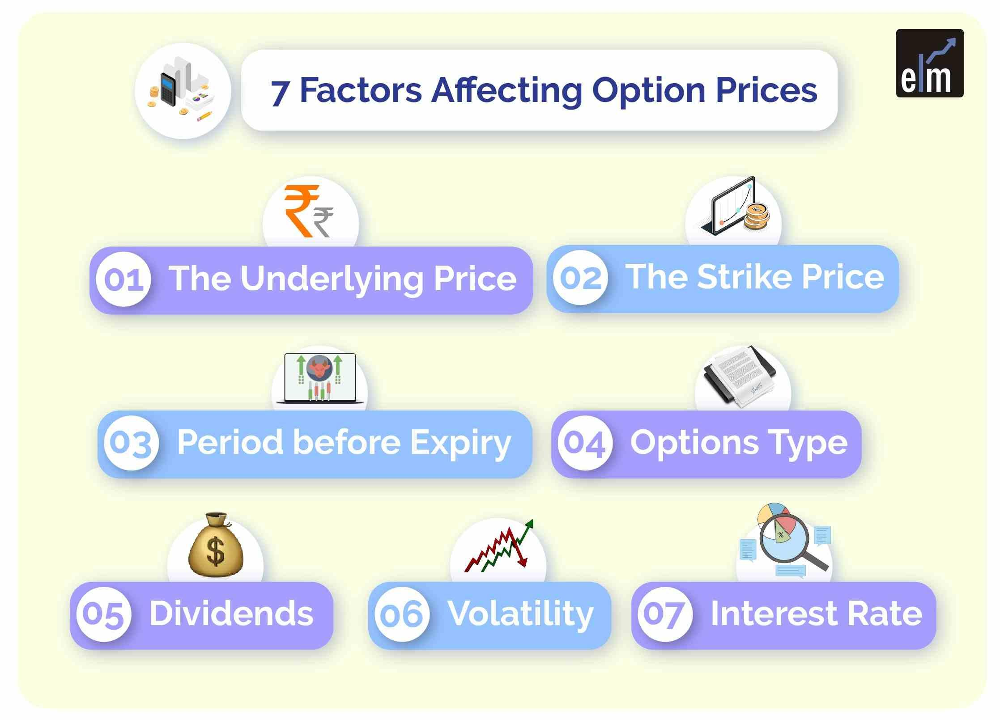

## Table of Contents

## What is an option in financial markets?

An option in financial markets is a contract that gives the buyer the right, but not the obligation, to buy or sell an asset at a specific price within a certain time. The asset could be stocks, commodities, or currencies. There are two main types of options: call options, which give the buyer the right to buy the asset, and put options, which give the right to sell the asset.

Options are used by investors for different reasons. Some use them to make money by betting on the future price movements of the asset. Others use options to protect their investments. For example, if an investor owns a stock and is worried that its price might fall, they can buy a put option to sell the stock at a set price, even if the market price drops. This way, they limit their potential losses.

## How do options differ from stocks and bonds?

Options are different from stocks and bonds because they give you the right, but not the obligation, to do something. When you buy a stock, you own a piece of a company. If the company does well, the value of your stock might go up. When you buy a bond, you are lending money to a company or government, and they promise to pay you back with interest. But with an option, you're not buying a piece of a company or lending money. You're buying the right to buy or sell an asset at a certain price in the future.

Options are also different because they have an expiration date. Stocks and bonds can be held for as long as you want, but options will expire after a set time. If you don't use your option before it expires, it becomes worthless. This makes options riskier but also gives them the potential for bigger rewards. Stocks and bonds are usually seen as more stable investments, while options can be used for both protection and speculation.

## What are the basic types of options?

There are two basic types of options: call options and put options. A call option gives you the right to buy an asset at a certain price before the option expires. If you think the price of the asset will go up, you might buy a call option. This way, you can buy the asset at the lower price set in the option, and then sell it at the higher market price to make a profit.

A put option gives you the right to sell an asset at a certain price before the option expires. If you think the price of the asset will go down, you might buy a put option. This can protect you if you already own the asset because you can sell it at the higher price set in the option, even if the market price drops. Put options can also be used to make money by betting that the price of an asset will fall.

## What is option pricing and why is it important?

Option pricing is about figuring out how much an option is worth. This is important because it helps people decide if buying or selling an option is a good idea. The price of an option depends on things like how much time is left before it expires, how much the price of the asset moves around, and how far the asset's current price is from the price set in the option. A popular way to figure out option prices is using a model called the Black-Scholes model, which uses math to estimate what an option should cost.

Understanding option pricing is key for anyone trading options. If you think an option is priced too low, you might want to buy it because you believe it's a good deal. If you think it's priced too high, you might want to sell it or avoid buying it. Getting option pricing right helps traders make smarter choices and manage their risks better. It's like knowing the real value of something before you decide to buy or sell it.

## What is the role of the underlying asset in option pricing?

The underlying asset is really important when figuring out how much an option is worth. This is the thing, like a stock or a commodity, that the option gives you the right to buy or sell. The price of the underlying asset is the main thing that decides how much the option is worth. If the price of the underlying asset goes up a lot, a call option that lets you buy it at a lower price becomes more valuable. On the other hand, if the price of the underlying asset goes down a lot, a put option that lets you sell it at a higher price becomes more valuable.

The price of the underlying asset also affects how much the option's price might change. If the underlying asset's price moves around a lot, the option's price can change a lot too. This is called volatility, and it makes options more valuable because there's a bigger chance the option will end up being worth using. So, the underlying asset is key in figuring out the option's price because it sets the starting point and affects how much the option's price might go up or down.

## How does the expiration date affect option pricing?

The expiration date of an option is super important when figuring out its price. The more time there is until the option expires, the more valuable it can be. This is because there's more time for the price of the underlying asset to move in a way that makes the option worth using. So, an option that expires in a year will usually be worth more than one that expires in a month, even if everything else about them is the same.

As the expiration date gets closer, the option's price usually goes down. This happens because there's less time left for the underlying asset's price to move in a way that makes the option valuable. If the price of the underlying asset isn't close enough to the price set in the option as the expiration date nears, the option might end up being worth nothing at all. So, the time until the expiration date is a big part of what makes an option more or less valuable.

## What is the impact of volatility on option prices?

Volatility is a big deal when it comes to option prices. It's all about how much the price of the underlying asset moves around. If the price of the asset goes up and down a lot, that's high volatility. When there's high volatility, options become more valuable. This is because there's a bigger chance that the price of the asset will move in a way that makes the option worth using. So, if you're thinking about buying an option, you might be willing to pay more for it if the underlying asset is really volatile.

On the other hand, if the price of the asset doesn't move around much, that's low volatility. When there's low volatility, options are usually less valuable. This is because there's less chance that the price of the asset will move enough to make the option worth using. So, if you're thinking about selling an option, you might be able to get away with charging less for it if the underlying asset isn't very volatile. In short, higher volatility means higher option prices, and lower volatility means lower option prices.

## How do interest rates influence option pricing?

Interest rates play a part in figuring out how much an option is worth. When interest rates go up, call options usually become more valuable. This is because if you buy a call option, you're not spending money right away to buy the asset. Instead, you can put that money into something that earns interest. So, higher interest rates mean you get more interest on the money you didn't spend, which makes the call option more attractive. On the other hand, put options usually become less valuable when interest rates go up because they're like selling the asset and then having to wait to get your money back, which means you miss out on the interest you could have earned.

The opposite happens when interest rates go down. Call options become less valuable because you're not earning as much interest on the money you didn't spend to buy the asset. Put options, however, become more valuable because you don't lose out on as much interest when you sell the asset and wait to get your money back. So, interest rates are another thing to think about when deciding how much an option is worth, along with the price of the underlying asset, how much time is left before the option expires, and how much the price of the asset moves around.

## What are the Greeks in option pricing and what do they represent?

The Greeks are special terms used in option pricing to help traders understand how different things affect the value of an option. They are called the Greeks because their names start with Greek letters. The main Greeks are Delta, Gamma, Theta, Vega, and Rho. Each one tells you something different about how the option's price might change. Delta tells you how much the option's price will change if the price of the underlying asset goes up or down by one dollar. Gamma tells you how much Delta will change when the price of the underlying asset moves. Theta shows how much the option's value goes down as time passes, which is important because options have an expiration date. Vega measures how much the option's price changes with changes in the volatility of the underlying asset. And Rho tells you how the option's price changes with changes in interest rates.

Understanding the Greeks can really help traders make better decisions. For example, if you know the Delta of your option, you can guess how much money you might make or lose if the price of the underlying asset changes. If you know the Theta, you can see how much time is working against you, which is important because options lose value as they get closer to expiring. Vega is useful because it shows how much the option's price might change if the market starts to move around a lot more or a lot less. And Rho, while often less important, can still matter if interest rates are changing a lot. By keeping an eye on these Greeks, traders can better manage their risks and make smarter choices about which options to buy or sell.

## How does the Black-Scholes model work in determining option prices?

The Black-Scholes model is a way to figure out how much an option should cost. It uses a special math formula that takes into account things like the current price of the underlying asset, how much time is left before the option expires, the price set in the option (called the strike price), how much the price of the underlying asset moves around (called volatility), and the interest rate. The model helps traders decide if an option is priced right by giving them an estimate of what it should be worth based on these factors.

When you use the Black-Scholes model, you put all these numbers into the formula, and it spits out a number that tells you the fair price for the option. For example, if the underlying asset's price is high and there's a lot of time left before the option expires, the model might say the option is worth more. If the price of the underlying asset is far away from the strike price and there's not much time left, the model might say the option is worth less. This helps traders make better decisions about buying or selling options because they can compare the model's price to what the option is actually selling for in the market.

## What are some advanced models beyond Black-Scholes used for option pricing?

Besides the Black-Scholes model, there are other advanced models used for figuring out option prices. One of these is the Binomial Options Pricing Model. This model works by breaking down the time until the option expires into smaller steps and figuring out what might happen to the price of the underlying asset at each step. It's like playing a game where you guess if the price will go up or down, and then you see what the option is worth at the end. This model is good because it can handle things like early exercising of options, which the Black-Scholes model can't do as easily.

Another advanced model is the Monte Carlo Simulation. This model uses random numbers to guess what might happen to the price of the underlying asset over time. It runs a bunch of different scenarios to see how the option's price might change in each one. By looking at all these different outcomes, the model can give you a good idea of what the option is worth. This method is really useful for pricing options that are more complicated, like options on assets that pay dividends or options that depend on more than one underlying asset.

## How do market conditions and investor sentiment affect option pricing?

Market conditions and investor sentiment can really change how much an option is worth. When the market is doing well and people are feeling good about it, they might be more willing to take risks. This can push up the prices of options because more people want to buy them, thinking they'll make money. On the other hand, if the market is doing badly and people are worried, they might not want to take as many risks. This can make option prices go down because fewer people want to buy them. Also, if there's a lot of uncertainty in the market, like before an important election or a big news event, people might think the price of the underlying asset will move around a lot. This can make options more valuable because there's a bigger chance they'll be worth using.

Investor sentiment can also affect how much people are willing to pay for options. If a lot of people think the price of the underlying asset is going to go up, they might buy a lot of call options, which can drive up the price of those options. If people think the price is going to go down, they might buy a lot of put options, which can drive up the price of those options. Sometimes, if a lot of people are buying the same kind of option, it can create a kind of bubble where the price goes up more than it should based on the actual value of the option. This is why it's important to keep an eye on what other people are thinking and doing in the market when you're trying to figure out how much an option is worth.

## What are the Principles of Option Pricing?

Options are financial derivatives that provide buyers with the right, but not the obligation, to either purchase or sell an underlying asset at a pre-set price, known as the strike price, before a specified expiration date. The pricing of options is influenced by various components, including the current market price of the underlying asset, strike price, time until expiration, prevailing interest rates, and market [volatility](/wiki/volatility-trading-strategies). 

### Key Components of Option Pricing

1. **Underlying Asset Price**: The current price of the asset on which the option is based plays a significant role in determining the option's value. If the market price of the asset is higher than the strike price for call options, or lower for put options, the option is considered to be "in-the-money."

2. **Strike Price**: This is the predetermined price at which the underlying asset can be bought or sold. The relationship between the strike price and the current market price of the asset influences whether an option is "in-the-money," "at-the-money," or "out-of-the-money."

3. **Time to Expiration**: The amount of time until the option's expiration date can affect the option's premium. Generally, the longer the time until expiration, the higher the premium, as there is more opportunity for the underlying asset's price to become favorable.

4. **Interest Rates**: Interest rates impact the cost of carrying the option until expiration. Higher interest rates can increase the present value of the option premium, especially for call options.

5. **Market Volatility**: This measures the extent of price fluctuations in the underlying asset. Higher volatility often results in higher option premiums, as there is increased potential for significant changes in the asset's price before expiration.

### Option Pricing Models

To calculate the theoretical price of options, several mathematical models are employed, with the Black-Scholes and Binomial models being the most prevalent.

- **Black-Scholes Model**: Developed by Fischer Black, Myron Scholes, and Robert Merton, this model provides a closed-form solution for pricing European call and put options. It assumes a constant volatility and interest rate. The formula for a European call option is:
$$
  C = S_0N(d_1) - Xe^{-rt}N(d_2)

$$

  Where:
  - $C$ is the call option price
  - $S_0$ is the current price of the stock
  - $X$ is the strike price
  - $r$ is the risk-free interest rate
  - $t$ is the time to expiration
  - $N(d)$ is the cumulative distribution function of the standard normal distribution
  - $d_1 = \frac{\ln(S_0/X) + (r + \sigma^2/2)t}{\sigma\sqrt{t}}$
  - $d_2 = d_1 - \sigma\sqrt{t}$
  - $\sigma$ is the volatility of the stock's returns

- **Binomial Model**: This model accounts for discrete time intervals and is applicable to American options, which can be exercised at any point before expiration. The model creates a price tree, projecting potential future prices of the underlying asset at different time intervals.

These models provide a foundational understanding for traders and financial analysts engaged in options trading, aiding in the formulation of strategies and the assessment of market movements. Understanding these elements is essential for navigating the complexities of financial derivatives markets.

## What market factors influence option pricing?

Several market factors significantly impact option pricing, with volatility, interest rates, and the underlying asset's price movements being the most influential.

**Volatility**: This is a crucial determinant in option pricing as it measures the extent of price variation over time. High volatility signifies a higher potential for the asset price to fluctuate significantly, leading to greater uncertainty about future price levels. Consequently, options on assets with higher volatility typically have higher premiums. This is because the potential for large price movements increases the potential payout of the option, making it more valuable. The Black-Scholes model, a widely used tool in options pricing, quantifies the impact of volatility on option prices using the formula for standard deviation as a measure of volatility. For an asset with price $S$, volatility $\sigma$, and time to expiration $T$, the option price can be influenced by these factors.

**Interest Rates**: The prevailing interest rates influence the cost of holding an option. An increase in interest rates makes call options more attractive and put options less attractive. This is because higher interest rates imply a higher present value of the exercise price and a lower present value of dividends foregone on the underlying asset. In the context of the Black-Scholes model, the risk-free interest rate $r$ is a critical component that affects the pricing of the option:

$$
C = S_0 \cdot N(d_1) - X \cdot e^{-rt} \cdot N(d_2)
$$

where $C$ is the call option price, $S_0$ is the current asset price, $X$ is the exercise price, $t$ is time to expiration, $N$ is the cumulative distribution function of the standard normal distribution, and $e$ is the base of the natural logarithm.

**Supply and Demand Dynamics**: The supply and demand for options in the market also play a crucial role in pricing. High demand for particular options can drive up their prices, whereas an oversupply can lead to a decrease. This dynamic is influenced by market participants' expectations of future price movements and the perceived risk associated with the underlying asset. Traders' sentiment and speculative activities can also contribute to fluctuations in option prices, even if there is no fundamental change in the underlying asset's value.

These market factors collectively contribute to the complexity of option pricing and necessitate the use of sophisticated models and tools for accurate valuation by traders and analysts. Understanding these influences is essential for effectively managing risk and optimizing trading strategies in the derivatives market.

## References & Further Reading

[1]: Black, F., & Scholes, M. (1973). ["The Pricing of Options and Corporate Liabilities."](https://www.cs.princeton.edu/courses/archive/fall09/cos323/papers/black_scholes73.pdf) Journal of Political Economy, 81(3), 637-654.

[2]: Hull, J. (2017). ["Options, Futures, and Other Derivatives."](https://books.google.com/books/about/Options_Futures_and_Other_Derivatives_eB.html?id=2iopDwAAQBAJ) Pearson.

[3]: Merton, R.C. (1973). ["Theory of Rational Option Pricing."](https://www.jstor.org/stable/3003143) The Bell Journal of Economics and Management Science, 4(1), 141-183.

[4]: Chan, E. P. (2009). ["Quantitative Trading: How to Build Your Own Algorithmic Trading Business."](https://github.com/ftvision/quant_trading_echan_book) Wiley.

[5]: Jansen, S. (2020). ["Machine Learning for Algorithmic Trading."](https://github.com/stefan-jansen/machine-learning-for-trading) Packt Publishing.

[6]: Lopez de Prado, M. (2018). ["Advances in Financial Machine Learning."](https://www.amazon.com/Advances-Financial-Machine-Learning-Marcos/dp/1119482089) Wiley.

[7]: Aronson, D. (2006). ["Evidence-Based Technical Analysis: Applying the Scientific Method and Statistical Inference to Trading Signals."](https://www.amazon.com/Evidence-Based-Technical-Analysis-Scientific-Statistical/dp/0470008741) Wiley.

[8]: Gatheral, J. (2006). ["The Volatility Surface: A Practitioner's Guide."](https://github.com/PlamenStilyianov/Quant/blob/master/Gatheral%20J.%20The%20volatility%20surface..%20A%20practitioner%27s%20guide%20(Wiley%2C%202006)(ISBN%200471792519)(210s)_FD_.pdf) Wiley.

[9]: Brigo, D., & Mercurio, F. (2006). ["Interest Rate Models - Theory and Practice with Smile, Inflation, and Credit."](https://link.springer.com/book/10.1007/978-3-540-34604-3) Springer.