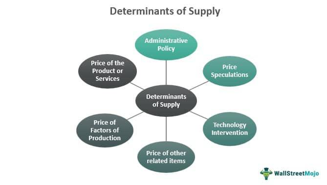

Supply elasticity is a fundamental concept in economics that refers to the sensitivity of the quantity of a good that producers are willing to supply to changes in price. This sensitivity is quantified using the supply elasticity coefficient, which is a measure of how much the quantity supplied changes in response to a price change. The formula for calculating supply elasticity ($E_s$) is given by:

$$



E_s = \frac{\%\ \text{change in quantity supplied}}{\%\ \text{change in price}} 
$$

Supply elasticity plays a pivotal role in shaping economic decisions and market dynamics. It influences how producers adjust their production levels in response to price changes, which can affect market equilibrium, pricing strategies, and resource allocation. For example, in markets where supply is highly elastic, producers can rapidly increase production in response to rising prices, potentially stabilizing prices and ensuring availability. Conversely, in markets with inelastic supply, price increases may lead to significant shortages, causing volatility and inefficiencies.

In recent years, the advent of algorithmic trading has introduced a new dimension to the discussion of supply elasticity. Algorithmic trading involves using automated systems and complex algorithms to execute trading orders at high speed and with precision. By incorporating supply elasticity metrics, these systems can make informed decisions about trade execution, optimize strategies under varying market conditions, and potentially gain a competitive edge through rapid adaptation.

The purpose of this article is to explore how factors such as production capacity, resource availability, and technological advancements affect supply elasticity, and how algorithmic trading systems leverage these insights. Understanding the interaction between supply elasticity and algorithmic trading is essential in the modern economic landscape, as it shapes the way markets operate, influences policy decisions, and drives the development of trading technologies. As markets become increasingly complex and interconnected, a comprehensive understanding of these topics is invaluable for professionals engaged in economics and finance, enabling them to better navigate the challenges and opportunities that arise.

## Table of Contents

## Understanding Supply Elasticity

Supply elasticity, in economics, refers to the responsiveness of the quantity supplied of a good to a change in its price. It is quantified by the elasticity coefficient, which measures how much the quantity supplied changes in response to price changes. This concept is crucial for understanding how suppliers react to market signals, which in turn affects pricing, production, and overall market equilibrium.

There are several types of supply elasticity, each describing a different degree of responsiveness:

1. **Perfectly Elastic Supply**: This occurs when any small change in price leads to an infinite change in quantity supplied. A perfectly elastic supply curve is a horizontal line. For instance, a very competitive market for standardized products might reflect this characteristic since suppliers can easily adjust their output without affecting the price.

2. **Perfectly Inelastic Supply**: Here, the quantity supplied remains constant irrespective of price changes. The supply curve is a vertical line. An example could be a unique resource like original art pieces from a deceased artist, where the supply can't be increased regardless of price.

3. **Unitary Elastic Supply**: This type occurs when the percentage change in quantity supplied is exactly equal to the percentage change in price. The supply curve in this case is a proportionate slope.

4. **Elastic Supply**: Supply is considered elastic when a small change in price results in a significant change in quantity supplied. For example, smartphone manufacturers can increase output relatively easily in response to rising market prices due to technological advancements and scalable production processes.

5. **Inelastic Supply**: This occurs when a change in price results in a relatively smaller change in quantity supplied. Agricultural goods in the short term often exhibit inelastic supply, as it is difficult to adjust production levels quickly.

The mathematical formula to calculate supply elasticity ($E_s$) is:

$$

E_s = \frac{\text{\% change in quantity supplied}}{\text{\% change in price}} 
$$

Where:

$$

E_s = \frac{\Delta Q/Q}{\Delta P/P} = \frac{P}{Q} \times \frac{\Delta Q}{\Delta P} 
$$

Here, $\Delta Q$ and $\Delta P$ are changes in quantity and price, and $Q$ and $P$ are the initial quantity supplied and price, respectively. An elasticity greater than one indicates elastic supply, less than one indicates inelastic supply, and equal to one is unitary elastic supply.

Supply elasticity holds significant implications in economic theory and practice. It affects producer decision-making, government policies on taxation, and understanding market dynamics. For example, it helps businesses decide whether to enter or [exit](/wiki/exit-strategy) a market based on their ability to respond to price changes. Policymakers use it to predict how changes in taxes or subsidies might affect the overall supply of goods and services, influencing economic planning and regulation. Understanding supply elasticity is therefore vital for predicting market reactions and making informed decisions in both business and public policy contexts.

## Factors Affecting Supply Elasticity

Supply elasticity is influenced by several key factors, each playing a crucial role in determining how the quantity of goods supplied responds to price changes. Understanding these factors is vital for predicting and analyzing market behavior.

**Production Capacity**

Production capacity significantly impacts supply elasticity. If a producer can increase output easily and quickly in response to price increases, the supply is considered elastic. In contrast, if production involves complex processes or long lead times, the supply tends to be inelastic. For instance, manufacturing industries with flexible production lines can adjust their output more readily compared to those with fixed capacities, such as oil refineries.

**Availability of Resources**

The ease with which firms can access necessary inputs also affects supply elasticity. An abundant supply of raw materials and labor tends to make the supply more elastic, as firms can ramp up production without significant cost increases. Conversely, limited or scarce resources can create bottlenecks, making it difficult to increase supply when prices rise, thus resulting in inelastic supply.

**Time Frame for Production**

The time required to adjust production levels directly influences supply elasticity. In the short term, supply is often inelastic because firms cannot immediately alter production volumes due to existing contracts or production schedules. Over the long term, however, firms can invest in new capacity or technologies to adjust their supply levels, making the supply more elastic.

**Technological Advancements**

Technological progress can enhance supply elasticity by reducing production costs and time. Advanced manufacturing technologies, automation, and improved logistics systems allow firms to respond more quickly to market demands. For example, the adoption of just-in-time inventory systems and advanced robotics can significantly boost a firm’s ability to adjust supply dynamically.

**Government Regulations and Market Conditions**

Regulatory environments and market conditions profoundly influence supply elasticity. Strict regulations, such as environmental laws and zoning restrictions, can limit production flexibility, making supply more inelastic. In contrast, deregulation or supportive policies can enhance supply elasticity by removing barriers to resource allocation and production expansion.

**External Factors: Global Supply Chain Dynamics and Geopolitical Events**

Global supply chains and geopolitical events also play a critical role. Disruptions in global logistics, such as shipping delays or trade restrictions, can constrain supply elasticity by limiting the availability of necessary inputs. Geopolitical tensions may lead to abrupt supply chain interruptions, making it challenging for producers to maintain consistent output levels.

**Industry-Specific Characteristics**

Different industries inherently possess varying levels of supply elasticity due to their unique characteristics. For instance, agricultural products often exhibit inelastic supply because of the lengthy production cycle and dependence on natural conditions. Conversely, the technology sector, with its rapid innovation cycles and ability to scale production quickly, tends to have more elastic supply.

In summary, supply elasticity is shaped by a myriad of interconnected factors ranging from production capabilities to external geopolitical influences. These determinants must be considered to accurately assess market dynamics and formulate effective economic strategies.

## Algorithmic Trading in the Context of Supply Elasticity

Algorithmic trading refers to the use of computer algorithms to automate and execute trades at speeds and frequencies much greater than those of human traders. These systems can process high volumes of data and make trading decisions based on predefined criteria. As financial markets have evolved, [algorithmic trading](/wiki/algorithmic-trading) has grown significantly, accounting for a substantial portion of trading activity in major exchanges globally. This growth stems from the increasing need for efficiency, precision, and the ability to respond swiftly to market changes.

In the context of supply elasticity, algorithmic trading systems incorporate various market dynamics to optimize trading strategies. Supply elasticity refers to the responsiveness of the quantity supplied of a good to a change in its price. Understanding this concept is crucial for predicting price movements and adjusting trading strategies accordingly. Algorithmic systems leverage supply elasticity information to assess potential price fluctuations and market trends, allowing traders to capitalize on favorable market conditions.

One advantage of using algorithmic trading in relation to supply dynamics is its capacity to manage large datasets and perform complex calculations instantaneously. Algorithms can adjust trading parameters based on real-time data, which is particularly beneficial when supply elasticity factors change due to unexpected shifts in production capacity, technological advancements, or regulatory policies. By incorporating elasticity metrics, algorithms can enhance decision-making processes, offering a competitive edge in the fast-paced trading environment.

Real-time data and automation further enhance the responsiveness of algorithmic trading systems. Automation allows these systems to execute trades based on current supply and demand conditions without manual intervention. The ability to quickly interpret incoming data streams ensures that trading strategies remain aligned with the latest market developments. For instance, if an external [factor](/wiki/factor-investing), such as a natural disaster, affects supply chains, algorithmic systems can rapidly adjust to mitigate potential risks and exploit new opportunities.

Despite these benefits, there are challenges and drawbacks associated with algorithmic trading in dynamic supply conditions. Algorithms are typically designed based on historical data and may not adequately account for unforeseen events or non-linear supply chain disruptions, potentially leading to significant losses. Moreover, reliance on algorithms can introduce systemic risks, as simultaneous actions by multiple algorithms might exacerbate market [volatility](/wiki/volatility-trading-strategies). Market participants must continuously refine and test their algorithms to ensure robust performance in diverse supply scenarios.

In conclusion, understanding and integrating supply elasticity into algorithmic trading systems provide significant advantages in optimizing trading strategies. However, it is essential to recognize the limitations and potential risks associated with reliance on algorithmic models, emphasizing the need for continuous improvement and adaptation to the evolving economic landscape.

## Case Studies: Supply Elasticity and Algorithmic Trading

Supply elasticity is a critical factor that can significantly impact market outcomes, particularly when intertwined with algorithmic trading. These systems, employing advanced computational techniques, adjust trading strategies based on fluctuations in supply elasticity, thereby affecting broader market dynamics.

### Case Study 1: Commodities Market

In commodity markets, supply elasticity plays a crucial role. For instance, let's consider the oil market. The elasticity of oil supply is often limited due to high production and investment costs, and geopolitical factors. During situations where geopolitical tensions disrupt supply chains, oil supplies can become even more inelastic. Algorithmic trading systems, designed to swiftly analyze vast amounts of data in real-time, can detect these changes and adjust trading strategies accordingly.

For example, in a scenario where a major oil-producing country faces sanctions, reducing the global oil supply, algorithms may rapidly incorporate this supply constraint into their pricing models. This enables traders to make timely decisions that reflect the new market equilibrium. By recognizing inelastic supply conditions, algorithms help prevent substantial financial losses that might occur due to delayed human responses.

### Case Study 2: Retail Sector

In the retail sector, supply elasticity can vary, particularly in e-commerce. Using algorithmic trading, companies like Amazon have developed sophisticated systems to adjust prices based on supply and demand conditions. These algorithms analyze supply chain dynamics, such as stock levels and lead times. Suppose an item’s supply becomes constrained due to increased demand and slower production times. In such a case, pricing algorithms might increase prices to balance demand with the reduced supply, thus maximizing revenue without manual intervention.

Python Code Example:
```python
def adjust_price(stock_level, lead_time, demand):
    base_price = 100  # Assume a base price
    price = base_price * (1 + (demand / stock_level) * (1 + lead_time))
    return price

# Example usage
adjusted_price = adjust_price(stock_level=50, lead_time=2, demand=70)
print(f"Adjusted Price: {adjusted_price}")
```

### Lessons Learned and Integration

These case studies illustrate how understanding supply elasticity can be crucial for developing responsive and effective algorithmic trading strategies. Integrating economic theory with algorithmic models allows for the anticipation of market shifts and optimization of trading approaches. A critical lesson is the need for adaptability in algorithms to account for sudden changes in supply conditions.

### Role of Data Analysis and Machine Learning

Machine learning and data analysis are pivotal in refining algorithmic responses. Real-time data feeds provide inputs for [machine learning](/wiki/machine-learning) models that predict supply elasticity changes. By analyzing historical data and recognizing patterns, algorithms can improve their predictive capabilities, resulting in more reliable trading strategies.

### Future Trends and Developments

Future developments in this field may include more sophisticated machine learning models that better account for complex interactions between supply elasticity and market variables. Advances in [artificial intelligence](/wiki/ai-artificial-intelligence) could lead to more autonomous trading systems that require minimal human oversight. Moreover, the continuous expansion of data sources, including Internet of Things (IoT) data in supply chains, will likely enhance the precision of these algorithmic strategies.

As markets and technologies evolve, the ability to harness and integrate insights from supply elasticity will remain vital for maintaining a competitive edge in algorithmic trading. Understanding these interactions can lead to more resilient and adaptable financial systems, prepared to handle the dynamic nature of global supply and demand conditions.

## Conclusion

Supply elasticity is a fundamental concept within economics that plays a crucial role in understanding how changes in prices influence the quantity supplied of goods and services. It reflects the responsiveness of producers to price variations and is determined by several factors such as production capacity, availability of resources, technological advancements, and regulatory conditions. Understanding these determinants is vital for both economic theory and practical applications, providing insights into market dynamics and decision-making processes.

The integration of supply elasticity into algorithmic trading underscores the intersection between traditional economic concepts and modern financial practices. Algorithmic trading systems, which now account for a significant portion of trading activities in financial markets, leverage supply elasticity by incorporating real-time data to optimize trading strategies. This synergy between supply elasticity and algorithmic trading enhances market efficiency and responsiveness, offering a competitive edge that can lead to significant financial gains.

For professionals in economics and finance, a thorough comprehension of supply elasticity and its interplay with algorithmic trading can yield fruitful insights into market behavior and strategy optimization. It is crucial for these professionals to stay informed about technological advancements that perpetually reshape market environments. As technologies continue to evolve, they promise further enhancements in algorithmic trading systems, enabling them to adapt more quickly and effectively to shifts in supply conditions.

In conclusion, the evolving landscape of algorithmic trading stands as a testament to the dynamic nature of modern financial markets. This necessitates ongoing research and education to harness its full potential. Moreover, understanding the theoretical underpinnings of supply elasticity not only enriches economic knowledge but also elevates practical capabilities in deploying automated trading strategies. As such, exploring the synergistic relationship between economic principles and technological innovations remains paramount for those seeking to thrive in contemporary and future market landscapes.

## References & Further Reading

[1]: Besomi, D. (2006). ["The Demand for Quantity and Supply Elasticities in Economic Analysis."](https://ocw.mit.edu/courses/14-01sc-principles-of-microeconomics-fall-2011/pages/unit-1-supply-and-demand/elasticity/) Munich Personal RePEc Archive.

[2]: Martinez-Jaramillo, S., Tsang, E., & Zic, J. (2005). ["Elucidating Generic Demand and Supply Elasticities for Stable Strategies in Agent-based Computational Economics."](https://www.sciencedirect.com/science/article/pii/S1877050917303447) International Conference on Computational Intelligence in Economics and Finance.

[3]: Lopez de Prado, M. (2018). ["Advances in Financial Machine Learning."](https://www.amazon.com/Advances-Financial-Machine-Learning-Marcos/dp/1119482089) Wiley.

[4]: Chan, E. (2009). ["Quantitative Trading: How to Build Your Own Algorithmic Trading Business."](https://github.com/ftvision/quant_trading_echan_book) Wiley.

[5]: Hull, J. (2017). ["Options, Futures, and Other Derivatives."](https://books.google.com/books/about/Options_Futures_and_Other_Derivatives_eB.html?id=2iopDwAAQBAJ) Pearson.

[6]: Aronson, D. R. (2006). ["Evidence-Based Technical Analysis: Applying the Scientific Method and Statistical Inference to Trading Signals."](https://www.amazon.com/Evidence-Based-Technical-Analysis-Scientific-Statistical/dp/0470008741) Wiley.

[7]: Jansen, S. (2018). ["Machine Learning for Algorithmic Trading: Predictive Models to Extract Signals from Market and Alternative Data for Systematic Trading Strategies with Python."](https://github.com/stefan-jansen/machine-learning-for-trading) Packt Publishing.