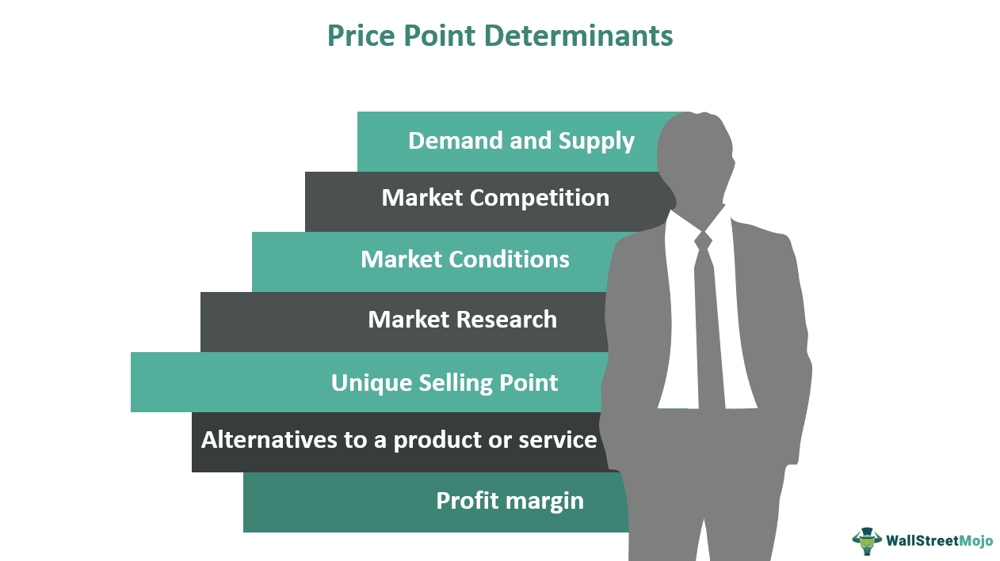

Stock price, company valuation, market capitalization, and algorithmic trading are fundamental concepts that shape the financial markets. Each of these terms carries weight in the decision-making processes of investors, analysts, and financial institutions.

The stock price is the current value of a company’s shares on the market. It fluctuates based on the forces of supply and demand. Investors and traders buy and sell stocks, adjusting prices in response to news, earnings reports, and economic indicators. The stock price reflects the market’s perception of a company's future prospects and profitability.

Company valuation is an estimation of the total worth of a business. Techniques such as discounted cash flow (DCF) analysis, price-to-earnings (P/E) ratios, and asset-based valuations help determine this value. Valuation plays a critical role not only in mergers and acquisitions but also in guiding investment choices.

Market capitalization, often referred to as market cap, represents a company's size as measured by the market value of its outstanding shares. It is calculated by multiplying the current stock price by the total number of outstanding shares. Market cap categorizes companies into different sizes—large-cap, mid-cap, and small-cap—each bearing distinct risk and growth potential characteristics.

Algorithmic trading involves using computer algorithms to execute trades at speeds and frequencies that are impossible for human traders. Algorithms analyze market conditions, identify trading opportunities, and execute orders systematically. This type of trading has become increasingly prevalent, contributing to market liquidity and efficiency. However, it also introduces complexities regarding market dynamics and stock price volatility.

These concepts are intricately connected. The stock price influences market cap, as higher stock prices can elevate a company's valuation. Algorithmic trading can cause rapid changes in stock prices, affecting both market cap and perceived company valuation. Understanding these relationships is essential for navigating the complexities of modern financial markets and making informed investment decisions.

## Table of Contents

## Understanding Stock Price and Company Valuation

Stock price is a critical metric in the financial markets, representing the current value at which a share of a company’s stock is trading on the market. It serves as a real-time indicator of a company's financial health and market perception. Stock prices are driven by the basic economic principle of supply and demand. When more investors want to buy a stock than sell it, the price rises, and conversely, when more want to sell than buy, the price drops. 

Company valuation, or the process of determining the economic value of a business, is intrinsically linked to stock prices. The valuation reflects potential earnings, assets, liabilities, and growth prospects, influencing investor behavior and consequently stock prices. Notably, while stock price reflects the current market consensus of a company's value, comprehensive company valuation considers both tangible elements, such as assets, and intangible ones, like brand reputation and market position.

Several methods exist for valuing a company, each providing insights from different angles. Fundamental analysis is one such approach, focusing on intrinsic value by examining related economic, financial, and other qualitative and quantitative factors. This method involves assessing a company's financial statements, such as the income statement, balance sheet, and cash flow statement, to determine its true value. Key ratios used in [fundamental analysis](/wiki/fundamental-analysis) include the Price-to-Earnings (P/E) ratio, which compares a company's current share price to its per-share earnings. The formula for the P/E ratio is:

$$
\text{P/E Ratio} = \frac{\text{Market Value per Share}}{\text{Earnings per Share (EPS)}}
$$

Other valuation methods include the Discounted Cash Flow (DCF) method, calculating the present value of projected future cash flows, and using multiples of comparable companies' valuation metrics. These methods help investors determine whether a stock is undervalued or overpriced compared to its intrinsic value. By combining insights from stock prices and comprehensive valuations, investors and analysts can make informed decisions about the feasibility and potential of investing in particular stocks.

## Market Cap: A Measure of Company Size

Market capitalization, often referred to as "market cap," is a widely used metric for assessing the size and value of publicly traded companies. It is calculated by multiplying the total number of a company's outstanding shares by the current market price per share. The formula for market capitalization is:

$$
\text{Market Cap} = \text{Share Price} \times \text{Number of Outstanding Shares}
$$

Market capitalization serves as a fundamental indicator of a company's market value, reflecting the total equity value as perceived by investors. It is crucial in providing a snapshot of a company's size without the complexities of other financial metrics.

Market cap differs from other valuation metrics like enterprise value or book value. While book value measures a company's net asset value based on historical accounting data, enterprise value includes the company's debt and subtracts cash, offering a more comprehensive understanding of a firm's total value. Market cap, however, focuses strictly on equity value and is more volatile due to its sensitivity to stock price changes.

One significant use of market capitalization is to categorize companies into groups based on their size. Generally, companies are classified into three broad categories:

1. **Large-cap**: Companies with a market capitalization of $10 billion or more. These companies often have a long track record, stable earnings, and a substantial presence in their industries. Examples include Apple, Microsoft, and Amazon.

2. **Mid-cap**: Firms with market caps between $2 billion and $10 billion. Mid-cap companies are typically in a growth phase and carry more risk than large-cap stocks but have more growth potential. Examples include Dunkin' Brands and Carvana.

3. **Small-cap**: Businesses valued between $300 million and $2 billion. These companies are often young and feature in emerging industries, offering high growth potential, albeit with higher volatility and risk. Examples include Redfin and Sally Beauty Holdings.

Market cap is often utilized by investors as a proxy for a company's investment risk level. Large-cap stocks are generally considered safer investments due to their established nature and dominant market positions, while small-cap stocks might offer high returns but with heightened risk. Understanding the differences in market cap categories assists investors in diversifying their portfolios and aligning their investments with their risk tolerance and financial goals.

This classification not only aids investors in understanding the risk and return profile of their investments but also helps track trends and performance in different sectors of the economy. Consequently, market cap remains a central component in the toolkit of individual and institutional investors alike.

## The Dynamics of Market Capitalization

Market capitalization, commonly known as market cap, is a crucial indicator of a company's overall size and financial health in the stock market. It is determined by multiplying the current stock price by the total number of outstanding shares:

$$
\text{Market Cap} = \text{Stock Price} \times \text{Number of Outstanding Shares}
$$

### Factors Influencing Market Cap Changes

1. **Stock Price Fluctuations:**
   The most direct influence on market capitalization is the fluctuation of a company's stock price. Since market cap is a function of stock price, any increase or decrease in stock price will proportionately affect the market cap. Stock prices can fluctuate due to various factors, including financial performance, changes in investor expectations, macroeconomic conditions, and overall market trends.

2. **Impact of Share Buybacks and Issuance:**
   Companies often engage in share buybacks or issuance, affecting the total number of outstanding shares. 

   - **Share Buybacks:** When a company buys back its own shares, the number of outstanding shares decreases. If the stock price remains constant, this results in an increase in the market cap per remaining share, as the earnings or value now represent fewer shares. This can signal confidence in the company's future prospects and can artificially inflate the market cap.

   - **Share Issuance:** Conversely, when a company issues additional shares, the total number of outstanding shares increases. If the stock price remains unchanged, the market cap increases, but the earnings or value are now distributed across more shares, which might dilute the value per share if the issuance is not accompanied by an increase in overall earnings or growth prospects.

### Market Cap as a Risk Indicator

Using market capitalization as a risk indicator is a debated topic. Generally, companies are categorized into large-cap, mid-cap, and small-cap, representing varying levels of risk and growth potential:

- **Large-Cap Companies:** Typically have a stable market presence and are seen as less risky due to their established market position. However, they may offer less aggressive growth.

- **Small-Cap Companies:** These are usually associated with higher risk due to less stable financial positions or less-established market presences. However, they may offer higher growth potential.

The risks associated with a company's market cap can also be influenced by market conditions. For instance, during economic downturns, small-cap companies might be hit harder due to limited resources and flexibility, reinforcing the belief that smaller market caps [carry](/wiki/carry-trading) higher risk. However, it's important to consider that a large market cap does not inherently equate to lower risk. Factors like industry disruptions, management decisions, and geopolitical events can impact companies regardless of their size.

In conclusion, while market capitalization provides insights into a company's size and a rough gauge of its market presence, it should not be the sole indicator of risk. Analyzing a comprehensive set of financial metrics alongside market cap offers a more nuanced understanding of potential risks and opportunities in investment.

## Algorithmic Trading in the Modern Market

Algorithmic trading, also known as algo trading, is a method of executing trades using pre-programmed computer algorithms. These algorithms incorporate mathematical models to decide the timing, price, and quantity of trades, all without human intervention. Unlike traditional trading, which relies heavily on human intuition and decision-making, [algorithmic trading](/wiki/algorithmic-trading) is characterized by speed and computational precision, often executing transactions in fractions of a second.

The core role of algorithms in determining stock prices and market movements lies in their ability to process vast amounts of data at incredible speeds. Algorithms are designed to analyze market conditions, historical data, and complex mathematical models to predict stock price movements and execute trades accordingly. This process heavily relies on high-frequency trading ([HFT](/wiki/high-frequency-trading-strategies)) systems, which account for a significant portion of trading [volume](/wiki/volume-trading-strategy) in modern markets. By executing trades faster than a human can react, algorithms can [arbitrage](/wiki/arbitrage) minor price discrepancies, contributing to market [liquidity](/wiki/liquidity-risk-premium) and efficiency.

However, algorithmic trading is not without its risks and benefits. A significant advantage is the reduction of human error and emotion from trading decisions, potentially leading to more consistent and rational trading outcomes. Additionally, algo trading can result in significant cost reductions due to decreased transaction times and enhanced market reach. Furthermore, the speed and efficiency of algorithms can help stabilize markets by providing liquidity, thus tightening bid-ask spreads.

Conversely, algorithmic trading can amplify systemic risks. The rapid pace at which trades are executed can lead to market phenomena known as "flash crashes," where stock prices plummet and recover in extremely short periods. These events occur due to overreactions from trading algorithms in response to market data, triggering cascades of automated selling or purchasing activities. Another risk is the potential for erroneous trades caused by faulty code or unexpected market conditions, risking substantial financial losses.

The complexity and opacity of algorithmic systems also present regulatory challenges, as it's often difficult to trace the decision-making pathways embedded in trading, which might correlate with market manipulation activities. Despite these risks, the importance of algorithmic trading in modern financial markets continues to grow, demanding ongoing advancements in technology and regulation to mitigate potential downsides.

## The Role of Algo Trading in Company Valuation

Algorithmic trading plays a significant role in influencing a company's stock price and perceived valuation. By deploying complex mathematical models and high-speed computational power, algorithmic systems can make rapid trading decisions based on large datasets. These decisions often account for a substantial portion of daily trading volumes, thereby impacting stock prices and, ultimately, a company's market valuation.

**Influence on Stock Prices and Perceived Value**

Algorithmic trading affects stock prices through its ability to execute trades at speeds and volumes beyond human capability. This technology utilizes various algorithms that react to market conditions, technical indicators, and even sentiment analysis derived from news articles or social media. The speed and efficiency with which algorithms operate can lead to substantial short-term movements in stock prices, directly influencing a company's perceived market value. When an algorithm identifies a price inefficiency or a trading opportunity, it executes trades that can cause rapid price fluctuations. These fluctuations, while often temporary, can contribute to [volatility](/wiki/volatility-trading-strategies) that affects investor perception and confidence in a company's valuation.

**Examples of Algorithms Used for Market Predictions and Stock Analysis**

Several types of algorithms are commonly used in market predictions and stock analysis:

1. **Mean Reversion Algorithms**: These algorithms are based on the idea that stock prices tend to return to their historical average over time. By assessing historical price data, they make trades that capitalize on short-term pricing anomalies.

2. **Trend-Following Algorithms**: These models aim to capitalize on momentum by trading in the direction of the ongoing trend. They often employ moving averages and other technical indicators to make trading decisions.

3. **Sentiment Analysis Algorithms**: Utilizing natural language processing, these algorithms gauge investor sentiment from news sources, financial statements, and social media to generate trading signals.

4. **Arbitrage Algorithms**: These detect and exploit price discrepancies between different markets or financial instruments, ensuring that the product is purchased at a low price in one market and sold at a higher price in another.

**Case Studies: Impact on Large-Cap vs. Small-Cap Companies**

The impact of algorithmic trading can differ significantly between large-cap and small-cap companies:

- **Large-Cap Companies**: Large-cap stocks, with their high market capitalization and liquidity, can absorb the ripple effects of algorithmic trading without significant price distortions. The vast trading volume of these stocks means that while algorithms can influence short-term price movements, long-term valuation is less likely to be affected drastically unless driven by fundamental changes in the company.

- **Small-Cap Companies**: In contrast, small-cap stocks are particularly susceptible to the effects of algorithmic trading due to their lower liquidity and trading volumes. Even modest algorithmic trades can lead to substantial price swings for these companies, affecting their market valuation in the short term. This volatility can, at times, misrepresent the company's true value, leading to challenges in attracting long-term investors who typically seek stability.

In both cases, while the efficiencies introduced by algorithmic trading can lead to improved market quality, the rapidity and frequency of trades may also increase market volatility, requiring investors to remain vigilant. As algorithmic trading continues to evolve, its impact on stock price and company valuation will likely grow more pronounced, underscoring the importance of understanding these technologies in the financial markets.

## Conclusion

Understanding stock price, company valuation, market capitalization, and algorithmic trading is crucial for navigating the financial markets. These elements form the backbone of modern investment and trading strategies, offering insights into both the inherent value of a company and its perceived market standing. Stock prices serve as immediate indicators of market sentiment, driven by supply and demand factors. Company valuation attempts to quantify a firm's intrinsic value, often influencing investor decisions and, consequently, stock prices.

Market capitalization provides a standardized measure to gauge a company's size, influencing investment categorizations such as large-cap, mid-cap, and small-cap. It is calculated by multiplying the stock price by the total number of outstanding shares. Changes in market cap are more than just reflective adjustments to stock prices; they are impacted by broader corporate actions such as share buybacks or new share issuances. Thus, a comprehensive understanding of these metrics provides investors with a well-rounded view of potential risks and growth opportunities.

Algorithmic trading has emerged as a transformative force in stock pricing and trading dynamics. Algorithms can process vast datasets to implement trading strategies that traditional methods might overlook, often executing trades at speeds and frequencies unattainable by human traders. This creates both advantages, such as increased market liquidity and efficiency, and challenges, including potential market volatility and systemic risks.

The interconnectedness of these financial components is evident, as algorithmic trading can substantially influence stock prices and, by extension, market capitalization and perceived company valuation. For instance, algorithmic strategies may exploit short-term price discrepancies, affecting the company's market cap temporarily, which could mislead traditional investors about a firm's long-term valuation.

Looking forward, technological advancements are poised to further disrupt these areas. The integration of [artificial intelligence](/wiki/ai-artificial-intelligence) and [machine learning](/wiki/machine-learning) into algorithmic trading heralds new possibilities for predictive analytics and automated decision-making, potentially enhancing the precision of stock price forecasting and valuation analyses. Blockchain technology also offers transparency and efficiency in trading systems, potentially changing how data is verified and processed in real-time.

In conclusion, the continuous evolution of technology mandates that investors, traders, and policymakers adapt to a shifting landscape where understanding the intricate interplay between stock prices, company valuation, market cap, and algorithmic trading is not just beneficial, but essential. The future will likely witness a deeper symbiosis between these elements, driving innovation and transforming how financial markets operate.

## References & Further Reading

[1]: ["Advances in Financial Machine Learning"](https://www.amazon.com/Advances-Financial-Machine-Learning-Marcos/dp/1119482089) by Marcos Lopez de Prado

[2]: ["Evidence-Based Technical Analysis: Applying the Scientific Method and Statistical Inference to Trading Signals"](https://www.amazon.com/Evidence-Based-Technical-Analysis-Scientific-Statistical/dp/0470008741) by David Aronson

[3]: ["Machine Learning for Algorithmic Trading"](https://github.com/stefan-jansen/machine-learning-for-trading) by Stefan Jansen

[4]: ["Quantitative Trading: How to Build Your Own Algorithmic Trading Business"](https://books.google.com/books/about/Quantitative_Trading.html?id=j70yEAAAQBAJ) by Ernest P. Chan