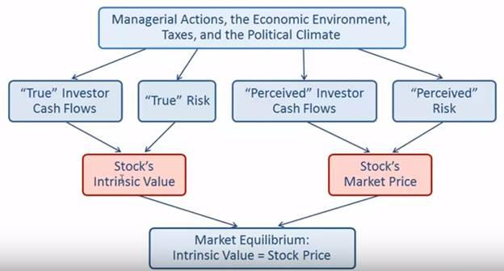

## Table of Contents

## What is a stock price and how is it determined?

A stock price is the amount of money someone has to pay to buy one share of a company's stock. It's like the price tag on a product in a store, but it changes all the time. The stock price shows how much people think the company is worth at that moment. If people think the company will do well in the future, the stock price usually goes up. If they think the company will do poorly, the stock price usually goes down.

The stock price is determined by what people are willing to pay for it. It's based on what's happening in the market, like how the economy is doing, and news about the company. When more people want to buy the stock than sell it, the price goes up because buyers have to offer more money to get it. When more people want to sell the stock than buy it, the price goes down because sellers have to lower their price to find a buyer. This constant back-and-forth between buyers and sellers is what sets the stock price at any given time.

## What is market capitalization and how does it relate to stock price?

Market capitalization, often called market cap, is the total value of all the shares of a company's stock. You can find it by multiplying the number of shares the company has by the current price of one share. So, if a company has 1 million shares and each share costs $10, the market cap would be $10 million. It's like figuring out how much the whole company is worth based on what people are willing to pay for its stock.

Market cap and stock price are closely related because the stock price is a big part of the market cap calculation. If the stock price goes up, the market cap goes up too, as long as the number of shares stays the same. If the stock price goes down, the market cap goes down. But remember, the number of shares can change too, like if the company issues more shares or buys some back. So, both the stock price and the number of shares affect the market cap.

## How do company earnings influence stock prices?

Company earnings are like report cards that show how much money a company made. When a company does well and makes more money than people expected, it's like getting a good grade. This makes investors happy and they might want to buy more of the company's stock. When more people want to buy the stock, the price goes up because they have to offer more money to get it. So, good earnings can make the stock price go up.

On the other hand, if a company doesn't make as much money as people thought it would, it's like getting a bad grade. This can make investors worried and they might want to sell the stock. When more people want to sell the stock than buy it, the price goes down because sellers have to lower their price to find someone who will buy it. So, bad earnings can make the stock price go down. Earnings are important because they show how healthy the company is, and that can change what people are willing to pay for its stock.

## What role do economic indicators play in stock price movements?

Economic indicators are like weather reports for the economy. They tell us how the economy is doing, and this can affect stock prices. When these indicators show that the economy is doing well, like when more people have jobs or when people are spending more money, investors feel good. They think companies will make more money, so they want to buy more stocks. This demand can push stock prices up.

On the other hand, if economic indicators show that the economy is struggling, like when fewer people have jobs or when people are spending less money, investors can get worried. They might think companies will make less money, so they might want to sell their stocks. This can make stock prices go down. So, economic indicators are important because they help investors guess what might happen to companies and their stock prices.

## How does investor sentiment affect stock prices and market capitalization?

Investor sentiment is like the mood of the people who buy and sell stocks. When investors feel good and are hopeful about the future, they are more likely to buy stocks. This demand can push stock prices up. If lots of people want to buy a company's stock, the price goes up because they have to offer more money to get it. When stock prices go up, the market capitalization, which is the total value of all the company's shares, also goes up. So, good investor sentiment can make both stock prices and market capitalization grow.

On the other hand, when investors feel worried or scared, they might want to sell their stocks. This can make stock prices go down because there are more people trying to sell than buy. When stock prices fall, the market capitalization of the company goes down too. So, bad investor sentiment can lead to lower stock prices and a smaller market capitalization. Investor sentiment is important because it can change how people act in the stock market, which affects both stock prices and the overall value of companies.

## What are the impacts of interest rates on stock valuations?

Interest rates are like the price of borrowing money. When interest rates go up, it costs more for companies to borrow money. This can make it harder for them to grow or invest in new projects. When companies have a harder time growing, investors might think they won't make as much money in the future. This can make stock prices go down because people are less willing to pay a lot for the stock. Also, when interest rates are high, other investments like bonds can look more attractive because they offer better returns. So, some investors might sell their stocks to buy these other investments, which can also push stock prices down.

On the other hand, when interest rates go down, it's cheaper for companies to borrow money. This can help them grow and invest in new projects, which might make investors think they'll make more money in the future. When investors are hopeful about a company's future, they might be willing to pay more for its stock, which can push stock prices up. Lower interest rates can also make other investments less attractive compared to stocks, so more people might want to buy stocks. This increased demand can also help lift stock prices. So, interest rates can have a big impact on how much people are willing to pay for stocks.

## How do geopolitical events influence stock market dynamics?

Geopolitical events, like wars, elections, or trade agreements, can shake up the stock market. When something big happens in the world, it can make investors worried or hopeful. If investors are scared, they might sell their stocks to avoid losing money. This selling can make stock prices go down. For example, if there's a war, investors might worry that it will hurt the economy and companies' profits, so they sell their stocks, which pushes prices down.

On the other hand, good news from geopolitical events can make investors feel good. If a new trade deal is signed, investors might think it will help companies make more money. This can make them want to buy more stocks, which can push prices up. So, what happens around the world can change how investors feel, and that can move the stock market in big ways.

## What is the effect of corporate governance on stock prices?

Corporate governance is like the rules and ways a company is run. When a company has good governance, it means they do things in a fair and honest way. This can make investors trust the company more. When investors trust a company, they might want to buy more of its stock. This demand can make the stock price go up. So, good governance can help make stock prices higher because it makes investors feel good about the company.

On the other hand, if a company has bad governance, like if the leaders are not honest or they don't treat everyone fairly, it can make investors worried. When investors are worried, they might want to sell their stock. This selling can make the stock price go down. So, bad governance can make stock prices lower because it makes investors feel bad about the company.

## How do stock splits and dividends impact stock prices and market capitalization?

A stock split is when a company decides to divide its existing shares into more shares. For example, in a 2-for-1 split, each share becomes two shares. The total value of the company, or market capitalization, stays the same because the price of each share gets cut in half. So, if you had one share worth $100 before the split, after the split you'd have two shares worth $50 each. The stock price goes down after a split, but this doesn't mean the company is worth less. Sometimes, a lower price can make the stock seem more affordable to new investors, which might make more people want to buy it and push the price up over time.

Dividends are payments a company gives to its shareholders from its profits. When a company announces a dividend, it can make the stock price go up because investors like getting extra money. But on the day the dividend is paid out, the stock price usually drops by about the amount of the dividend because the company's value goes down by that amount. The market capitalization stays the same overall because the drop in stock price is balanced by the money paid out to shareholders. So, dividends can make the stock price go up and down, but they don't change the total value of the company.

## What advanced financial models are used to predict stock prices?

One common advanced financial model used to predict stock prices is the Discounted Cash Flow (DCF) model. This model tries to guess what a company will be worth in the future by looking at the money it will make. It takes all the future money the company might make and brings it back to today's value using a discount rate. The discount rate is like a guess about how much money is worth now compared to later. If the model says the company will be worth more than its current stock price, then the stock might be a good buy. But if it says the company will be worth less, the stock might be too expensive.

Another model is the Capital Asset Pricing Model (CAPM). This model looks at how risky a stock is compared to the whole market. It uses something called the beta, which shows how much the stock moves with the market. If a stock has a high beta, it means it's riskier and might go up and down a lot. The CAPM helps figure out what return, or money you get back, you should expect from a stock based on its risk. If the expected return is higher than what you could get from a safer investment, like a bond, then the stock might be a good choice. But if the expected return is lower, you might want to look elsewhere.

There are also more complex models like the Black-Scholes model, which is used to predict the price of options, which are contracts that give you the right to buy or sell a stock at a certain price. This model uses things like the current stock price, the option's price, how long until the option expires, and how much the stock price might move around. It's a bit like trying to predict the weather, but for stock prices. These models help investors make smarter choices by giving them a way to think about what might happen to stock prices in the future.

## How does sector-specific news affect stock prices within that sector?

Sector-specific news can really shake things up for the stocks in that sector. When good news comes out, like a new law that helps the sector or a big new deal, it can make investors excited. They might think the companies in the sector will make more money, so they want to buy more of those stocks. This demand can push the stock prices up. For example, if there's news about a new technology that will help all the companies in the tech sector, investors might rush to buy tech stocks, making their prices go up.

On the other hand, bad news can make investors worried. If there's news about a new rule that will make things harder for the sector, or if a big company in the sector is having problems, investors might want to sell their stocks. This selling can make stock prices go down. For instance, if there's a report about a big oil spill that could hurt all the companies in the energy sector, investors might start selling their energy stocks, which can push the prices down. So, news that's specific to a sector can move stock prices a lot, depending on whether it's good or bad.

## What are the long-term trends and cycles in stock market capitalization?

Long-term trends in stock market capitalization show how the total value of all stocks in a market changes over many years. One big trend is that stock market capitalization tends to grow over time. This is because the economy usually grows, and as companies make more money, their stock prices go up, which makes the total value of the market go up too. But this growth isn't always smooth. There are cycles, like booms and busts, where the market goes up a lot for a while and then drops. These cycles can last for years. For example, the stock market might boom for several years, making everyone feel rich, but then it might bust, causing a lot of worry and loss.

Another long-term trend is that different sectors of the market can take turns leading the growth. Sometimes, technology stocks might be the ones driving the market up, while at other times, it might be energy or healthcare stocks. These shifts can happen because of changes in the economy, like new technologies or changes in what people need. Over very long periods, like decades, the market tends to go through big cycles that can be affected by big events like wars, new laws, or big changes in how people live and work. Understanding these long-term trends and cycles can help investors make better choices about when to buy or sell stocks.

## What is the relationship between stock price and company valuation?

Stock price is a critical metric in the financial markets, representing the current value at which a share of a company’s stock is trading on the market. It serves as a real-time indicator of a company's financial health and market perception. Stock prices are driven by the basic economic principle of supply and demand. When more investors want to buy a stock than sell it, the price rises, and conversely, when more want to sell than buy, the price drops. 

Company valuation, or the process of determining the economic value of a business, is intrinsically linked to stock prices. The valuation reflects potential earnings, assets, liabilities, and growth prospects, influencing investor behavior and consequently stock prices. Notably, while stock price reflects the current market consensus of a company's value, comprehensive company valuation considers both tangible elements, such as assets, and intangible ones, like brand reputation and market position.

Several methods exist for valuing a company, each providing insights from different angles. Fundamental analysis is one such approach, focusing on intrinsic value by examining related economic, financial, and other qualitative and quantitative factors. This method involves assessing a company's financial statements, such as the income statement, balance sheet, and cash flow statement, to determine its true value. Key ratios used in [fundamental analysis](/wiki/fundamental-analysis) include the Price-to-Earnings (P/E) ratio, which compares a company's current share price to its per-share earnings. The formula for the P/E ratio is:

$$
\text{P/E Ratio} = \frac{\text{Market Value per Share}}{\text{Earnings per Share (EPS)}}
$$

Other valuation methods include the Discounted Cash Flow (DCF) method, calculating the present value of projected future cash flows, and using multiples of comparable companies' valuation metrics. These methods help investors determine whether a stock is undervalued or overpriced compared to its intrinsic value. By combining insights from stock prices and comprehensive valuations, investors and analysts can make informed decisions about the feasibility and potential of investing in particular stocks.

## What is Market Cap: A Measure of Company Size?

Market capitalization, often referred to as "market cap," is a widely used metric for assessing the size and value of publicly traded companies. It is calculated by multiplying the total number of a company's outstanding shares by the current market price per share. The formula for market capitalization is:

$$
\text{Market Cap} = \text{Share Price} \times \text{Number of Outstanding Shares}
$$

Market capitalization serves as a fundamental indicator of a company's market value, reflecting the total equity value as perceived by investors. It is crucial in providing a snapshot of a company's size without the complexities of other financial metrics.

Market cap differs from other valuation metrics like enterprise value or book value. While book value measures a company's net asset value based on historical accounting data, enterprise value includes the company's debt and subtracts cash, offering a more comprehensive understanding of a firm's total value. Market cap, however, focuses strictly on equity value and is more volatile due to its sensitivity to stock price changes.

One significant use of market capitalization is to categorize companies into groups based on their size. Generally, companies are classified into three broad categories:

1. **Large-cap**: Companies with a market capitalization of $10 billion or more. These companies often have a long track record, stable earnings, and a substantial presence in their industries. Examples include Apple, Microsoft, and Amazon.

2. **Mid-cap**: Firms with market caps between $2 billion and $10 billion. Mid-cap companies are typically in a growth phase and carry more risk than large-cap stocks but have more growth potential. Examples include Dunkin' Brands and Carvana.

3. **Small-cap**: Businesses valued between $300 million and $2 billion. These companies are often young and feature in emerging industries, offering high growth potential, albeit with higher volatility and risk. Examples include Redfin and Sally Beauty Holdings.

Market cap is often utilized by investors as a proxy for a company's investment risk level. Large-cap stocks are generally considered safer investments due to their established nature and dominant market positions, while small-cap stocks might offer high returns but with heightened risk. Understanding the differences in market cap categories assists investors in diversifying their portfolios and aligning their investments with their risk tolerance and financial goals.

This classification not only aids investors in understanding the risk and return profile of their investments but also helps track trends and performance in different sectors of the economy. Consequently, market cap remains a central component in the toolkit of individual and institutional investors alike.

## What are the Dynamics of Market Capitalization?

Market capitalization, commonly known as market cap, is a crucial indicator of a company's overall size and financial health in the stock market. It is determined by multiplying the current stock price by the total number of outstanding shares:

$$
\text{Market Cap} = \text{Stock Price} \times \text{Number of Outstanding Shares}
$$

### Factors Influencing Market Cap Changes

1. **Stock Price Fluctuations:**
   The most direct influence on market capitalization is the fluctuation of a company's stock price. Since market cap is a function of stock price, any increase or decrease in stock price will proportionately affect the market cap. Stock prices can fluctuate due to various factors, including financial performance, changes in investor expectations, macroeconomic conditions, and overall market trends.

2. **Impact of Share Buybacks and Issuance:**
   Companies often engage in share buybacks or issuance, affecting the total number of outstanding shares. 

   - **Share Buybacks:** When a company buys back its own shares, the number of outstanding shares decreases. If the stock price remains constant, this results in an increase in the market cap per remaining share, as the earnings or value now represent fewer shares. This can signal confidence in the company's future prospects and can artificially inflate the market cap.

   - **Share Issuance:** Conversely, when a company issues additional shares, the total number of outstanding shares increases. If the stock price remains unchanged, the market cap increases, but the earnings or value are now distributed across more shares, which might dilute the value per share if the issuance is not accompanied by an increase in overall earnings or growth prospects.

### Market Cap as a Risk Indicator

Using market capitalization as a risk indicator is a debated topic. Generally, companies are categorized into large-cap, mid-cap, and small-cap, representing varying levels of risk and growth potential:

- **Large-Cap Companies:** Typically have a stable market presence and are seen as less risky due to their established market position. However, they may offer less aggressive growth.

- **Small-Cap Companies:** These are usually associated with higher risk due to less stable financial positions or less-established market presences. However, they may offer higher growth potential.

The risks associated with a company's market cap can also be influenced by market conditions. For instance, during economic downturns, small-cap companies might be hit harder due to limited resources and flexibility, reinforcing the belief that smaller market caps [carry](/wiki/carry-trading) higher risk. However, it's important to consider that a large market cap does not inherently equate to lower risk. Factors like industry disruptions, management decisions, and geopolitical events can impact companies regardless of their size.

In conclusion, while market capitalization provides insights into a company's size and a rough gauge of its market presence, it should not be the sole indicator of risk. Analyzing a comprehensive set of financial metrics alongside market cap offers a more nuanced understanding of potential risks and opportunities in investment.

## References & Further Reading

[1]: ["Advances in Financial Machine Learning"](https://www.amazon.com/Advances-Financial-Machine-Learning-Marcos/dp/1119482089) by Marcos Lopez de Prado

[2]: ["Evidence-Based Technical Analysis: Applying the Scientific Method and Statistical Inference to Trading Signals"](https://www.amazon.com/Evidence-Based-Technical-Analysis-Scientific-Statistical/dp/0470008741) by David Aronson

[3]: ["Machine Learning for Algorithmic Trading"](https://github.com/stefan-jansen/machine-learning-for-trading) by Stefan Jansen

[4]: ["Quantitative Trading: How to Build Your Own Algorithmic Trading Business"](https://books.google.com/books/about/Quantitative_Trading.html?id=j70yEAAAQBAJ) by Ernest P. Chan