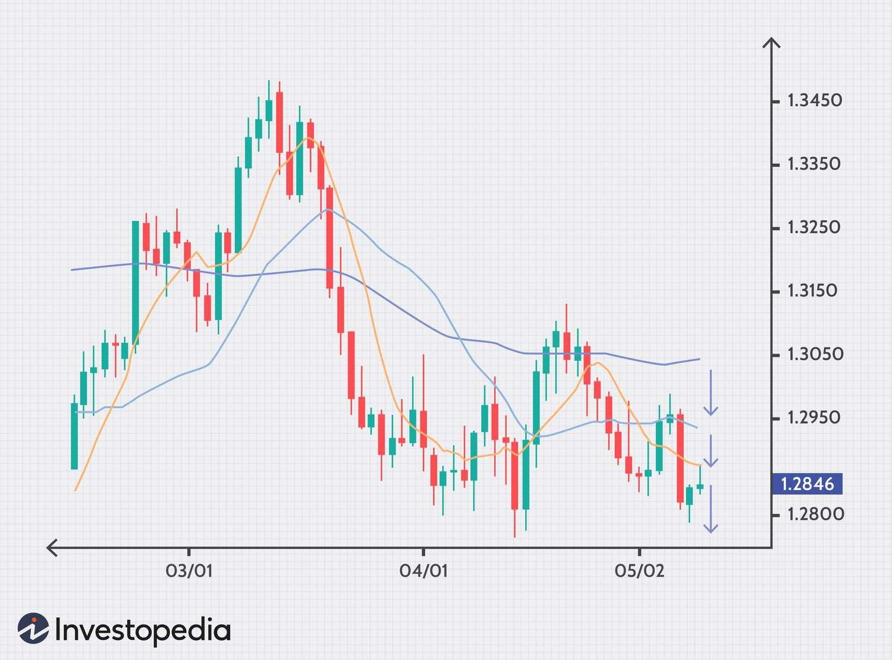

## Table of Contents

## What is a currency pair in the Forex market?

A currency pair in the Forex market is how one currency is traded for another. It shows the value of one currency compared to another. For example, if you see EUR/USD, it means you're looking at the value of the Euro against the US Dollar.

When you trade currency pairs, you're essentially betting on whether one currency will get stronger or weaker compared to the other. If you think the Euro will get stronger against the US Dollar, you might buy the EUR/USD pair. If it does get stronger, you could sell it later for a profit. It's all about the exchange rate between the two currencies.

## How are closing prices determined in the Forex market?

In the Forex market, the closing price of a currency pair is determined by the last traded price at the end of a trading session. This can be at the end of the day, week, or any other period that traders consider important. The closing price is crucial because it's often used to calculate daily price movements and to set up trading strategies for the next session.

The Forex market operates 24 hours a day during the business week, so the closing price can vary depending on which time zone you're looking at. For example, the New York close is often used as a standard, which happens at 5 PM Eastern Time. However, traders in other parts of the world might use different closing times, like the London close or the Tokyo close. What's important is that everyone agrees on a specific time to consider as the "close" for their analysis and trading decisions.

## What time frame is typically used to determine the closing price of a currency pair?

In the Forex market, the closing price of a currency pair is usually based on the last trade of the day. The most common time frame used is the New York close, which happens at 5 PM Eastern Time. This is a popular choice because New York is one of the biggest Forex trading centers in the world. Traders often use this time to analyze daily price movements and plan their next moves.

However, not everyone uses the New York close. Some traders might look at the London close, which is at 4 PM GMT, or the Tokyo close, which is at 3 PM JST. It really depends on where the trader is located and what time zone they are working in. The important thing is that everyone agrees on a specific time to call the "close" so they can compare prices and make decisions.

## What is the difference between bid and ask prices, and how do they affect closing prices?

The bid price is what someone is willing to pay to buy a currency pair, while the ask price is what someone is willing to sell it for. The difference between these two prices is called the spread. When you see a price quote for a currency pair, the bid price is usually on the left, and the ask price is on the right. For example, if the EUR/USD pair is quoted as 1.1000/1.1002, the bid price is 1.1000, and the ask price is 1.1002.

The closing price in the Forex market is the last traded price at the end of a trading session. It can be the bid price, the ask price, or somewhere in between, depending on the last trade that happened before the market closed. If the last trade was a buy, the closing price might be closer to the ask price. If it was a sell, it might be closer to the bid price. This means the closing price can be influenced by whether the last trade was a buy or a sell, and it reflects the final agreement between buyers and sellers at the end of the day.

## How do market makers influence the closing prices of currency pairs?

Market makers are big players in the Forex market. They are banks or financial institutions that help keep the market running smoothly by always being ready to buy or sell currency pairs. They set the bid and ask prices that you see when you want to trade. Because they are always in the market, they can influence the closing prices of currency pairs. If a market maker wants to buy or sell a lot of a currency pair near the end of the trading day, they can push the price up or down.

When the trading day is about to end, market makers might make trades to balance their books or to take advantage of what they think will happen next. If they think a currency will go up in value, they might buy it, which can make the closing price higher. If they think it will go down, they might sell it, which can make the closing price lower. So, the actions of market makers can have a big impact on what the closing price ends up being, especially if they make big trades right before the market closes.

## What role do economic indicators play in the determination of closing prices?

Economic indicators are like reports that tell us how well a country's economy is doing. Things like unemployment rates, inflation, and how much stuff people are buying can affect the value of a country's currency. When these reports come out, traders look at them to guess what might happen next with the currency. If the numbers are good, it might make people think the currency will get stronger, so they might buy more of it, pushing up the closing price. If the numbers are bad, people might sell the currency, which can make the closing price go down.

For example, if a report shows that more people are getting jobs, traders might think the economy is doing well and buy the country's currency. This could make the closing price higher. On the other hand, if a report shows that prices are going up a lot (inflation), traders might worry that the central bank will raise interest rates, which could make them sell the currency and lower the closing price. So, economic indicators can really move the market and affect what the closing price ends up being.

## How can traders use technical analysis to predict closing prices?

Traders use technical analysis to look at past price movements and patterns to guess where prices might go next. They use charts and tools like moving averages, support and resistance levels, and trend lines to help them. For example, if a currency pair has been going up and hits a resistance level but then starts to go down, a trader might think the closing price will be lower that day. They look at these patterns to make smart guesses about what the market will do.

Technical analysis can also help traders see when the market might be getting too excited or too worried. If a lot of people are buying and the price is going up fast, it might mean the price is about to drop because it's too high. This is called being "overbought." If everyone is selling and the price is dropping fast, it might mean the price is about to go up because it's too low. This is called being "oversold." By watching these signs, traders can try to predict where the closing price might end up at the end of the day.

## What are the impacts of geopolitical events on currency pair closing prices?

Geopolitical events, like wars, elections, or trade deals, can really shake up the Forex market. When something big happens in the world, it can make people worried or excited about what might happen next. If a country is in a war or facing big political changes, people might think its economy will do badly. They might sell that country's currency, which can make the closing price go down. On the other hand, if a country signs a good trade deal, people might think its economy will do well and buy its currency, pushing the closing price up.

These events can also make the market more unpredictable. When something unexpected happens, like a sudden election result or a new law, traders might not know what to do. They might buy and sell a lot, trying to guess what will happen next. This can make the price of a currency pair jump around a lot during the day. At the end of the day, the closing price can be very different from what people expected because of all the quick buying and selling. So, geopolitical events can make the Forex market a wild ride, and traders need to keep a close eye on the news to try and predict what might happen to closing prices.

## How does liquidity affect the closing prices in the Forex market?

Liquidity in the Forex market means how easy it is to buy or sell a currency pair without the price moving a lot. When there's a lot of liquidity, there are many buyers and sellers, so big trades don't change the price much. This can make the closing price more stable because there's always someone ready to trade at the end of the day. If the market is very liquid, the closing price is more likely to be close to what traders expected because there's less chance of big surprises.

On the other hand, when liquidity is low, there are fewer people trading, so even small trades can move the price a lot. This can make the closing price more unpredictable. If there aren't many traders at the end of the day, a few big trades can push the price up or down a lot, making the closing price different from what most people thought it would be. So, liquidity can really affect how stable or unpredictable the closing price is in the Forex market.

## What are the common strategies used by traders to take advantage of closing price movements?

Traders often use a strategy called "end-of-day trading" to take advantage of closing price movements. They look at the closing prices from the day before to decide what to do the next day. If they think a currency pair's price will go up by the end of the day, they might buy it in the morning and sell it before the market closes. If they think it will go down, they might sell it in the morning and buy it back before the close. This way, they try to make money from the difference between the opening and closing prices.

Another common strategy is called "scalping." Scalpers make lots of small trades throughout the day, trying to catch small price changes. They might focus on the last hour of trading, when prices can move a lot as the market gets ready to close. By making quick trades right before the close, they can take advantage of any last-minute price jumps or drops. This can be risky, but it can also lead to small profits that add up over time.

## How do algorithmic trading systems determine and react to closing prices?

Algorithmic trading systems use computer programs to make trading decisions. They look at lots of data, like past prices and market trends, to guess where prices might go. When it comes to closing prices, these systems might use a strategy called "end-of-day trading." They watch the closing prices from the day before and use that information to decide what to do the next day. If the system thinks a currency pair's price will go up by the end of the day, it might buy it in the morning and sell it before the market closes. If it thinks the price will go down, it might sell it in the morning and buy it back before the close.

These systems can also react quickly to changes right before the market closes. They might use a strategy called "scalping," where they make lots of small trades to catch small price changes. In the last hour of trading, prices can move a lot as the market gets ready to close. The system can spot these last-minute price jumps or drops and make quick trades to take advantage of them. This can be risky, but it can also lead to small profits that add up over time. By using these strategies, algorithmic trading systems try to make money from the difference between the opening and closing prices.

## What advanced statistical models are used to forecast closing prices in the Forex market?

Traders and analysts use advanced statistical models like ARIMA (AutoRegressive Integrated Moving Average) and GARCH (Generalized Autoregressive Conditional Heteroskedasticity) to forecast closing prices in the Forex market. ARIMA models look at past price data to find patterns and predict future prices. They are good at understanding how prices have moved in the past and using that to guess where they might go next. GARCH models, on the other hand, focus on how much prices might move around, or the volatility. They help traders understand if the market is likely to be calm or jumpy, which can affect the closing price.

Another model that's often used is machine learning, like neural networks. These models can look at a lot of different data, not just past prices, but also things like economic indicators, news events, and even social media sentiment. By learning from all this data, machine learning models can make smart guesses about what the closing price might be. They are good at finding patterns that might be hard for people to see. So, these advanced statistical models help traders make better predictions about closing prices by looking at different aspects of the market.

## What is the Role of Closing Prices in Algorithmic Trading?

Algorithmic trading relies on automated strategies that implement trades based on specific, predefined criteria. Among these criteria, closing prices serve as vital data points, offering insights into historical trends and market sentiment. The assessment of closing prices is crucial for developing strategies that can predict price movements and capitalize on potential trading opportunities.

Historical data analysis forms the backbone of these trading strategies, with closing prices acting as a crucial [factor](/wiki/factor-investing) in the evaluation of price patterns and market trends. By analyzing past closing prices, traders can identify [statistics](/wiki/bayesian-statistics) and patterns that may suggest future price movements. For example, moving averages, which are calculated using closing prices, help to smooth out price data and highlight trends over a set period. The moving average $MA_t$ for closing prices can be computed as follows:

$$
MA_t = \frac{1}{n} \sum_{i=0}^{n-1} P_{t-i}
$$

where $P_{t-i}$ is the closing price at time $t-i$, and $n$ is the number of periods considered.

The resulting moving averages can be used to generate potential buy or sell signals. For instance, if a short-term moving average crosses above a long-term moving average, it may indicate a buy signal, suggesting an upward trend. Conversely, if a short-term average moves below a long-term average, it may signal a potential sell.

Platforms like Algobot exploit these algorithms to optimize trading opportunities by integrating automated procedures with risk management protocols. These systems can simultaneously process multiple data points and execute trades across various currency pairs, enhancing trading efficiency and effectiveness. By analyzing closing prices in real-time, algorithmic trading strives to capitalize on even the most subtle price movements, thus maximizing potential returns while mitigating associated risks.

Overall, the use of closing prices in algorithmic trading is indispensable, as it ensures that the strategies employed are both data-driven and reflective of market conditions. By incorporating these prices into algorithms, traders can better navigate the forex market, making informed decisions that align with their risk tolerance and investment objectives.

## What trends and technical indicators are being analyzed?

Technical analysis is a method used by traders to evaluate financial markets and make trading decisions by analyzing statistical trends gathered from historical market activity. Closing prices play a crucial role in this analysis, as they reflect the final price at which a currency pair trades at the end of a trading session. This data point is indispensable for identifying patterns and predicting future price movements.

**Trends Identification:**

1. **Uptrends, Downtrends, and Sideways Trends:**
   - An **uptrend** is identified when currency pairs show higher highs and higher lows, indicating rising prices. Traders typically look for opportunities to buy in an uptrend.
   - A **downtrend** occurs when currency pairs exhibit lower highs and lower lows, suggesting declining prices, where selling strategies are more favorable.
   - **Sideways trends** or ranges happen when the price keeps bouncing between support and resistance levels, neither consistently rising nor falling, which might suggest a neutral market.

**Technical Indicators Derived from Closing Prices:**

1. **Moving Averages:**
   - Moving averages smooth out price data, offering a clear view of the price trends. The formulas for Simple Moving Average (SMA) and Exponential Moving Average (EMA) leverage closing prices.
   - **SMA calculation:**
$$
     \text{SMA} = \frac{P_1 + P_2 + \ldots + P_n}{n}

$$
     where $P_1, P_2, \ldots, P_n$ are closing prices over $n$ periods.
   - **EMA** gives more weight to recent prices, making it more responsive to new information.

2. **Relative Strength Index (RSI):**
   - RSI is a momentum oscillator that measures the speed and change of price movements. It helps identify overbought or oversold conditions in a currency pair.
   - RSI ranges from 0 to 100, with levels above 70 typically indicating overbought conditions and levels below 30 suggesting oversold conditions.

3. **Bollinger Bands:**
   - These bands consist of a central moving average (usually SMA) and two standard deviations plotted above and below it, indicating volatility.
   - When the price moves excessively beyond the bands, it may imply overbought (above the upper band) or oversold (below the lower band) conditions.

**Example Code (Python):**

Here's a basic example to calculate the Simple Moving Average (SMA) using Python:

```python
def simple_moving_average(prices, period):
    if len(prices) < period:
        return None  # Not enough data points
    sma = sum(prices[-period:]) / period
    return sma

# Example usage
closing_prices = [1.3000, 1.3050, 1.3070, 1.3040, 1.3100]
period = 3
sma = simple_moving_average(closing_prices, period)
print(f"The {period}-day SMA is {sma}")
```

Upon analyzing these indicators, traders can make informed decisions by assessing historical price behaviors, predicting potential market directions, and identifying opportune moments for entering or exiting trades. Achieving proficiency in using technical indicators effectively is essential for developing strategies that respond accurately to market dynamics, thereby enhancing trading outcomes.

## References & Further Reading

[1]: Bergstra, J., Bardenet, R., Bengio, Y., & Kégl, B. (2011). ["Algorithms for Hyper-Parameter Optimization."](https://dl.acm.org/doi/10.5555/2986459.2986743) Advances in Neural Information Processing Systems 24.

[2]: ["Advances in Financial Machine Learning"](https://www.amazon.com/Advances-Financial-Machine-Learning-Marcos/dp/1119482089) by Marcos Lopez de Prado

[3]: ["Evidence-Based Technical Analysis: Applying the Scientific Method and Statistical Inference to Trading Signals"](https://www.amazon.com/Evidence-Based-Technical-Analysis-Scientific-Statistical/dp/0470008741) by David Aronson

[4]: ["Machine Learning for Algorithmic Trading"](https://github.com/stefan-jansen/machine-learning-for-trading) by Stefan Jansen

[5]: ["Quantitative Trading: How to Build Your Own Algorithmic Trading Business"](https://www.amazon.com/Quantitative-Trading-Build-Algorithmic-Business/dp/1119800064) by Ernest P. Chan