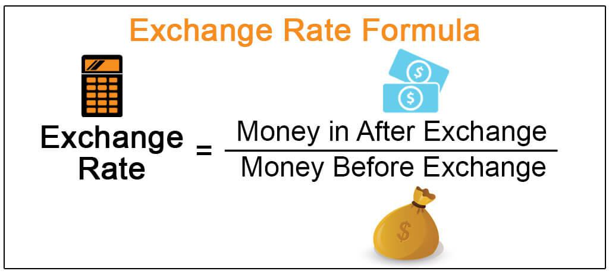

In today's interconnected global economy, exchange rates play a pivotal role in influencing the flow of goods, services, and capital across countries. As businesses expand beyond national borders and engage in international trade, the value of currencies becomes a critical factor in determining the competitiveness of nations' exports and imports. The foreign exchange market, commonly referred to as Forex, is the largest and most liquid financial market in the world, where these currency exchanges occur. Trillions of dollars are traded daily, leading to constant fluctuations in currency values as market participants, including banks, corporations, and individual traders, engage in buying and selling activities.

This article explores the intricacies of currency valuation, exchange rates, and the foreign exchange market, with a particular focus on algorithmic trading. Algorithmic trading, driven by sophisticated computer programs, has revolutionized the Forex market by enabling rapid and efficient execution of trades. Through the use of complex algorithms, traders can optimize their strategies and react to market changes in real-time, minimizing human error and reducing transaction costs.



Understanding these concepts is essential not only for traders who seek to capitalize on market opportunities but also for businesses that rely on favorable exchange rates for their international financial operations. Policymakers are also deeply invested in managing exchange rates as they influence monetary policy, economic stability, and international competitiveness. By examining the dynamic nature of exchange rates and the tools available for navigating this landscape, stakeholders can better position themselves to achieve their economic objectives in the global market.

## Table of Contents

## Understanding Currency Valuation and Exchange Rates

Currency valuation refers to the process of determining the value of one nation's currency in relation to another's. This valuation is typically expressed through exchange rates, which are fundamental to international trade and finance. Exchange rates indicate how much of one currency is required to purchase a unit of another currency. These rates fluctuate based on several economic indicators and external factors, directly impacting global economic relations and trade balances.

Exchange rates are a dynamic aspect of the foreign exchange market, as they are affected by a variety of factors:

1. **Interest Rates**: Generally, currencies from countries with higher interest rates tend to attract more foreign capital, leading to an appreciation of the currency. This is due to the potential for higher returns on investments in that currency.

2. **Inflation Rates**: A lower inflation rate in a country compared to its trading partners usually results in the appreciation of its currency. This is because the purchasing power of the currency increases relative to others, making exports more competitive.

3. **Gross Domestic Product (GDP)**: A growing GDP signals a strong economy, which is an attractive feature for investors. Increased demand for a country's goods and services can strengthen its currency.

4. **Political Stability**: Countries with stable political environments are considered safer for investment, causing their currencies to strengthen. Conversely, political unrest or instability can lead to depreciation.

5. **Market Speculation**: Traders' perceptions and predictions about future economic conditions can also influence exchange rates. Speculation can cause currency values to change rapidly, independent of actual economic indicators.

Understanding these dynamics aids traders and economists in anticipating market changes and making informed decisions. For instance, employing econometric models can assist in analyzing how these factors interact and influence currency values. A basic approach may include the use of time-series analysis to identify trends and patterns in historical exchange rate data. This analysis can be enhanced using statistical programming in Python. Here's a simple example of how to conduct a basic time-series analysis using Python:

```python
import pandas as pd
import matplotlib.pyplot as plt
from statsmodels.tsa.arima.model import ARIMA

# Load historical exchange rate data
data = pd.read_csv('exchange_rate_data.csv', parse_dates=['Date'], index_col='Date')

# Plot the data
data['Exchange_Rate'].plot(title='Exchange Rate Over Time')
plt.show()

# Fit an ARIMA model
model = ARIMA(data['Exchange_Rate'], order=(1, 1, 1))
model_fit = model.fit()

# Display a summary of the model
print(model_fit.summary())

# Forecast exchange rates
forecast = model_fit.forecast(steps=5)
print(forecast)
```

This code snippet demonstrates loading historical exchange rate data, visualizing it, fitting an ARIMA model, and making short-term forecasts. Such predictive modeling helps in gauging future currency movements and making strategic decisions.

In conclusion, currency valuation and the mechanisms driving exchange rates are interwoven with broader economic indicators. Proficiently understanding and analyzing these factors is crucial for influencing effective decision-making in the Forex market and global economic policies.

## Types of Exchange Rates

Exchange rates serve as a vital mechanism in the international financial system, with the ability to influence global trade, economic stability, and monetary policy. Broadly, exchange rates fall into two primary categories: floating and fixed.

Floating exchange rates are determined by the market forces of supply and demand. In this system, the value of a currency is allowed to fluctuate freely against other currencies. These fluctuations occur due to a variety of factors, such as changes in interest rates, inflation, economic indicators, and investor perceptions. For instance, if there is high demand for a currency due to favorable economic conditions or higher interest rates, its value will typically appreciate relative to other currencies. Conversely, if demand drops or economic prospects dim, the currency may depreciate. Thus, the exchange rate, in a floating system, is constantly adjusting to reflect the prevailing economic climate and market sentiment.

In contrast, fixed exchange rates peg a country's currency to another major currency, such as the U.S. dollar or the euro. This pegging requires active intervention by the country's central bank to maintain the currency's value within a narrow band. Such interventions can involve buying or selling the national currency in foreign exchange markets to counter any pressure that would otherwise cause it to appreciate or depreciate. Fixed exchange rates provide greater stability and predictability in international pricing, which can promote trade and investment by reducing the risks associated with currency fluctuations. However, maintaining a fixed rate can be challenging, especially if market conditions shift significantly, requiring substantial foreign reserves to uphold the peg or necessitating policy adjustments that might not align with domestic economic goals.

Each type of exchange rate system holds distinct implications for international trade and economic policy. Floating exchange rates offer flexibility and can absorb external shocks, allowing monetary policies to focus on domestic objectives like controlling inflation or unemployment. However, they can introduce [volatility](/wiki/volatility-trading-strategies) and uncertainty, impacting international trade flows and capital movement. On the other hand, fixed exchange rates provide predictability, reducing currency risk for businesses engaged in cross-border transactions, but at the potential cost of limited monetary policy independence and the need for significant foreign exchange reserves to defend the peg.

In summary, the choice between floating and fixed exchange rates involves a trade-off between stability and flexibility, influencing how countries interact economically on a global scale. Understanding the characteristics and implications of each system is crucial for policymakers, businesses, and investors who navigate the complexities of international finance.

## Factors Influencing Exchange Rates

Exchange rates are primarily influenced by a complex interaction of market demand and supply dynamics. These fluctuations in currency values are often reflective of the collective actions and decisions within the foreign exchange markets. Geopolitical events, policy changes, and economic news releases can have immediate and profound impacts on these rates. Events such as political elections, diplomatic tensions, or changes in government policies can lead to increased uncertainty and volatility in currency markets. For example, a sudden geopolitical conflict might prompt investors to seek safe-haven currencies, thereby driving up their demand and value.

Economic indicators play a crucial role in exchange rate movements. Key among these are interest rates, inflation rates, and GDP growth. When a country's economy is robust, characterized by a stable government, low inflation, and positive GDP growth, its currency typically strengthens. This is because investors seek to invest in economies with a positive outlook, increasing demand for that country’s currency.

Trade balances also significantly influence a nation’s currency valuation. A country with a surplus in its trade balance tends to have a stronger currency because it is receiving more foreign currency for its exports than it is spending on imports. Conversely, a trade deficit can lead to a depreciating currency as more domestic currency is sold to buy foreign currency.

Central banks, acting as key players in the Forex market, often engage in interventions to maintain exchange rate stability. Through mechanisms such as altering interest rates or directly buying and selling currencies, central banks aim to achieve economic objectives and control inflation. For instance, by increasing interest rates, a central bank can attract foreign capital, thereby strengthening its currency due to higher demand.

In summary, exchange rates are sculpted by a myriad of factors encompassing market dynamics, geopolitical climates, economic performance, trade balances, and central bank interventions. Understanding these elements facilitates better prediction and management of currency risk in the Forex market.

## Algorithmic Trading in Forex Markets

Algorithmic trading in Forex markets leverages sophisticated computer algorithms to streamline and enhance the trading process. These systems operate by executing trades according to predefined market criteria, thus significantly minimizing the potential for human error and emotional bias that can often impact trading decisions negatively. By automating the execution of trades, [algorithmic trading](/wiki/algorithmic-trading) ensures consistency and precision, leading to more accurate transaction handling and faster decision-making, which is crucial in the highly dynamic Forex market.

The use of algorithmic trading plays a vital role in improving market [liquidity](/wiki/liquidity-risk-premium) and providing depth to the Forex market. Market liquidity refers to the ease with which an asset can be bought or sold without affecting its price. Algorithmic trading contributes to increased liquidity by efficiently matching buy and sell orders and facilitating a higher [volume](/wiki/volume-trading-strategy) of trades. This enhanced market liquidity translates to reduced transaction costs and narrower bid-ask spreads, making the Forex market more accessible and efficient for traders globally.

Technological advancements have been pivotal in refining algorithmic trading techniques, particularly through the integration of [artificial intelligence](/wiki/ai-artificial-intelligence) (AI) and [machine learning](/wiki/machine-learning). These technologies enable the development of more sophisticated predictive models that can analyze large sets of market data to identify emerging patterns and trends. As a result, these models enhance the capability of trading algorithms to forecast future currency movements and adapt strategies accordingly. For instance, machine learning algorithms can be trained to recognize specific market conditions, allowing for more accurate and timely trading decisions.

In practical terms, a Python script can be utilized to implement a basic algorithmic trading strategy. For example, a simple moving average crossover strategy, one of the common approaches, can be coded as follows:

```python
import pandas as pd

# Load Forex market data
data = pd.read_csv('forex_data.csv')

# Calculate short-term and long-term moving averages
data['short_mavg'] = data['Close'].rolling(window=40, min_periods=1).mean()
data['long_mavg'] = data['Close'].rolling(window=100, min_periods=1).mean()

# Create signal for buying when short-term average crosses above long-term
data['signal'] = 0.0
data['signal'][40:] = np.where(data['short_mavg'][40:] > data['long_mavg'][40:], 1.0, 0.0)

# Generate trading orders
data['positions'] = data['signal'].diff()
```

This script demonstrates a basic algorithmic approach where trade signals are generated based on the short-term moving average crossing above or below the long-term moving average, triggering buy or sell orders. By automating such strategies, traders can capitalize on market opportunities more efficiently and consistently.

Consequently, algorithmic trading has transformed the Forex market landscape, enabling traders to engage with a new level of speed and sophistication. As technology continues to evolve, these systems will further integrate advanced analytical tools and techniques, solidifying their role as an indispensable component of modern trading.

## Designing Trading Algorithms for Forex

Designing trading algorithms for the Forex market involves a strategic approach centered around the defining principles of financial data analysis. The foundational step is to define clear rules based on market indicators, such as moving averages and price patterns. Moving averages, for example, are used to smooth out price data by creating a constantly updated average price, helping to identify trends. The formula for a simple moving average (SMA) over $n$ periods is:

$$
SMA = \frac{P_1 + P_2 + \cdots + P_n}{n}
$$

Where $P_1, P_2, \ldots, P_n$ are the prices at each period. 

In addition to price patterns, algorithms often incorporate predictive models designed to forecast currency movements and execute trades in real-time. These models can utilize historical data and current market conditions to predict future price levels. Machine learning techniques, including regression analysis and neural networks, may be employed to discover complex patterns and correlations that may not be immediately apparent.

Popular trading strategies implemented in these algorithms include [trend following](/wiki/trend-following), which involves entering a trade in the direction of a stock's movement and maintaining that position until the trend reverses. Statistical [arbitrage](/wiki/arbitrage) is another strategy that involves exploiting price differentials between related currencies. Sentiment analysis, which uses natural language processing to gauge market sentiment from news data, can also be integrated to anticipate market reactions.

Python is a favored language for developing these algorithms due to its extensive libraries that facilitate data analysis and machine learning. Libraries such as NumPy for numerical computations, pandas for data manipulation, and scikit-learn for developing machine learning models are frequently employed by developers. Additionally, the open-source sentiment analysis library, TextBlob, can be utilized to perform sentiment analysis.

An example snippet of a simple [momentum](/wiki/momentum)-based trading algorithm in Python might look like this:

```python
import pandas as pd
import numpy as np

# Fetch historical Forex data
data = pd.read_csv('forex_data.csv')

# Calculate moving averages
data['SMA_50'] = data['Close'].rolling(window=50).mean()
data['SMA_200'] = data['Close'].rolling(window=200).mean()

# Define trading signal
data['Signal'] = 0
data['Signal'][50:] = np.where(data['SMA_50'][50:] > data['SMA_200'][50:], 1, 0)

# Calculate daily returns
data['Returns'] = data['Close'].pct_change()

# Apply strategy returns
data['Strategy_Returns'] = data['Returns'] * data['Signal'].shift(1)

# Output the cumulative returns
cumulative_returns = (1 + data['Strategy_Returns']).cumprod() - 1
print(cumulative_returns.tail(1))
```

This code calculates the 50-day and 200-day moving averages and establishes a trading signal to buy when the short-term moving average crosses above the long-term average. Such strategies and their execution highlight the importance of scientific rigor and technical expertise in designing Forex trading algorithms.

## Risks and Challenges in Algorithmic Trading

Algorithmic trading in the Forex market brings numerous advantages, but it also poses significant challenges and risks. The reliance on technology is a double-edged sword; while it increases efficiency, it also introduces vulnerabilities. High-frequency trading ([HFT](/wiki/high-frequency-trading-strategies)), a subset of algorithmic trading, can exacerbate market volatility, potentially leading to flash crashes. Flash crashes are extreme price movements occurring in seconds, often triggered by automated trading systems responding to transient events. A notable example is the 2010 Flash Crash, where the Dow Jones Industrial Average dropped nearly 1,000 points within minutes, highlighting the systemic risks of algorithmic trading.

The propensity for market manipulation is another challenge associated with algorithmic trading. By capitalizing on speed and data access, manipulative strategies such as quote stuffing and spoofing can distort market perceptions, leading to unfair trading advantages. Regulatory bodies like the Commodity Futures Trading Commission (CFTC) and the Securities and Exchange Commission (SEC) have implemented strict oversight to combat these practices, enforcing regulations to prevent fraudulent activities and ensure the integrity of financial markets.

Adapting algorithms to align with changing market conditions is essential for mitigating risks and maintaining profitability. Market conditions are fluid, influenced by a plethora of economic, political, and social factors. Traders must employ dynamic strategies, continuously updating their algorithms to capture shifts in market trends and avoid obsolescence. This requires a robust understanding of current market indicators and a commitment to rigorous [backtesting](/wiki/backtesting) and fine-tuning.

In the context of regulatory compliance, algorithms must be designed to adhere to the legal frameworks governing financial markets. This is crucial to prevent breaches that could result in fines or legal action. By incorporating compliance checks into algorithmic systems, traders can ensure adherence to applicable laws, thus safeguarding against potential penalties.

In conclusion, while algorithmic trading revolutionizes Forex markets by enhancing trading efficiency and precision, it carries inherent risks that must be carefully managed. Ensuring regulatory compliance, safeguarding against manipulation, and maintaining algorithmic adaptability are fundamental to navigating the complexities of the modern trading environment.

## Adapting to Market Shifts with Algorithmic Trading

Algorithmic trading provides a significant advantage in swiftly adapting to market shifts, particularly concerning exchange rate fluctuations. This ability to recalibrate trading strategies in real-time is critical for maintaining profitability and managing risks in the highly dynamic Forex market.

When currency values change in response to economic data releases or policy adjustments, such as [interest rate](/wiki/interest-rate-trading-strategies) hikes or trade imbalances, algorithms can rapidly process this information and modify trading positions accordingly. For instance, algorithms continuously analyze market indicators and economic variables, deploying predictive models to anticipate potential currency movements. This process minimizes the delay between obtaining new information and executing corresponding trades, often achieving a reaction speed unattainable by manual trading.

Consider a scenario where a major economy releases its GDP growth figures. An algorithmic system, equipped with rules for interpreting these economic indicators, might identify a better-than-expected growth rate, signaling a potential strengthening of that country's currency. Upon detecting this, the algorithm can swiftly adjust its trading strategy to capitalize on the anticipated appreciation, whether through direct currency pair exchanges or derivative instruments.

Moreover, the adaptability of algorithms extends beyond immediate execution. Traders also utilize these tools for strategic planning, leveraging historical data and market forecasts to formulate long-term trading strategies. By incorporating machine learning techniques, such as [reinforcement learning](/wiki/reinforcement-learning), algorithms can enhance their predictive capabilities over time, optimizing decision-making as they encounter various market conditions.

In implementing such adaptive systems, many traders turn to programming languages like Python for their flexibility and abundant libraries for data analysis and machine learning. A simple Python snippet might involve the use of `pandas` for data manipulation and `scikit-learn` for predictive modeling:

```python
import pandas as pd
from sklearn.linear_model import LinearRegression

# Load historical currency data
data = pd.read_csv('currency_data.csv')

# Prepare features and target variable
X = data[['interest_rate', 'gdp_growth', 'inflation_rate']]
y = data['currency_value']

# Train a predictive model
model = LinearRegression()
model.fit(X, y)

# Predict future currency values
future_data = pd.DataFrame({'interest_rate': [0.05], 'gdp_growth': [0.03], 'inflation_rate': [0.02]})
predicted_value = model.predict(future_data)

print(f"Predicted Currency Value: {predicted_value}")
```

Through such implementations, algorithmic trading not only enhances the execution efficiency but also fortifies strategic foresight, making it an indispensable tool for modern Forex traders. This capability of quick adaptation ensures that traders remain competitive and resilient amidst the ever-evolving landscapes of Forex markets.

## Conclusion

In the contemporary landscape of global finance, the intricate dynamics of currency valuation, exchange rates, and the foreign exchange market underscore their critical importance. The Forex market, recognized as the largest and most liquid financial market worldwide, functions continuously, facilitating international trade and investments. The introduction of algorithmic trading has significantly altered the Forex environment by enhancing precision, efficiency, and the speed at which trades are executed. These algorithms leverage sophisticated techniques, often employing mathematical models or machine learning to forecast currency trends and execute trades without human intervention. This technological shift minimizes human error and allows rapid adaptation to market shifts, a crucial advantage in a volatile environment.

For traders, businesses, and policymakers navigating international markets, a comprehensive understanding of these elements is essential. Traders must grasp the intricacies of currency valuation to forecast and strategize effectively, while businesses that operate across borders must manage foreign exchange risk to protect their revenue streams. Policymakers, on the other hand, need to consider the effects of exchange rate policies on national economic stability.

As technology progresses, the role of advanced analytical tools in refining Forex trading is set to expand further. Tools incorporating artificial intelligence and big data analytics are becoming increasingly prevalent, offering deep insights into market trends and driving smarter trading decisions. Python remains a popular choice for developing these tools due to its robust libraries such as NumPy and pandas, which facilitate data manipulation and complex calculations. A simple Python example for calculating a moving average, often used in predictive market models, might look like this:

```python
import pandas as pd

# Create a sample time series data
data = {'Date': pd.date_range(start='2023-01-01', periods=10),
        'Price': [1.1, 1.2, 1.15, 1.18, 1.22, 1.25, 1.3, 1.28, 1.27, 1.31]}
df = pd.DataFrame(data)

# Calculate a simple moving average with a window size of 3
df['3_MA'] = df['Price'].rolling(window=3).mean()

print(df)
```

In conclusion, the fusion of financial strategies with technological innovation continues to redefine Forex trading. Stakeholders must adapt and embrace these changes, ensuring that they remain competitive in the dynamic international markets. The future of Forex trading will likely be characterized by even greater integration of technology, paving the way for more refined and efficient trading mechanisms.

## References & Further Reading

[1]: Bergstra, J., Bardenet, R., Bengio, Y., & Kégl, B. (2011). ["Algorithms for Hyper-Parameter Optimization."](https://papers.nips.cc/paper/4443-algorithms-for-hyper-parameter-optimization) Advances in Neural Information Processing Systems 24.

[2]: ["Advances in Financial Machine Learning"](https://www.amazon.com/Advances-Financial-Machine-Learning-Marcos/dp/1119482089) by Marcos Lopez de Prado

[3]: ["Evidence-Based Technical Analysis: Applying the Scientific Method and Statistical Inference to Trading Signals"](https://www.amazon.com/Evidence-Based-Technical-Analysis-Scientific-Statistical/dp/0470008741) by David Aronson

[4]: ["Machine Learning for Algorithmic Trading"](https://github.com/stefan-jansen/machine-learning-for-trading) by Stefan Jansen

[5]: ["Quantitative Trading: How to Build Your Own Algorithmic Trading Business"](https://www.amazon.com/Quantitative-Trading-Build-Algorithmic-Business/dp/1119800064) by Ernest P. Chan