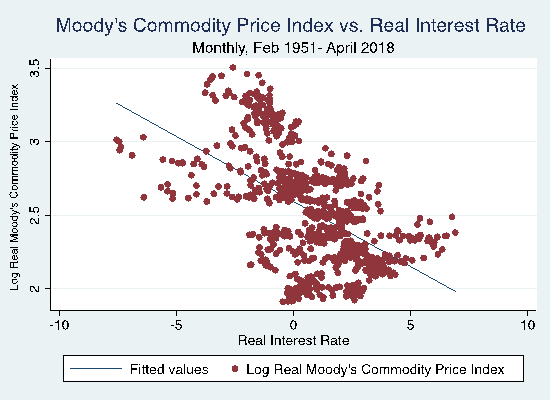

## Table of Contents

## What is a commodity?

A commodity is a basic good that can be bought and sold. These are things like oil, gold, wheat, and coffee. Commodities are usually raw materials or agricultural products that are the same no matter who makes them. This means that one company's oil is pretty much the same as another company's oil.

People and businesses trade commodities on special markets called commodity exchanges. These markets help set the prices for commodities around the world. Farmers, miners, and other producers sell their goods on these markets, while companies that need these materials to make other products buy them. Trading commodities can be risky because prices can change a lot, but it's important for the global economy.

## How are commodity prices determined?

Commodity prices are determined by how many people want to buy them and how many are available to sell. If lots of people want a commodity but there isn't much of it, the price goes up. If there's a lot of a commodity but not many people want it, the price goes down. This is called supply and demand.

Other things can affect commodity prices too. Things like the weather can change how much of a commodity is available. For example, if there's a drought, less wheat might be grown, so the price of wheat could go up. Also, big events like wars or changes in laws can change how much people want a commodity or how much is available. Traders on commodity exchanges watch all these things to guess what prices will do next.

## What role do supply and demand play in commodity pricing?

Supply and demand are the main things that decide how much a commodity costs. When there's a lot of a commodity but not many people want it, the price goes down. This happens because sellers need to lower the price to get people to buy it. On the other hand, if there's not much of a commodity but lots of people want it, the price goes up. This is because people are willing to pay more to get it when it's hard to find.

Other things can change supply and demand too. For example, if there's a good harvest, more wheat might be available, so the price could go down. But if there's a bad harvest, less wheat is available, and the price might go up. Also, if a new technology makes it easier to find oil, more oil might be available, which could lower the price. So, supply and demand are always changing, and they keep commodity prices moving up and down.

## Can you explain the concept of futures contracts in commodity markets?

Futures contracts are agreements to buy or sell a commodity at a certain price on a specific date in the future. They are used in commodity markets to help people manage the risk of prices changing. For example, a farmer might use a futures contract to lock in a price for their wheat before they harvest it. This way, they know how much money they will get, even if the price of wheat goes down later.

People who trade futures don't always want the actual commodity. Instead, they might be trying to make money by guessing if the price will go up or down. If someone thinks the price of oil will go up, they might buy a futures contract now and sell it later at a higher price. This can be risky because if the price goes down instead, they could lose money. But futures contracts help make commodity markets more stable by letting people plan for the future.

## How do global events influence commodity prices?

Global events can have a big impact on commodity prices. When something big happens, like a war or a natural disaster, it can change how much of a commodity is available or how much people want it. For example, if there's a war in a country that produces a lot of oil, it might be harder to get oil from that country. This can make the price of oil go up because there's less of it available.

Also, changes in laws or trade agreements can affect commodity prices. If a country puts a new tax on importing a commodity, it might make that commodity more expensive in that country. Or, if two countries agree to trade more with each other, it might make certain commodities cheaper because they're easier to get. These kinds of events can make commodity prices go up and down a lot, and people who trade commodities have to keep an eye on what's happening around the world.

## What are the key differences between spot prices and futures prices for commodities?

Spot prices and futures prices are two different ways to talk about how much a commodity costs. The spot price is the price you pay for a commodity right now, if you want to buy it and take it home today. It's like going to the store and buying something off the shelf. The spot price changes all the time based on how many people want the commodity and how much of it is available right now.

Futures prices are different because they're about buying or selling a commodity at a set price in the future. When you buy a futures contract, you're agreeing to buy the commodity later, not today. The futures price can be different from the spot price because it's a guess about what the price will be in the future. People use futures prices to plan ahead and try to protect themselves from big changes in commodity prices.

## How do commodity exchanges function and affect price determination?

Commodity exchanges are like big markets where people buy and sell things like oil, wheat, and gold. These exchanges help set the prices for these commodities all over the world. When someone wants to buy or sell a commodity, they go to the exchange and make a deal with someone else who wants to do the opposite. The exchange makes sure everything is fair and that people follow the rules. They also keep track of all the deals and make sure everyone gets what they agreed on.

The prices on commodity exchanges change all the time based on how many people want to buy and how much of the commodity is available. If lots of people want to buy a commodity but there isn't much of it, the price goes up. If there's a lot of a commodity but not many people want it, the price goes down. The exchanges help make sure that the prices are fair by letting lots of people buy and sell. This way, the prices reflect what's really happening in the world, like if there's a drought or a new law that changes how much of a commodity is available.

## What impact does currency fluctuation have on commodity prices?

Currency fluctuations can have a big impact on commodity prices. When the value of a country's money goes up or down compared to other countries' money, it can change how much people in different places want to buy or sell commodities. For example, if the U.S. dollar gets stronger, it might make commodities that are priced in dollars more expensive for people in other countries. This could make them buy less, which might lower the demand and the price of the commodity.

On the other hand, if the U.S. dollar gets weaker, commodities priced in dollars become cheaper for people in other countries. This could make them buy more, which might increase demand and push the price up. Also, if a country that produces a lot of a commodity has its currency change a lot, it can affect how much they want to sell and at what price. So, currency changes can make commodity prices go up and down a lot.

## How do government policies and regulations affect commodity pricing?

Government policies and regulations can change commodity prices a lot. When a government makes new rules about how much of a commodity can be produced or sold, it can change how much of that commodity is available. For example, if a government decides to put a limit on how much oil can be taken out of the ground, there will be less oil available, and the price might go up. Also, if a government gives money to farmers to grow more wheat, there might be more wheat available, which could make the price go down.

Another way government policies affect commodity prices is through taxes and subsidies. If a government puts a big tax on importing a commodity, it can make that commodity more expensive in that country. On the other hand, if a government gives money to companies that produce a commodity, it can make it cheaper for them to produce it, which might lower the price. These kinds of policies can make commodity prices go up and down, and people who trade commodities have to keep an eye on what governments are doing.

## What are some advanced trading strategies used in commodity markets?

In commodity markets, traders use many smart ways to make money. One way is called spread trading. This is when a trader buys one commodity and sells another at the same time. They do this because they think the price difference between the two commodities will change. For example, if a trader thinks the price of wheat will go up more than the price of corn, they might buy wheat and sell corn. This can be less risky than just buying or selling one commodity because it's about the difference in prices, not the prices themselves.

Another strategy is called hedging. This is when someone who produces or uses a commodity uses the market to protect themselves from price changes. For example, a farmer might sell wheat futures to lock in a price for their wheat before they harvest it. This way, they know how much money they will get, even if the price of wheat goes down later. Companies that need commodities to make things might buy futures to make sure they can get the commodity they need, even if the price goes up.

Some traders also use technical analysis to guess where prices are going. They look at charts and numbers to see patterns in how prices have moved in the past. They think these patterns can help them guess what will happen next. This can be tricky because the future isn't always like the past, but many traders find it helpful. By using these and other strategies, traders try to make money and manage risk in the fast-moving world of commodity markets.

## How can one analyze historical commodity price data to predict future trends?

Analyzing historical commodity price data can help people guess where prices might go in the future. They look at past prices to find patterns and trends. For example, they might see that the price of oil goes up every summer because more people drive. By looking at these patterns, they can make guesses about what might happen next. They also look at other things that can affect prices, like how much of a commodity is being produced or used, and what's happening in the world.

Using special tools and math, people can make models that try to predict future prices. These models use past data to guess what might happen. But, guessing the future is hard because many things can change, like the weather, new laws, or big events like wars. So, while looking at the past can help, it's not perfect. People have to keep watching what's happening now to make the best guesses about what will happen next.

## What role do technological advancements play in the determination of commodity prices?

Technological advancements can change how much of a commodity is available and how much people want it. For example, if a new way to find oil is invented, it might make it easier to get more oil out of the ground. This could mean more oil is available, which might make the price go down. On the other hand, if a new technology makes it easier to grow wheat, more wheat might be produced, which could also lower the price. But if a new technology makes people want more of a commodity, like if electric cars make people want more lithium for batteries, the price might go up because more people are trying to buy it.

Also, technology can help people guess where prices are going. With new tools and computers, people can look at lots of data from the past to find patterns and make models that try to predict the future. These models can help traders decide when to buy or sell commodities. But, even with good technology, it's hard to be sure about the future because many things can change. So, while technology can help, it's just one part of figuring out commodity prices.

## What are the differences between Spot and Futures Prices?

Spot prices represent the current market valuation of a commodity that is available for immediate delivery and payment. These prices are influenced by the present supply and demand dynamics. For example, if a commodity is scarce or if demand is high, the spot price will likely increase. Conversely, if there is an abundance of the commodity, the spot price may decrease.

Futures prices, on the other hand, are set today for transactions that are scheduled to occur at a specified future date. These prices are established through contracts on futures exchanges and are an essential tool for hedging and speculating. Futures prices often reflect market expectations about future conditions, including anticipated changes in supply and demand, economic trends, and geopolitical events.

The difference between spot and futures prices is known as the basis, which can be expressed as:

$$
\text{Basis} = \text{Spot Price} - \text{Futures Price}
$$

The basis is influenced by several factors including storage costs, interest rates, and convenience yield—the latter being the non-monetary advantage of holding the physical commodity, such as immediate availability. When futures prices exceed spot prices, the market is said to be in "contango," which often occurs when there are costs associated with storing commodities until future delivery. Conversely, when spot prices are higher than futures prices, the market is in "backwardation." This situation can arise when there is a high demand for immediate delivery relative to what sellers are willing to offer in the future.

Understanding the relationship between spot and futures prices is crucial for participants in the commodities market, as it impacts decision-making in hedging, speculation, and investment strategies. These concepts play a significant role in determining the cost of carrying a commodity and aligning future risk management with current market dynamics.

## References & Further Reading

[1]: Mason, C. F., & Finney, M. (2012). ["The Economics of Commodity Trading Firms."](https://www.bauer.uh.edu/spirrong/economics-commodity-trading-firms.pdf) Institute for Energy Economics.

[2]: Gorton, G., & Rouwenhorst, K. G. (2006). ["Facts and Fantasies about Commodity Futures."](https://www.nber.org/papers/w10595) Financial Analysts Journal, 62(2), 47-68.

[3]: Till, H. (2017). ["Handbook of Commodity Investing"](https://onlinelibrary.wiley.com/doi/epdf/10.1002/9781118267004.fmatter). John Wiley & Sons.

[4]: Black, F., & Scholes, M. (1973). ["The Pricing of Options and Corporate Liabilities."](https://www.cs.princeton.edu/courses/archive/fall09/cos323/papers/black_scholes73.pdf) Journal of Political Economy, 81(3), 637-654.

[5]: Hull, J. C. (2014). ["Options, Futures, and Other Derivatives"](https://www.amazon.com/Options-Futures-Other-Derivatives-9th/dp/0133456315) (9th ed.). Pearson.

[6]: Kumar, P. R., & Palaha, A. (2020). ["Algorithmic Trading and Regulation: An Emphasis on the Regulations and Frameworks in the USA and India."](https://escholarship.org/search/?q=author%3AMart%C3%ADnez-Garc%C3%ADa%2C%20G) Jaipuria Institute of Management.

[7]: Irwin, S. H., & Sanders, D. R. (2012). ["Financialization and Structural Change in Commodity Futures Markets."](https://caia.org/sites/default/files/membersonly/Financialization_and_Structural_Change_in_Commodity_Future_Markets.pdf) Journal of Agricultural and Applied Economics, 44(3), 371-396.