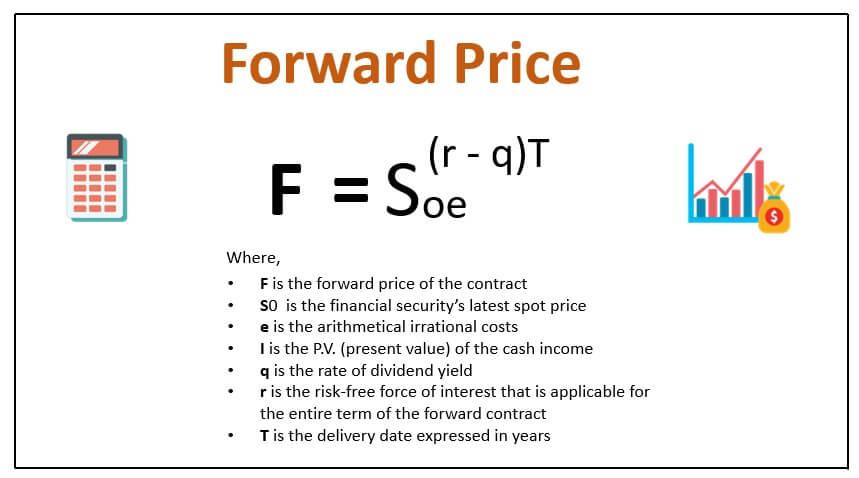

The world of commodities is intricate and vital to global economics. Commodities, comprising raw materials and primary agricultural products, serve as the building blocks of goods and services that drive industrialization and consumption worldwide. The pricing of these crucial assets is not only a reflection of their inherent value but also a complex interaction of various economic, geopolitical, and environmental factors. Understanding how commodity prices are determined is essential for investors and market participants, as it influences trading strategies, risk management practices, and economic forecasts.

Commodity prices are primarily driven by supply and demand dynamics, where the interplay between production levels and consumer demand establishes market equilibrium. However, this equilibrium can be disrupted by a multitude of factors ranging from geopolitical tensions and currency fluctuations to technological advancements and climatic conditions. Consequently, these factors introduce a level of volatility that requires market participants to adopt sophisticated strategies to navigate the complexities of commodity trading.



The emergence of algorithmic trading has added a new dimension to the commodity marketplace. By leveraging advanced computational techniques, algorithmic trading facilitates rapid execution of trades based on pre-set criteria, enabling traders to respond to market changes with unprecedented speed. This dynamic trading environment underscores the importance of a comprehensive understanding of the principles governing commodity prices. This article explores the key factors influencing commodity pricing, market economics, and the role of algorithmic trading, providing insights that are crucial for effective participation in today's commodity markets.

## Table of Contents

## What Are Commodities?

Commodities are fundamental materials or primary agricultural products that form the backbone of the global economy. These items can be broadly categorized into two types: hard commodities and soft commodities. Hard commodities include natural resources that are mined or extracted, such as oil, gold, and metals, while soft commodities encompass agricultural products like grains and livestock.

Oil is one of the most significant commodities, acting as the lifeblood of industrial economies. Its price influences transportation costs, production expenses, and even the cost of food due to its role in agriculture. The Organization of the Petroleum Exporting Countries (OPEC) plays a crucial role in the oil market by coordinating the petroleum policies of its member countries to stabilize oil markets.

Gold, another key commodity, is valued not only for its aesthetic qualities but also as a financial asset. Investors often turn to gold as a hedge against inflation and currency fluctuations. Its limited supply and the challenges associated with its extraction further influence its market price.

Grains, including wheat, corn, and rice, are vital soft commodities. They are staple foods for billions of people and serve as feed for livestock. The pricing and availability of these commodities are closely linked to weather conditions, farming practices, and global demand.

Metals such as copper, aluminum, and steel are indispensable in construction and manufacturing. These commodities are essential for infrastructure development and technological advancement. Fluctuations in their prices can be attributed to changes in industrial demand, government policies, and mining productivity.

Overall, commodities are indispensable to the production of goods and services worldwide. They not only drive economic activity but also serve as a barometer for global economic health. Understanding the intricacies of commodity markets is essential for traders, investors, and policymakers alike.

## Factors Affecting Commodity Pricing

Commodity pricing is primarily influenced by the interaction between supply and demand. These forces are foundational in setting market prices: when supply exceeds demand, prices tend to fall, whereas when demand outpaces supply, prices typically rise. The balance of supply and demand is affected by several key factors.

Production costs are a significant determinant of commodity prices. Key inputs such as labor, raw materials, and energy can impact the cost-effectiveness of producing commodities. For example, if the cost of extracting oil or mining metals increases due to higher energy prices or wage increases, the overall cost of production rises, pushing up commodity prices. This is often represented in economic models by shifting the supply curve upward, leading to higher equilibrium prices.

Geopolitical events can disrupt supply chains and affect commodity prices significantly. Political instability in resource-rich regions can lead to supply interruptions, causing price spikes. For instance, tensions in the Middle East often lead to [volatility](/wiki/volatility-trading-strategies) in oil prices. Sanctions, trade restrictions, or conflicts can hinder exports, reducing the availability of commodities on the global market and thereby increasing prices.

Government regulations also play a crucial role. Policy decisions such as tariffs, subsidies, or export controls can alter the supply and demand landscape. Subsidies might encourage increased production, thereby lowering prices, while tariffs on imports can reduce supply, pushing prices upward.

Weather events are particularly impactful on agricultural commodities. Adverse weather conditions, such as droughts or floods, can drastically reduce crop yields, thereby decreasing supply and causing prices to rise. For instance, a severe drought in a major grain-producing region can lead to a significant drop in supply, elevating global grain prices. Conversely, favorable weather can lead to bumper harvests, increasing supply and potentially lowering prices.

In summary, commodity pricing is a complex interplay of production costs, geopolitical factors, governmental policies, and weather conditions. Each of these elements can cause fluctuations in supply and demand, thereby influencing prices in the commodity markets. Understanding these factors is essential for predicting price movements and making informed trading decisions.

## Spot vs. Futures Prices

Spot prices represent the current market valuation of a commodity that is available for immediate delivery and payment. These prices are influenced by the present supply and demand dynamics. For example, if a commodity is scarce or if demand is high, the spot price will likely increase. Conversely, if there is an abundance of the commodity, the spot price may decrease.

Futures prices, on the other hand, are set today for transactions that are scheduled to occur at a specified future date. These prices are established through contracts on futures exchanges and are an essential tool for hedging and speculating. Futures prices often reflect market expectations about future conditions, including anticipated changes in supply and demand, economic trends, and geopolitical events.

The difference between spot and futures prices is known as the basis, which can be expressed as:

$$
\text{Basis} = \text{Spot Price} - \text{Futures Price}
$$

The basis is influenced by several factors including storage costs, interest rates, and convenience yield—the latter being the non-monetary advantage of holding the physical commodity, such as immediate availability. When futures prices exceed spot prices, the market is said to be in "contango," which often occurs when there are costs associated with storing commodities until future delivery. Conversely, when spot prices are higher than futures prices, the market is in "backwardation." This situation can arise when there is a high demand for immediate delivery relative to what sellers are willing to offer in the future.

Understanding the relationship between spot and futures prices is crucial for participants in the commodities market, as it impacts decision-making in hedging, speculation, and investment strategies. These concepts play a significant role in determining the cost of carrying a commodity and aligning future risk management with current market dynamics.

## Market Economics of Commodities

Commodity markets are influenced by a combination of fundamental and speculative trading. Fundamental trading is based on the supply and demand dynamics of the market, where the availability and need for a commodity drive its price. For example, a surplus in oil production may lead to lower prices, while a shortage may cause prices to spike. Speculative trading, on the other hand, involves traders attempting to profit from price movements by anticipating future market trends, often through the use of financial instruments like futures contracts.

Market psychology and sentiment are critical components that can lead to significant price volatility in commodity markets. Traders' perceptions of future economic conditions, geopolitical events, or industry developments can lead to changes in buying or selling behavior. For instance, rumors of geopolitical tensions in oil-producing regions can lead to a surge in oil prices as traders anticipate supply disruptions. Conversely, positive news about technological advancements in extraction processes might lower prices by easing supply concerns.

Global economic health plays a crucial role in influencing commodity prices. During periods of economic growth, demand for commodities typically increases as industries expand and consumer spending rises, leading to higher prices. Conversely, during economic downturns, decreased industrial activity and consumer demand can result in lower prices. For example, the global financial crisis of 2008 led to reduced demand for industrial commodities, causing a significant drop in prices.

Currency fluctuations also impact commodity prices. Most commodities are traded globally in U.S. dollars; thus, any change in the dollar's value can affect prices. A stronger dollar makes commodities more expensive for holders of other currencies, potentially reducing demand and lowering prices. Conversely, a weaker dollar can make commodities cheaper and boost demand.

In summary, the economics of commodity markets are shaped by the interplay of fundamental factors, speculative behaviors, market sentiment, global economic conditions, and currency movements. Understanding these elements is vital for market participants to make informed trading decisions.

## Role of Algorithmic Trading in Commodities

Algorithmic trading leverages advanced computer algorithms to automate and optimize trading decisions, offering a significant advantage in the commodity markets. These algorithms, which are essentially complex computer programs, are designed to follow predefined criteria to execute trades. By processing vast amounts of data instantaneously, [algorithmic trading](/wiki/algorithmic-trading) allows traders to act swiftly and decisively. This capability is particularly advantageous in the fast-paced environment of commodity markets where prices are notoriously volatile.

The primary advantage of algorithmic trading is its speed. Algorithms can analyze market conditions and execute trades within milliseconds, much faster than any human trader could. This rapid response capability is crucial for capitalizing on short-term price movements driven by market news or abrupt changes in supply and demand.

Algorithmic trading strategies often incorporate various mathematical models and statistical techniques. For example, mean reversion, [momentum](/wiki/momentum) strategies, and [arbitrage](/wiki/arbitrage) opportunities are commonly employed to identify profitable trades. These strategies can be encoded into algorithms using programming languages such as Python. Python’s libraries like NumPy, pandas, and SciPy are particularly useful for financial computations and data analysis. Below is a simple example of what a momentum-based trading strategy might look like in Python:

```python
import numpy as np
import pandas as pd

# Sample historical data for a commodity
data = pd.Series([50, 51, 49, 52, 53, 51, 54, 55, 56, 54])

# Calculate short-term momentum (difference between current and previous closing prices)
momentum = data.diff()

# Generate buy/sell signals based on momentum
signals = np.where(momentum > 0, "Buy", "Sell")

# Output the signals
print(signals)
```

Algorithmic trading has transformed the commodity market by providing [liquidity](/wiki/liquidity-risk-premium) and narrowing the bid-ask spread. However, it also introduces challenges, such as increased market volatility and the potential for flash crashes due to the sheer [volume](/wiki/volume-trading-strategy) of trades executed in milliseconds.

Moreover, the regulatory environment has adapted to account for the rise of algorithmic trading. Trading firms and participants must implement risk controls and ensure compliance with evolving market regulations to prevent market disruptions. The use of advanced risk management systems is thus a critical component in the implementation of algorithmic trading strategies in commodities. 

Overall, algorithmic trading plays an essential role in modern commodity markets by enhancing efficiency, liquidity, and price discovery while mandating that market participants remain vigilant about the associated risks and regulatory requirements.

## Conclusion

Commodity pricing results from an intricate interplay of supply-demand fundamentals, global events, and trading practices. Central to this is the law of supply and demand, which dictates that prices rise when demand exceeds supply and fall when supply exceeds demand. This fundamental economic principle is shaped by numerous factors, including production costs, geopolitical tensions, weather patterns, and government regulations. For instance, a political upheaval in an oil-rich region can disrupt supply chains and cause price spikes, while favorable weather can lead to bumper agricultural yields and lower prices.

Beyond basic economic forces, global events significantly influence commodity prices. Geopolitical incidents, natural disasters, and economic sanctions are pivotal in altering market dynamics. These events can cause abrupt shifts in supply or demand, leading to volatility in commodity prices. For example, a drought in a grain-producing region can drastically reduce supply, leading to higher prices, while new mining regulations can affect metal supplies, modifying market expectations.

Trading practices further contribute to the complexity of commodity pricing. The distinction between spot and futures prices illustrates the market's expectations and the cost of carrying the commodity over time. While spot prices reflect current market realities, futures prices are shaped by traders' predictions and hedging strategies.

The rise of algorithmic trading introduces an additional layer, enabling rapid execution of trades through sophisticated computer programs. These algorithms analyze market data and execute orders at a speed beyond human capability, often within milliseconds, thereby affecting short-term price movements. Algorithmic trading can capitalize on arbitrage opportunities, momentary price discrepancies, or exploit patterns that human traders might overlook, thus significantly impacting market liquidity and volatility.

Understanding these multifaceted influences is essential for effective market participation. Traders and investors must be adept at interpreting supply-demand signals, anticipating the impacts of global events, and recognizing the role of algorithmic strategies within commodity markets. As technology continues to evolve, the reliance on data-driven decision-making is poised to become even more integral to successful commodity trading, emphasizing the importance of staying informed and adaptable in analyzing these complex dynamics.

## References & Further Reading

[1]: Mason, C. F., & Finney, M. (2012). ["The Economics of Commodity Trading Firms."](https://www.bauer.uh.edu/spirrong/economics-commodity-trading-firms.pdf) Institute for Energy Economics.

[2]: Gorton, G., & Rouwenhorst, K. G. (2006). ["Facts and Fantasies about Commodity Futures."](https://www.nber.org/papers/w10595) Financial Analysts Journal, 62(2), 47-68.

[3]: Till, H. (2017). ["Handbook of Commodity Investing"](https://onlinelibrary.wiley.com/doi/epdf/10.1002/9781118267004.fmatter). John Wiley & Sons.

[4]: Black, F., & Scholes, M. (1973). ["The Pricing of Options and Corporate Liabilities."](https://www.cs.princeton.edu/courses/archive/fall09/cos323/papers/black_scholes73.pdf) Journal of Political Economy, 81(3), 637-654.

[5]: Hull, J. C. (2014). ["Options, Futures, and Other Derivatives"](https://www.amazon.com/Options-Futures-Other-Derivatives-9th/dp/0133456315) (9th ed.). Pearson.

[6]: Kumar, P. R., & Palaha, A. (2020). ["Algorithmic Trading and Regulation: An Emphasis on the Regulations and Frameworks in the USA and India."](https://escholarship.org/search/?q=author%3AMart%C3%ADnez-Garc%C3%ADa%2C%20G) Jaipuria Institute of Management.

[7]: Irwin, S. H., & Sanders, D. R. (2012). ["Financialization and Structural Change in Commodity Futures Markets."](https://caia.org/sites/default/files/membersonly/Financialization_and_Structural_Change_in_Commodity_Future_Markets.pdf) Journal of Agricultural and Applied Economics, 44(3), 371-396.