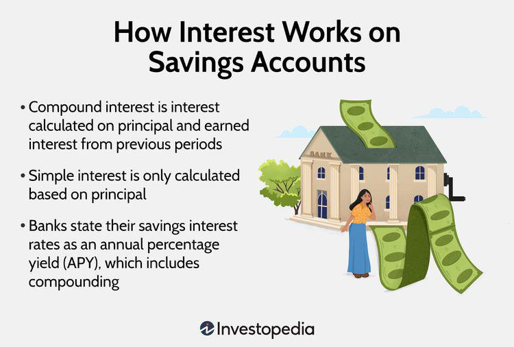

In today's dynamic financial landscape, having a firm grasp of bank rates, savings account interest rates, and algorithmic trading is essential for both investors and savers. These elements collectively shape the broader economic environment and individual financial opportunities. Bank rates, often determined by factors such as the central bank's monetary policy and prevailing economic conditions, influence the cost of borrowing and the return on savings. Meanwhile, savings account interest rates, dictated by supply and demand dynamics, are pivotal in attracting or limiting deposits at financial institutions.

Understanding how algorithmic trading interacts with these factors introduces another layer of complexity. Algorithmic trading, which employs computational algorithms to execute trades based on preset criteria, has gained prominence for its ability to process vast datasets and make trades faster than humanly possible. Its influence on market dynamics, and indirectly on interest rates, can have significant implications for investors and savers alike.



This article aims to elucidate the intricate interplay between these financial tools, their potential impacts on personal finance, and the strategic considerations necessary for optimizing investments and savings. By examining the current financial environment through the lens of these three crucial components, we seek to provide readers with practical insights and strategies to leverage them effectively. By the end of this article, readers will be well-equipped to navigate the complex financial landscape, making informed decisions that enhance their financial well-being.

## Table of Contents

## Understanding Bank Rates and Savings Account Interest Rates

Bank rates are the interest rates that financial institutions offer on various products, such as savings accounts, certificates of deposit (CDs), and loans. These rates are a fundamental aspect of the banking sector and significantly impact both the economy and individual financial planning. The rates offered by banks are influenced by a number of internal and external factors, with a particular emphasis on the monetary policy set by the Federal Reserve and prevailing economic conditions.

The Federal Reserve, the central banking system of the United States, plays a pivotal role in determining bank rates through its control over the federal funds rate, which is the interest rate at which banks lend to each other overnight. Adjustments to this rate are a primary tool for the Federal Reserve to influence economic activity. When the Federal Reserve changes the federal funds rate, banks often respond by altering their own interest rates on savings accounts and other financial instruments. For example, a reduction in the federal funds rate tends to lower interest rates on savings accounts, making borrowing cheaper and encouraging spending and investment. Conversely, an increase can lead to higher rates, incentivizing saving over spending.

Economic conditions also significantly affect bank rates. During periods of economic growth, demand for credit increases, pushing banks to offer competitive rates to attract more deposits. In contrast, economic downturns usually result in a decrease in demand for credit, and banks may lower rates to encourage borrowing. Inflation rates, employment figures, and GDP growth are some of the economic indicators that banks consider when adjusting their interest rates.

The supply and demand dynamics in the banking sector are another critical [factor](/wiki/factor-investing) influencing savings account interest rates. Banks use these rates to attract deposits when they need to increase their cash reserves or fund more loans. If a bank requires more deposits, it may offer higher interest rates to attract more savers. Conversely, if a bank has sufficient deposits, it might lower rates. Therefore, these rates often fluctuate in response to changes in the bank’s needs and broader economic signals.

Staying informed about current savings account rates is essential for maximizing the return on your savings. Savers should regularly compare the interest rates offered by different banks and financial institutions. Online platforms and financial news outlets can be valuable resources for tracking these rates. Additionally, consumers can utilize bank rate comparison tools to identify high-yield savings options that align with their financial goals.

In summary, understanding bank rates and savings account interest rates requires comprehension of the Federal Reserve's monetary policy actions, economic conditions, and supply and demand dynamics. By keeping abreast of these factors, savers can make informed decisions to ensure optimal returns on their deposits.

## The Role of Government and Central Banks

Governments and central banks play a pivotal role in shaping the economic landscape through the manipulation of interest rates via monetary policy. Central banks, such as the Federal Reserve in the United States, have the ability to influence short-term interest rates by setting the federal funds rate, which is the rate at which banks lend to each other overnight. This rate serves as a benchmark for other interest rates across the economy, including those for savings accounts, mortgages, and loans.

Monetary policy can be broadly categorized into two types: expansionary and contractionary. In an expansionary monetary policy, central banks lower interest rates to stimulate economic activity. This is often employed during periods of economic downturn to encourage borrowing, spending, and investment. Lower interest rates decrease the cost of loans, making it more attractive for businesses to invest in projects and for consumers to purchase goods and services. Consequently, banks may reduce the interest rates offered on savings accounts to dissuade saving and instead promote expenditure and investment.

In contrast, during periods of high inflation, central banks might adopt a contractionary monetary policy by raising interest rates. Higher rates can help reduce inflationary pressures by discouraging borrowing and spending. Savings account rates may rise as a result, increasing the return on savings and encouraging consumers to save rather than spend.

Central banks influence interest rates through various tools, such as open market operations, where they buy or sell government securities to change the level of reserves in the banking system. By increasing reserves, central banks can lower the federal funds rate; by decreasing reserves, they can raise it.

Understanding these monetary policy mechanisms is crucial for savers and investors. For instance, if an investor anticipates that a central bank will lower interest rates, they might expect lower returns on savings accounts but potentially stronger performance in certain stock markets or bond sectors due to increased economic activity. Conversely, if interest rates are expected to rise, investors might shift towards fixed-income investments that offer higher returns in anticipation of increased interest rates.

By staying informed about policy directions and economic forecasts, individuals can make more informed decisions regarding their savings and investments. This could involve reallocating investment portfolios to optimize returns based on anticipated [interest rate](/wiki/interest-rate-trading-strategies) changes, or choosing financial products that offer protection against interest rate [volatility](/wiki/volatility-trading-strategies).

## Algorithmic Trading: An Overview

Algorithmic trading utilizes computer programs to execute financial transactions based on a set of predefined rules and algorithms. This method leverages complex mathematical models and statistical analysis to determine the optimal timing and pricing for trades. Algorithmic trading is prevalent in today's financial markets, as it can efficiently process substantial volumes of data and execute trades at speeds unobtainable by human traders.

One of the primary advantages of [algorithmic trading](/wiki/algorithmic-trading) is its ability to handle large datasets. High-frequency trading ([HFT](/wiki/high-frequency-trading-strategies)), a subset of algorithmic trading, involves executing orders of extreme frequency, often in fractions of a second, to capitalize on minute price discrepancies. This level of trading speed and data processing is essential in today’s fast-paced markets where competitive edge is measured in milliseconds.

Algorithmic strategies rely on historical data and real-time information to make decisions. Common algorithms include market-making, [arbitrage](/wiki/arbitrage), and trend-following strategies. Market-making algorithms manage bid-ask spreads to facilitate market [liquidity](/wiki/liquidity-risk-premium), while arbitrage algorithms exploit price differences between instruments in different markets. Trend-following strategies use historical price data to identify market inertia and capitalize on anticipated price movements.

Despite its advantages, algorithmic trading is not without challenges. The dependence on technology introduces operational risks, including system failures and cybersecurity threats. Additionally, the complexity of algorithms can result in unintended market effects, such as the Flash Crash of May 6, 2010, wherein algorithmic trading contributed to a massive short-term market decline.

Furthermore, algorithmic trading can result in market volatility. While these programmed transactions enhance market efficiency, they can amplify trends and contribute to swift price movements, posing potential risks for traditional investors. Regulatory bodies monitor and regulate algorithmic trading to mitigate these risks and ensure market integrity.

In summary, algorithmic trading is a powerful tool in modern financial markets, offering speed and efficiency beyond human capability. However, it requires careful implementation and regulation to manage its inherent risks and maintain stable market conditions. As technology evolves, the role of algorithmic trading will likely expand, continuing to shape the dynamics of global financial markets.

## How Algorithmic Trading Impacts Interest Rates and Bank Rates

Algorithmic trading represents a significant force within financial markets, affecting various market dynamics, including interest rates and bank rates. By automating trading strategies, algorithmic systems enable market participants to react instantaneously to data, news, and price changes, potentially impacting the supply and demand for financial products.

One of the primary influences of algorithmic trading on interest rates and bank rates arises from its ability to process large datasets and execute trades at speeds unattainable by human traders. As algorithms swiftly react to market information, they contribute to the liquidity and price efficiency of financial instruments. This heightened market responsiveness can induce short-term fluctuations in interest rates through rapid shifts in supply and demand dynamics. For instance, if algorithmic trading detects an economic indicator that suggests future changes in the Federal Reserve's monetary policy, it can trigger a cascade of trades that adjust the market's expectations about interest rates.

Moreover, the extensive use of algorithmic trading contributes to volatility, as large volumes of trades can be executed almost simultaneously. This volatility may alter investor behavior, influencing the rates that banks offer on savings accounts and other consumer financial products. Algorithms that focus on interest rate products, such as bonds or interest rate futures, directly engage with market rates. By altering the pricing and yields of these securities, algorithmic trading can indirectly affect the rates of return on savings accounts and fixed deposits that banks adjust in response to their funding costs.

For investors and savers, understanding the implications of algorithmic trading on market dynamics is crucial. Algorithmic systems can generate rapid price adjustments, creating opportunities and risks relating to interest rate movements. By monitoring the technological advancements and strategies employed in algorithmic trading, individuals can better anticipate these rate changes and position their portfolios accordingly.

Finally, while algorithmic trading streamlines and enhances trading operations, it also underscores the necessity of robust risk management practices. Automated systems can amplify systemic risks, especially under conditions of market stress or technical failures. Consequently, investors should remain vigilant and consider both the technological and behavioral aspects of algorithmic trading when formulating their savings and investment strategies. 

In conclusion, while algorithmic trading enhances market efficiency by processing and executing trades at rapid speeds, it also introduces pronounced effects on interest rate dynamics. By understanding these influences, investors can optimize their financial decision-making processes in response to evolving market conditions.

## Strategies for Maximizing Savings and Investments

To maximize returns on savings and investments, individuals must strategically navigate financial markets and product offerings. High-yield savings accounts present a straightforward method of [earning](/wiki/earning-announcement) higher interest on deposited funds. These accounts typically offer rates above the national average, occasionally linked to broader economic indicators such as the Federal Reserve's interest rate movements. Continuous monitoring of financial news and trends is essential in identifying banks or financial institutions offering competitive rates.

Algorithmic trading presents an advanced approach for optimizing investment portfolios. This method utilizes computational algorithms to analyze vast datasets and execute trades based on specific criteria. Algorithms can incorporate a variety of factors, including market trends, historical data, and statistical models, to make informed trading decisions. For instance, a basic Python pseudocode for a moving average crossover strategy might look like:

```python
def moving_average(data, period):
    return sum(data[-period:]) / period

def trade_signal(prices, short_window, long_window):
    short_ma = moving_average(prices, short_window)
    long_ma = moving_average(prices, long_window)

    if short_ma > long_ma:
        return "Buy"
    elif short_ma < long_ma:
        return "Sell"
    else:
        return "Hold"
```

This strategy assumes a decision to "Buy" when the short-term moving average exceeds the long-term moving average, indicating a potential market uptrend. Conversely, a "Sell" signal is generated when the short-term average falls below the long-term average.

Diversification is another critical component of a robust investment strategy, helping mitigate risk across an array of asset classes, including stocks, bonds, and real estate. By distributing investments, individuals can cushion potential losses in one sector with gains in another. Monitoring interest rate fluctuations is equally vital, as changes can influence asset valuations and impact investment returns. For example, rising interest rates tend to depress bond prices but may boost returns on savings accounts and other fixed-income instruments.

Ultimately, achieving financial stability and growth requires a blend of vigilance in spotting advantageous market conditions, leveraging technology to enhance trading efficiency, and balancing portfolios to manage risk effectively. As market conditions evolve, so too should the strategies employed to maximize financial outcomes, making adaptability a key trait for successful investors.

## The Bottom Line

Understanding the interplay between bank rates, savings account interest rates, and algorithmic trading is vital in today's economy. These financial tools form a complex system where each component influences the others and, when mastered, can significantly boost personal financial outcomes. Bank rates, set by financial institutions, are heavily influenced by central banks' monetary policy and economic factors, which in turn affect savings account interest rates. These rates determine the return individuals can expect on their deposits.

Algorithmic trading, on the other hand, introduces a high-tech dimension to financial markets, allowing for swift reactions to market changes and efficient processing of vast amounts of data. This trading technique can impact financial markets, influencing demand and supply dynamics, which may subsequently alter interest rates and bank rates. Thus, staying informed about the mechanics of algorithmic trading becomes crucial for recognizing how these fluctuations might affect savings and investments.

To effectively leverage these tools, individuals need to engage in continuous learning and adaptation. Financial landscapes are ever-changing, with numerous variables influencing market conditions and interest rate trends. By maintaining an informed perspective on these variations, investors and savers can optimize their strategies, decide on high-yield savings options, and potentially utilize algorithmic strategies to enhance investment portfolios. The key lies in understanding and predicting how these interrelated components might shift, enabling individuals to make calculated decisions and sustain financial growth amid evolving economic conditions.

## References & Further Reading

[1]: Gupta, A. (2019). ["Handbook of High-Frequency Trading."](https://onlinelibrary.wiley.com/doi/pdf/10.1002/9781118593486.fmatter) Academic Press.

[2]: Tsay, R. S. (2010). ["Analysis of Financial Time Series."](https://onlinelibrary.wiley.com/doi/book/10.1002/9780470644560) Wiley.

[3]: Seco, L. (2013). ["Mathematics of Financial Markets."](https://link.springer.com/book/10.1007/b97681) Springer.

[4]: Hasbrouck, J. (2007). ["Empirical Market Microstructure: The Institutions, Economics, and Econometrics of Securities Trading."](https://academic.oup.com/book/52241) Oxford University Press.

[5]: Aldridge, I. (2013). ["High-Frequency Trading: A Practical Guide to Algorithmic Strategies and Trading Systems."](https://www.amazon.com/High-Frequency-Trading-Practical-Algorithmic-Strategies/dp/1118343506) Wiley.

[6]: Lo, A. W., & MacKinlay, A. C. (1999). ["A Non-Random Walk Down Wall Street."](https://www.jstor.org/stable/j.ctt7tccx) Princeton University Press.