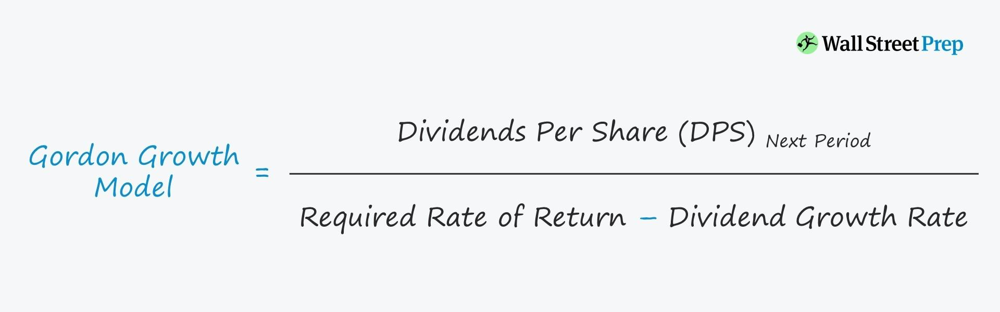

## Table of Contents

## What is the Gordon Growth Model?

The Gordon Growth Model is a way to figure out how much a stock is worth by looking at the dividends it pays out. It assumes that these dividends will grow at a steady rate forever. The model uses a simple formula where you take the next year's expected dividend and divide it by the difference between the required rate of return and the growth rate of the dividends. This model is really helpful for companies that are stable and not expected to change a lot in the future.

One important thing to remember is that the growth rate of the dividends has to be less than the required rate of return. If it's not, the formula won't work because you can't divide by zero or a negative number. This model is named after Myron J. Gordon, who came up with it. It's also called the dividend discount model because it's all about discounting future dividends back to what they're worth today.

## What are the key components of the Gordon Growth Model?

The Gordon Growth Model is made up of a few important parts. The first part is the expected dividend for next year. This is the amount of money the company is expected to pay out to its shareholders in the next year. The second part is the required rate of return. This is the return that investors want to get from their investment in the company. It's like the minimum amount they need to be happy with their investment.

The third part is the growth rate of the dividends. This is how fast the company's dividends are expected to grow every year. It's important that this growth rate is less than the required rate of return. If it's not, the model won't work. The model uses these three parts in a simple formula to figure out the value of a stock. You take the expected dividend for next year and divide it by the difference between the required rate of return and the growth rate of the dividends. This gives you the stock's value according to the Gordon Growth Model.

## How do you calculate the dividend growth rate for the Gordon Growth Model?

To calculate the dividend growth rate for the Gordon Growth Model, you need to look at the company's past dividends. You can do this by finding out how much the company paid in dividends each year and then figuring out the average rate at which those dividends grew over time. For example, if a company paid $1 per share last year and $1.05 this year, the growth rate would be 5%. You can use this method to calculate the growth rate over several years and then use an average to get a more accurate number.

It's also important to consider what the company says about its future plans. Sometimes, companies will tell investors that they plan to increase their dividends by a certain amount each year. If the company gives a clear statement about its future dividend growth, you can use that number instead of calculating it from past data. This can be more reliable if the company has a good track record of sticking to its plans. Remember, the growth rate you use should be realistic and based on what you think the company can actually do in the future.

## What is the formula for the Gordon Growth Model?

The Gordon Growth Model has a simple formula to find out how much a stock is worth. The formula is: Stock Value = Next Year's Dividend / (Required Rate of Return - Dividend Growth Rate). This means you take the dividend the company is expected to pay next year and divide it by the difference between the rate of return investors want and the rate at which the dividends are expected to grow.

It's important that the dividend growth rate is less than the required rate of return. If it's not, the formula won't work because you can't divide by zero or a negative number. This model is really useful for companies that are stable and not expected to change a lot in the future. It helps investors figure out if a stock is a good buy based on the dividends it will pay out.

## How do you determine the required rate of return in the Gordon Growth Model?

The required rate of return in the Gordon Growth Model is what investors expect to earn from their investment in a company. It's like the minimum amount they need to feel good about putting their money into the stock. This rate can be influenced by many things, like how risky the investment is, what other investment options are available, and what the general economy is doing. If a stock is seen as riskier, investors might want a higher return to make up for that risk.

To figure out the required rate of return, you can look at what similar investments are offering. For example, if other stocks in the same industry are giving a return of 8%, investors might expect at least that much from the stock they're looking at. Another way is to use models like the Capital Asset Pricing Model (CAPM), which looks at the risk-free rate (like what you'd get from government bonds) and adds a premium for the stock's specific risk. This gives a more detailed and personalized estimate of the return investors might require.

## What assumptions does the Gordon Growth Model make about future dividends?

The Gordon Growth Model assumes that future dividends will grow at a steady rate forever. This means it believes the company will keep increasing its dividends by the same percentage each year, without any big changes. The model is really simple because it doesn't think the company will ever stop growing its dividends or change how fast it grows them.

This assumption works well for companies that are stable and not expected to change a lot. But it might not be right for companies that are growing quickly or going through big changes. The model also assumes that the growth rate of the dividends will always be less than the required rate of return. If this isn't true, the formula won't work because you can't divide by zero or a negative number.

## How does the Gordon Growth Model differ from other valuation models?

The Gordon Growth Model is different from other valuation models because it focuses on dividends and assumes they will grow at a steady rate forever. This makes it really simple to use, but it only works well for companies that are stable and not expected to change a lot. Other models, like the Discounted Cash Flow (DCF) model, look at all the cash a company makes, not just dividends. The DCF model can handle more complicated situations where a company's cash flow might change a lot over time.

Another big difference is that the Gordon Growth Model uses a single growth rate for dividends, while other models might use different growth rates for different parts of a company's future. For example, the DCF model might use one growth rate for the next few years and a different one after that. The Gordon Growth Model also assumes that the growth rate of dividends will always be less than the required rate of return, which is a big assumption that might not be true for all companies. This makes it less flexible than other models that can handle a wider range of situations.

## What are the limitations of using the Gordon Growth Model for share price determination?

The Gordon Growth Model has some big limitations when you use it to figure out a share's price. One big problem is that it assumes dividends will grow at a steady rate forever. This doesn't work well for companies that are growing quickly or going through big changes. If a company's dividends don't grow steadily, the model won't give you a good answer. Also, the model assumes the growth rate of dividends will always be less than the required rate of return. If this isn't true, you can't use the formula because you can't divide by zero or a negative number.

Another limitation is that the Gordon Growth Model only looks at dividends and doesn't consider other important things like a company's earnings or cash flow. Other models, like the Discounted Cash Flow model, look at all the money a company makes, which can give a more complete picture of its value. The Gordon Growth Model is also not very flexible. It uses one growth rate for the whole future, while other models can use different growth rates for different times or parts of a company's future. This makes it less useful for companies that are expected to change a lot over time.

## How can the Gordon Growth Model be adjusted for companies with irregular dividend patterns?

The Gordon Growth Model is best for companies with steady dividend growth, but you can still use it for companies with irregular dividends by making some changes. One way to do this is to use an average growth rate over several years instead of just one year. This can help smooth out the ups and downs in the dividends. For example, if a company's dividends went up and down a lot over the last five years, you could find the average growth rate over those five years and use that in the model. This way, you're not just looking at one year's growth, which might not be typical.

Another way to adjust the model is to use different growth rates for different periods. You could use a higher growth rate for the next few years if you think the company's dividends will grow quickly, and then switch to a lower, more stable growth rate after that. This can help the model fit better with what you think will happen to the company's dividends in the future. But remember, the more you change the model, the less simple it becomes, and the more guesses you have to make about the future.

## What impact does a change in the required rate of return have on the share price according to the Gordon Growth Model?

When the required rate of return goes up, the share price goes down according to the Gordon Growth Model. This happens because the required rate of return is in the bottom part of the formula. If it gets bigger, the whole value of the share goes down. Think of it like this: if investors want a higher return, they will be willing to pay less for the stock because they need more money from it to meet their new expectations.

On the other hand, if the required rate of return goes down, the share price goes up. This is because a smaller number in the bottom part of the formula makes the whole value bigger. If investors are happy with a lower return, they will be willing to pay more for the stock because the dividends they get will be worth more to them. So, changes in the required rate of return can have a big effect on how much investors think a share is worth.

## How can the Gordon Growth Model be used in conjunction with other financial analysis tools?

The Gordon Growth Model can be used with other financial analysis tools to get a better picture of a company's value. For example, you might use the Gordon Growth Model to find out what a stock is worth based on its dividends. Then, you could use the Discounted Cash Flow (DCF) model to look at all the money the company makes, not just dividends. By comparing the results from both models, you can see if they agree on the stock's value or if there are big differences that need more looking into.

Another way to use the Gordon Growth Model with other tools is to check its assumptions. The Gordon Growth Model assumes dividends will grow at a steady rate forever, which might not be true for all companies. You can use other tools like ratio analysis to see if the company's financial health supports the growth rate you used in the model. For example, if the company's earnings are growing slower than its dividends, the Gordon Growth Model might be too optimistic. By using these other tools, you can make sure the Gordon Growth Model's results make sense and adjust them if needed.

## What advanced techniques can be applied to enhance the accuracy of the Gordon Growth Model in predicting share prices?

To make the Gordon Growth Model better at predicting share prices, you can use something called multi-stage growth models. Instead of using just one growth rate for the whole future, you can break it into different stages. For example, you might use a high growth rate for the next few years if you think the company will grow quickly, and then switch to a lower, more stable growth rate after that. This can help the model fit better with what you think will happen to the company's dividends in the future. By using different growth rates for different times, you can make the model more accurate for companies that are expected to change a lot over time.

Another way to improve the Gordon Growth Model is to use sensitivity analysis. This means you try out different numbers for the required rate of return and the growth rate to see how much they change the share price. By doing this, you can see which numbers have the biggest effect on the model's results. This can help you understand how sensitive the share price is to changes in these key numbers. It also helps you see if the model's results are reliable or if small changes in your guesses can make a big difference in the share price. By using these advanced techniques, you can make the Gordon Growth Model more accurate and useful for predicting share prices.

## What are the Mechanics of Share Price Calculation?

Share prices are primarily influenced by market dynamics and investor expectations, which are subject to a complex interplay of economic factors, corporate performance, and broader market sentiment. At its core, stock valuation aims to estimate the intrinsic value of a company—a theoretical value based on fundamentals that may differ from its current market price due to varying investor perceptions and market conditions.

Various valuation methods have been developed to estimate the intrinsic value of a stock. One common approach is the use of multiples, such as the Price-to-Earnings (P/E) ratio. The P/E ratio compares a company's current share price to its per-share earnings, providing a quick glimpse of how a company's valuation stacks up against its earnings. Higher P/E ratios might suggest that a stock is overvalued or that investors expect high growth rates in the future.

Another sophisticated method involves Discounted Cash Flows (DCF), which calculates the present value of expected future cash flows generated by the company. This method requires estimating future free cash flows and determining an appropriate discount rate, often the company's weighted average cost of capital (WACC). The formula for calculating DCF is:

$$

\text{DCF} = \sum \frac{C_t}{(1 + r)^t} 
$$

where $C_t$ represents the expected cash flow in year $t$ and $r$ is the discount rate.

Among the various valuation models, the Dividend Discount Model (DDM) stands out by focusing on dividends paid out to shareholders. The DDM estimates the present value of a stock based on its expected future dividends. A popular variant of the DDM is the Gordon Growth Model (GGM), which assumes constant growth in dividends. The GGM formula is:

$$

\text{Intrinsic Value} = \frac{D}{r - g}
$$

where $D$ is the expected annual dividend, $r$ is the discount rate, and $g$ is the growth rate in dividends. GGM simplifies the valuation process by considering only the dividends, a particularly useful approach when estimating stocks of stable companies with predictable dividend policies.

These methods underscore the complexity of stock valuation, where each model provides unique insights and faces specific limitations. By employing these tools, investors strive to identify investment opportunities where the intrinsic value significantly exceeds or falls short of the market price, thereby guiding informed investment decisions.

## What is the Gordon Growth Model and how can it be understood?

The Gordon Growth Model (GGM) is a widely used dividend discount model designed to ascertain the intrinsic value of a company's stock by focusing on expected future dividend growth and associated discount rates. This model stands out for its assumption of a constant rate of growth in dividends over time.

The primary formula utilized in the GGM is:

$$
\text{Intrinsic Value} = \frac{D}{r - g}
$$

Where:
- $D$ represents the expected annual dividend for the next period.
- $r$ denotes the discount rate or the required rate of return by investors.
- $g$ is the constant growth rate of dividends.

The underlying principle of the GGM is its reliance on the predictable and steady growth of dividends, thus offering a streamlined approach to stock valuation. This model is particularly effective for companies with stable, mature business models that have established patterns of dividend payments. The GGM posits that the value of a stock is inherently connected to its future dividend payments, given the premise that dividends are a key return component for shareholders.

However, the model requires the assumption that $r > g$ to ensure meaningful calculations. If the growth rate $g$ equals or exceeds the discount rate $r$, the formula would fail to produce a viable intrinsic value. Therefore, it is crucial for investors to provide accurate estimates for these variables to derive dependable valuations through the GGM.

The simplicity of the GGM makes it a fundamental tool in dividend-based stock valuation, facilitating a better understanding of investment prospects through straightforward calculations. The model’s focus on dividends provides clarity, particularly in assessing companies with predictable growth trajectories. Nonetheless, the assumptions inherent in the GGM must be critically evaluated to ensure applicability to real-world scenarios and investment contexts.

## What is an Example of Applying the Gordon Growth Model?

Consider a scenario where an investor is evaluating a stock that pays an annual dividend of $2. The company's dividends are expected to grow at a steady rate of 3% per year, while the investor seeks a return of 5% on their investment, which is the discount rate. The Gordon Growth Model (GGM) provides a way to calculate the intrinsic value of this stock using the formula:

$$
\text{Intrinsic Value} = \frac{D}{r - g}
$$

where $D$ is the expected annual dividend, $r$ is the discount rate, and $g$ is the growth rate. Applying these values:

$$
\text{Intrinsic Value} = \frac{2}{0.05 - 0.03} = \frac{2}{0.02} = 100
$$

The intrinsic value of the stock, as calculated by the GGM, is $100. This valuation helps investors in making informed decisions by comparing the calculated intrinsic value with the stock's current market price. 

If the market price is below $100, the stock could be considered undervalued according to the model, possibly signaling a buying opportunity. Conversely, if the market price is above $100, it may be seen as overvalued, indicating that an investor might reconsider purchasing or evaluate the reasons for the discrepancy. The GGM thus acts as a guide, in helping to determine whether the market aligns with the theoretical valuation based on expected future dividends.

## What are the drawbacks and limitations of the Gordon Growth Model?

The Gordon Growth Model (GGM) offers a straightforward method for valuing a stock based on its expected future dividends, but it carries certain inherent limitations. Primarily, GGM assumes perpetual and constant growth in dividends, a scenario not always applicable in real-world settings. Companies often experience fluctuating growth rates due to market conditions, economic cycles, and changes in management strategies. This assumption of uniform growth can lead to inaccurate valuations if a company's actual dividend growth is erratic or trend-breaking.

Furthermore, the GGM is not suitable for companies that do not pay dividends. Many firms, especially those in the technology or startup sectors, reinvest earnings into business growth rather than distributing them to shareholders. Therefore, these companies elude valuation via the GGM, limiting the model's applicability to dividend-paying firms alone.

The model's sensitivity to the growth rate ($g$) and the discount rate ($r$) also poses challenges. Small variations in these parameters can cause significant shifts in the calculated intrinsic value. Particularly problematic is the scenario where the growth rate approaches or equals the discount rate. The formula for the intrinsic value is:

$$
\text{Intrinsic Value} = \frac{D}{r - g}
$$

If $g$ equals $r$, the denominator approaches zero, resulting in an undefined or infinite value, rendering the model impractical and highlighting its mathematical constraints. If $g$ exceeds $r$, the model suggests an illogical negative stock value, further emphasizing the risk of reliance on incorrect or overly optimistic growth estimates.

These drawbacks underline the necessity for investors to exercise caution and complement the GGM with other financial analysis tools and models to construct a more holistic view of a company's valuation and potential investment viability.

## References & Further Reading

[1]: ["The Theory of Investment Value"](https://www.amazon.com/Theory-Investment-Contrary-Opinion-Library/dp/087034126X) by John Burr Williams

[2]: ["Security Analysis"](https://www.amazon.com/Security-Analysis-Foreword-Buffett-Editions/dp/0071592539) by Benjamin Graham and David Dodd

[3]: ["Investment Valuation: Tools and Techniques for Determining the Value of Any Asset"](https://archive.org/details/investmentvaluat0000damo_n6k9) by Aswath Damodaran

[4]: Gordon, M. J. (1959). ["Dividends, Earnings, and Stock Prices."](http://piketty.pse.ens.fr/files/Gordon1959.pdf) The Review of Economics and Statistics, 41(2), 99105.

[5]: ["Quantitative Value: A Practitioner's Guide to Automating Intelligent Investment and Eliminating Behavioral Errors"](https://www.amazon.com/Quantitative-Value-Web-Site-Practitioners/dp/1118328078) by Wesley R. Gray and Tobias E. Carlisle