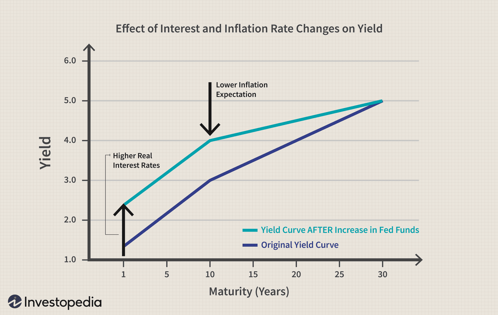

The bond market is a fundamental component of the global financial system, serving a critical role in providing investors with predictable returns and opportunities for capital preservation. Bonds are fixed-income instruments in which an investor loans money to an entity—typically corporate or governmental—in exchange for periodic interest payments and the return of the bond's face value upon maturity. This market is often seen as a safe haven for investment, as it offers various forms of risk mitigation compared to the more volatile stock market.

Central to the functioning of the bond market is the influence of interest rates, which profoundly impact the pricing and yield of bonds. The relationship between interest rates and bond prices is inverse: as interest rates rise, existing bond prices generally fall, and conversely, when interest rates decrease, bond prices tend to increase. This is largely due to the fixed nature of bond coupon payments becoming more or less attractive relative to new bonds issued at current rates. 

Interest rate fluctuations are guided by monetary policy, often driven by central banks like the U.S. Federal Reserve, which adjusts rates to control economic growth, inflation, and employment levels. These changes in interest rates are key to determining the yield investors can expect from bonds and shape broader market strategies.

Furthermore, the rise of algorithmic trading has added a layer of complexity to the bond market, particularly in the trading of U.S. Treasury bonds. Algorithmic trading employs sophisticated mathematical models and automated systems to execute trading decisions at speeds and frequencies beyond human capability. This technological shift has transformed how bonds are traded, increasing market efficiency and liquidity but also introducing new challenges related to market volatility and the risk of rapid, large-volume trades.

Understanding the intertwined roles of interest rates, the bond market, and algorithmic trading is essential for investors aiming to optimize their portfolios. A nuanced appreciation of these dynamics can better position investors to capitalize on market opportunities while managing risks effectively. This article will explore these elements in detail, providing insights into their interactions and implications for investment strategies.

## Table of Contents

## Understanding the Bond Market

The bond market, an integral part of the financial ecosystem, is larger in terms of volume compared to the stock market. It serves as a platform where debt securities are issued and traded, providing a range of opportunities for investors seeking income and capital preservation. Bonds are essentially loans made by investors to borrowers, typically governments or corporations, who use these funds for various purposes, such as infrastructure projects or business expansion.

### Types of Bonds

1. **Treasury Bonds (T-Bonds)**: Issued by national governments, treasury bonds are considered among the safest investments due to the backing by the full faith and credit of the issuing sovereign entity. In the United States, for example, these bonds are long-term, typically with maturities of 10 years or more, and pay interest semi-annually.

2. **Corporate Bonds**: These are issued by corporations to raise capital for expansion, acquisition, or other operational needs. The risk associated with corporate bonds generally depends on the issuing company's creditworthiness, with higher yields offered on bonds from companies with lower credit ratings.

3. **Municipal Bonds**: Issued by states, municipalities, or counties, these bonds fund public projects like schools, highways, or hospitals. They often offer tax-exempt interest income to investors residing in the issuing locality.

4. **Agency Bonds**: These are issued by government-affiliated entities such as Fannie Mae or Freddie Mac. They carry a different risk profile because they are not directly backed by the government but still offer relatively low risk.

### Key Terminologies

- **Coupon Rate**: This is the interest rate that the bond issuer will pay to the bondholder. It is expressed as a percentage of the face value of the bond.

- **Yield**: Yield represents the earnings generated and realized on an investment over a particular period. It is expressed as a percentage and often refers to the effective interest rate on a bond.

- **Maturity**: This indicates the specific future date on which the bond's principal amount (face value) is to be paid to the bondholder.

- **Credit Rating**: Bonds are rated based on the issuer’s ability to repay the borrowed funds. Ratings are provided by agencies such as Moody's and Standard & Poor’s and affect the bond's interest rate.

### Yield Concepts

The yield of a bond can be impacted by various factors, including current interest rates and the bond's credit rating. Key yield concepts include:

- **Current Yield**: Calculated by dividing the bond's annual coupon payment by its current market price. It provides a snapshot of the bond's income relative to its price at a point in time.
$$
  \text{Current Yield} = \frac{\text{Annual Coupon Payment}}{\text{Current Market Price}}

$$

- **Yield to Maturity (YTM)**: This is a more comprehensive yield measure that considers both the annual coupon income and any capital gains or losses the investor will realize if the bond is held to maturity. It is a complex calculation that solves for the interest rate (Y) in the bond pricing equation:
$$
  \text{Price} = \sum_{t=1}^{n} \frac{\text{Coupon Payment}}{(1+Y)^t} + \frac{\text{Face Value}}{(1+Y)^n}

$$

Understanding the bond market involves appreciating how various types of bonds, related terminologies, and yield concepts provide investors with tools to navigate economic conditions and investment objectives effectively. Such comprehension aids investors in making informed decisions that align with their financial goals.

## Role of Interest Rates in the Bond Market

Interest rates are central to the dynamics of the bond market, as they are key determinants of bond yields and, consequently, investor returns. The inverse relationship between interest rates and bond prices is one of the fundamental principles guiding bond market operations. When interest rates rise, new bonds are issued with higher yields, making existing bonds with lower yields less attractive. This decreases the price of existing bonds. Conversely, when interest rates fall, existing bonds with higher coupon rates become more valuable, increasing their market price.

The Federal Reserve, through its monetary policy decisions, significantly influences interest rates in the United States. By altering the federal funds rate, the [interest rate](/wiki/interest-rate-trading-strategies) at which depository institutions trade federal funds with each other overnight, the Federal Reserve aims to regulate economic activity and control inflation. Lowering interest rates typically encourages borrowing and investment but may lead to higher inflation if overused. Conversely, raising interest rates can slow economic growth but help keep inflation in check.

The impact of different interest rate environments is pivotal for investment strategies. In a low-interest-rate environment, investors might seek higher yields through riskier bonds or alternative investments, while in a high-interest-rate environment, more conservative bond investments might become attractive due to higher yields on safer bonds like treasuries. Understanding these dynamics helps investors forecast bond market movements and adjust their portfolios accordingly.

Changes in interest rates affect the market directly and alter investor sentiment, influencing the supply-demand dynamics of treasury bonds. When rates are anticipated to rise, investors might reduce demand for existing bonds in anticipation of new issues offering higher returns. This expected rate movement can lead to a sell-off in the bond market, further depressing bond prices. Conversely, expectations of falling rates can drive demand for existing bonds, increasing their prices.

Moreover, interest rate changes can have broader economic implications. For instance, rising rates may dampen economic growth by increasing borrowing costs for consumers and businesses, which can lead to reduced spending and investment. Conversely, lower rates can stimulate the economy by making borrowing cheaper but may also lead to asset bubbles if kept low for too long.

Understanding these aspects is essential for investors aiming to capitalize on rate movements. By anticipating Federal Reserve policies and potential rate changes, investors can strategically position their bond portfolios to maximize returns while managing risk. Predictive models and financial analysis tools can assist in assessing potential rate changes and their anticipated impact on the bond market, enabling more informed decision-making.

## Treasury Bonds: Safe Haven Assets

Treasury bonds (T-bonds) are long-term, fixed-interest debt securities issued by the U.S. government, and they serve as a cornerstone of the global bond market due to their perceived safety and reliability. These instruments typically have maturities ranging from 10 to 30 years, during which the U.S. government pays periodic interest—often referred to as coupon payments—to bondholders.

In times of economic uncertainty, investors often seek refuge in treasury bonds. The reputation of T-bonds as safe-haven assets stems from the low default risk associated with U.S. government securities, backed by the full faith and credit of the U.S. government.

### Key Concepts

1. **Coupon Rate**: The coupon rate of a treasury bond is the interest rate that the bond issuer agrees to pay annually or semi-annually to the bondholder. This rate is fixed at the time of issuance and remains unchanged throughout the life of the bond. For example, a $1,000 bond with a 5% coupon rate pays $50 per year.

2. **Yield to Maturity (YTM)**: Yield to maturity is a critical metric for assessing the potential return of a treasury bond if held until maturity. It accounts for all coupon payments, the face value repayment, and any difference between the bond's purchase price and its face value. The YTM is expressed as an annual percentage rate. 

   The yield to maturity can be calculated using the formula:
$$
   YTM = \frac{C + \frac{F - P}{n}}{\frac{F + P}{2}}

$$

   where:
   - $C$ = Coupon payment
   - $F$ = Face value of the bond
   - $P$ = Price of the bond
   - $n$ = Number of years to maturity

3. **Factors Affecting Treasury Bond Yields**: Several factors influence the yields of treasury bonds, including interest rates, inflation expectations, and economic growth. Generally, rising interest rates lead to falling bond prices, thus increasing yields. Conversely, declining interest rates typically result in higher bond prices and lower yields. Changes in market demand and supply dynamics, driven by investor sentiment and government policies, also impact yields.

### Impact of Government Borrowing and Fiscal Policies

Government borrowing directly affects the supply of treasury bonds in the market. When the U.S. government increases borrowing, it issues more bonds, which can put downward pressure on existing bond prices and lead to higher yields. Conversely, reduced borrowing can decrease the supply of bonds, potentially increasing bond prices and lowering yields.

Fiscal policies, including tax rates and public spending levels, also influence the treasury bond market. Expansionary fiscal policies, such as increased government spending or tax cuts, may lead to higher government borrowing and thus more bond issuance. This could result in a larger bond supply, affecting bond pricing and yields. On the other hand, contractionary fiscal policies could reduce borrowing needs and influence bond market dynamics.

Overall, the interplay between government fiscal strategies and market forces defines the landscape of treasury bonds, their yields, and their role as a secure investment choice during periods of financial [volatility](/wiki/volatility-trading-strategies).

## Algorithmic Trading in the Bond Market

Algorithmic trading, often referred to as algo trading, employs advanced computer algorithms to execute trading decisions with minimal human intervention, delivering significant improvements in both speed and efficiency. This approach is increasingly being adopted in the bond market, traditionally known for its conservative nature. The influx of [algorithmic trading](/wiki/algorithmic-trading) is transforming the bond market landscape, particularly impacting [liquidity](/wiki/liquidity-risk-premium) and pricing mechanisms — crucial aspects for both issuers and investors.

In the context of treasury bonds, algorithmic trading systems analyze vast datasets in real-time, identifying profitable opportunities based on predefined criteria such as price patterns, volatility, and economic indicators. Algorithms execute trades with precision, often across multiple platforms simultaneously, optimizing transaction costs and exploiting market inefficiencies. For market participants, including institutional investors and brokers, this can lead to improved trade execution, tighter bid-ask spreads, and enhanced market liquidity.

However, the adoption of algorithmic trading strategies in the traditionally stable bond market brings both opportunities and challenges. While algo trading can enhance market efficiency and liquidity, it may also introduce risks associated with rapid and automated decision-making. High-frequency trading ([HFT](/wiki/high-frequency-trading-strategies)), a subset of algorithmic trading, can contribute to market volatility and lead to phenomena such as flash crashes, where prices plunge rapidly before equally swift recoveries. Therefore, the design and testing of algorithms are critical to ensure they function as intended without unintended systemic risks.

Additionally, regulatory considerations must be accounted for, as authorities may impose specific rules to manage the implications of automated trading systems. Compliance with such regulations is crucial to safeguard against algorithmic malfunctions and market manipulation.

While algorithmic trading provides substantial benefits such as reduced transaction costs and the capability to execute complex strategies efficiently, its integration into the bond market necessitates careful implementation and monitoring. Market participants must balance the technological advantages with potential risks to harness the full potential of algorithmic trading. As this trend continues to evolve, it represents a pivotal shift towards a more dynamic and responsive bond trading environment.

## Interplay Between Interest Rates, Treasury Bonds, and Algo Trading

The interaction between interest rates, treasury bonds, and algorithmic trading in the bond market creates a dynamic environment that offers both challenges and opportunities for investors. Interest rates, primarily influenced by central bank policies, set the stage for determining bond yields and ultimately influence the price and attractiveness of treasury bonds. An increase in interest rates generally results in a decline in bond prices, and vice versa, which is a fundamental consideration for investors. This relationship requires investors to carefully strategize their bond portfolio management, particularly in an era where algorithmic trading is becoming increasingly prevalent.

Algorithmic trading, known for its speed and efficiency, is reshaping market dynamics by employing sophisticated mathematical models and computer algorithms to perform trades at a speed and [volume](/wiki/volume-trading-strategy) that would be impossible for human traders. This technology-driven approach allows traders to analyze large datasets quickly, thus responding to market changes with precision. Investors can utilize algorithmic trading strategies to react to interest rate movements more effectively by automating the buying and selling process based on predefined criteria, such as yield thresholds and interest rate forecasts.

To successfully exploit the interplay between interest rates and algorithmic trading, investors should focus on employing strategies that consider both the anticipated direction of interest rate changes and the capabilities of automated systems. For instance, a strategy may involve setting up algorithms to buy bonds when interest rates are forecasted to drop, thereby capturing the expected rise in bond prices. Conversely, algorithms can be set to sell or short bonds in anticipation of rising interest rates, which would typically decrease bond values.

Balancing risk and return in this fluctuating environment involves a thorough understanding of market signals and leveraging technological advancements in trading. By utilizing algorithms that can process intricate data including macroeconomic indicators, sentiment analysis, and market trends, investors can gain a competitive edge. Algorithms can be designed to adapt to changing conditions, continuously optimizing the portfolio based on real-time data and predictive analytics.

Moreover, the integration of [machine learning](/wiki/machine-learning) techniques into algorithmic trading can enhance decision-making processes. For example, machine learning algorithms can analyze historical interest rate patterns and market reactions to generate predictive models. This technological innovation aids investors in anticipating market shifts and adjusting their strategies accordingly, thereby minimizing risk while maximizing returns.

In summary, the convergence of interest rates, treasury bonds, and algorithmic trading is crafting a new landscape in the bond market. By strategically integrating algorithmic tools and data-driven insights with traditional investment wisdom, investors can better navigate the complexities of market fluctuations and enhance their bond portfolio performance.

## Conclusion

The integration of interest rates, treasury bonds, and algorithmic trading has significantly transformed the bond market, driving both complexities and opportunities for investors. Interest rates remain a fundamental component, governing the cost of borrowing and influencing the yield environment for bonds. Their directional shifts are often pivotal in dictating the flow of investment into and out of treasury bonds, with inverse correlations affecting bond pricing dynamics.

Algorithmic trading has emerged as a potent force, augmenting market efficiencies by enhancing liquidity, reducing transaction costs, and enabling rapid execution of trades based on real-time data analysis. This technological advancement allows for more sophisticated trading strategies that can adapt swiftly to interest rate changes, potentially offering investors a competitive edge.

Investors equipped with a comprehensive understanding of these interacting elements can better navigate the bond market's intricacies, optimizing their portfolios to align with evolving economic conditions and market mechanisms. Staying informed about regulatory developments, fiscal policies, and technological trends is essential for capitalizing on future opportunities and mitigating potential risks.

In conclusion, the bond market's future is shaped by its participants' ability to integrate financial acumen with advanced trading technologies. By maintaining an adaptive investment strategy, investors can effectively balance risk and return, positioning themselves advantageously in a landscape marked by continual evolution and innovation.

## References & Further Reading

[1]: Fabozzi, F. J. (2007). ["Fixed Income Analysis."](https://www.amazon.com/Fixed-Income-Analysis-Frank-Fabozzi/dp/047005221X) Wiley Finance.

[2]: Adrian, T., Crump, R. K., & Moench, E. (2013). ["Pricing the Term Structure with Linear Regressions."](https://www.newyorkfed.org/medialibrary/media/research/staff_reports/sr340.pdf) Journal of Financial Economics, 110(1), 110-138.

[3]: Duffie, D. (1999). ["Dynamic Asset Pricing Theory."](https://archive.org/details/dynamicassetpric0000duff) Princeton University Press.

[4]: Cartea, A., Jaimungal, S., & Penalva, J. (2015). ["Algorithmic and High-Frequency Trading."](https://assets.cambridge.org/97811070/91146/frontmatter/9781107091146_frontmatter.pdf) Cambridge University Press.

[5]: Hull, J. C. (2018). ["Options, Futures, and Other Derivatives."](https://www.semanticscholar.org/paper/Options%2C-Futures%2C-and-Other-Derivatives-Hull/89bdee500c8623864fc9eb7a471546aa713acc44) Pearson.