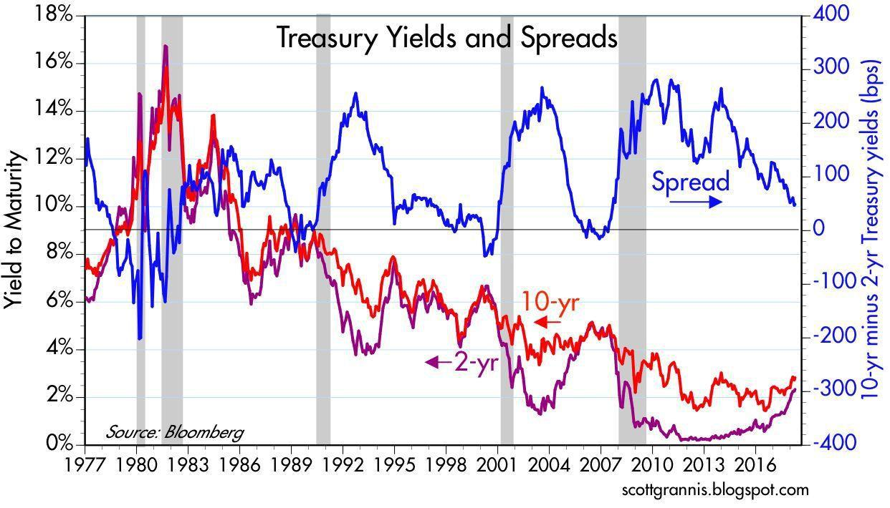

## Table of Contents

## What is a Treasury bond?

A Treasury bond is a type of loan that you give to the government. When you buy a Treasury bond, you are lending money to the U.S. government, and in return, they promise to pay you back with interest over a long period of time, usually 20 or 30 years. These bonds are considered very safe because they are backed by the full faith and credit of the U.S. government, which means the government is committed to paying you back.

People often buy Treasury bonds to keep their money safe and to earn a steady income from the interest payments. The interest rate on these bonds is fixed, which means it stays the same throughout the life of the bond. This makes Treasury bonds a good choice for people who want a reliable and predictable source of income, especially during times when other investments might be risky.

## How are Treasury bond interest rates determined?

Treasury bond interest rates are set through a process called an auction. The U.S. government decides how much money it needs to borrow and then holds an auction where investors can bid on the bonds. Investors say how much they are willing to pay for the bonds and what interest rate they want. The interest rate is then set at the level where the government can sell all the bonds it wants to sell. If lots of people want to buy the bonds, the interest rate can be lower because the government doesn't have to offer as much to attract buyers.

Sometimes, other things can affect Treasury bond interest rates too. For example, if people think the economy is going to grow a lot, they might want higher interest rates to make up for the risk of inflation. If the economy is not doing well, people might be okay with lower interest rates because they want a safe place to keep their money. Also, what the Federal Reserve does with its own interest rates can influence Treasury bond rates. If the Federal Reserve raises its rates, Treasury bond rates might go up too.

## What factors influence Treasury bond interest rates?

Treasury bond interest rates are influenced by how much people want to buy them and how much the government wants to borrow. When the government holds an auction for these bonds, investors bid on them. If lots of people want to buy the bonds, the [interest rate](/wiki/interest-rate-trading-strategies) can be lower because the government doesn't have to offer as much to attract buyers. On the other hand, if not many people want to buy the bonds, the government might have to offer a higher interest rate to get people interested.

Other things can affect Treasury bond interest rates too. For example, if people think the economy is going to grow a lot, they might want higher interest rates to make up for the risk of inflation. If the economy is not doing well, people might be okay with lower interest rates because they want a safe place to keep their money. Also, what the Federal Reserve does with its own interest rates can influence Treasury bond rates. If the Federal Reserve raises its rates, Treasury bond rates might go up too.

## What is the relationship between Treasury bond interest rates and the economy?

Treasury bond interest rates and the economy are closely connected. When the economy is doing well and people think it will keep growing, they might want higher interest rates on Treasury bonds. This is because they expect prices to go up (inflation), so they want to be paid more to keep up with those rising prices. On the other hand, if the economy is not doing well, people might be happy with lower interest rates because they want a safe place to put their money, and they might not be worried about inflation.

The Federal Reserve also plays a big role in this relationship. When the Federal Reserve raises its own interest rates, it usually means that Treasury bond interest rates will go up too. This is because the Federal Reserve's rates affect the whole economy, including how much people are willing to pay for Treasury bonds. So, when the Federal Reserve tries to slow down the economy by raising rates, it can make Treasury bond rates go up, and when it wants to help the economy grow by lowering rates, Treasury bond rates might go down.

## How do Treasury bond auctions work?

Treasury bond auctions are how the U.S. government borrows money from people. When the government needs money, it decides how much it wants to borrow and then holds an auction. At the auction, people and big investors can bid on the bonds. They say how much they are willing to pay for the bonds and what interest rate they want. The government then looks at all the bids and sets the interest rate at the level where it can sell all the bonds it wants to sell. If lots of people want to buy the bonds, the interest rate can be lower because the government doesn't have to offer as much to get people to buy them.

Sometimes, the government uses different ways to run the auction. In a "single-price" auction, everyone who gets a bond pays the same interest rate, which is the lowest rate the government accepted to sell all the bonds. In a "multiple-price" auction, people pay the interest rate they bid. The government chooses which method to use based on what it thinks will work best to borrow the money it needs. No matter which method is used, the goal is the same: to get the money the government needs by selling bonds to people and investors.

## What is the yield curve and how does it relate to Treasury bond interest rates?

The yield curve is a line that shows the interest rates of Treasury bonds with different lengths of time until they pay back the money. It's like a chart that helps people see how the interest rates change depending on how long they have to wait to get their money back. Usually, the yield curve goes up, which means that the longer you have to wait, the higher the interest rate you get. This makes sense because people want more money for waiting longer.

But sometimes, the yield curve can do something different and surprising. If it goes down instead of up, it's called an "inverted yield curve." This happens when short-term Treasury bonds have higher interest rates than long-term ones. People pay attention to this because it can mean that the economy might have problems soon. So, the yield curve is a useful tool to understand what's happening with Treasury bond interest rates and what might happen with the economy.

## How do changes in Federal Reserve policy affect Treasury bond interest rates?

When the Federal Reserve changes its policy, it can have a big effect on Treasury bond interest rates. If the Federal Reserve raises its own interest rates, it usually means that Treasury bond interest rates will go up too. This is because the Federal Reserve's rates affect the whole economy, including how much people are willing to pay for Treasury bonds. When the Federal Reserve raises rates, it's often trying to slow down the economy to keep inflation under control. This makes borrowing money more expensive, so people expect higher returns from their investments like Treasury bonds.

On the other hand, if the Federal Reserve lowers its interest rates, Treasury bond interest rates usually go down too. This happens because the Federal Reserve is trying to help the economy grow by making borrowing cheaper. When rates are low, people are more willing to buy Treasury bonds even if the interest they get is lower, because they want a safe place to put their money. So, changes in Federal Reserve policy can push Treasury bond interest rates up or down, depending on what the Federal Reserve is trying to do with the economy.

## What is the difference between nominal and real interest rates on Treasury bonds?

The nominal interest rate on a Treasury bond is the rate you see printed on the bond. It's the percentage of the money you lent to the government that they pay you back each year. For example, if you buy a bond with a nominal interest rate of 2%, you get 2% of your money back every year until the bond matures. The nominal rate doesn't take into account changes in the value of money over time, like inflation.

The real interest rate, on the other hand, is the nominal rate minus inflation. It shows how much your money is really growing in value. If the nominal rate is 2% and inflation is 1%, the real interest rate is 1%. This means that even though you're getting 2% back from the bond, the value of your money is only growing by 1% because prices are going up by 1% too. The real interest rate gives you a better idea of what your investment is worth after you account for the rising cost of living.

## How can investors use Treasury bond interest rates to predict economic trends?

Investors can use Treasury bond interest rates to predict economic trends by looking at the yield curve. The yield curve shows how the interest rates on Treasury bonds change depending on how long you have to wait to get your money back. Usually, the yield curve goes up, which means longer-term bonds have higher interest rates. But if the yield curve goes down, it's called an inverted yield curve. This can be a sign that people think the economy might have problems soon. So, by watching the yield curve, investors can get clues about what might happen with the economy.

Another way investors use Treasury bond interest rates is by watching how they change when the Federal Reserve changes its own interest rates. If the Federal Reserve raises its rates, it's often trying to slow down the economy to keep inflation under control. This usually means Treasury bond interest rates will go up too. On the other hand, if the Federal Reserve lowers its rates, it's trying to help the economy grow by making borrowing cheaper, and Treasury bond interest rates usually go down. By paying attention to these changes, investors can guess if the economy is going to grow or slow down.

## What are the risks associated with investing in Treasury bonds based on their interest rates?

When you invest in Treasury bonds, one risk you face is interest rate risk. This means that if interest rates go up after you buy a bond, the value of your bond can go down. People might not want to buy your bond because they can get a new one with a higher interest rate. If you need to sell your bond before it matures, you might have to sell it for less than you paid for it. So, if you think interest rates are going to go up, you might want to be careful about buying long-term Treasury bonds.

Another risk is inflation risk. If the interest rate on your Treasury bond is lower than the rate of inflation, the real value of your money can go down over time. For example, if you get 2% interest on your bond but prices are going up by 3% every year, you're actually losing money in terms of what you can buy. This is why people look at the real interest rate, which is the nominal rate minus inflation. If inflation goes up a lot, the real interest rate can become negative, which means your investment isn't growing in value as much as you might think.

## How do global economic conditions impact U.S. Treasury bond interest rates?

Global economic conditions can have a big effect on U.S. Treasury bond interest rates. When things are going well in other countries, investors might want to put their money in those places instead of in U.S. Treasury bonds. This can make the demand for U.S. Treasury bonds go down, which can push up the interest rates because the U.S. government might have to offer more to get people to buy them. On the other hand, if other countries are having problems, investors might see U.S. Treasury bonds as a safe place to put their money. This can make the demand for U.S. Treasury bonds go up, which can push down the interest rates because the government doesn't have to offer as much to attract buyers.

Another way global economic conditions can affect U.S. Treasury bond interest rates is through changes in currency values. If the U.S. dollar gets stronger compared to other currencies, it can make U.S. Treasury bonds more attractive to foreign investors because they can get more dollars for their money. This can increase the demand for U.S. Treasury bonds and push down the interest rates. But if the U.S. dollar gets weaker, foreign investors might not want to buy U.S. Treasury bonds as much, which can decrease the demand and push up the interest rates. So, what's happening in the global economy can change how much people want to buy U.S. Treasury bonds and what interest rates they expect.

## What advanced models are used to forecast Treasury bond interest rates?

Advanced models that help forecast Treasury bond interest rates often use something called time series analysis. This means they look at how interest rates have changed in the past and use that information to guess what might happen in the future. These models can look at things like how the economy is doing, what the Federal Reserve is doing with its own interest rates, and even what's happening in other countries. By putting all this information together, the models can make predictions about whether Treasury bond interest rates will go up or down.

Another type of model that is used is called a vector autoregression (VAR) model. This model looks at how different things in the economy, like inflation, unemployment, and the Federal Reserve's actions, affect each other and how they might affect Treasury bond interest rates. VAR models can be really helpful because they can show how changes in one part of the economy might cause changes in another part, which can then affect interest rates. By understanding these relationships, investors and economists can make better guesses about what might happen to Treasury bond interest rates in the future.

## What is the Bond Market and How Can We Understand It?

The bond market, an integral part of the financial ecosystem, is larger in terms of [volume](/wiki/volume-trading-strategy) compared to the stock market. It serves as a platform where debt securities are issued and traded, providing a range of opportunities for investors seeking income and capital preservation. Bonds are essentially loans made by investors to borrowers, typically governments or corporations, who use these funds for various purposes, such as infrastructure projects or business expansion.

### Types of Bonds

1. **Treasury Bonds (T-Bonds)**: Issued by national governments, treasury bonds are considered among the safest investments due to the backing by the full faith and credit of the issuing sovereign entity. In the United States, for example, these bonds are long-term, typically with maturities of 10 years or more, and pay interest semi-annually.

2. **Corporate Bonds**: These are issued by corporations to raise capital for expansion, acquisition, or other operational needs. The risk associated with corporate bonds generally depends on the issuing company's creditworthiness, with higher yields offered on bonds from companies with lower credit ratings.

3. **Municipal Bonds**: Issued by states, municipalities, or counties, these bonds fund public projects like schools, highways, or hospitals. They often offer tax-exempt interest income to investors residing in the issuing locality.

4. **Agency Bonds**: These are issued by government-affiliated entities such as Fannie Mae or Freddie Mac. They carry a different risk profile because they are not directly backed by the government but still offer relatively low risk.

### Key Terminologies

- **Coupon Rate**: This is the interest rate that the bond issuer will pay to the bondholder. It is expressed as a percentage of the face value of the bond.

- **Yield**: Yield represents the earnings generated and realized on an investment over a particular period. It is expressed as a percentage and often refers to the effective interest rate on a bond.

- **Maturity**: This indicates the specific future date on which the bond's principal amount (face value) is to be paid to the bondholder.

- **Credit Rating**: Bonds are rated based on the issuer’s ability to repay the borrowed funds. Ratings are provided by agencies such as Moody's and Standard & Poor’s and affect the bond's interest rate.

### Yield Concepts

The yield of a bond can be impacted by various factors, including current interest rates and the bond's credit rating. Key yield concepts include:

- **Current Yield**: Calculated by dividing the bond's annual coupon payment by its current market price. It provides a snapshot of the bond's income relative to its price at a point in time.
$$
  \text{Current Yield} = \frac{\text{Annual Coupon Payment}}{\text{Current Market Price}}

$$

- **Yield to Maturity (YTM)**: This is a more comprehensive yield measure that considers both the annual coupon income and any capital gains or losses the investor will realize if the bond is held to maturity. It is a complex calculation that solves for the interest rate (Y) in the bond pricing equation:
$$
  \text{Price} = \sum_{t=1}^{n} \frac{\text{Coupon Payment}}{(1+Y)^t} + \frac{\text{Face Value}}{(1+Y)^n}

$$

Understanding the bond market involves appreciating how various types of bonds, related terminologies, and yield concepts provide investors with tools to navigate economic conditions and investment objectives effectively. Such comprehension aids investors in making informed decisions that align with their financial goals.

## Are Treasury Bonds Considered Safe Haven Assets?

Treasury bonds (T-bonds) are long-term, fixed-interest debt securities issued by the U.S. government, and they serve as a cornerstone of the global bond market due to their perceived safety and reliability. These instruments typically have maturities ranging from 10 to 30 years, during which the U.S. government pays periodic interest—often referred to as coupon payments—to bondholders.

In times of economic uncertainty, investors often seek refuge in treasury bonds. The reputation of T-bonds as safe-haven assets stems from the low default risk associated with U.S. government securities, backed by the full faith and credit of the U.S. government.

### Key Concepts

1. **Coupon Rate**: The coupon rate of a treasury bond is the interest rate that the bond issuer agrees to pay annually or semi-annually to the bondholder. This rate is fixed at the time of issuance and remains unchanged throughout the life of the bond. For example, a $1,000 bond with a 5% coupon rate pays $50 per year.

2. **Yield to Maturity (YTM)**: Yield to maturity is a critical metric for assessing the potential return of a treasury bond if held until maturity. It accounts for all coupon payments, the face value repayment, and any difference between the bond's purchase price and its face value. The YTM is expressed as an annual percentage rate. 

   The yield to maturity can be calculated using the formula:
$$
   YTM = \frac{C + \frac{F - P}{n}}{\frac{F + P}{2}}

$$

   where:
   - $C$ = Coupon payment
   - $F$ = Face value of the bond
   - $P$ = Price of the bond
   - $n$ = Number of years to maturity

3. **Factors Affecting Treasury Bond Yields**: Several factors influence the yields of treasury bonds, including interest rates, inflation expectations, and economic growth. Generally, rising interest rates lead to falling bond prices, thus increasing yields. Conversely, declining interest rates typically result in higher bond prices and lower yields. Changes in market demand and supply dynamics, driven by investor sentiment and government policies, also impact yields.

### Impact of Government Borrowing and Fiscal Policies

Government borrowing directly affects the supply of treasury bonds in the market. When the U.S. government increases borrowing, it issues more bonds, which can put downward pressure on existing bond prices and lead to higher yields. Conversely, reduced borrowing can decrease the supply of bonds, potentially increasing bond prices and lowering yields.

Fiscal policies, including tax rates and public spending levels, also influence the treasury bond market. Expansionary fiscal policies, such as increased government spending or tax cuts, may lead to higher government borrowing and thus more bond issuance. This could result in a larger bond supply, affecting bond pricing and yields. On the other hand, contractionary fiscal policies could reduce borrowing needs and influence bond market dynamics.

Overall, the interplay between government fiscal strategies and market forces defines the landscape of treasury bonds, their yields, and their role as a secure investment choice during periods of financial [volatility](/wiki/volatility-trading-strategies).

## References & Further Reading

[1]: Fabozzi, F. J. (2007). ["Fixed Income Analysis."](https://www.amazon.com/Fixed-Income-Analysis-Frank-Fabozzi/dp/047005221X) Wiley Finance.

[2]: Adrian, T., Crump, R. K., & Moench, E. (2013). ["Pricing the Term Structure with Linear Regressions."](https://www.newyorkfed.org/medialibrary/media/research/staff_reports/sr340.pdf) Journal of Financial Economics, 110(1), 110-138.

[3]: Duffie, D. (1999). ["Dynamic Asset Pricing Theory."](https://archive.org/details/dynamicassetpric0000duff) Princeton University Press.

[4]: Cartea, A., Jaimungal, S., & Penalva, J. (2015). ["Algorithmic and High-Frequency Trading."](https://assets.cambridge.org/97811070/91146/frontmatter/9781107091146_frontmatter.pdf) Cambridge University Press.

[5]: Hull, J. C. (2018). ["Options, Futures, and Other Derivatives."](https://www.semanticscholar.org/paper/Options%2C-Futures%2C-and-Other-Derivatives-Hull/89bdee500c8623864fc9eb7a471546aa713acc44) Pearson.