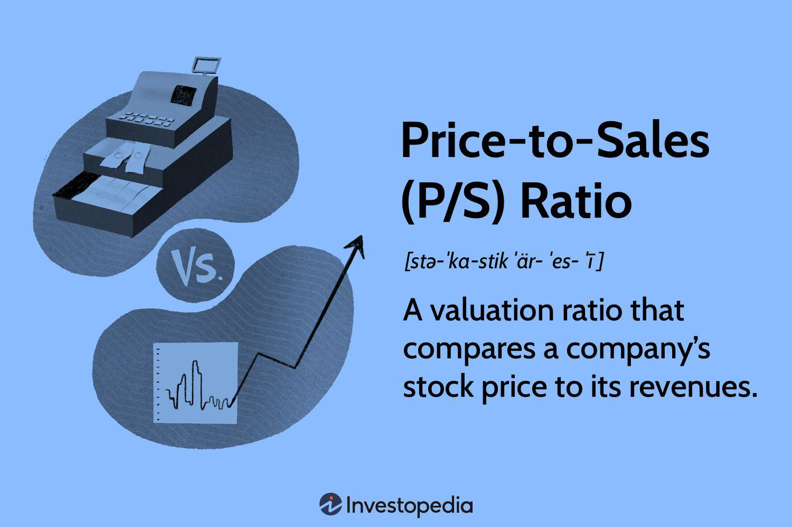

## Table of Contents

## What is the Price-to-Sales (P/S) ratio?

The Price-to-Sales (P/S) ratio is a financial metric that helps investors understand how much they are paying for a company's sales. It is calculated by dividing the company's market capitalization by its total revenue over a certain period, usually a year. This ratio is particularly useful for evaluating companies that are not yet profitable, as it focuses on sales rather than earnings.

A lower P/S ratio might suggest that a company is undervalued, meaning investors are paying less for each dollar of sales. On the other hand, a higher P/S ratio could indicate that the company is overvalued, or it might reflect high growth expectations from investors. It's important to compare the P/S ratio of a company with others in the same industry, as different sectors can have very different average ratios.

## How is the P/S ratio calculated?

The P/S ratio is calculated by dividing a company's market capitalization by its total revenue. Market capitalization is the total value of all a company's shares of stock. It is found by multiplying the current stock price by the total number of shares outstanding. Revenue is the total amount of money a company brings in from its sales over a certain period, usually a year.

This ratio tells you how much investors are willing to pay for each dollar of a company's sales. For example, if a company has a market capitalization of $100 million and annual revenue of $50 million, its P/S ratio would be 2. This means investors are paying $2 for every $1 of sales the company makes. The P/S ratio is useful because it can be used to value companies that are not yet profitable, since it focuses on sales instead of earnings.

## Why is the P/S ratio important for investors?

The P/S ratio is important for investors because it helps them see how much they are paying for a company's sales. It is a simple way to check if a company might be a good buy. If the P/S ratio is low, it might mean the company is undervalued, which could be a good time to buy its stock. If the ratio is high, it might mean the stock is overvalued, and investors might want to be careful.

This ratio is especially useful for looking at companies that are not making profits yet. These companies might have big plans for the future, but they are not [earning](/wiki/earning-announcement) money right now. By using the P/S ratio, investors can still get an idea of how much the company is worth based on its sales, not just its profits. This can help investors make smarter choices about where to put their money.

## What is considered a good P/S ratio?

A good P/S ratio can be different depending on the industry. For example, tech companies often have higher P/S ratios because people expect them to grow a lot. On the other hand, companies in older industries might have lower P/S ratios because they are not expected to grow as much. A good rule of thumb is to compare the P/S ratio of a company to others in the same industry to see if it is high or low.

Generally, a P/S ratio below 2 is often seen as good, but this can vary. If a company has a P/S ratio of 1, it means investors are paying $1 for every $1 of sales, which might be a good deal. But if the P/S ratio is 5, investors are paying $5 for every $1 of sales, which might be too expensive unless the company is expected to grow a lot in the future. So, it's important to look at the whole picture, not just the P/S ratio, when deciding if a stock is a good buy.

## How does the P/S ratio vary across different industries?

The P/S ratio can be very different from one industry to another. For example, tech companies often have higher P/S ratios. This is because people expect these companies to grow a lot in the future. They might not be making big profits right now, but investors are willing to pay more for their sales because they believe the companies will do well later on. On the other hand, companies in older industries like manufacturing or utilities usually have lower P/S ratios. These companies are not expected to grow as fast, so investors are not willing to pay as much for their sales.

It's important to compare the P/S ratio of a company to others in the same industry. This helps investors see if a company's P/S ratio is high or low compared to its peers. For example, a P/S ratio of 3 might be high for a manufacturing company but could be considered low for a tech company. By understanding these differences, investors can make better decisions about which stocks to buy. They can see if a company is a good deal or if it might be overpriced based on its sales and the industry it is in.

## Can the P/S ratio be used to compare companies within the same industry?

Yes, the P/S ratio can be used to compare companies within the same industry. This helps investors see if a company's stock is a good deal compared to others in the same field. For example, if one company in the tech industry has a P/S ratio of 5 and another has a P/S ratio of 2, the second company might be a better buy because investors are paying less for each dollar of sales.

However, it's important to look at more than just the P/S ratio. Other things like the company's growth plans, how much debt it has, and its overall financial health should also be considered. By looking at all these factors together, investors can get a better idea of which company might be a smarter investment.

## What are the limitations of using the P/S ratio as a valuation metric?

The P/S ratio is useful but it has some limits. One big limit is that it doesn't tell you about a company's profits. A company might have high sales but still lose money. If you only look at the P/S ratio, you might think a company is a good buy, but if it's not making any profit, it could be a bad investment. Also, the P/S ratio doesn't take into account the costs of running the business. Two companies might have the same sales, but if one has much higher costs, it will be less valuable.

Another problem with the P/S ratio is that it can be affected by changes in the business cycle. During good times, sales might be high, making the P/S ratio look better. But in bad times, sales might drop, making the P/S ratio worse, even if the company's value hasn't changed that much. This means the P/S ratio can be misleading if you don't think about the bigger picture. It's always important to use the P/S ratio along with other ways to value a company, like looking at its profits, debts, and future growth plans.

## How does the P/S ratio relate to other financial ratios like P/E and P/B?

The P/S ratio is one way to value a company, but it's different from the P/E (Price-to-Earnings) ratio and the P/B (Price-to-Book) ratio. The P/E ratio looks at how much investors are paying for each dollar of a company's earnings. It tells you if a stock is expensive or cheap based on its profits. The P/S ratio, on the other hand, focuses on sales instead of earnings. It's useful for companies that aren't making profits yet because it shows how much investors are willing to pay for each dollar of sales. So, while the P/E ratio is about profits, the P/S ratio is about sales.

The P/B ratio is another way to value a company, and it compares the market value of a company to its book value, which is the value of its assets minus its liabilities. This ratio can tell you if a company's stock price is high or low compared to what it's worth on paper. Unlike the P/S ratio, which focuses on sales, the P/B ratio looks at the company's net worth. Each of these ratios gives you a different piece of the puzzle when trying to figure out if a stock is a good buy. Using them together can give you a better overall picture of a company's value.

## What historical trends can be observed in P/S ratios for specific sectors?

Over the years, the P/S ratios for different sectors have shown clear trends. For example, in the technology sector, P/S ratios have often been higher than in other sectors. This is because people expect tech companies to grow a lot in the future. During the dot-com boom in the late 1990s and early 2000s, P/S ratios for tech companies went very high, sometimes over 10. But after the bubble burst, these ratios came down a lot. More recently, with the rise of companies like Amazon and Google, P/S ratios in tech have been climbing again, showing that investors are still willing to pay a lot for tech sales.

In contrast, sectors like utilities and manufacturing tend to have lower and more stable P/S ratios. These industries are not expected to grow as fast as tech, so investors don't pay as much for each dollar of sales. For utilities, P/S ratios have often stayed below 2, reflecting their steady but slow growth. Manufacturing companies have seen their P/S ratios go up and down with the economy, but they generally stay lower than tech. These trends show how different industries are valued differently by investors based on their growth prospects and stability.

## How can changes in a company's P/S ratio over time inform investment decisions?

Watching how a company's P/S ratio changes over time can help investors make smart choices. If the P/S ratio goes down, it might mean the company's stock is getting cheaper compared to its sales. This could be a good time to buy the stock, especially if the company is doing well in other ways, like making more profit or growing its business. But if the P/S ratio goes up a lot, it might mean the stock is getting too expensive. Investors might want to be careful or even sell the stock if they think it's overpriced.

It's also important to think about why the P/S ratio is changing. If the company's sales are growing but the stock price isn't going up as fast, the P/S ratio will go down. This could be a sign that the market isn't giving the company enough credit for its growth. On the other hand, if sales are staying the same but the stock price is going up, the P/S ratio will go up. This might mean investors are too excited about the company and expecting too much growth. By looking at these changes and understanding the reasons behind them, investors can make better decisions about when to buy or sell a stock.

## What advanced techniques can be used to adjust the P/S ratio for more accurate valuations?

To get a more accurate valuation using the P/S ratio, investors can adjust it for different factors. One way is to look at the company's growth rate. If a company is growing fast, you might want to pay more for its sales than for a company that isn't growing as fast. You can do this by dividing the P/S ratio by the company's expected growth rate. This gives you a P/S to Growth (PEG) ratio for sales, which can help you see if the company is a good buy compared to its growth.

Another way to adjust the P/S ratio is to think about the company's profit margins. If a company makes a lot of profit from each dollar of sales, you might be willing to pay more for those sales. To do this, you can multiply the P/S ratio by the company's profit margin. This gives you an idea of how much you're paying for the company's profits, not just its sales. By using these adjustments, you can get a better picture of whether a company's stock is a good deal or not.

## How do macroeconomic factors influence the interpretation of P/S ratios?

Macroeconomic factors like the overall economy, interest rates, and inflation can change how we look at P/S ratios. When the economy is doing well, companies usually sell more stuff, so their P/S ratios might go up. But if the economy is bad, sales might go down, making P/S ratios look worse even if the company itself hasn't changed much. Also, when interest rates are low, investors might be willing to pay more for stocks, pushing up P/S ratios. But if interest rates go up, investors might want to put their money in safer places like bonds, making P/S ratios go down.

Inflation can also mess with P/S ratios. If prices are going up because of inflation, a company's sales might look bigger, but it doesn't mean they're making more money. This can make the P/S ratio seem better than it really is. So, when looking at P/S ratios, it's important to think about these bigger economic things. They can make a company's P/S ratio look different even if the company itself hasn't changed. By keeping an eye on these factors, investors can get a better idea of what a P/S ratio really means.

## What is the Price-to-Sales Ratio and how can it be understood?

The price-to-sales (P/S) ratio is a widely utilized financial valuation tool, providing a straightforward method to assess a company's valuation by comparing its market capitalization to its revenue. Mathematically, the P/S ratio is computed by taking the company's stock price and dividing it by the sales per share. This can be expressed in the formula:

$$
\text{P/S Ratio} = \frac{\text{Market Capitalization}}{\text{Total Revenue}} = \frac{\text{Stock Price}}{\text{Sales per Share}}
$$

Investors leverage the P/S ratio to determine if a stock is potentially undervalued or overvalued concerning its sales figures. This metric proves particularly advantageous for analyzing companies within industries where earnings may be inconsistent or for firms that are not yet profitable. For instance, early-stage technology companies often exhibit dynamic growth and reinvest profits into further expansion, which can result in volatile or negative earnings. In such situations, traditional metrics like the price-to-earnings (P/E) ratio may not be applicable, whereas the P/S ratio can offer more relevant insights into a company's sales performance irrespective of profitability.

While the P/S ratio provides valuable initial insights into a company's valuation, it is imperative to utilize it alongside other financial metrics to achieve a comprehensive understanding. Sole reliance on the P/S ratio might overlook crucial factors such as profitability, cash flow, or debt levels, which are essential for a thorough financial analysis. Integrating the P/S ratio with additional indicators allows investors to construct a more balanced perspective when evaluating a firm's financial health and growth potential.

## How does this compare with other valuation metrics?

Valuation metrics such as the price-to-sales (P/S) ratio, price-to-earnings (P/E) ratio, and price-to-book (P/B) ratio provide distinct perspectives on a company's financial health, aiding investors and traders in making informed decisions. The P/E ratio predominantly evaluates a company's profitability, calculating the ratio by dividing the market price per share by earnings per share (EPS). This metric is particularly useful for assessing companies with stable earnings, offering insights into how much investors are willing to pay for each unit of profit. Conversely, the P/B ratio sheds light on a company's net asset value, dividing the market price per share by the book value per share. This metric is particularly relevant for industries with significant tangible assets, giving investors a sense of how a company's market value compares to its intrinsic assets.

In contrast, the P/S ratio centers on revenue, a [factor](/wiki/factor-investing) notably critical when evaluating firms in sectors characterized by volatile earnings or for businesses that are not yet profitable. This feature positions the P/S ratio as a potentially more reliable metric for early-stage technology companies, where earnings might not yet reflect the company's growth potential. It is calculated simply as the market capitalization divided by total revenue, or, equivalently, the stock price divided by sales per share:

$$
\text{P/S Ratio} = \frac{\text{Market Capitalization}}{\text{Total Revenue}} = \frac{\text{Stock Price}}{\text{Sales per Share}}
$$

Despite the individual strengths of these metrics, they each bear inherent limitations. The P/E ratio may not be useful for companies with minimal or negative earnings, while the P/B ratio may undervalue companies with significant intangible assets or growth potential above their book value. Similarly, reliance solely on the P/S ratio ignores profitability, debt levels, and cash flow, which are crucial for comprehensive financial analysis.

Hence, a nuanced approach integrating multiple metrics is often essential, providing a balanced and holistic view of a firm's valuation. By combining insights from the P/S, P/E, and P/B ratios, investors can capture a more robust picture of a company's fiscal health, aligning investment strategies with both market opportunities and potential risks. This blended methodology facilitates refined decision-making, accommodating the diverse financial landscapes across different industries and market conditions.

## References & Further Reading

[1]: ["Valuation: Measuring and Managing the Value of Companies"](https://www.amazon.com/Valuation-Measuring-Managing-Companies-Finance/dp/1119610885) by McKinsey & Company Inc.

[2]: ["Financial Modeling"](https://www.investopedia.com/terms/f/financialmodeling.asp) by Simon Benninga

[3]: ["Algorithmic Trading: Winning Strategies and Their Rationale"](https://www.wiley.com/en-us/Algorithmic+Trading%3A+Winning+Strategies+and+Their+Rationale-p-9781118460146) by Ernie Chan

[4]: ["Security Analysis"](https://www.amazon.com/Security-Analysis-Foreword-Buffett-Editions/dp/0071592539) by Benjamin Graham and David L. Dodd

[5]: ["The Intelligent Investor"](https://www.amazon.com/Intelligent-Investor-Definitive-Investing-Essentials/dp/0060555661) by Benjamin Graham