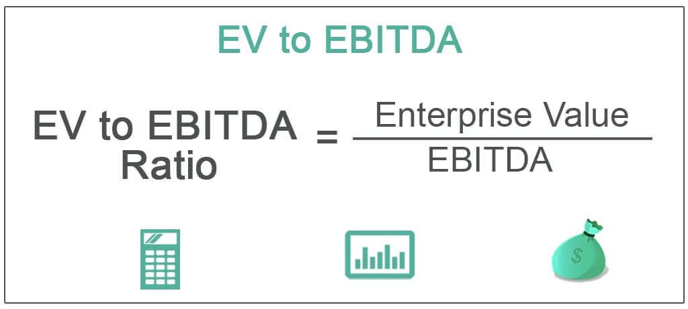

Understanding financial metrics is essential for investors aiming to evaluate a company's value and make informed decisions. Among these metrics, the EV/EBITDA ratio stands out as a widely-used tool for assessing a company's operational efficiency and overall market valuation. This ratio simplifies the complex landscape of financial analysis by measuring a company's Enterprise Value (EV) relative to its Earnings Before Interest, Taxes, Depreciation, and Amortization (EBITDA).

The EV/EBITDA ratio is calculated with the formula:



$$
\text{EV/EBITDA} = \frac{\text{Enterprise Value (EV)}}{\text{EBITDA}}
$$

Here, Enterprise Value is the sum of a company’s market capitalization, its debt, and any minority interest, minus the company’s cash and equivalents. EBITDA, on the other hand, represents the company’s operating performance by factoring in earnings before interest, taxes, depreciation, and amortization are deducted. This calculation provides a normalized view of a company's valuation, which is invaluable for comparing firms with differing capital structures.

This article explores the significance of the EV/EBITDA ratio in company valuation. It highlights how the metric sheds light on operational efficiencies and reveals companies that might be undervalued by the market. Additionally, the application of this ratio in algorithmic trading reveals its importance in identifying investment opportunities by standardizing valuations across different industries.

In comparing it to other financial metrics, the EV/EBITDA ratio offers unique insights, particularly due to its ability to isolate operating performance from capital structure and accounting practices. This makes it an especially valuable metric in capital-intensive industries, where traditional metrics may not capture the complete picture.

Finally, understanding when to apply the EV/EBITDA ratio and recognizing its limitations is crucial. This article provides guidance on effectively employing this metric while also noting instances where investors should exercise caution. By mastering tools like the EV/EBITDA ratio alongside other financial metrics, investors can enhance their valuation analyses and adapt to evolving financial landscapes, ensuring strategic, data-driven decision-making.

## Table of Contents

## Understanding EV/EBITDA

The EV/EBITDA ratio is a valuation metric used to assess a company's enterprise value in relation to its earnings before interest, taxes, depreciation, and amortization. This ratio serves as a critical tool for investors seeking to evaluate operational efficiency and overall market valuation.

Enterprise Value (EV) represents the total value of a company, which is calculated as the market capitalization plus total debt, minus cash and cash equivalents. It provides a comprehensive snapshot of a company's value, considering both equity and debt holdings, while excluding cash reserves that are not tied to operations. 

Mathematically, Enterprise Value can be expressed as:
$$
\text{EV} = \text{Market Capitalization} + \text{Total Debt} - \text{Cash and Cash Equivalents}
$$

Earnings Before Interest, Taxes, Depreciation, and Amortization (EBITDA) measures a company's operational profitability before deducting non-operational expenses such as interest and taxes. It is often regarded as a proxy for operating cash flow, emphasizing a firm's ability to generate earnings from its core business operations. 

The EV/EBITDA ratio is calculated by dividing the enterprise value by EBITDA:
$$
\text{EV/EBITDA} = \frac{\text{Enterprise Value (EV)}}{\text{EBITDA}}
$$

This ratio is an essential tool for normalizing a company's valuation, making it suitable for comparisons across businesses with varying capital structures. Unlike other metrics that may be influenced by accounting decisions or financial strategies, EV/EBITDA focuses on operating performance. This makes it particularly advantageous for evaluating companies across industries, where differences in leverage, taxes, and accounting policies might otherwise obscure fundamental [earning](/wiki/earning-announcement) potentials.

In summary, the EV/EBITDA ratio offers valuable insights into a company's valuation by isolating its operating performance from its capital structure and accounting practices. This makes it a preferred choice for investors who prioritize operational efficiency and wish to compare similar firms on a like-for-like basis.

## Significance in Company Valuation

The EV/EBITDA ratio is a pivotal metric employed to assess company valuation, particularly within the same industry. It is instrumental in determining operational efficiencies, as it strips away intricate financial elements, such as interest, taxes, and amortization, to provide a focused view of the earnings generated purely from business operations. By doing so, it helps investors uncover potential undervaluation within the market where other operational metrics are comparable. 

A lower EV/EBITDA ratio is often interpreted by investors as a signal that a company might be undervalued. This perception arises because a low ratio can indicate that the market is not fully recognizing the operational efficiency and profitability potential intrinsic to the company. However, it is crucial for investors to contextualize this ratio against industry norms and complementary financial indicators to validate the robustness of these insights.

The metric is particularly valuable for investors seeking to identify companies with a strong potential for cash-flow-driven earnings. By concentrating on operating earnings, EV/EBITDA avoids distortions created by financing and accounting decisions, offering a concentrated view of a company's performance from its core operations. For example, in industries with varying capital structures, such as telecommunications or utilities, EV/EBITDA can reveal how efficiently a company is converting revenue into operational profit, thus highlighting firms with superior intrinsic business value.

In summary, the EV/EBITDA ratio is an essential tool for investors aiming to quantify a company's core business value by focusing on its operating earnings. This metric provides a clearer, comparative framework to assess whether a company is undervalued within its industry, offering significant insights into its operational efficacy and long-term profitability prospects. By integrating this ratio into a broader array of financial analyses, investors can make more informed, strategic decisions.

## Application in Algorithmic Trading

Algorithmic trading utilizes financial metrics like the EV/EBITDA ratio to inform strategic decisions by identifying undervalued securities. The EV/EBITDA ratio serves as a crucial benchmark in these automated systems by offering a normalized measure of a company's valuation, which is essential when comparing firms across diverse industries. This normalization is particularly important as it accounts for variations in capital structures, providing a more consistent basis for evaluation than traditional metrics like P/E ratios, which are influenced by financing decisions.

In practice, algorithmic traders integrate the EV/EBITDA metric into their models using programming languages such as Python to automate the evaluation process. This automation allows for rapid, data-driven decision-making in dynamic markets, enhancing investment selection through the detection of market inefficiencies. For instance, a simple Python script might query financial databases to fetch EV and EBITDA values, calculate the ratio, and then flag securities with ratios suggesting undervaluation:

```python
import pandas as pd

# Assume we have a DataFrame df with columns 'Enterprise Value' and 'EBITDA'
df = pd.DataFrame({
    'Company': ['A', 'B', 'C'],
    'Enterprise Value': [1000, 850, 1200],  # in millions
    'EBITDA': [150, 100, 175]  # in millions
})

# Calculate EV/EBITDA ratio
df['EV/EBITDA'] = df['Enterprise Value'] / df['EBITDA']

# Identify companies with low EV/EBITDA ratio
undervalued_companies = df[df['EV/EBITDA'] < df['EV/EBITDA'].quantile(0.25)]

print(undervalued_companies)
```

The EV/EBITDA ratio's ability to focus on a firm’s operational performance, excluding the effects of debt and accounting practices, makes it particularly effective in crafting algorithmic strategies. This allows traders to pinpoint undervalued opportunities that the broader market might overlook. Understanding how to incorporate this metric into algorithmic models is essential for creating robust strategies that exploit market inefficiencies, providing an edge in competitive financial environments.

## Comparison with Other Valuation Metrics

Comparing the EV/EBITDA ratio with other prominent valuation metrics, such as the Price-to-Earnings (P/E) and Price-to-Sales (P/S) ratios, provides investors with a more nuanced understanding of a company's financial health and market valuation. Each of these metrics offers its own perspective, and when used together, they can help create a comprehensive view.

The EV/EBITDA ratio is particularly useful because it includes debt considerations while evaluating a company's value. Unlike the P/E ratio, which focuses solely on a company's earnings and market capitalization, EV/EBITDA considers the enterprise value, which is the sum of market capitalization, preferred shares, minority interest, and debt, minus total cash and cash equivalents. This inclusion of debt and cash impacts government debt and is especially important in assessing overall enterprise value, as it provides a more accurate picture of a company's total obligations and assets. 

Mathematically, Enterprise Value (EV) is calculated as:

$$
EV = \text{Market Capitalization} + \text{Total Debt} + \text{Preferred Shares} + \text{Minority Interest} - \text{Cash and Cash Equivalents}
$$

The inclusion of EBITDA (Earnings Before Interest, Taxes, Depreciation, and Amortization) in the denominator isolates the operating performance, allowing for an analysis less affected by differences in financing and accounting practices. This makes the EV/EBITDA ratio particularly suitable for comparison across firms with diverse capital structures, distinguishing it from the P/E ratio, which can be skewed by changes in tax policy or interest rates.

In contrast, the P/S ratio, which compares a company's stock price to its revenues, offers a revenue-oriented perspective. However, it does not account for a company's profitability or debt load, potentially overlooking operational efficiencies. The EV/EBITDA ratio addresses this gap by focusing on operational earnings, making it more applicable for capital-intensive industries where substantial expenses like depreciation may obscure true profitability. For instance, in sectors such as utilities and manufacturing, where large capital investments are common, reliance on operational performance metrics like EV/EBITDA provides more relevant insights.

Despite these advantages, relying solely on EV/EBITDA can lead to an incomplete assessment. Each valuation metric presents unique aspects of a company's financial scenario; thus, using them in conjunction facilitates a more holistic evaluation. For example, while EV/EBITDA excels in evaluating companies with consistent cash flows and varied debt structures, the P/E ratio might be more indicative of growth prospects and dividend sustainability. Similarly, the P/S ratio offers insight into market hypotheses about future revenue potential.

In summary, the integration of EV/EBITDA with other valuation metrics, such as P/E and P/S ratios, enriches analysis, providing a layered understanding of a company’s operational efficiency, market position, and future potential.

## EV/EBITDA Across Different Industries

Industry variations play a significant role in determining the typical EV/EBITDA ratio for companies. These differences are largely due to the distinct capital requirements, growth prospects, and operational strategies characteristic to each sector.

In the technology sector, companies typically exhibit higher EV/EBITDA ratios. This is attributed to the rapid growth potential and higher earnings multiples that investors attribute to tech companies. These businesses often have substantial intangible assets and lower physical capital requirements, impacting their enterprise valuation positively.

The retail industry operates on a different paradigm. Here, a lower EV/EBITDA might indicate undervaluation, provided the company maintains consistent and stable cash flows. This stability is essential, as retail businesses often face thin margins and inventory challenges. For investors, a lower ratio can signify potential growth or a stable market position, justifying further investigation into the company's cash flow consistency and competitive strategy.

Energy firms often utilize the EV/EBITDA ratio to uncover undervalued opportunities. The sector's heavy capital expenditure on exploration and infrastructure can lead to leveraged balance sheets. As a result, the EV, which includes market capitalization and debt, may overshadow earnings temporarily, suggesting undervaluation. Investors adept in this sector recognize the cyclical nature of energy prices and technological advancements that could alleviate operational costs, making low ratios attractive.

Healthcare and telecommunications sectors have unique capital and asset structures, influencing their EV/EBITDA ratios. High regulation and significant initial capital outlay are common in these industries, impacting debt levels and amortization. For example, healthcare companies must navigate complex reimbursement structures and innovation cycles which can affect profitability metrics. Telecom companies, meanwhile, invest heavily in network infrastructure, influencing their debt profiles and, consequently, their valuation ratios.

Applying EV/EBITDA metrics across various industries necessitates an understanding of sector-specific dynamics. Each industry presents its own set of capital and growth challenges which must be considered when interpreting the ratio. Thus, discerning investors incorporate broader industry trends and specific company drivers in their analyses to accurately assess valuation significance. Without this contextual knowledge, the ratio alone may not be sufficient to gauge true company value, emphasizing the importance of broader financial analysis in investment decision-making.

## When to Use and When to Be Cautious

The EV/EBITDA ratio is a valuable tool for evaluating companies' operational efficiencies and market valuations, yet its application requires a nuanced understanding of when it offers the most insight and when it requires cautious interpretation.

Firstly, the EV/EBITDA ratio excels in comparing companies within the same industry, particularly those with analogous growth trajectories. This homogeneity ensures that the operational efficiencies are evaluated on a level playing field, thereby enhancing the accuracy of comparisons. The EV/EBITDA ratio's focus on removing the effects of capital structure (debt vs. equity) allows for a cleaner analysis of operational performance, making it indispensable for intra-industry comparisons.

However, caution is warranted when applying the EV/EBITDA ratio to companies with substantial capital expenditure requirements. Capital-intensive industries often have significant CAPEX, which may not be fully captured by EBITDA, leading to potential misinterpretations of a firm's true financial health. Therefore, adjustments or complementary analysis might be required to incorporate capital costs adequately.

Furthermore, since EV/EBITDA excludes interest, taxes, and amortization, it might bypass some cost elements crucial for assessing overall profitability. The exclusion of these factors can obscure the firm's net earnings picture, especially in cases where financial leverage and tax strategies vary significantly. Hence, reliance solely on this metric may skew valuation perceptions.

Regional differences in tax regimes and interest rates introduce additional layers of complexity. Since these factors differ substantially across geographies, the EV/EBITDA ratio can deliver misleading cross-border comparisons unless adjusted for such disparities. An awareness of these regional economic variations is necessary to ensure the metric's appropriate application.

Lastly, while the EV/EBITDA metric is powerful, it should not act as a sole indicator for investment decisions. Integrating additional financial metrics and company-specific analysis layers can compensate for its intrinsic limitations, offering a more comprehensive view of a company's valuation and profitability prospects. Using EV/EBITDA alongside metrics such as Price-to-Earnings (P/E), Free Cash Flow (FCF), and Return on Equity (ROE) enhances the robustness of financial evaluations.

## How EV/EBITDA Fits Into Modern Valuation Techniques

The EV/EBITDA metric is integral to modern valuation techniques due to its ability to present a comprehensive view across varied business models. By focusing on enterprise value and operational earnings, the ratio provides a standardized measure that is neutral to the capital structure, making it valuable for comparative analysis across companies with different debt and equity levels.

As financial markets continue to evolve, the adaptability of the EV/EBITDA ratio to new industry dynamics is essential. Industries such as technology and green energy are rapidly changing, and traditional valuation metrics may not always provide a clear picture. The flexibility of EV/EBITDA allows analysts to adjust assumptions and inputs to better capture the unique characteristics of these modern industries. For instance, incorporating forward-looking estimates of EBITDA can account for anticipated growth rates and emerging market trends.

Incorporating the EV/EBITDA metric into [algorithmic trading](/wiki/algorithmic-trading) models enhances decision-making. Algorithms leverage this ratio to identify undervalued stocks by comparing current market conditions against historical data. With the ability to quickly process vast amounts of financial data, algorithms can execute trades that capitalize on discrepancies in valuation, aiding in achieving optimal investment returns. The neutrality of the EV/EBITDA ratio to different financing methods also ensures that these algorithms are not biased towards companies with specific capital structures.

Moreover, understanding how the EV/EBITDA ratio adapts to emerging markets can significantly enhance competitive strategies and financial analysis. Emerging markets might present unique challenges such as volatile earnings and high debt levels, which traditional metrics may not capture effectively. By employing EV/EBITDA, investors can gain insights into the operational efficiency and potential growth of companies in these markets, allowing for more informed investment decisions.

Overall, the EV/EBITDA ratio’s role in modern valuation is pivotal, offering clear insights and aiding in the strategic financial assessments necessary in today's dynamic economic environment.

## Conclusion

The EV/EBITDA ratio is an enduring and influential tool for investors and traders, providing a critical assessment of both company valuation and operational efficiency. This metric's ability to isolate operational performance from financial structure intricacies enables investors to gain clearer insights into a company's intrinsic business value. However, despite its strengths, the EV/EBITDA ratio is most effective when used alongside other financial metrics. This comprehensive approach allows for a more detailed analysis, capturing facets of a company’s performance that might be overlooked if relying solely on EV/EBITDA.

In algorithmic trading, the ratio's adaptability and precision elevate its significance within the fast-paced and ever-changing financial markets. Algorithms utilize the EV/EBITDA ratio to identify undervalued stocks and strategically capitalize on these opportunities, thus demonstrating the metric’s vital role in sophisticated trading environments.

As financial landscapes evolve, proficiency in utilizing tools like the EV/EBITDA ratio becomes essential for investors. By understanding the nuances and applications of this metric, investors and traders can adapt to market changes with agility and confidence. Leveraging the EV/EBITDA ratio allows for the execution of strategic, data-driven decisions, equipping investors with a robust framework for assessing company value in both stable and volatile market conditions.

## References & Further Reading

[1]: Damodaran, A. (2006). ["Valuation Approaches and Metrics: A Survey of the Theory and Evidence."](https://people.stern.nyu.edu/adamodar/pdfiles/papers/valuesurvey.pdf) Foundations and Trends in Finance, Vol. 1, No. 8.

[2]: Fernández, P. (2007). ["Company Valuation Methods: The Most Common Errors in Valuations."](https://media.iese.edu/research/pdfs/DI-0449-E.pdf) 

[3]: Loughran, T., & McDonald, B. (2016). ["Textual Analysis in Accounting and Finance: A Survey."](https://onlinelibrary.wiley.com/doi/abs/10.1111/1475-679X.12123) The Review of Financial Studies, 29(5), 1273-1320.

[4]: ["Valuation: Measuring and Managing the Value of Companies"](https://www.amazon.com/Valuation-Measuring-Managing-Companies-Finance/dp/1119610885) by McKinsey & Company Inc.

[5]: ["Investment Valuation: Tools and Techniques for Determining the Value of Any Asset"](https://archive.org/details/investmentvaluat0000damo_n6k9) by Aswath Damodaran

[6]: ["The Little Book of Valuation: How to Value a Company, Pick a Stock and Profit"](https://www.amazon.com/Little-Book-Valuation-Company-Profits/dp/1394244401) by Aswath Damodaran