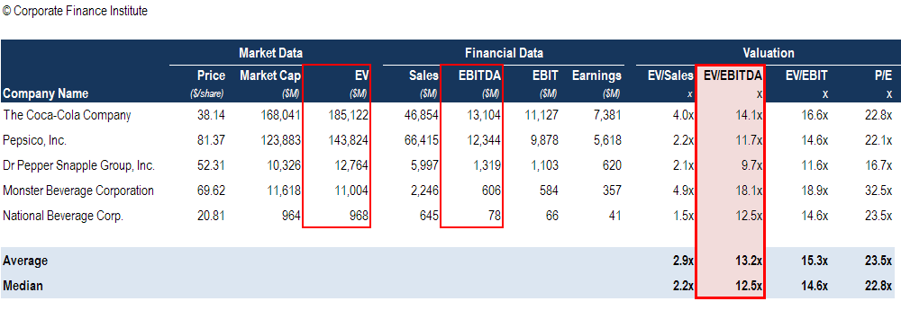

## Table of Contents

## What is EV/EBITDA and why is it important?

EV/EBITDA stands for Enterprise Value to Earnings Before Interest, Taxes, Depreciation, and Amortization. It's a way to figure out how much a company is worth by comparing its total value to its earnings, without considering some expenses like taxes and interest. Imagine you want to buy a business; EV/EBITDA helps you see if the price is fair by looking at the company's earnings power.

This measure is important because it gives a clearer picture of a company's value, especially when comparing businesses in the same industry. It's useful because it removes the effects of different financing choices, tax rates, and non-cash charges like depreciation, which can vary a lot from one company to another. By using EV/EBITDA, investors and analysts can better understand if a company is a good buy or if it's overpriced, making it a key tool in financial analysis.

## How do you calculate Enterprise Value (EV)?

To calculate Enterprise Value (EV), you start with the market value of a company's equity, which is simply the total value of all its shares. You can find this by multiplying the current stock price by the number of outstanding shares. Then, you add the company's total debt, which includes short-term and long-term debt. This step is important because it shows how much money the company owes, which is part of its total value. Finally, you subtract any cash and cash equivalents the company has. Cash is subtracted because it could be used to pay off some of the debt, reducing the net cost to buy the company.

So, the formula for EV is: Market Value of Equity + Total Debt - Cash and Cash Equivalents. This gives you a complete picture of what it would cost to buy the entire business, not just the equity. It's like figuring out the price tag for taking over a company, including all its debts and subtracting any cash it has on hand. This way, you get a clearer idea of the company's true value, which is useful for comparing different companies or deciding if a business is a good investment.

## What is EBITDA and how is it calculated?

EBITDA stands for Earnings Before Interest, Taxes, Depreciation, and Amortization. It's a way to measure how much money a company makes from its main business activities, without considering some costs like taxes, interest on loans, and the wear and tear of its equipment or buildings. Think of it as the money the company earns before some big expenses are taken out.

To calculate EBITDA, you start with the company's net income, which is the profit after all expenses. Then, you add back the interest expense, which is the cost of borrowing money. Next, you add back the taxes the company paid. After that, you add back depreciation, which is the cost of using up assets like machinery over time, and amortization, which is similar but for intangible things like patents. So, EBITDA = Net Income + Interest + Taxes + Depreciation + Amortization. This gives you a clearer picture of the company's operating performance.

## Why is the EV/EBITDA multiple used to value companies?

The EV/EBITDA multiple is used to value companies because it gives a clear picture of how much a business is worth by comparing its total value to its earnings. This is helpful because it takes away the effects of things like taxes, interest, and how old the company's equipment is. These things can be different for each company and might not show how well the business is really doing. By using EV/EBITDA, you can see if a company is a good deal or if it's too expensive, which is important for deciding whether to invest in it.

Another reason EV/EBITDA is useful is that it lets you compare companies in the same industry more easily. Since it ignores things like how a company is financed or its tax situation, you can see which company is making more money from its main business activities. This makes it easier to figure out which company might be a better investment. That's why many investors and analysts use EV/EBITDA when they want to understand a company's value and compare it with others.

## How does EV/EBITDA differ from other valuation metrics like P/E ratio?

EV/EBITDA and the P/E ratio are both used to figure out how much a company is worth, but they look at different things. The P/E ratio, or Price to Earnings ratio, compares the price of a company's stock to its earnings per share. It tells you how much investors are willing to pay for each dollar of the company's earnings. This is great for looking at the value of a company's stock, but it doesn't consider the company's debt or cash. On the other hand, EV/EBITDA looks at the entire value of the company, including its debt and subtracting its cash. It also focuses on earnings before interest, taxes, depreciation, and amortization, which gives a clearer view of the company's operating performance without those expenses.

The main difference between EV/EBITDA and P/E ratio is that EV/EBITDA gives you a fuller picture of a company's value. It's like looking at the whole business, not just the stock price. This makes it better for comparing companies with different levels of debt or different tax situations. EV/EBITDA is especially useful when looking at companies that might be bought or sold because it shows what it would cost to take over the entire business. The P/E ratio, however, is simpler and more focused on the stock price, which can be good for individual investors looking at stock performance.

## What are the typical EV/EBITDA multiples across different industries?

EV/EBITDA multiples can vary a lot depending on the industry. Industries that are growing fast or are less risky usually have higher multiples. For example, technology companies often have higher EV/EBITDA multiples because people expect them to grow a lot in the future. On the other hand, industries like utilities or manufacturing might have lower multiples because they are more stable but don't grow as quickly.

In general, you might see EV/EBITDA multiples around 10 to 15 for many industries. But some industries can be different. For example, software companies might have multiples of 20 or more because they are seen as having a lot of potential for growth. Meanwhile, industries like retail or energy might have multiples closer to 5 to 10 because they are seen as more stable but with less room for big growth.

## How can EV/EBITDA multiples be used to compare companies within the same industry?

EV/EBITDA multiples help compare companies in the same industry by giving a clear picture of their value. Imagine you have two companies in the tech industry. One company has an EV/EBITDA multiple of 20, and the other has a multiple of 15. The one with the higher multiple might be seen as more valuable because people expect it to grow more in the future. But if both companies are making the same amount of money, the one with the lower multiple might be a better deal because you're paying less for each dollar of earnings.

Using EV/EBITDA is helpful because it takes away the effects of things like how much debt a company has or how old its equipment is. These things can be different for each company and might not show how well the business is really doing. By looking at EV/EBITDA, you can see which company is making more money from its main business activities and which one might be a better investment. This makes it easier to decide which company in the same industry is a better buy.

## What factors can affect a company's EV/EBITDA multiple?

A company's EV/EBITDA multiple can be affected by many things. One big thing is how fast the company is growing. If people think a company will grow a lot in the future, they might be willing to pay more for it right now, which makes its EV/EBITDA multiple higher. Another thing that matters is how risky the company is. If a company is in a stable industry and doesn't have a lot of risk, people might be okay with paying more for it, leading to a higher multiple. But if a company has a lot of debt, that can make the multiple lower because it's seen as riskier.

Also, the overall economy and how people feel about the market can change a company's EV/EBITDA multiple. When the economy is doing well and people feel good about the future, they might be willing to pay more for companies, pushing up the multiples. But if the economy is not doing well, or if there's a lot of uncertainty, people might not want to pay as much, which can lower the multiples. Finally, things like how a company is run, its profit margins, and what's happening in its industry can all play a role in its EV/EBITDA multiple.

## How do you interpret a high or low EV/EBITDA multiple?

A high EV/EBITDA multiple means that people are willing to pay a lot for a company's earnings. This can happen if the company is growing fast or if it's in an industry that people think will do well in the future. It might also mean that the company is seen as less risky. But a high multiple can also mean that the company is overvalued, which means people might be paying too much for it. So, a high multiple could be a good sign if the company really is going to grow a lot, but it could also be a warning sign if the price is too high compared to what the company is actually worth.

On the other hand, a low EV/EBITDA multiple means that people are not willing to pay as much for the company's earnings. This could be because the company is not growing as fast, or it might be in an industry that people think will not do well in the future. It could also mean that the company has a lot of debt or other risks that make it less attractive to investors. But a low multiple can also be a good thing if it means the company is undervalued, which means you might be able to buy it for less than it's really worth. So, a low multiple could be a sign of a good deal if the company is actually doing better than people think.

## What are the limitations and potential pitfalls of using EV/EBITDA multiples for valuation?

Using EV/EBITDA multiples for valuation has some limitations. One big problem is that it doesn't consider how much a company needs to spend to keep its business running. For example, if a company has old equipment that needs to be replaced soon, EV/EBITDA won't show that cost. This can make the company look more valuable than it really is. Also, EV/EBITDA can be tricky to use for companies that are losing money or have very low earnings because the multiple can become very high or even negative, which doesn't help in understanding the company's value.

Another issue is that EV/EBITDA can be affected by how a company does its accounting. Different companies might count their earnings or expenses in different ways, which can make it hard to compare them fairly. For example, one company might include certain costs in its EBITDA that another company leaves out. This can lead to misleading comparisons. Also, EV/EBITDA doesn't take into account the company's growth potential or the risks it faces, which are important for figuring out if a company is a good investment. So, while EV/EBITDA can be a helpful tool, it's important to use it along with other ways of looking at a company's value to get a full picture.

## How can EV/EBITDA multiples be adjusted for non-recurring items or different accounting practices?

When using EV/EBITDA multiples, it's important to adjust for non-recurring items or different accounting practices to get a fair comparison. Non-recurring items are one-time costs or gains that don't happen every year, like selling a piece of property or paying for a big lawsuit. These can make a company's earnings look different than they really are. To fix this, you can add back any non-recurring costs or subtract any non-recurring gains from the EBITDA number. This way, you see what the company's earnings would be without those one-time events, giving you a clearer picture of its ongoing performance.

Different accounting practices can also make it hard to compare companies. For example, one company might count certain costs as expenses while another might treat them as investments. To adjust for this, you need to look at the company's financial statements and see how they report their earnings. If you find differences, you can make adjustments to the EBITDA to make the numbers more comparable. By doing this, you can get a better idea of which company is really doing better, even if they use different ways of accounting.

## How do advanced valuation models incorporate EV/EBITDA multiples alongside other financial metrics?

Advanced valuation models often use EV/EBITDA multiples along with other financial metrics to get a full picture of a company's value. These models might start with EV/EBITDA to see how much the whole business is worth compared to its earnings. But they don't stop there. They also look at other things like the company's growth rate, how much money it makes from its sales, and how much risk it has. By putting all these pieces together, the models can give a more complete and accurate idea of what the company is really worth.

For example, a model might use EV/EBITDA to compare a company to others in its industry. But then it might also look at the company's price-to-earnings (P/E) ratio to see how much investors are willing to pay for its stock. It might also consider the company's free cash flow, which shows how much money the company has left after paying for everything it needs to keep running. By combining EV/EBITDA with these other metrics, the model can help investors see if a company is a good buy or if it's overpriced, making it easier to make smart investment choices.

## How does it compare with other valuation metrics?

Comparing the EV/EBITDA ratio with other prominent valuation metrics, such as the Price-to-Earnings (P/E) and Price-to-Sales (P/S) ratios, provides investors with a more nuanced understanding of a company's financial health and market valuation. Each of these metrics offers its own perspective, and when used together, they can help create a comprehensive view.

The EV/EBITDA ratio is particularly useful because it includes debt considerations while evaluating a company's value. Unlike the P/E ratio, which focuses solely on a company's earnings and market capitalization, EV/EBITDA considers the enterprise value, which is the sum of market capitalization, preferred shares, minority interest, and debt, minus total cash and cash equivalents. This inclusion of debt and cash impacts government debt and is especially important in assessing overall enterprise value, as it provides a more accurate picture of a company's total obligations and assets. 

Mathematically, Enterprise Value (EV) is calculated as:

$$
EV = \text{Market Capitalization} + \text{Total Debt} + \text{Preferred Shares} + \text{Minority Interest} - \text{Cash and Cash Equivalents}
$$

The inclusion of EBITDA (Earnings Before Interest, Taxes, Depreciation, and Amortization) in the denominator isolates the operating performance, allowing for an analysis less affected by differences in financing and accounting practices. This makes the EV/EBITDA ratio particularly suitable for comparison across firms with diverse capital structures, distinguishing it from the P/E ratio, which can be skewed by changes in tax policy or interest rates.

In contrast, the P/S ratio, which compares a company's stock price to its revenues, offers a revenue-oriented perspective. However, it does not account for a company's profitability or debt load, potentially overlooking operational efficiencies. The EV/EBITDA ratio addresses this gap by focusing on operational earnings, making it more applicable for capital-intensive industries where substantial expenses like depreciation may obscure true profitability. For instance, in sectors such as utilities and manufacturing, where large capital investments are common, reliance on operational performance metrics like EV/EBITDA provides more relevant insights.

Despite these advantages, relying solely on EV/EBITDA can lead to an incomplete assessment. Each valuation metric presents unique aspects of a company's financial scenario; thus, using them in conjunction facilitates a more holistic evaluation. For example, while EV/EBITDA excels in evaluating companies with consistent cash flows and varied debt structures, the P/E ratio might be more indicative of growth prospects and dividend sustainability. Similarly, the P/S ratio offers insight into market hypotheses about future revenue potential.

In summary, the integration of EV/EBITDA with other valuation metrics, such as P/E and P/S ratios, enriches analysis, providing a layered understanding of a company’s operational efficiency, market position, and future potential.

## References & Further Reading

[1]: Damodaran, A. (2006). ["Valuation Approaches and Metrics: A Survey of the Theory and Evidence."](https://people.stern.nyu.edu/adamodar/pdfiles/papers/valuesurvey.pdf) Foundations and Trends in Finance, Vol. 1, No. 8.

[2]: Fernández, P. (2007). ["Company Valuation Methods: The Most Common Errors in Valuations."](https://media.iese.edu/research/pdfs/DI-0449-E.pdf) 

[3]: Loughran, T., & McDonald, B. (2016). ["Textual Analysis in Accounting and Finance: A Survey."](https://onlinelibrary.wiley.com/doi/abs/10.1111/1475-679X.12123) The Review of Financial Studies, 29(5), 1273-1320.

[4]: ["Valuation: Measuring and Managing the Value of Companies"](https://www.amazon.com/Valuation-Measuring-Managing-Companies-Finance/dp/1119610885) by McKinsey & Company Inc.

[5]: ["Investment Valuation: Tools and Techniques for Determining the Value of Any Asset"](https://archive.org/details/investmentvaluat0000damo_n6k9) by Aswath Damodaran

[6]: ["The Little Book of Valuation: How to Value a Company, Pick a Stock and Profit"](https://www.amazon.com/Little-Book-Valuation-Company-Profits/dp/1394244401) by Aswath Damodaran