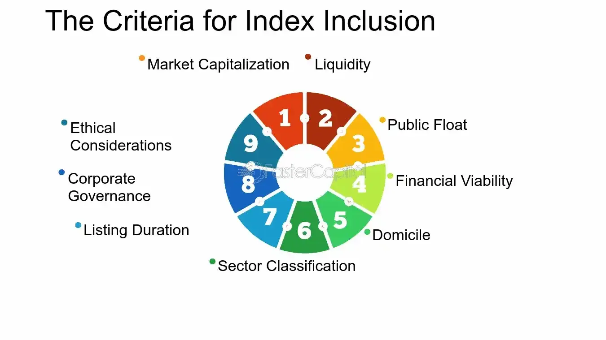

## Table of Contents

## What is a stock index?

A stock index is a way to measure the performance of a group of stocks. It's like a scorecard that shows how well a bunch of companies are doing in the stock market. For example, the Dow Jones Industrial Average is an index that tracks 30 big companies in the U.S. When people talk about the stock market going up or down, they often look at these indexes to see the overall trend.

Indexes are important because they give investors a quick way to understand how the market is doing without having to look at every single stock. They can also be used to compare the performance of different investments. For instance, if you want to know if your stocks are doing better or worse than the market, you can compare them to a stock index. This helps investors make smarter decisions about where to put their money.

## Why is it important for a company to be included in a stock index?

Being included in a stock index is a big deal for a company. It's like getting a stamp of approval that says the company is important and doing well. When a company is part of an index, it gets more attention from investors. More people want to buy its stock because they see it as a good investment. This can make the stock price go up, which is great for the company and its shareholders.

Also, being in an index can help a company get more money. Many big investors, like pension funds and mutual funds, have rules that say they have to invest in companies that are in certain indexes. So, if a company is in an index, these big investors will buy its stock. This can bring in a lot of money, which the company can use to grow and do even better. In short, being in a stock index can really help a company shine and grow.

## What are the most common stock indexes?

Some of the most common stock indexes are the Dow Jones Industrial Average, the S&P 500, and the Nasdaq Composite. The Dow Jones, or just "the Dow," is made up of 30 big companies in the U.S. It's one of the oldest and most watched indexes. The S&P 500 is another big one. It includes 500 of the largest companies in the U.S. and gives a good picture of how the whole market is doing. The Nasdaq Composite is different because it focuses on technology and internet companies. It's a good way to see how the tech sector is doing.

There are also important indexes outside the U.S. The FTSE 100, for example, is made up of the 100 biggest companies listed on the London Stock Exchange. It's a key measure of the UK market. The Nikkei 225 is another famous index, representing the top 225 companies on the Tokyo Stock Exchange. It's a big deal in Japan. These indexes help people all over the world understand how different markets are doing and make smart investment choices.

## What criteria do stock indexes use to include companies?

Stock indexes use different rules to decide which companies to include. Some indexes, like the S&P 500, look at the size of a company, measured by its market value. They want big companies that represent a large part of the market. Other indexes, like the Dow Jones, pick companies based on their importance in the economy and how well-known they are. They might also consider how much the company is traded and if it's stable.

Some indexes focus on specific industries. For example, the Nasdaq Composite includes a lot of technology companies. They want to show how that part of the market is doing. Other indexes, like the FTSE 100, look at the biggest companies in a certain country. They want to give a good picture of the whole market in that place. Each index has its own special rules, but they all want to show a fair and useful view of the market or industry they cover.

## How does market capitalization affect a company's inclusion in a stock index?

Market capitalization, or market cap, is really important when it comes to deciding which companies get into a stock index. Market cap is just the total value of all a company's stock. Some indexes, like the S&P 500, focus a lot on market cap. They want big companies because these companies have a big impact on the market. So, if a company has a high market cap, it's more likely to be included in these indexes. This is because the index wants to show what the biggest and most important companies are doing.

But not all indexes care about market cap in the same way. The Dow Jones Industrial Average, for example, looks at other things too, like how important a company is to the economy and how well-known it is. Still, market cap can play a role because bigger companies often have a bigger impact. So, even though market cap isn't the only thing that matters, it's a key part of deciding which companies make it into many stock indexes.

## What role does sector classification play in stock index inclusion?

Sector classification is important when deciding which companies go into a stock index. Some indexes focus on specific parts of the economy, like technology or health care. If a company is in one of these sectors, it might be more likely to be included in an index that tracks that sector. For example, the Nasdaq Composite has a lot of technology companies because it wants to show how the tech sector is doing.

Other indexes, like the S&P 500, want to include companies from many different sectors to give a good picture of the whole market. They might look at how much each sector is worth and try to match that in the index. This way, the index can show what's happening in the economy as a whole, not just in one part of it. So, sector classification helps decide which companies fit into an index and how the index represents the market.

## How often are stock indexes rebalanced, and what does this mean for companies?

Stock indexes are rebalanced at different times depending on the index. Some indexes, like the S&P 500, are looked at every three months to see if they need to be changed. This means the people who run the index check if any companies should be added or taken out. Other indexes might be rebalanced once a year or even less often. The timing can depend on the rules of the index and what it's trying to show.

When an index is rebalanced, it can be a big deal for companies. If a company gets added to an index, it can make its stock price go up because more investors will want to buy it. This is because many big investors have to buy stocks that are in the index. On the other hand, if a company gets taken out of an index, its stock price might go down because fewer people will want to buy it. So, rebalancing can change how well a company does in the stock market.

## What are the financial implications for a company when it is added or removed from a stock index?

When a company gets added to a stock index, it can be really good for its stock price. This is because a lot of big investors, like pension funds and mutual funds, have rules that say they have to buy stocks that are in certain indexes. So, when a company joins an index, these big investors will start buying its stock. This can make the stock price go up because more people want to buy it. It's like getting a big stamp of approval that says the company is important and doing well. This can also bring in more money for the company, which it can use to grow and do even better.

On the other hand, if a company gets taken out of a stock index, it can be bad for its stock price. When a company leaves an index, those big investors who have to follow the index rules will start selling its stock. This can make the stock price go down because fewer people want to buy it. It's like getting a signal that the company might not be doing as well as before. This can make it harder for the company to get money and grow. So, being added or removed from a stock index can have a big impact on a company's financial health.

## How do index providers like MSCI and S&P determine company inclusion?

Index providers like MSCI and S&P have rules to decide which companies go into their indexes. They look at things like how big a company is, which they measure by its market value. They also check what part of the economy the company is in, like if it's in technology or health care. MSCI and S&P want their indexes to show a good picture of the market, so they think about how important a company is and how much it's traded. They might also look at how stable the company is and if it follows certain rules about how it's run.

When MSCI and S&P decide to add or take out a company from an index, they think about how this will change the index. They want the index to keep showing what's happening in the market. If a company gets added, it's because it fits well with what the index is trying to show. If a company gets taken out, it's because it doesn't fit anymore. This process of adding and removing companies helps keep the index up to date and useful for investors.

## What are the differences in inclusion criteria between major global indexes like the FTSE, Dow Jones, and Nikkei?

The FTSE 100, Dow Jones Industrial Average, and Nikkei 225 each have their own special rules for picking companies. The FTSE 100 focuses on the biggest companies listed on the London Stock Exchange. It looks at the market value of these companies and wants to show how the UK market is doing. The FTSE 100 is all about size, so if a company is big enough, it might get in. The Dow Jones Industrial Average, on the other hand, picks 30 big companies in the U.S. It cares about how important these companies are to the economy and how well-known they are. The Dow Jones isn't just about size; it's also about the company's role in the market.

The Nikkei 225 is different because it tracks the top 225 companies on the Tokyo Stock Exchange. It looks at the price of the stocks, not just the market value. This means a company with a high stock price might get in, even if it's not the biggest. The Nikkei wants to show how the Japanese market is doing, so it picks companies that are important in Japan. Each of these indexes has its own way of deciding which companies to include, but they all want to give a good picture of their part of the market.

## How can a company influence its chances of being included in a stock index?

A company can boost its chances of getting into a stock index by growing bigger. This means making more money and having a higher market value. When a company gets bigger, it's more likely to catch the eye of index makers like MSCI or S&P, who often look at how big a company is. Another way is to be a leader in its industry. If a company is well-known and important in its field, like tech or health care, it might get noticed by indexes that focus on those sectors.

Also, a company can help its chances by making sure it's stable and follows good rules about how it's run. Index makers care about this because they want companies that are reliable and trustworthy. If a company can show it's doing well and is a good example in its industry, it might have a better shot at being included in an index. In the end, it's all about showing that the company is important and doing well in the market.

## What advanced statistical methods are used to assess a company's suitability for inclusion in specialized or thematic indexes?

To decide if a company should be in a special or theme-based index, people use smart math methods. They look at things like how much the company fits the theme of the index. For example, if the index is about green energy, they might use a score to see how much of the company's business is about green energy. They also use numbers to see if the company is growing and how much it's worth. These methods help make sure the index really shows what it's supposed to, like green energy or tech.

Another way they use math is to check how the company does compared to others in the same field. They might use something called regression analysis to see if the company is doing better or worse than expected. They also look at how much the company's stock moves up and down, which is called volatility. If the company's stock is too jumpy, it might not be a good fit for the index. All these smart math tricks help make the index a good and fair picture of the theme or special area it's about.

## What are Financial Indices and How Can We Understand Them?

A financial index is a statistical measure that aggregates the performance of a group of related stocks, offering insights into market dynamics and economic conditions. These indices serve as indicators of market trends and are vital in evaluating the health of specific economic sectors.

Prominent financial indices like the S&P 500 and Nasdaq 100 are essential tools for investors. The S&P 500, for example, comprises 500 of the largest publicly traded companies in the United States and is often regarded as a barometer for the overall U.S. stock market. It provides a broad perspective on the economic climate by reflecting the collective performance of diverse industries. The Nasdaq 100, on the other hand, represents 100 of the largest non-financial companies listed on the Nasdaq stock market, emphasizing the technology sector's influence on market dynamics.

Indices help investors make informed strategic decisions, allowing them to manage diversified portfolios effectively. They offer benchmarks to measure the performance of individual investments or funds, enabling investors to assess whether they are outperforming or underperforming the market. Through methodologies such as market capitalization-weighted calculations, indices present a transparent view of market performance. For instance, the value of a market-cap-weighted index is determined by the equation:

$$
\text{Index Level} = \frac{\sum_{i=1}^{n} (P_i \times Q_i)}{D}
$$

where $P_i$ represents the stock price, $Q_i$ is the number of shares, and $D$ is the divisor, which adjusts for stock splits and other structural changes.

Investors utilize indices not only to gauge the market environment but also to align their investment strategies with analyzed trends, thereby optimizing exposure to desired asset classes or sectors. This alignment is crucial for portfolio diversification—a strategy to reduce risk by allocating investments across various financial instruments, industries, and other categories.

Given their significance, financial indices are integral to both institutional and retail investment communities, providing benchmarks for performance evaluation, asset allocation, and strategic asset management.

## What is the impact of a company's inclusion in a stock index?

Inclusion in a stock index significantly impacts companies by enhancing their visibility and [liquidity](/wiki/liquidity-risk-premium) within financial markets. When a company is added to a major index, such as the S&P 500, it gains increased prominence as the index is frequently monitored by investors and analysts worldwide. This heightened visibility can lead to increased analyst coverage and media attention, which may further boost investor interest and trading volumes.

A key consequence of index inclusion is the obligatory purchase of the company's shares by index funds and exchange-traded funds (ETFs) that track the index. These funds are designed to replicate the performance of the index by holding its constituent stocks in proportion to their index weight. This creates substantial demand for the newly included company's shares, potentially driving up its share price. The formula for calculating the percentage increase in demand due to index inclusion can be approximated by:

$$
\text{Demand Increase} = \left( \frac{\text{Value of Index Funds Tracking Index}}{\text{Market Capitalization of Company}} \right) \times \text{Percentage Weight in Index}
$$

For instance, if index funds collectively have \$1 trillion in assets tracking an index and a company constitutes 0.1% of the index, the funds will need to allocate approximately \$1 billion to the company's shares.

Conversely, removal from an index can reduce a company's visibility and appeal to investors. The previously increased liquidity may dwindle as index-tracking funds are required to sell the shares of companies that have been removed, potentially exerting downward pressure on the stock price. This can result in higher [volatility](/wiki/volatility-trading-strategies) and depreciation in market value, which may deter potential investors.

Overall, the inclusion or exclusion of companies in stock indices plays a vital role in shaping their market perception and financial performance, influencing both short-term price fluctuations and long-term investment attractiveness.

## What is Algorithmic Trading in Indices?

Index-based algorithmic trading strategies are designed to optimize investment returns by exploiting the movements of stock indices. These strategies often implement trend-following methods, which are used to identify and capitalize on the directional [momentum](/wiki/momentum) of an index. Trend-following algorithms may use technical indicators such as moving averages, relative strength index (RSI), and Bollinger Bands to determine entry and [exit](/wiki/exit-strategy) points for trades.

Automated trading systems execute trades across multiple components of an index, a method that provides diversified exposure to the market while managing volatility. By trading a basket of stocks rather than individual equities, these systems reduce unsystematic risk, thereby enhancing portfolio stability. Moreover, automated systems enable traders to respond swiftly to market fluctuations, a speed unattainable by manual trading. For example, algorithms may be programmed to execute trades instantaneously in reaction to market news or significant price movements within an index, thereby capturing opportunities for profit.

However, the implementation of index-based algorithmic trading strategies necessitates robust risk management protocols to counteract potential market impacts and systemic risks. One key element of risk management is the setting of stop-loss orders, which automatically sell a stock if its price falls below a certain threshold. Another crucial aspect is the execution of portfolio rebalancing, which involves periodically adjusting the composition of the portfolio to maintain desired risk levels.

Efficient algorithms usually incorporate statistical measures to anticipate and mitigate risks. For example, the Value at Risk (VaR) model is used to estimate the maximum potential loss of a portfolio over a specific time frame with a given confidence level. Mathematically, VaR can be calculated by:

$$
\text{VaR}_{\alpha} = -\text{inv}(F_{\text{loss}}(\alpha))
$$

where $\text{inv}(F_{\text{loss}}(\alpha))$ is the inverse of the loss distribution function at a given confidence level $\alpha$.

In Python, for example, calculating VaR using historical returns can be implemented as follows:

```python
import numpy as np

def calculate_var(returns, confidence_level=0.05):
    sorted_returns = np.sort(returns)
    index = int(confidence_level * len(sorted_returns))
    return abs(sorted_returns[index])

# Example usage
historical_returns = np.random.normal(0, 0.02, 1000)  # Simulated returns
value_at_risk = calculate_var(historical_returns)
print(f"Value at Risk: {value_at_risk:.2f}")
```

In summary, while index-based algorithmic trading offers substantial benefits via rapid, diversified, and systematic trade execution, it requires vigilant risk assessment and management to protect against adverse market movements and ensure sustained profitability.

## References & Further Reading

[1]: Shleifer, A. (1986). ["Do Demand Curves for Stocks Slope Down?"](https://www.jstor.org/stable/2328486) The Quarterly Journal of Economics, 101(3), 329-351.

[2]: Jain, P. C. (1987). ["The Effect on Stock Price of Inclusion in or Exclusion from the S&P 500."](https://www.jstor.org/stable/pdf/4479002.pdf?addFooter=false) Financial Analysts Journal, 43(1), 58-65.

[3]: Hasbrouck, J., & Saar, G. (2013). ["Low-latency trading."](https://pages.stern.nyu.edu/~jhasbrou/Research/lowLatencyTrading/lowLatencyTradingHasbrouckSaarJFM.pdf) Journal of Financial Markets, 16(4), 646-679.

[4]: Bessis, J. (2015). ["Risk Management in Banking"](https://www.wiley.com/en-us/Risk+Management+in+Banking%2C+4th+Edition-p-9781118660218) (4th ed.). Wiley.

[5]: Gai, J., & Kapadia, N. (2010). ["Stock Volatility and the Firm's Information Environment."](https://www.semanticscholar.org/paper/Contagion-in-financial-networks-Gai-Kapadia/0e50ef770c4e1a48c5b18e8c485f66a7670123f5)00161-2/fulltext) Journal of Financial Economics, 96(3), 397-412.

[6]: Aldridge, I. (2013). ["High-Frequency Trading: A Practical Guide to Algorithmic Strategies and Trading Systems"](https://www.ahmetbeyefendi.com/wp-content/uploads/2020/07/High-Frequency-Trading-Irene-Aldridge.pdf). Wiley.

[7]: Korajczyk, R. A., & Sadka, R. (2019). ["High-Frequency Trading Activity, News Releases, and Price Discovery."](https://www.sciencedirect.com/science/article/abs/pii/S0304405X07001572) The Review of Financial Studies, 32(2), 602-635.