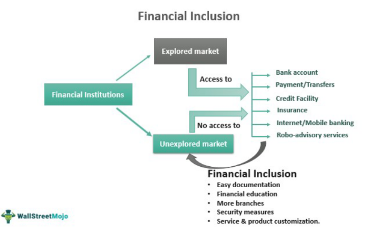

Understanding the dynamic interplay of financial markets involves a comprehensive analysis of various elements such as stock indices, the process of index inclusion, and the implementation of algorithmic trading. Financial indices serve as essential benchmarks, providing a quantitative measure of market trends, sector performances, and economic vitality. These indices, which include prominent examples like the S&P 500 and the Nasdaq 100, play a crucial role in shaping investment strategies, offering investors a snapshot of the broader market dynamics.

The significance of stock indices extends beyond mere performance measurement; they guide investors in making strategic decisions and managing diversified portfolios. By encapsulating the performance of a selected group of stocks, these indices influence market sentiment and investor behavior. The process of a company’s inclusion in a major index such as the S&P 500 can greatly enhance its visibility and liquidity, often resulting in pronounced changes in stock prices due to modified investor perceptions and actions. Conversely, exclusion from an index can diminish a company's market prominence and reduce its appeal to investors.



Moreover, algorithmic trading represents a transformative force in modern financial markets. Leveraging computer algorithms to automate and optimize trading decisions, this approach enhances the speed and precision of trade executions. The rapid advancements in computing technologies and data processing capabilities have enabled the widespread adoption of high-frequency trading strategies, capable of processing vast datasets and adapting to real-time market conditions with remarkable efficiency.

This article examines the complex interdependencies between financial index inclusion and algorithmic trading, exploring how they collectively impact stock markets. It aims to provide insights into the mechanisms of financial indices, the ripple effects of index inclusion on stock prices, and the evolution of algorithmic trading practices, which continue to redefine the landscape of modern finance.

## Table of Contents

## Understanding Financial Indices

A financial index is a statistical measure that aggregates the performance of a group of related stocks, offering insights into market dynamics and economic conditions. These indices serve as indicators of market trends and are vital in evaluating the health of specific economic sectors.

Prominent financial indices like the S&P 500 and Nasdaq 100 are essential tools for investors. The S&P 500, for example, comprises 500 of the largest publicly traded companies in the United States and is often regarded as a barometer for the overall U.S. stock market. It provides a broad perspective on the economic climate by reflecting the collective performance of diverse industries. The Nasdaq 100, on the other hand, represents 100 of the largest non-financial companies listed on the Nasdaq stock market, emphasizing the technology sector's influence on market dynamics.

Indices help investors make informed strategic decisions, allowing them to manage diversified portfolios effectively. They offer benchmarks to measure the performance of individual investments or funds, enabling investors to assess whether they are outperforming or underperforming the market. Through methodologies such as market capitalization-weighted calculations, indices present a transparent view of market performance. For instance, the value of a market-cap-weighted index is determined by the equation:

$$
\text{Index Level} = \frac{\sum_{i=1}^{n} (P_i \times Q_i)}{D}
$$

where $P_i$ represents the stock price, $Q_i$ is the number of shares, and $D$ is the divisor, which adjusts for stock splits and other structural changes.

Investors utilize indices not only to gauge the market environment but also to align their investment strategies with analyzed trends, thereby optimizing exposure to desired asset classes or sectors. This alignment is crucial for portfolio diversification—a strategy to reduce risk by allocating investments across various financial instruments, industries, and other categories.

Given their significance, financial indices are integral to both institutional and retail investment communities, providing benchmarks for performance evaluation, asset allocation, and strategic asset management.

## Impact of Company Inclusion in a Stock Index

Inclusion in a stock index significantly impacts companies by enhancing their visibility and [liquidity](/wiki/liquidity-risk-premium) within financial markets. When a company is added to a major index, such as the S&P 500, it gains increased prominence as the index is frequently monitored by investors and analysts worldwide. This heightened visibility can lead to increased analyst coverage and media attention, which may further boost investor interest and trading volumes.

A key consequence of index inclusion is the obligatory purchase of the company's shares by index funds and exchange-traded funds (ETFs) that track the index. These funds are designed to replicate the performance of the index by holding its constituent stocks in proportion to their index weight. This creates substantial demand for the newly included company's shares, potentially driving up its share price. The formula for calculating the percentage increase in demand due to index inclusion can be approximated by:

$$
\text{Demand Increase} = \left( \frac{\text{Value of Index Funds Tracking Index}}{\text{Market Capitalization of Company}} \right) \times \text{Percentage Weight in Index}
$$

For instance, if index funds collectively have \$1 trillion in assets tracking an index and a company constitutes 0.1% of the index, the funds will need to allocate approximately \$1 billion to the company's shares.

Conversely, removal from an index can reduce a company's visibility and appeal to investors. The previously increased liquidity may dwindle as index-tracking funds are required to sell the shares of companies that have been removed, potentially exerting downward pressure on the stock price. This can result in higher [volatility](/wiki/volatility-trading-strategies) and depreciation in market value, which may deter potential investors.

Overall, the inclusion or exclusion of companies in stock indices plays a vital role in shaping their market perception and financial performance, influencing both short-term price fluctuations and long-term investment attractiveness.

## Algorithmic Trading and Its Evolution

Algorithmic trading, often referred to as algo-trading, involves the use of computer programs and systems to execute trades in financial markets based on a predefined set of instructions or algorithms. These instructions often rely on timing, price, quantity, or a mathematical model to make the trading decision. The primary objective is to execute trades at optimal speeds and with high precision, minimizing human intervention.

The evolution of [algorithmic trading](/wiki/algorithmic-trading) is largely attributed to advancements in computer technology and data processing capabilities. As computational power has exponentially increased, it has enabled the development and implementation of complex trading algorithms that can handle large volumes of data at impressive speeds. With these advancements, high-frequency trading ([HFT](/wiki/high-frequency-trading-strategies)) has emerged as a prominent strategy within algorithmic trading. HFT employs sophisticated algorithms to execute numerous trades at millisecond or even microsecond intervals, often capitalizing on minimal price discrepancies in the market.

One of the core advantages of algorithmic trading is its ability to quickly analyze large datasets, adapting to real-time market conditions with exceptional speed. Algorithms are designed to detect patterns, trends, or anomalies that might be invisible to human traders. For example, an algorithm could be designed to execute a trade whenever a certain stock’s price crosses a specific threshold, or when a pre-defined pattern is recognized in a candlestick chart.

Consider a basic example of a trading algorithm implemented in Python:

```python
import pandas as pd
import numpy as np

def moving_average_strategy(data, short_window, long_window):
    # Calculate short and long moving averages
    signals = pd.DataFrame(index=data.index)
    signals['price'] = data['price']
    signals['short_mavg'] = data['price'].rolling(window=short_window, min_periods=1, center=False).mean()
    signals['long_mavg'] = data['price'].rolling(window=long_window, min_periods=1, center=False).mean()
    # Generate buy/sell signals
    signals['signal'] = 0.0  
    signals['signal'][short_window:] = np.where(signals['short_mavg'][short_window:] > signals['long_mavg'][short_window:], 1.0, 0.0)   
    signals['positions'] = signals['signal'].diff()
    return signals
```

This script uses a simple moving average crossover strategy, where a short-term moving average crossing above a long-term moving average suggests a buy signal, and a crossover below suggests a sell signal.

The ability to process data and execute trades rapidly has made algorithmic trading a dominant force in exchanges worldwide. However, it is not without risks. The reliance on technology means that issues such as algorithm errors or unforeseen market conditions can have significant impacts. Despite these risks, algorithmic trading continues to evolve, integrating [machine learning](/wiki/machine-learning) and [artificial intelligence](/wiki/ai-artificial-intelligence) to create even more adaptive and sophisticated trading systems. These developments suggest ongoing radical changes in how markets operate and how trades are conducted, challenging traditional trading practices and offering new opportunities and efficiencies for market participants.

## Algorithmic Trading in Indices

Index-based algorithmic trading strategies are designed to optimize investment returns by exploiting the movements of stock indices. These strategies often implement trend-following methods, which are used to identify and capitalize on the directional [momentum](/wiki/momentum) of an index. Trend-following algorithms may use technical indicators such as moving averages, relative strength index (RSI), and Bollinger Bands to determine entry and [exit](/wiki/exit-strategy) points for trades.

Automated trading systems execute trades across multiple components of an index, a method that provides diversified exposure to the market while managing volatility. By trading a basket of stocks rather than individual equities, these systems reduce unsystematic risk, thereby enhancing portfolio stability. Moreover, automated systems enable traders to respond swiftly to market fluctuations, a speed unattainable by manual trading. For example, algorithms may be programmed to execute trades instantaneously in reaction to market news or significant price movements within an index, thereby capturing opportunities for profit.

However, the implementation of index-based algorithmic trading strategies necessitates robust risk management protocols to counteract potential market impacts and systemic risks. One key element of risk management is the setting of stop-loss orders, which automatically sell a stock if its price falls below a certain threshold. Another crucial aspect is the execution of portfolio rebalancing, which involves periodically adjusting the composition of the portfolio to maintain desired risk levels.

Efficient algorithms usually incorporate statistical measures to anticipate and mitigate risks. For example, the Value at Risk (VaR) model is used to estimate the maximum potential loss of a portfolio over a specific time frame with a given confidence level. Mathematically, VaR can be calculated by:

$$
\text{VaR}_{\alpha} = -\text{inv}(F_{\text{loss}}(\alpha))
$$

where $\text{inv}(F_{\text{loss}}(\alpha))$ is the inverse of the loss distribution function at a given confidence level $\alpha$.

In Python, for example, calculating VaR using historical returns can be implemented as follows:

```python
import numpy as np

def calculate_var(returns, confidence_level=0.05):
    sorted_returns = np.sort(returns)
    index = int(confidence_level * len(sorted_returns))
    return abs(sorted_returns[index])

# Example usage
historical_returns = np.random.normal(0, 0.02, 1000)  # Simulated returns
value_at_risk = calculate_var(historical_returns)
print(f"Value at Risk: {value_at_risk:.2f}")
```

In summary, while index-based algorithmic trading offers substantial benefits via rapid, diversified, and systematic trade execution, it requires vigilant risk assessment and management to protect against adverse market movements and ensure sustained profitability.

## Steps to Identify Company Index Inclusion

Investors looking to identify companies included in a financial index can utilize various resources and strategies to stay informed about index compositions. One of the primary methods is to access official index provider websites. These websites, such as those for MSCI, S&P Dow Jones Indices, and FTSE Russell, offer comprehensive and regularly updated lists of index constituents. These lists typically provide additional information, such as historical changes, which can be crucial for understanding trends and making informed investment decisions.

Another invaluable resource is financial platforms like Yahoo Finance, Bloomberg, or Reuters. These platforms not only provide real-time data on stock performances but also offer insights into index compositions. Investors can use these platforms to stay current with sector performance, gaining strategic insights into portfolio adjustments. For instance, Yahoo Finance allows users to filter stocks by their index inclusion, facilitating a direct understanding of what companies are currently part of major indices like the S&P 500 or the Nasdaq 100.

Understanding the criteria for index inclusion is also pivotal for investors seeking to predict future market movements and stock performances. These criteria can vary significantly between indices. Common factors include market capitalization, liquidity, and sector representation. For example, an investor who monitors changes in a company’s market capitalization can make informed predictions about its potential inclusion or exclusion from an index.

Moreover, investors may benefit from using algorithmic tools to track and predict index changes. For example, a Python script could be developed to scrape data from financial news websites, monitoring for announcements of index rebalances or potential inclusions/exclusions. An example of a simple Python script to track company stock data from Yahoo Finance APIs might look like this:

```python
import yfinance as yf  # For more datasets, visit: https://paperswithbacktest.com/datasets

# Download data for a specific company
ticker = "AAPL"
data = yf.Ticker(ticker)

# Get information about which indices the company belongs to
index_info = data.info.get('indices_info', 'Not Available')
print(f"{ticker} is included in the following indices: {index_info}")
```

While such tools can be useful, they require regular updating and validation to ensure accuracy and reliability. These practices combined help investors not only keep track of current index constituents but also anticipate and react to changes effectively, thus optimizing their investment strategies.

## The Future of Index Trading and Algorithmic Involvement

Technological advancements continue to reshape financial markets, with algorithmic trading being an ever-growing component of this transformation. As markets become more complex, the integration of artificial intelligence (AI) is expected to significantly enhance the capabilities of trading systems by providing superior predictive analytics and comprehensive market insights.

AI algorithms excel at processing vast amounts of data rapidly, identifying patterns invisible to human traders. This capacity is critical in index trading, where real-time data analysis is crucial for making informed investment decisions and optimizing return strategies. Machine learning—an AI subset—can improve the accuracy of algorithms over time by learning from previous trades and identifying new patterns, thus refining predictive models for future index movements.

Future AI-driven trading systems might leverage advanced predictive analytics to perform intricate data analyses incorporating not just historical price and [volume](/wiki/volume-trading-strategy) data, but also news sentiment, macroeconomic indicators, and [alternative data](/wiki/best-alternative-data) sources such as social media trends. Together, these aspects inform a more holistic understanding of market dynamics, allowing for nuanced investment strategies that could adjust in real-time to shifting market conditions.

Moreover, as trading systems evolve, they may increasingly rely on AI to optimize asset allocation and manage risks with greater precision. AI can automate complex decision-making processes, reducing the likelihood of human error and enhancing the efficiency of executing trades across various index components. Furthermore, AI can contribute to risk management by running simulations and stress tests to anticipate potential market impacts, leading to more resilient trading strategies.

To participate effectively in modern index trading, investors and traders must stay updated on technological innovations within algorithmic systems. Familiarity with AI and machine learning advancements is essential, as is understanding the implications of these technologies on market behaviors and index trading strategies. As markets evolve, so too must the tools and approaches used by investors to retain a competitive edge.

In summary, the future of index trading will likely be characterized by an increasing reliance on AI and machine learning technologies that enhance algorithmic trading systems. These advancements promise to refine investment strategies and improve market predictions, underscoring the importance of continuous education in technology trends for successful participation in the financial markets.

## Conclusion

The inclusion of stocks in financial indices has significant implications for both company valuations and investor strategies. When a company's stock is added to a major index, it often experiences increased visibility and trading volume, which can lead to enhanced liquidity and a potential rise in stock price. This phenomenon, sometimes referred to as the "index effect," occurs because index funds and exchange-traded funds (ETFs) that track these indices are required to purchase shares of the newly included companies, thereby increasing demand.

Conversely, removal from an index can decrease a company's visibility and attractiveness to investors, often resulting in reduced liquidity and a negative impact on stock price. This dynamic underscores the importance of index membership as a [factor](/wiki/factor-investing) in corporate financial strategy and investor decision-making.

Algorithmic trading has transformed interactions with stock indices, bringing about unprecedented efficiency in trading operations. By employing sophisticated algorithms, trades are executed with speed and precision far beyond human capabilities. High-frequency trading strategies can capitalize on minor price discrepancies and market trends in fractions of a second, thus maximizing returns. The automation of trading processes allows for the maintenance of diversified portfolios and the effective management of risk through rapid execution and complex analysis.

The continuous advancement in technology and market analytics necessitates that investors remain informed about market dynamics and technological innovations. Understanding the evolving landscape of algorithmic trading and its application to index-based trading strategies is critical for optimizing investment returns in modern financial markets. Adapting to these technological improvements involves integrating predictive analytics and market insights derived from AI, which promise to further refine trading strategies and enhance market understanding.

## References & Further Reading

[1]: Shleifer, A. (1986). ["Do Demand Curves for Stocks Slope Down?"](https://www.jstor.org/stable/2328486) The Quarterly Journal of Economics, 101(3), 329-351.

[2]: Jain, P. C. (1987). ["The Effect on Stock Price of Inclusion in or Exclusion from the S&P 500."](https://www.jstor.org/stable/pdf/4479002.pdf?addFooter=false) Financial Analysts Journal, 43(1), 58-65.

[3]: Hasbrouck, J., & Saar, G. (2013). ["Low-latency trading."](https://pages.stern.nyu.edu/~jhasbrou/Research/lowLatencyTrading/lowLatencyTradingHasbrouckSaarJFM.pdf) Journal of Financial Markets, 16(4), 646-679.

[4]: Bessis, J. (2015). ["Risk Management in Banking"](https://www.wiley.com/en-us/Risk+Management+in+Banking%2C+4th+Edition-p-9781118660218) (4th ed.). Wiley.

[5]: Gai, J., & Kapadia, N. (2010). ["Stock Volatility and the Firm's Information Environment."](https://www.semanticscholar.org/paper/Contagion-in-financial-networks-Gai-Kapadia/0e50ef770c4e1a48c5b18e8c485f66a7670123f5)00161-2/fulltext) Journal of Financial Economics, 96(3), 397-412.

[6]: Aldridge, I. (2013). ["High-Frequency Trading: A Practical Guide to Algorithmic Strategies and Trading Systems"](https://www.ahmetbeyefendi.com/wp-content/uploads/2020/07/High-Frequency-Trading-Irene-Aldridge.pdf). Wiley.

[7]: Korajczyk, R. A., & Sadka, R. (2019). ["High-Frequency Trading Activity, News Releases, and Price Discovery."](https://www.sciencedirect.com/science/article/abs/pii/S0304405X07001572) The Review of Financial Studies, 32(2), 602-635.